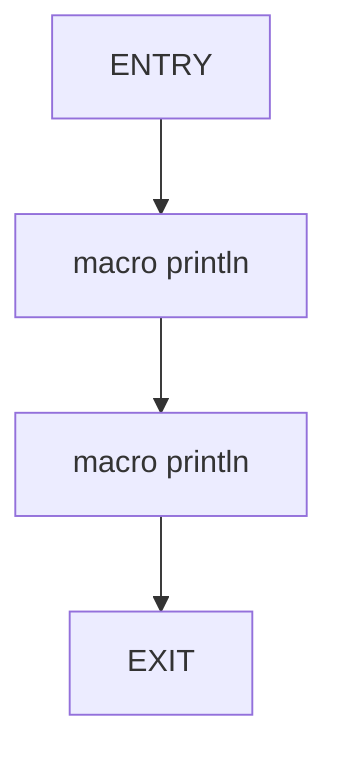

# CFG Group: root

## Function: `main`

- File: MMSB/build.rs
- Branches: 0
- Loops: 0
- Nodes: 4
- Edges: 3

```mermaid
flowchart TD
    main_0["ENTRY"]
    main_1["macro println"]
    main_2["macro println"]
    main_3["EXIT"]
    main_0 --> main_1
    main_1 --> main_2
    main_2 --> main_3
```

