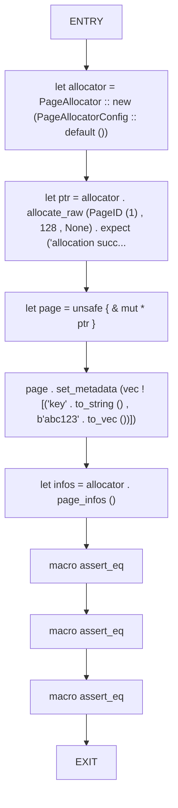
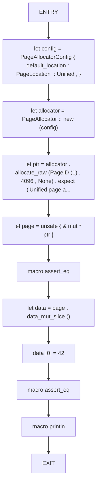

# CFG Group: src/00_physical

## Function: `test_checkpoint_roundtrip_in_memory`

- File: MMSB/src/00_physical/allocator.rs
- Branches: 0
- Loops: 0
- Nodes: 14
- Edges: 13

```mermaid
flowchart TD
    test_checkpoint_roundtrip_in_memory_0["ENTRY"]
    test_checkpoint_roundtrip_in_memory_1["let alloc = PageAllocator :: new (PageAllocatorConfig :: default ())"]
    test_checkpoint_roundtrip_in_memory_2["let ptr = alloc . allocate_raw (PageID (9999) , 1024 * 1024 , None) . unwrap ()"]
    test_checkpoint_roundtrip_in_memory_3["let page = unsafe { & mut * ptr }"]
    test_checkpoint_roundtrip_in_memory_4["page . apply_delta (& Delta { delta_id : DeltaID (1) , page_id : PageID (9999..."]
    test_checkpoint_roundtrip_in_memory_5["let snapshot = alloc . snapshot_pages ()"]
    test_checkpoint_roundtrip_in_memory_6["macro assert_eq"]
    test_checkpoint_roundtrip_in_memory_7["macro assert_eq"]
    test_checkpoint_roundtrip_in_memory_8["alloc . restore_from_snapshot (snapshot) . expect ('roundtrip should work')"]
    test_checkpoint_roundtrip_in_memory_9["let restored = alloc . acquire_page (PageID (9999)) . unwrap ()"]
    test_checkpoint_roundtrip_in_memory_10["let restored_page = unsafe { & * restored }"]
    test_checkpoint_roundtrip_in_memory_11["macro assert_eq"]
    test_checkpoint_roundtrip_in_memory_12["macro println"]
    test_checkpoint_roundtrip_in_memory_13["EXIT"]
    test_checkpoint_roundtrip_in_memory_0 --> test_checkpoint_roundtrip_in_memory_1
    test_checkpoint_roundtrip_in_memory_1 --> test_checkpoint_roundtrip_in_memory_2
    test_checkpoint_roundtrip_in_memory_2 --> test_checkpoint_roundtrip_in_memory_3
    test_checkpoint_roundtrip_in_memory_3 --> test_checkpoint_roundtrip_in_memory_4
    test_checkpoint_roundtrip_in_memory_4 --> test_checkpoint_roundtrip_in_memory_5
    test_checkpoint_roundtrip_in_memory_5 --> test_checkpoint_roundtrip_in_memory_6
    test_checkpoint_roundtrip_in_memory_6 --> test_checkpoint_roundtrip_in_memory_7
    test_checkpoint_roundtrip_in_memory_7 --> test_checkpoint_roundtrip_in_memory_8
    test_checkpoint_roundtrip_in_memory_8 --> test_checkpoint_roundtrip_in_memory_9
    test_checkpoint_roundtrip_in_memory_9 --> test_checkpoint_roundtrip_in_memory_10
    test_checkpoint_roundtrip_in_memory_10 --> test_checkpoint_roundtrip_in_memory_11
    test_checkpoint_roundtrip_in_memory_11 --> test_checkpoint_roundtrip_in_memory_12
    test_checkpoint_roundtrip_in_memory_12 --> test_checkpoint_roundtrip_in_memory_13
```

## Function: `test_page_info_metadata_roundtrip`

- File: MMSB/src/00_physical/allocator.rs
- Branches: 0
- Loops: 0
- Nodes: 10
- Edges: 9

## Function: `test_unified_page`

- File: MMSB/src/00_physical/allocator.rs
- Branches: 0
- Loops: 0
- Nodes: 11
- Edges: 10

