# CFG Group: src/01_page

## Function: `allocate_zeroed`

- File: MMSB/src/01_page/page.rs
- Branches: 1
- Loops: 0
- Nodes: 10
- Edges: 10

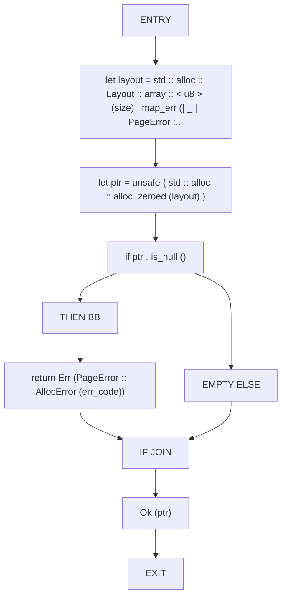

## Function: `apply_log`

- File: MMSB/src/01_page/tlog_replay.rs
- Branches: 0
- Loops: 0
- Nodes: 3
- Edges: 2

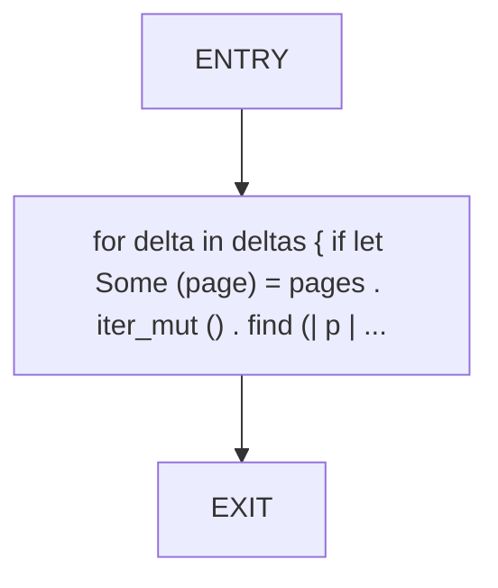

## Function: `bitpack_mask`

- File: MMSB/src/01_page/tlog_compression.rs
- Branches: 0
- Loops: 0
- Nodes: 6
- Edges: 5

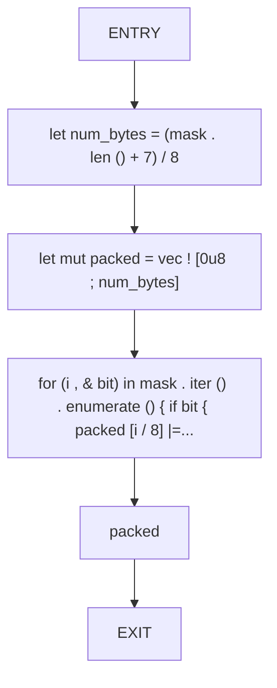

## Function: `bitunpack_mask`

- File: MMSB/src/01_page/tlog_compression.rs
- Branches: 0
- Loops: 0
- Nodes: 3
- Edges: 2

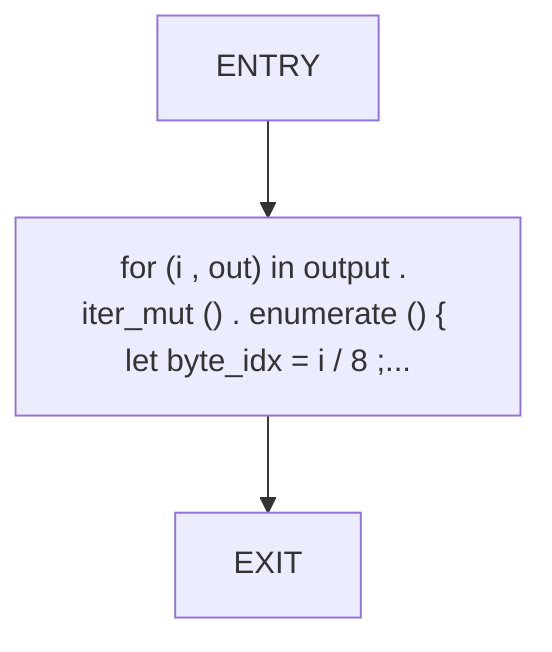

## Function: `checkpoint_validation_detects_divergence`

- File: MMSB/src/01_page/replay_validator.rs
- Branches: 0
- Loops: 0
- Nodes: 15
- Edges: 14

```mermaid
flowchart TD
    checkpoint_validation_detects_divergence_0["ENTRY"]
    checkpoint_validation_detects_divergence_1["let path = temp_log_path ()"]
    checkpoint_validation_detects_divergence_2["let log = TransactionLog :: new (& path) . unwrap ()"]
    checkpoint_validation_detects_divergence_3["let allocator = PageAllocator :: new (PageAllocatorConfig :: default ())"]
    checkpoint_validation_detects_divergence_4["allocator . allocate_raw (PageID (1) , 4 , Some (PageLocation :: Cpu)) . unwr..."]
    checkpoint_validation_detects_divergence_5["allocator . allocate_raw (PageID (2) , 4 , Some (PageLocation :: Cpu)) . unwr..."]
    checkpoint_validation_detects_divergence_6["{ let page1 = allocator . acquire_page (PageID (1)) . unwrap () ; let page2 =..."]
    checkpoint_validation_detects_divergence_7["let mut validator = ReplayValidator :: new (1e-9)"]
    checkpoint_validation_detects_divergence_8["let checkpoint_id = validator . record_checkpoint (& allocator , & log) . unwrap ()"]
    checkpoint_validation_detects_divergence_9["{ let page1 = allocator . acquire_page (PageID (1)) . unwrap () ; unsafe { (*..."]
    checkpoint_validation_detects_divergence_10["let report = validator . validate_allocator (checkpoint_id , & allocator) . unwrap ()"]
    checkpoint_validation_detects_divergence_11["macro assert"]
    checkpoint_validation_detects_divergence_12["macro assert_eq"]
    checkpoint_validation_detects_divergence_13["fs :: remove_file (path) . ok ()"]
    checkpoint_validation_detects_divergence_14["EXIT"]
    checkpoint_validation_detects_divergence_0 --> checkpoint_validation_detects_divergence_1
    checkpoint_validation_detects_divergence_1 --> checkpoint_validation_detects_divergence_2
    checkpoint_validation_detects_divergence_2 --> checkpoint_validation_detects_divergence_3
    checkpoint_validation_detects_divergence_3 --> checkpoint_validation_detects_divergence_4
    checkpoint_validation_detects_divergence_4 --> checkpoint_validation_detects_divergence_5
    checkpoint_validation_detects_divergence_5 --> checkpoint_validation_detects_divergence_6
    checkpoint_validation_detects_divergence_6 --> checkpoint_validation_detects_divergence_7
    checkpoint_validation_detects_divergence_7 --> checkpoint_validation_detects_divergence_8
    checkpoint_validation_detects_divergence_8 --> checkpoint_validation_detects_divergence_9
    checkpoint_validation_detects_divergence_9 --> checkpoint_validation_detects_divergence_10
    checkpoint_validation_detects_divergence_10 --> checkpoint_validation_detects_divergence_11
    checkpoint_validation_detects_divergence_11 --> checkpoint_validation_detects_divergence_12
    checkpoint_validation_detects_divergence_12 --> checkpoint_validation_detects_divergence_13
    checkpoint_validation_detects_divergence_13 --> checkpoint_validation_detects_divergence_14
```

## Function: `compact`

- File: MMSB/src/01_page/tlog_compression.rs
- Branches: 2
- Loops: 0
- Nodes: 16
- Edges: 17

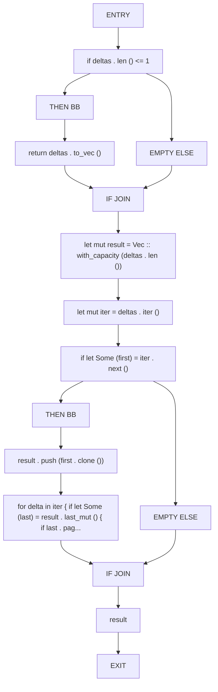

## Function: `compare_snapshots`

- File: MMSB/src/01_page/replay_validator.rs
- Branches: 0
- Loops: 0
- Nodes: 10
- Edges: 9

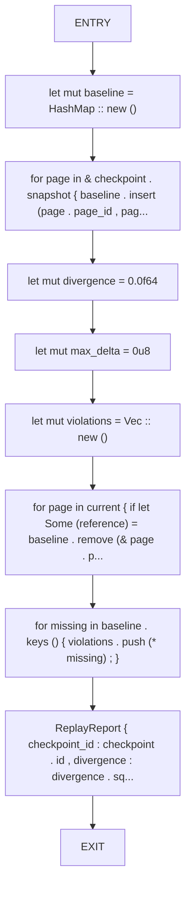

## Function: `compress_delta_mask`

- File: MMSB/src/01_page/tlog_compression.rs
- Branches: 0
- Loops: 0
- Nodes: 6
- Edges: 5

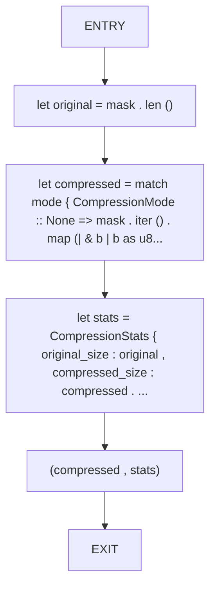

## Function: `decode_rle`

- File: MMSB/src/01_page/tlog_compression.rs
- Branches: 0
- Loops: 0
- Nodes: 4
- Edges: 3

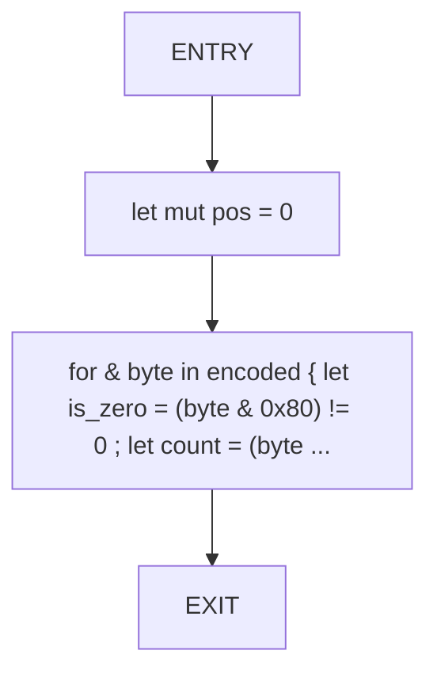

## Function: `delta`

- File: MMSB/src/01_page/integrity_checker.rs
- Branches: 0
- Loops: 0
- Nodes: 3
- Edges: 2

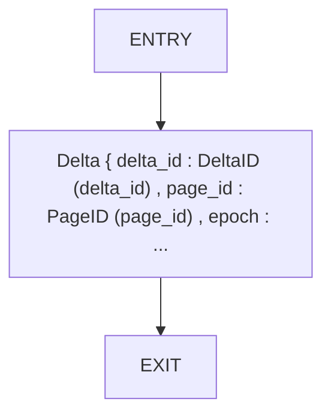

## Function: `detects_orphan_and_epoch_errors`

- File: MMSB/src/01_page/integrity_checker.rs
- Branches: 0
- Loops: 0
- Nodes: 11
- Edges: 10

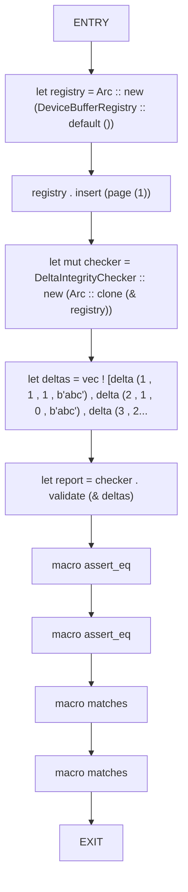

## Function: `encode_rle`

- File: MMSB/src/01_page/tlog_compression.rs
- Branches: 1
- Loops: 0
- Nodes: 13
- Edges: 13

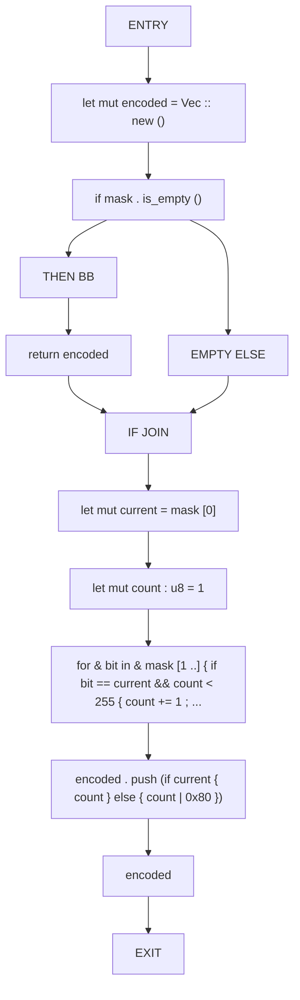

## Function: `generate_mask`

- File: MMSB/src/01_page/simd_mask.rs
- Branches: 0
- Loops: 0
- Nodes: 4
- Edges: 3

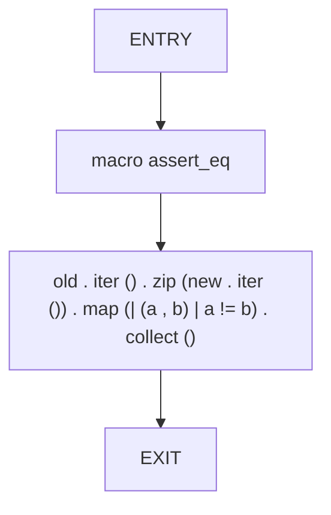

## Function: `l2_distance`

- File: MMSB/src/01_page/replay_validator.rs
- Branches: 1
- Loops: 0
- Nodes: 13
- Edges: 13

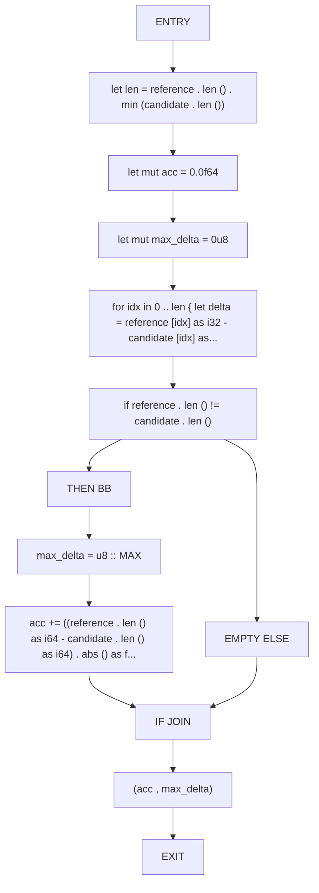

## Function: `load_checkpoint`

- File: MMSB/src/01_page/checkpoint.rs
- Branches: 2
- Loops: 0
- Nodes: 32
- Edges: 33

```mermaid
flowchart TD
    load_checkpoint_0["ENTRY"]
    load_checkpoint_1["macro ffi_debug"]
    load_checkpoint_2["let mut reader = BufReader :: new (File :: open (path) ?)"]
    load_checkpoint_3["let mut magic = [0u8 ; 8]"]
    load_checkpoint_4["reader . read_exact (& mut magic) ?"]
    load_checkpoint_5["if & magic != SNAPSHOT_MAGIC"]
    load_checkpoint_6["THEN BB"]
    load_checkpoint_7["return Err (std :: io :: Error :: new (std :: io :: ErrorKind :: InvalidData ..."]
    load_checkpoint_8["EMPTY ELSE"]
    load_checkpoint_9["IF JOIN"]
    load_checkpoint_10["macro ffi_debug"]
    load_checkpoint_11["let mut version_bytes = [0u8 ; 4]"]
    load_checkpoint_12["reader . read_exact (& mut version_bytes) ?"]
    load_checkpoint_13["let version = u32 :: from_le_bytes (version_bytes)"]
    load_checkpoint_14["if version != SNAPSHOT_VERSION"]
    load_checkpoint_15["THEN BB"]
    load_checkpoint_16["return Err (std :: io :: Error :: new (std :: io :: ErrorKind :: InvalidData ..."]
    load_checkpoint_17["EMPTY ELSE"]
    load_checkpoint_18["IF JOIN"]
    load_checkpoint_19["macro ffi_debug"]
    load_checkpoint_20["let mut page_count_bytes = [0u8 ; 4]"]
    load_checkpoint_21["reader . read_exact (& mut page_count_bytes) ?"]
    load_checkpoint_22["let page_count = u32 :: from_le_bytes (page_count_bytes) as usize"]
    load_checkpoint_23["macro ffi_debug"]
    load_checkpoint_24["let mut log_offset_bytes = [0u8 ; 8]"]
    load_checkpoint_25["reader . read_exact (& mut log_offset_bytes) ?"]
    load_checkpoint_26["macro ffi_debug"]
    load_checkpoint_27["let mut snapshots = Vec :: with_capacity (page_count)"]
    load_checkpoint_28["for i in 0 .. page_count { let mut id_bytes = [0u8 ; 8] ; reader . read_exact..."]
    load_checkpoint_29["macro ffi_debug"]
    load_checkpoint_30["match allocator . restore_from_snapshot (snapshots) { Ok (_) => { ffi_debug !..."]
    load_checkpoint_31["EXIT"]
    load_checkpoint_0 --> load_checkpoint_1
    load_checkpoint_1 --> load_checkpoint_2
    load_checkpoint_2 --> load_checkpoint_3
    load_checkpoint_3 --> load_checkpoint_4
    load_checkpoint_4 --> load_checkpoint_5
    load_checkpoint_5 --> load_checkpoint_6
    load_checkpoint_6 --> load_checkpoint_7
    load_checkpoint_5 --> load_checkpoint_8
    load_checkpoint_7 --> load_checkpoint_9
    load_checkpoint_8 --> load_checkpoint_9
    load_checkpoint_9 --> load_checkpoint_10
    load_checkpoint_10 --> load_checkpoint_11
    load_checkpoint_11 --> load_checkpoint_12
    load_checkpoint_12 --> load_checkpoint_13
    load_checkpoint_13 --> load_checkpoint_14
    load_checkpoint_14 --> load_checkpoint_15
    load_checkpoint_15 --> load_checkpoint_16
    load_checkpoint_14 --> load_checkpoint_17
    load_checkpoint_16 --> load_checkpoint_18
    load_checkpoint_17 --> load_checkpoint_18
    load_checkpoint_18 --> load_checkpoint_19
    load_checkpoint_19 --> load_checkpoint_20
    load_checkpoint_20 --> load_checkpoint_21
    load_checkpoint_21 --> load_checkpoint_22
    load_checkpoint_22 --> load_checkpoint_23
    load_checkpoint_23 --> load_checkpoint_24
    load_checkpoint_24 --> load_checkpoint_25
    load_checkpoint_25 --> load_checkpoint_26
    load_checkpoint_26 --> load_checkpoint_27
    load_checkpoint_27 --> load_checkpoint_28
    load_checkpoint_28 --> load_checkpoint_29
    load_checkpoint_29 --> load_checkpoint_30
    load_checkpoint_30 --> load_checkpoint_31
```

## Function: `make_delta`

- File: MMSB/src/01_page/columnar_delta.rs
- Branches: 0
- Loops: 0
- Nodes: 3
- Edges: 2

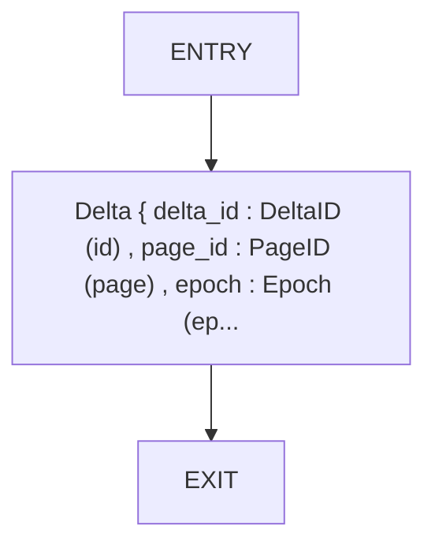

## Function: `merge_deltas`

- File: MMSB/src/01_page/delta_merge.rs
- Branches: 0
- Loops: 0
- Nodes: 3
- Edges: 2

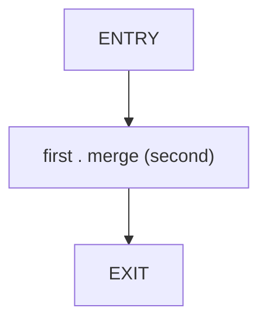

## Function: `merge_dense_avx2`

- File: MMSB/src/01_page/delta_merge.rs
- Branches: 0
- Loops: 0
- Nodes: 6
- Edges: 5


## Function: `merge_dense_avx512`

- File: MMSB/src/01_page/delta_merge.rs
- Branches: 0
- Loops: 0
- Nodes: 6
- Edges: 5

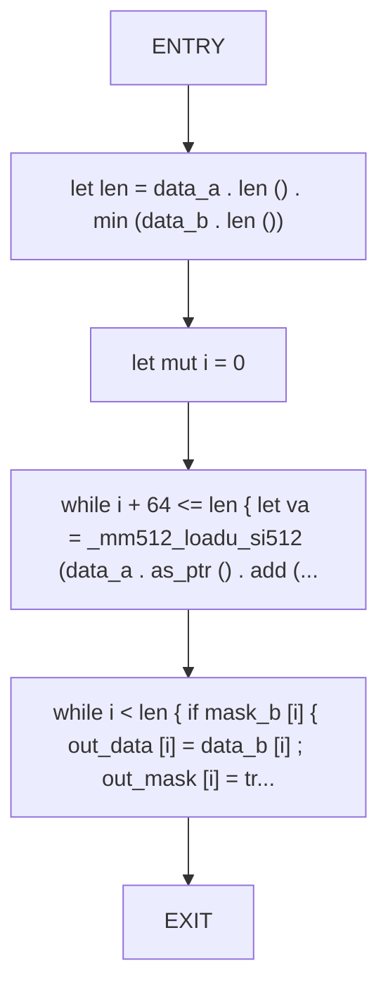

## Function: `merge_dense_simd`

- File: MMSB/src/01_page/delta_merge.rs
- Branches: 0
- Loops: 0
- Nodes: 5
- Edges: 4

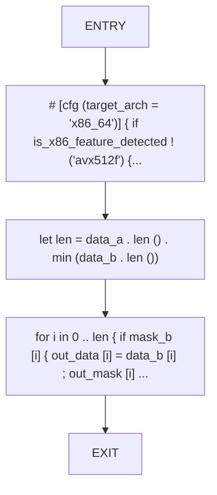

## Function: `now_ns`

- File: MMSB/src/01_page/delta.rs
- Branches: 0
- Loops: 0
- Nodes: 3
- Edges: 2

```mermaid
flowchart TD
    now_ns_0["ENTRY"]
    now_ns_1["SystemTime :: now () . duration_since (UNIX_EPOCH) . unwrap_or_default () . a..."]
    now_ns_2["EXIT"]
    now_ns_0 --> now_ns_1
    now_ns_1 --> now_ns_2
```

## Function: `page`

- File: MMSB/src/01_page/integrity_checker.rs
- Branches: 0
- Loops: 0
- Nodes: 3
- Edges: 2

```mermaid
flowchart TD
    page_0["ENTRY"]
    page_1["Arc :: new (Page :: new (PageID (page_id) , 4 , PageLocation :: Cpu) . unwrap..."]
    page_2["EXIT"]
    page_0 --> page_1
    page_1 --> page_2
```

## Function: `rand_suffix`

- File: MMSB/src/01_page/replay_validator.rs
- Branches: 0
- Loops: 0
- Nodes: 4
- Edges: 3

```mermaid
flowchart TD
    rand_suffix_0["ENTRY"]
    rand_suffix_1["use"]
    rand_suffix_2["SystemTime :: now () . duration_since (UNIX_EPOCH) . unwrap () . as_nanos () ..."]
    rand_suffix_3["EXIT"]
    rand_suffix_0 --> rand_suffix_1
    rand_suffix_1 --> rand_suffix_2
    rand_suffix_2 --> rand_suffix_3
```

## Function: `read_bytes`

- File: MMSB/src/01_page/page.rs
- Branches: 1
- Loops: 0
- Nodes: 10
- Edges: 10

```mermaid
flowchart TD
    read_bytes_0["ENTRY"]
    read_bytes_1["if * cursor + len > blob . len ()"]
    read_bytes_2["THEN BB"]
    read_bytes_3["return Err (PageError :: MetadataDecode ('metadata truncated'))"]
    read_bytes_4["EMPTY ELSE"]
    read_bytes_5["IF JOIN"]
    read_bytes_6["let bytes = blob [* cursor .. * cursor + len] . to_vec ()"]
    read_bytes_7["* cursor += len"]
    read_bytes_8["Ok (bytes)"]
    read_bytes_9["EXIT"]
    read_bytes_0 --> read_bytes_1
    read_bytes_1 --> read_bytes_2
    read_bytes_2 --> read_bytes_3
    read_bytes_1 --> read_bytes_4
    read_bytes_3 --> read_bytes_5
    read_bytes_4 --> read_bytes_5
    read_bytes_5 --> read_bytes_6
    read_bytes_6 --> read_bytes_7
    read_bytes_7 --> read_bytes_8
    read_bytes_8 --> read_bytes_9
```

## Function: `read_frame`

- File: MMSB/src/01_page/tlog.rs
- Branches: 0
- Loops: 0
- Nodes: 31
- Edges: 30

```mermaid
flowchart TD
    read_frame_0["ENTRY"]
    read_frame_1["let mut delta_id = [0u8 ; 8]"]
    read_frame_2["match reader . read_exact (& mut delta_id) { Ok (()) => { } Err (err) if err ..."]
    read_frame_3["let mut page_id = [0u8 ; 8]"]
    read_frame_4["reader . read_exact (& mut page_id) ?"]
    read_frame_5["let mut epoch = [0u8 ; 4]"]
    read_frame_6["reader . read_exact (& mut epoch) ?"]
    read_frame_7["let mut mask_len_bytes = [0u8 ; 4]"]
    read_frame_8["reader . read_exact (& mut mask_len_bytes) ?"]
    read_frame_9["let mask_len = u32 :: from_le_bytes (mask_len_bytes) as usize"]
    read_frame_10["let mut mask_raw = vec ! [0u8 ; mask_len]"]
    read_frame_11["reader . read_exact (& mut mask_raw) ?"]
    read_frame_12["let mask = mask_raw . iter () . map (| b | * b != 0) . collect :: < Vec < bool > > ()"]
    read_frame_13["let mut payload_len_bytes = [0u8 ; 4]"]
    read_frame_14["reader . read_exact (& mut payload_len_bytes) ?"]
    read_frame_15["let payload_len = u32 :: from_le_bytes (payload_len_bytes) as usize"]
    read_frame_16["let mut payload = vec ! [0u8 ; payload_len]"]
    read_frame_17["reader . read_exact (& mut payload) ?"]
    read_frame_18["let mut sparse_flag = [0u8 ; 1]"]
    read_frame_19["reader . read_exact (& mut sparse_flag) ?"]
    read_frame_20["let mut timestamp_bytes = [0u8 ; 8]"]
    read_frame_21["reader . read_exact (& mut timestamp_bytes) ?"]
    read_frame_22["let mut source_len_bytes = [0u8 ; 4]"]
    read_frame_23["reader . read_exact (& mut source_len_bytes) ?"]
    read_frame_24["let source_len = u32 :: from_le_bytes (source_len_bytes) as usize"]
    read_frame_25["let mut source_buf = vec ! [0u8 ; source_len]"]
    read_frame_26["reader . read_exact (& mut source_buf) ?"]
    read_frame_27["let source = Source (String :: from_utf8_lossy (& source_buf) . to_string ())"]
    read_frame_28["let intent_metadata = if version >= 2 { let mut metadata_len_bytes = [0u8 ; 4] ; if reader . read_e..."]
    read_frame_29["Ok (Some (Delta { delta_id : DeltaID (u64 :: from_le_bytes (delta_id)) , page..."]
    read_frame_30["EXIT"]
    read_frame_0 --> read_frame_1
    read_frame_1 --> read_frame_2
    read_frame_2 --> read_frame_3
    read_frame_3 --> read_frame_4
    read_frame_4 --> read_frame_5
    read_frame_5 --> read_frame_6
    read_frame_6 --> read_frame_7
    read_frame_7 --> read_frame_8
    read_frame_8 --> read_frame_9
    read_frame_9 --> read_frame_10
    read_frame_10 --> read_frame_11
    read_frame_11 --> read_frame_12
    read_frame_12 --> read_frame_13
    read_frame_13 --> read_frame_14
    read_frame_14 --> read_frame_15
    read_frame_15 --> read_frame_16
    read_frame_16 --> read_frame_17
    read_frame_17 --> read_frame_18
    read_frame_18 --> read_frame_19
    read_frame_19 --> read_frame_20
    read_frame_20 --> read_frame_21
    read_frame_21 --> read_frame_22
    read_frame_22 --> read_frame_23
    read_frame_23 --> read_frame_24
    read_frame_24 --> read_frame_25
    read_frame_25 --> read_frame_26
    read_frame_26 --> read_frame_27
    read_frame_27 --> read_frame_28
    read_frame_28 --> read_frame_29
    read_frame_29 --> read_frame_30
```

## Function: `read_log`

- File: MMSB/src/01_page/tlog_serialization.rs
- Branches: 2
- Loops: 1
- Nodes: 54
- Edges: 56

```mermaid
flowchart TD
    read_log_0["ENTRY"]
    read_log_1["let file = File :: open (path) ?"]
    read_log_2["let mut reader = BufReader :: new (file)"]
    read_log_3["let mut magic = [0u8 ; 8]"]
    read_log_4["reader . read_exact (& mut magic) ?"]
    read_log_5["if & magic != b'MMSBLOG1'"]
    read_log_6["THEN BB"]
    read_log_7["return Err (std :: io :: Error :: new (std :: io :: ErrorKind :: InvalidData ..."]
    read_log_8["EMPTY ELSE"]
    read_log_9["IF JOIN"]
    read_log_10["let mut version_bytes = [0u8 ; 4]"]
    read_log_11["reader . read_exact (& mut version_bytes) ?"]
    read_log_12["let version = u32 :: from_le_bytes (version_bytes)"]
    read_log_13["let mut deltas = Vec :: new ()"]
    read_log_14["LOOP"]
    read_log_15["LOOP BB"]
    read_log_16["let mut delta_id = [0u8 ; 8]"]
    read_log_17["if reader . read_exact (& mut delta_id) . is_err ()"]
    read_log_18["THEN BB"]
    read_log_19["break"]
    read_log_20["EMPTY ELSE"]
    read_log_21["IF JOIN"]
    read_log_22["let mut page_id = [0u8 ; 8]"]
    read_log_23["reader . read_exact (& mut page_id) ?"]
    read_log_24["let mut epoch = [0u8 ; 4]"]
    read_log_25["reader . read_exact (& mut epoch) ?"]
    read_log_26["let mut mask_len_bytes = [0u8 ; 4]"]
    read_log_27["reader . read_exact (& mut mask_len_bytes) ?"]
    read_log_28["let mask_len = u32 :: from_le_bytes (mask_len_bytes) as usize"]
    read_log_29["let mut mask_bytes = vec ! [0u8 ; mask_len]"]
    read_log_30["reader . read_exact (& mut mask_bytes) ?"]
    read_log_31["let mask = mask_bytes . iter () . map (| b | * b != 0) . collect ()"]
    read_log_32["let mut payload_len_bytes = [0u8 ; 4]"]
    read_log_33["reader . read_exact (& mut payload_len_bytes) ?"]
    read_log_34["let payload_len = u32 :: from_le_bytes (payload_len_bytes) as usize"]
    read_log_35["let mut payload = vec ! [0u8 ; payload_len]"]
    read_log_36["reader . read_exact (& mut payload) ?"]
    read_log_37["let mut sparse_flag = [0u8 ; 1]"]
    read_log_38["reader . read_exact (& mut sparse_flag) ?"]
    read_log_39["let is_sparse = sparse_flag [0] != 0"]
    read_log_40["let mut timestamp_bytes = [0u8 ; 8]"]
    read_log_41["reader . read_exact (& mut timestamp_bytes) ?"]
    read_log_42["let timestamp = u64 :: from_le_bytes (timestamp_bytes)"]
    read_log_43["let mut source_len_bytes = [0u8 ; 4]"]
    read_log_44["reader . read_exact (& mut source_len_bytes) ?"]
    read_log_45["let source_len = u32 :: from_le_bytes (source_len_bytes) as usize"]
    read_log_46["let mut source_buf = vec ! [0u8 ; source_len]"]
    read_log_47["reader . read_exact (& mut source_buf) ?"]
    read_log_48["let source = Source (String :: from_utf8_lossy (& source_buf) . to_string ())"]
    read_log_49["let intent_metadata = if version >= 2 { let mut metadata_len_bytes = [0u8 ; 4] ; if reader . read_e..."]
    read_log_50["deltas . push (Delta { delta_id : DeltaID (u64 :: from_le_bytes (delta_id)) ,..."]
    read_log_51["AFTER LOOP"]
    read_log_52["Ok (deltas)"]
    read_log_53["EXIT"]
    read_log_0 --> read_log_1
    read_log_1 --> read_log_2
    read_log_2 --> read_log_3
    read_log_3 --> read_log_4
    read_log_4 --> read_log_5
    read_log_5 --> read_log_6
    read_log_6 --> read_log_7
    read_log_5 --> read_log_8
    read_log_7 --> read_log_9
    read_log_8 --> read_log_9
    read_log_9 --> read_log_10
    read_log_10 --> read_log_11
    read_log_11 --> read_log_12
    read_log_12 --> read_log_13
    read_log_13 --> read_log_14
    read_log_14 --> read_log_15
    read_log_15 --> read_log_16
    read_log_16 --> read_log_17
    read_log_17 --> read_log_18
    read_log_18 --> read_log_19
    read_log_17 --> read_log_20
    read_log_19 --> read_log_21
    read_log_20 --> read_log_21
    read_log_21 --> read_log_22
    read_log_22 --> read_log_23
    read_log_23 --> read_log_24
    read_log_24 --> read_log_25
    read_log_25 --> read_log_26
    read_log_26 --> read_log_27
    read_log_27 --> read_log_28
    read_log_28 --> read_log_29
    read_log_29 --> read_log_30
    read_log_30 --> read_log_31
    read_log_31 --> read_log_32
    read_log_32 --> read_log_33
    read_log_33 --> read_log_34
    read_log_34 --> read_log_35
    read_log_35 --> read_log_36
    read_log_36 --> read_log_37
    read_log_37 --> read_log_38
    read_log_38 --> read_log_39
    read_log_39 --> read_log_40
    read_log_40 --> read_log_41
    read_log_41 --> read_log_42
    read_log_42 --> read_log_43
    read_log_43 --> read_log_44
    read_log_44 --> read_log_45
    read_log_45 --> read_log_46
    read_log_46 --> read_log_47
    read_log_47 --> read_log_48
    read_log_48 --> read_log_49
    read_log_49 --> read_log_50
    read_log_50 --> read_log_14
    read_log_50 --> read_log_51
    read_log_51 --> read_log_52
    read_log_52 --> read_log_53
```

## Function: `read_u32`

- File: MMSB/src/01_page/page.rs
- Branches: 1
- Loops: 0
- Nodes: 10
- Edges: 10

```mermaid
flowchart TD
    read_u32_0["ENTRY"]
    read_u32_1["if * cursor + 4 > blob . len ()"]
    read_u32_2["THEN BB"]
    read_u32_3["return Err (PageError :: MetadataDecode ('unexpected end of metadata'))"]
    read_u32_4["EMPTY ELSE"]
    read_u32_5["IF JOIN"]
    read_u32_6["let bytes : [u8 ; 4] = blob [* cursor .. * cursor + 4] . try_into () . map_err (| _ | PageError :: M..."]
    read_u32_7["* cursor += 4"]
    read_u32_8["Ok (u32 :: from_le_bytes (bytes))"]
    read_u32_9["EXIT"]
    read_u32_0 --> read_u32_1
    read_u32_1 --> read_u32_2
    read_u32_2 --> read_u32_3
    read_u32_1 --> read_u32_4
    read_u32_3 --> read_u32_5
    read_u32_4 --> read_u32_5
    read_u32_5 --> read_u32_6
    read_u32_6 --> read_u32_7
    read_u32_7 --> read_u32_8
    read_u32_8 --> read_u32_9
```

## Function: `schema_valid`

- File: MMSB/src/01_page/integrity_checker.rs
- Branches: 1
- Loops: 0
- Nodes: 9
- Edges: 9

```mermaid
flowchart TD
    schema_valid_0["ENTRY"]
    schema_valid_1["if delta . is_sparse"]
    schema_valid_2["THEN BB"]
    schema_valid_3["let changed = delta . mask . iter () . filter (| flag | * * flag) . count ()"]
    schema_valid_4["changed == delta . payload . len ()"]
    schema_valid_5["ELSE BB"]
    schema_valid_6["{ delta . mask . len () == delta . payload . len () }"]
    schema_valid_7["IF JOIN"]
    schema_valid_8["EXIT"]
    schema_valid_0 --> schema_valid_1
    schema_valid_1 --> schema_valid_2
    schema_valid_2 --> schema_valid_3
    schema_valid_3 --> schema_valid_4
    schema_valid_1 --> schema_valid_5
    schema_valid_5 --> schema_valid_6
    schema_valid_4 --> schema_valid_7
    schema_valid_6 --> schema_valid_7
    schema_valid_7 --> schema_valid_8
```

## Function: `serialize_frame`

- File: MMSB/src/01_page/tlog.rs
- Branches: 1
- Loops: 0
- Nodes: 24
- Edges: 24

```mermaid
flowchart TD
    serialize_frame_0["ENTRY"]
    serialize_frame_1["writer . write_all (& delta . delta_id . 0 . to_le_bytes ()) ?"]
    serialize_frame_2["writer . write_all (& delta . page_id . 0 . to_le_bytes ()) ?"]
    serialize_frame_3["writer . write_all (& delta . epoch . 0 . to_le_bytes ()) ?"]
    serialize_frame_4["let mask_len = delta . mask . len () as u32"]
    serialize_frame_5["writer . write_all (& mask_len . to_le_bytes ()) ?"]
    serialize_frame_6["for flag in & delta . mask { writer . write_all (& [* flag as u8]) ? ; }"]
    serialize_frame_7["let payload_len = delta . payload . len () as u32"]
    serialize_frame_8["writer . write_all (& payload_len . to_le_bytes ()) ?"]
    serialize_frame_9["writer . write_all (& delta . payload) ?"]
    serialize_frame_10["writer . write_all (& [delta . is_sparse as u8]) ?"]
    serialize_frame_11["writer . write_all (& delta . timestamp . to_le_bytes ()) ?"]
    serialize_frame_12["let source_bytes = delta . source . 0 . as_bytes ()"]
    serialize_frame_13["writer . write_all (& (source_bytes . len () as u32) . to_le_bytes ()) ?"]
    serialize_frame_14["writer . write_all (source_bytes) ?"]
    serialize_frame_15["let metadata_len = delta . intent_metadata . as_ref () . map (| s | s . as_bytes () . len () as ..."]
    serialize_frame_16["writer . write_all (& metadata_len . to_le_bytes ()) ?"]
    serialize_frame_17["if let Some (metadata) = & delta . intent_metadata"]
    serialize_frame_18["THEN BB"]
    serialize_frame_19["writer . write_all (metadata . as_bytes ()) ?"]
    serialize_frame_20["EMPTY ELSE"]
    serialize_frame_21["IF JOIN"]
    serialize_frame_22["Ok (())"]
    serialize_frame_23["EXIT"]
    serialize_frame_0 --> serialize_frame_1
    serialize_frame_1 --> serialize_frame_2
    serialize_frame_2 --> serialize_frame_3
    serialize_frame_3 --> serialize_frame_4
    serialize_frame_4 --> serialize_frame_5
    serialize_frame_5 --> serialize_frame_6
    serialize_frame_6 --> serialize_frame_7
    serialize_frame_7 --> serialize_frame_8
    serialize_frame_8 --> serialize_frame_9
    serialize_frame_9 --> serialize_frame_10
    serialize_frame_10 --> serialize_frame_11
    serialize_frame_11 --> serialize_frame_12
    serialize_frame_12 --> serialize_frame_13
    serialize_frame_13 --> serialize_frame_14
    serialize_frame_14 --> serialize_frame_15
    serialize_frame_15 --> serialize_frame_16
    serialize_frame_16 --> serialize_frame_17
    serialize_frame_17 --> serialize_frame_18
    serialize_frame_18 --> serialize_frame_19
    serialize_frame_17 --> serialize_frame_20
    serialize_frame_19 --> serialize_frame_21
    serialize_frame_20 --> serialize_frame_21
    serialize_frame_21 --> serialize_frame_22
    serialize_frame_22 --> serialize_frame_23
```

## Function: `summary`

- File: MMSB/src/01_page/tlog.rs
- Branches: 1
- Loops: 0
- Nodes: 13
- Edges: 13

```mermaid
flowchart TD
    summary_0["ENTRY"]
    summary_1["let file = match File :: open (path . as_ref ()) { Ok (file) => file , Err (err) if err ..."]
    summary_2["if file . metadata () ? . len () == 0"]
    summary_3["THEN BB"]
    summary_4["return Ok (LogSummary :: default ())"]
    summary_5["EMPTY ELSE"]
    summary_6["IF JOIN"]
    summary_7["let mut reader = BufReader :: new (file)"]
    summary_8["let version = validate_header (& mut reader) ?"]
    summary_9["let mut summary = LogSummary :: default ()"]
    summary_10["while let Ok (Some (delta)) = read_frame (& mut reader , version) { summary ...."]
    summary_11["Ok (summary)"]
    summary_12["EXIT"]
    summary_0 --> summary_1
    summary_1 --> summary_2
    summary_2 --> summary_3
    summary_3 --> summary_4
    summary_2 --> summary_5
    summary_4 --> summary_6
    summary_5 --> summary_6
    summary_6 --> summary_7
    summary_7 --> summary_8
    summary_8 --> summary_9
    summary_9 --> summary_10
    summary_10 --> summary_11
    summary_11 --> summary_12
```

## Function: `temp_log_path`

- File: MMSB/src/01_page/replay_validator.rs
- Branches: 0
- Loops: 0
- Nodes: 5
- Edges: 4

```mermaid
flowchart TD
    temp_log_path_0["ENTRY"]
    temp_log_path_1["let mut path = std :: env :: temp_dir ()"]
    temp_log_path_2["path . push (format ! ('mmsb_replay_{}.log' , rand_suffix ()))"]
    temp_log_path_3["path"]
    temp_log_path_4["EXIT"]
    temp_log_path_0 --> temp_log_path_1
    temp_log_path_1 --> temp_log_path_2
    temp_log_path_2 --> temp_log_path_3
    temp_log_path_3 --> temp_log_path_4
```

## Function: `test_apply_to_pages`

- File: MMSB/src/01_page/columnar_delta.rs
- Branches: 0
- Loops: 0
- Nodes: 14
- Edges: 13

```mermaid
flowchart TD
    test_apply_to_pages_0["ENTRY"]
    test_apply_to_pages_1["let deltas = vec ! [make_delta (1 , 1 , 1 , b'\x01\x02') , make_delta (2 , 2 , 2 , b'\xFF\..."]
    test_apply_to_pages_2["let batch = ColumnarDeltaBatch :: from_rows (deltas)"]
    test_apply_to_pages_3["let mut pages = HashMap :: new ()"]
    test_apply_to_pages_4["let mut page1 = Page :: new (PageID (1) , 2 , PageLocation :: Cpu) . unwrap ()"]
    test_apply_to_pages_5["let mut page2 = Page :: new (PageID (2) , 2 , PageLocation :: Cpu) . unwrap ()"]
    test_apply_to_pages_6["pages . insert (PageID (1) , page1)"]
    test_apply_to_pages_7["pages . insert (PageID (2) , page2)"]
    test_apply_to_pages_8["batch . apply_to_pages (& mut pages) . unwrap ()"]
    test_apply_to_pages_9["page1 = pages . remove (& PageID (1)) . unwrap ()"]
    test_apply_to_pages_10["page2 = pages . remove (& PageID (2)) . unwrap ()"]
    test_apply_to_pages_11["macro assert_eq"]
    test_apply_to_pages_12["macro assert_eq"]
    test_apply_to_pages_13["EXIT"]
    test_apply_to_pages_0 --> test_apply_to_pages_1
    test_apply_to_pages_1 --> test_apply_to_pages_2
    test_apply_to_pages_2 --> test_apply_to_pages_3
    test_apply_to_pages_3 --> test_apply_to_pages_4
    test_apply_to_pages_4 --> test_apply_to_pages_5
    test_apply_to_pages_5 --> test_apply_to_pages_6
    test_apply_to_pages_6 --> test_apply_to_pages_7
    test_apply_to_pages_7 --> test_apply_to_pages_8
    test_apply_to_pages_8 --> test_apply_to_pages_9
    test_apply_to_pages_9 --> test_apply_to_pages_10
    test_apply_to_pages_10 --> test_apply_to_pages_11
    test_apply_to_pages_11 --> test_apply_to_pages_12
    test_apply_to_pages_12 --> test_apply_to_pages_13
```

## Function: `test_checkpoint_roundtrip_in_memory`

- File: MMSB/src/01_page/allocator.rs
- Branches: 0
- Loops: 0
- Nodes: 14
- Edges: 13

```mermaid
flowchart TD
    test_checkpoint_roundtrip_in_memory_0["ENTRY"]
    test_checkpoint_roundtrip_in_memory_1["let alloc = PageAllocator :: new (PageAllocatorConfig :: default ())"]
    test_checkpoint_roundtrip_in_memory_2["let ptr = alloc . allocate_raw (PageID (9999) , 1024 * 1024 , None) . unwrap ()"]
    test_checkpoint_roundtrip_in_memory_3["let page = unsafe { & mut * ptr }"]
    test_checkpoint_roundtrip_in_memory_4["page . apply_delta (& Delta { delta_id : DeltaID (1) , page_id : PageID (9999..."]
    test_checkpoint_roundtrip_in_memory_5["let snapshot = alloc . snapshot_pages ()"]
    test_checkpoint_roundtrip_in_memory_6["macro assert_eq"]
    test_checkpoint_roundtrip_in_memory_7["macro assert_eq"]
    test_checkpoint_roundtrip_in_memory_8["alloc . restore_from_snapshot (snapshot) . expect ('roundtrip should work')"]
    test_checkpoint_roundtrip_in_memory_9["let restored = alloc . acquire_page (PageID (9999)) . unwrap ()"]
    test_checkpoint_roundtrip_in_memory_10["let restored_page = unsafe { & * restored }"]
    test_checkpoint_roundtrip_in_memory_11["macro assert_eq"]
    test_checkpoint_roundtrip_in_memory_12["macro println"]
    test_checkpoint_roundtrip_in_memory_13["EXIT"]
    test_checkpoint_roundtrip_in_memory_0 --> test_checkpoint_roundtrip_in_memory_1
    test_checkpoint_roundtrip_in_memory_1 --> test_checkpoint_roundtrip_in_memory_2
    test_checkpoint_roundtrip_in_memory_2 --> test_checkpoint_roundtrip_in_memory_3
    test_checkpoint_roundtrip_in_memory_3 --> test_checkpoint_roundtrip_in_memory_4
    test_checkpoint_roundtrip_in_memory_4 --> test_checkpoint_roundtrip_in_memory_5
    test_checkpoint_roundtrip_in_memory_5 --> test_checkpoint_roundtrip_in_memory_6
    test_checkpoint_roundtrip_in_memory_6 --> test_checkpoint_roundtrip_in_memory_7
    test_checkpoint_roundtrip_in_memory_7 --> test_checkpoint_roundtrip_in_memory_8
    test_checkpoint_roundtrip_in_memory_8 --> test_checkpoint_roundtrip_in_memory_9
    test_checkpoint_roundtrip_in_memory_9 --> test_checkpoint_roundtrip_in_memory_10
    test_checkpoint_roundtrip_in_memory_10 --> test_checkpoint_roundtrip_in_memory_11
    test_checkpoint_roundtrip_in_memory_11 --> test_checkpoint_roundtrip_in_memory_12
    test_checkpoint_roundtrip_in_memory_12 --> test_checkpoint_roundtrip_in_memory_13
```

## Function: `test_epoch_filter`

- File: MMSB/src/01_page/columnar_delta.rs
- Branches: 0
- Loops: 0
- Nodes: 6
- Edges: 5

```mermaid
flowchart TD
    test_epoch_filter_0["ENTRY"]
    test_epoch_filter_1["let deltas = vec ! [make_delta (1 , 1 , 1 , b'a') , make_delta (2 , 2 , 2 , b'b') , make_d..."]
    test_epoch_filter_2["let batch = ColumnarDeltaBatch :: from_rows (deltas)"]
    test_epoch_filter_3["let matches = batch . filter_epoch_eq (Epoch (1))"]
    test_epoch_filter_4["macro assert_eq"]
    test_epoch_filter_5["EXIT"]
    test_epoch_filter_0 --> test_epoch_filter_1
    test_epoch_filter_1 --> test_epoch_filter_2
    test_epoch_filter_2 --> test_epoch_filter_3
    test_epoch_filter_3 --> test_epoch_filter_4
    test_epoch_filter_4 --> test_epoch_filter_5
```

## Function: `test_page_info_metadata_roundtrip`

- File: MMSB/src/01_page/allocator.rs
- Branches: 0
- Loops: 0
- Nodes: 10
- Edges: 9

```mermaid
flowchart TD
    test_page_info_metadata_roundtrip_0["ENTRY"]
    test_page_info_metadata_roundtrip_1["let allocator = PageAllocator :: new (PageAllocatorConfig :: default ())"]
    test_page_info_metadata_roundtrip_2["let ptr = allocator . allocate_raw (PageID (1) , 128 , None) . expect ('allocation succ..."]
    test_page_info_metadata_roundtrip_3["let page = unsafe { & mut * ptr }"]
    test_page_info_metadata_roundtrip_4["page . set_metadata (vec ! [('key' . to_string () , b'abc123' . to_vec ())])"]
    test_page_info_metadata_roundtrip_5["let infos = allocator . page_infos ()"]
    test_page_info_metadata_roundtrip_6["macro assert_eq"]
    test_page_info_metadata_roundtrip_7["macro assert_eq"]
    test_page_info_metadata_roundtrip_8["macro assert_eq"]
    test_page_info_metadata_roundtrip_9["EXIT"]
    test_page_info_metadata_roundtrip_0 --> test_page_info_metadata_roundtrip_1
    test_page_info_metadata_roundtrip_1 --> test_page_info_metadata_roundtrip_2
    test_page_info_metadata_roundtrip_2 --> test_page_info_metadata_roundtrip_3
    test_page_info_metadata_roundtrip_3 --> test_page_info_metadata_roundtrip_4
    test_page_info_metadata_roundtrip_4 --> test_page_info_metadata_roundtrip_5
    test_page_info_metadata_roundtrip_5 --> test_page_info_metadata_roundtrip_6
    test_page_info_metadata_roundtrip_6 --> test_page_info_metadata_roundtrip_7
    test_page_info_metadata_roundtrip_7 --> test_page_info_metadata_roundtrip_8
    test_page_info_metadata_roundtrip_8 --> test_page_info_metadata_roundtrip_9
```

## Function: `test_roundtrip`

- File: MMSB/src/01_page/columnar_delta.rs
- Branches: 0
- Loops: 0
- Nodes: 9
- Edges: 8

```mermaid
flowchart TD
    test_roundtrip_0["ENTRY"]
    test_roundtrip_1["let deltas = vec ! [make_delta (1 , 10 , 5 , b'abc') , make_delta (2 , 10 , 6 , b'def') ,]"]
    test_roundtrip_2["let batch = ColumnarDeltaBatch :: from_rows (deltas . clone ())"]
    test_roundtrip_3["macro assert_eq"]
    test_roundtrip_4["macro assert_eq"]
    test_roundtrip_5["let back = batch . to_vec ()"]
    test_roundtrip_6["macro assert_eq"]
    test_roundtrip_7["macro assert_eq"]
    test_roundtrip_8["EXIT"]
    test_roundtrip_0 --> test_roundtrip_1
    test_roundtrip_1 --> test_roundtrip_2
    test_roundtrip_2 --> test_roundtrip_3
    test_roundtrip_3 --> test_roundtrip_4
    test_roundtrip_4 --> test_roundtrip_5
    test_roundtrip_5 --> test_roundtrip_6
    test_roundtrip_6 --> test_roundtrip_7
    test_roundtrip_7 --> test_roundtrip_8
```

## Function: `test_unified_page`

- File: MMSB/src/01_page/allocator.rs
- Branches: 0
- Loops: 0
- Nodes: 11
- Edges: 10

```mermaid
flowchart TD
    test_unified_page_0["ENTRY"]
    test_unified_page_1["let config = PageAllocatorConfig { default_location : PageLocation :: Unified , }"]
    test_unified_page_2["let allocator = PageAllocator :: new (config)"]
    test_unified_page_3["let ptr = allocator . allocate_raw (PageID (1) , 4096 , None) . expect ('Unified page a..."]
    test_unified_page_4["let page = unsafe { & mut * ptr }"]
    test_unified_page_5["macro assert_eq"]
    test_unified_page_6["let data = page . data_mut_slice ()"]
    test_unified_page_7["data [0] = 42"]
    test_unified_page_8["macro assert_eq"]
    test_unified_page_9["macro println"]
    test_unified_page_10["EXIT"]
    test_unified_page_0 --> test_unified_page_1
    test_unified_page_1 --> test_unified_page_2
    test_unified_page_2 --> test_unified_page_3
    test_unified_page_3 --> test_unified_page_4
    test_unified_page_4 --> test_unified_page_5
    test_unified_page_5 --> test_unified_page_6
    test_unified_page_6 --> test_unified_page_7
    test_unified_page_7 --> test_unified_page_8
    test_unified_page_8 --> test_unified_page_9
    test_unified_page_9 --> test_unified_page_10
```

## Function: `validate_delta`

- File: MMSB/src/01_page/delta_validation.rs
- Branches: 3
- Loops: 0
- Nodes: 18
- Edges: 20

```mermaid
flowchart TD
    validate_delta_0["ENTRY"]
    validate_delta_1["if delta . is_sparse"]
    validate_delta_2["THEN BB"]
    validate_delta_3["let changed = delta . mask . iter () . filter (| & & bit | bit) . count ()"]
    validate_delta_4["if changed != delta . payload . len ()"]
    validate_delta_5["THEN BB"]
    validate_delta_6["return Err (DeltaError :: SizeMismatch { mask_len : changed , payload_len : d..."]
    validate_delta_7["EMPTY ELSE"]
    validate_delta_8["IF JOIN"]
    validate_delta_9["ELSE BB"]
    validate_delta_10["if delta . mask . len () != delta . payload . len ()"]
    validate_delta_11["THEN BB"]
    validate_delta_12["return Err (DeltaError :: SizeMismatch { mask_len : delta . mask . len () , p..."]
    validate_delta_13["EMPTY ELSE"]
    validate_delta_14["IF JOIN"]
    validate_delta_15["IF JOIN"]
    validate_delta_16["Ok (())"]
    validate_delta_17["EXIT"]
    validate_delta_0 --> validate_delta_1
    validate_delta_1 --> validate_delta_2
    validate_delta_2 --> validate_delta_3
    validate_delta_3 --> validate_delta_4
    validate_delta_4 --> validate_delta_5
    validate_delta_5 --> validate_delta_6
    validate_delta_4 --> validate_delta_7
    validate_delta_6 --> validate_delta_8
    validate_delta_7 --> validate_delta_8
    validate_delta_1 --> validate_delta_9
    validate_delta_9 --> validate_delta_10
    validate_delta_10 --> validate_delta_11
    validate_delta_11 --> validate_delta_12
    validate_delta_10 --> validate_delta_13
    validate_delta_12 --> validate_delta_14
    validate_delta_13 --> validate_delta_14
    validate_delta_8 --> validate_delta_15
    validate_delta_14 --> validate_delta_15
    validate_delta_15 --> validate_delta_16
    validate_delta_16 --> validate_delta_17
```

## Function: `validate_header`

- File: MMSB/src/01_page/tlog.rs
- Branches: 2
- Loops: 0
- Nodes: 19
- Edges: 20

```mermaid
flowchart TD
    validate_header_0["ENTRY"]
    validate_header_1["reader . seek (SeekFrom :: Start (0)) ?"]
    validate_header_2["let mut magic = [0u8 ; 8]"]
    validate_header_3["reader . read_exact (& mut magic) ?"]
    validate_header_4["if & magic != MAGIC"]
    validate_header_5["THEN BB"]
    validate_header_6["return Err (std :: io :: Error :: new (std :: io :: ErrorKind :: InvalidData ..."]
    validate_header_7["EMPTY ELSE"]
    validate_header_8["IF JOIN"]
    validate_header_9["let mut version_bytes = [0u8 ; 4]"]
    validate_header_10["reader . read_exact (& mut version_bytes) ?"]
    validate_header_11["let version = u32 :: from_le_bytes (version_bytes)"]
    validate_header_12["if version < 1 || version > VERSION"]
    validate_header_13["THEN BB"]
    validate_header_14["return Err (std :: io :: Error :: new (std :: io :: ErrorKind :: InvalidData ..."]
    validate_header_15["EMPTY ELSE"]
    validate_header_16["IF JOIN"]
    validate_header_17["Ok (version)"]
    validate_header_18["EXIT"]
    validate_header_0 --> validate_header_1
    validate_header_1 --> validate_header_2
    validate_header_2 --> validate_header_3
    validate_header_3 --> validate_header_4
    validate_header_4 --> validate_header_5
    validate_header_5 --> validate_header_6
    validate_header_4 --> validate_header_7
    validate_header_6 --> validate_header_8
    validate_header_7 --> validate_header_8
    validate_header_8 --> validate_header_9
    validate_header_9 --> validate_header_10
    validate_header_10 --> validate_header_11
    validate_header_11 --> validate_header_12
    validate_header_12 --> validate_header_13
    validate_header_13 --> validate_header_14
    validate_header_12 --> validate_header_15
    validate_header_14 --> validate_header_16
    validate_header_15 --> validate_header_16
    validate_header_16 --> validate_header_17
    validate_header_17 --> validate_header_18
```

## Function: `write_checkpoint`

- File: MMSB/src/01_page/checkpoint.rs
- Branches: 0
- Loops: 0
- Nodes: 12
- Edges: 11

```mermaid
flowchart TD
    write_checkpoint_0["ENTRY"]
    write_checkpoint_1["let pages = allocator . snapshot_pages ()"]
    write_checkpoint_2["let log_offset = tlog . current_offset () ?"]
    write_checkpoint_3["let mut writer = BufWriter :: new (File :: create (path) ?)"]
    write_checkpoint_4["writer . write_all (SNAPSHOT_MAGIC) ?"]
    write_checkpoint_5["writer . write_all (& SNAPSHOT_VERSION . to_le_bytes ()) ?"]
    write_checkpoint_6["writer . write_all (& (pages . len () as u32) . to_le_bytes ()) ?"]
    write_checkpoint_7["writer . write_all (& log_offset . to_le_bytes ()) ?"]
    write_checkpoint_8["for page in pages { writer . write_all (& page . page_id . 0 . to_le_bytes ()..."]
    write_checkpoint_9["writer . flush () ?"]
    write_checkpoint_10["Ok (())"]
    write_checkpoint_11["EXIT"]
    write_checkpoint_0 --> write_checkpoint_1
    write_checkpoint_1 --> write_checkpoint_2
    write_checkpoint_2 --> write_checkpoint_3
    write_checkpoint_3 --> write_checkpoint_4
    write_checkpoint_4 --> write_checkpoint_5
    write_checkpoint_5 --> write_checkpoint_6
    write_checkpoint_6 --> write_checkpoint_7
    write_checkpoint_7 --> write_checkpoint_8
    write_checkpoint_8 --> write_checkpoint_9
    write_checkpoint_9 --> write_checkpoint_10
    write_checkpoint_10 --> write_checkpoint_11
```

