# CFG Group: src/01_page

## Function: `allocate_zeroed`

- File: MMSB/src/01_page/page.rs
- Branches: 1
- Loops: 0
- Nodes: 8
- Edges: 8

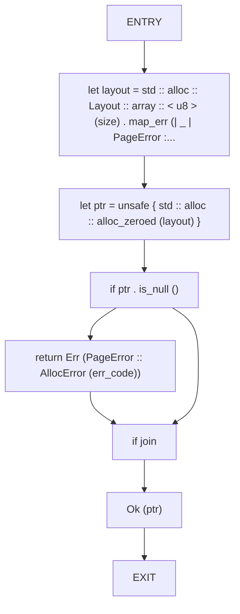

## Function: `apply_log`

- File: MMSB/src/01_page/tlog_replay.rs
- Branches: 1
- Loops: 1
- Nodes: 7
- Edges: 8

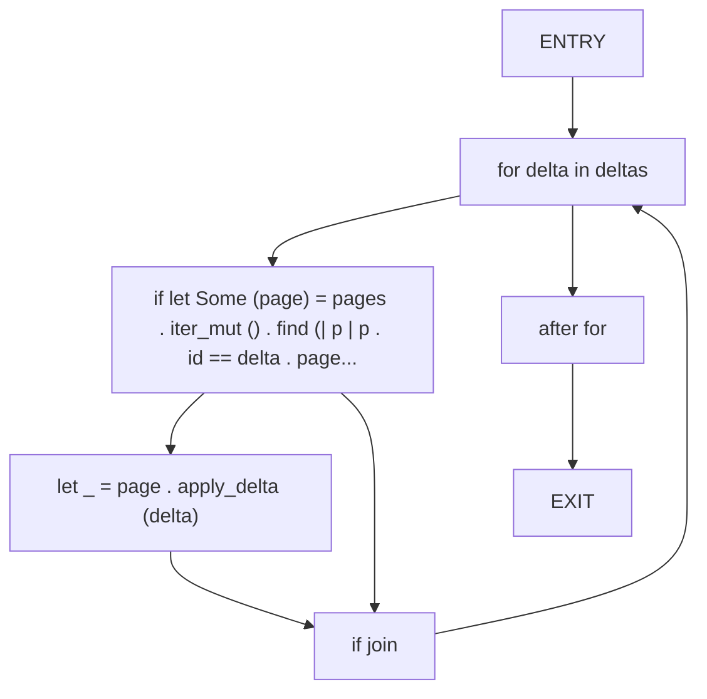

## Function: `bitpack_mask`

- File: MMSB/src/01_page/tlog_compression.rs
- Branches: 1
- Loops: 1
- Nodes: 10
- Edges: 11

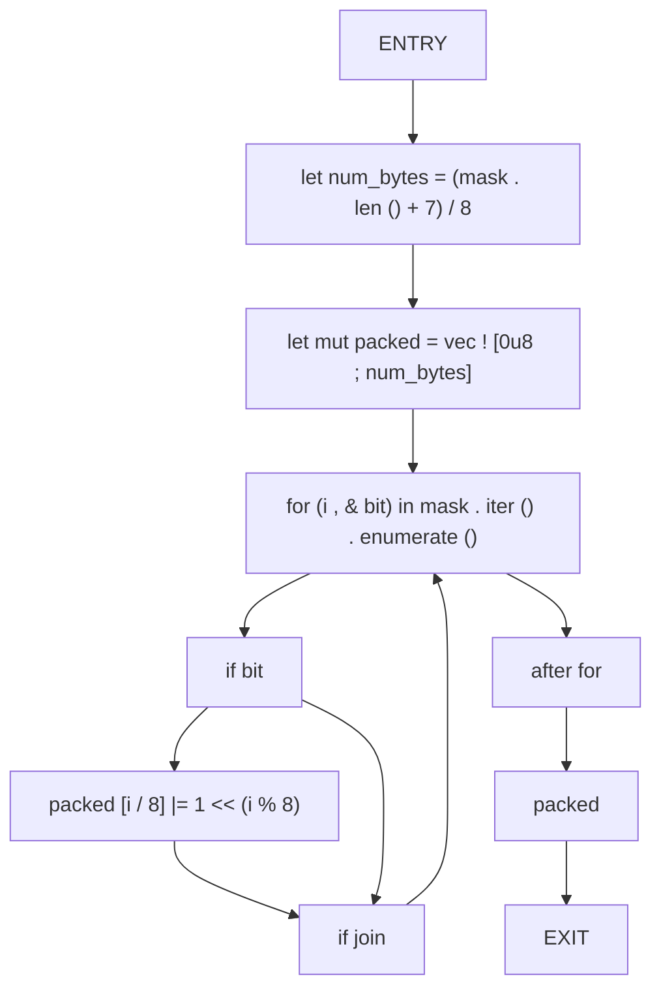

## Function: `bitunpack_mask`

- File: MMSB/src/01_page/tlog_compression.rs
- Branches: 1
- Loops: 1
- Nodes: 9
- Edges: 10

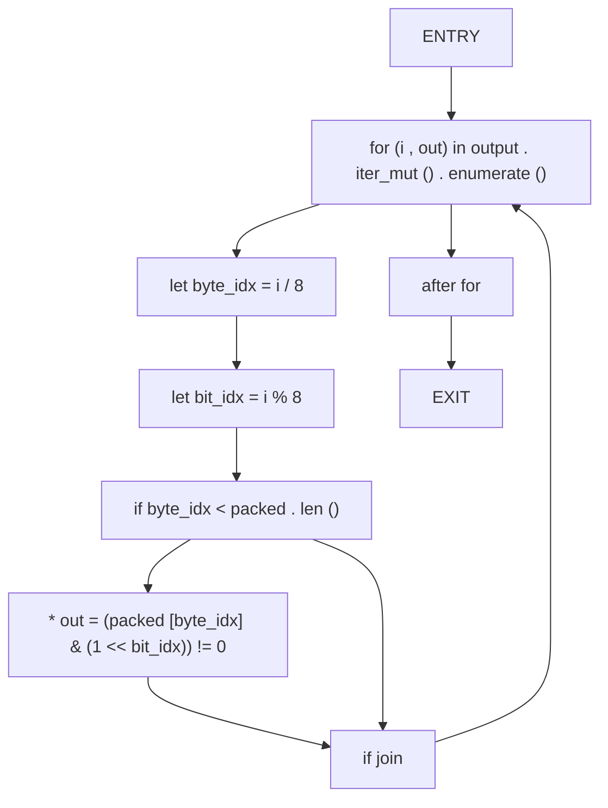

## Function: `compact`

- File: MMSB/src/01_page/tlog_compression.rs
- Branches: 5
- Loops: 1
- Nodes: 22
- Edges: 27

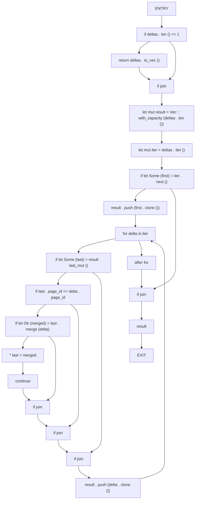

## Function: `compress_delta_mask`

- File: MMSB/src/01_page/tlog_compression.rs
- Branches: 0
- Loops: 0
- Nodes: 6
- Edges: 5

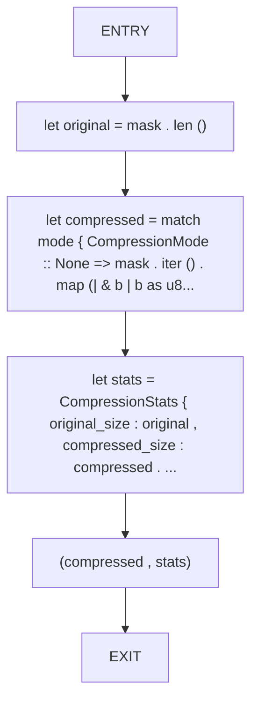

## Function: `decode_rle`

- File: MMSB/src/01_page/tlog_compression.rs
- Branches: 1
- Loops: 2
- Nodes: 14
- Edges: 16

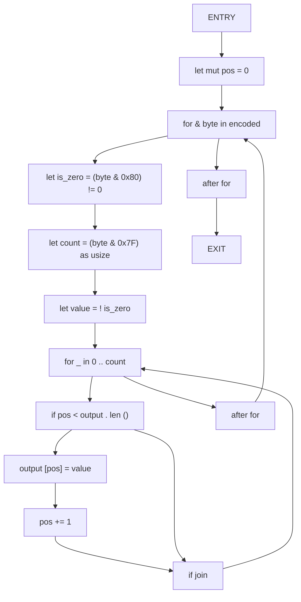

## Function: `encode_rle`

- File: MMSB/src/01_page/tlog_compression.rs
- Branches: 2
- Loops: 1
- Nodes: 18
- Edges: 20

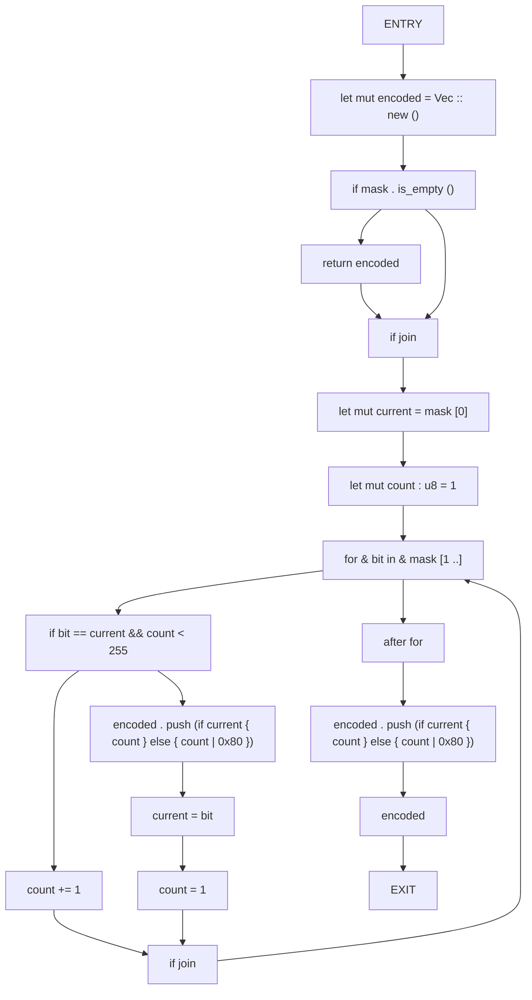

## Function: `generate_mask`

- File: MMSB/src/01_page/simd_mask.rs
- Branches: 0
- Loops: 0
- Nodes: 4
- Edges: 3

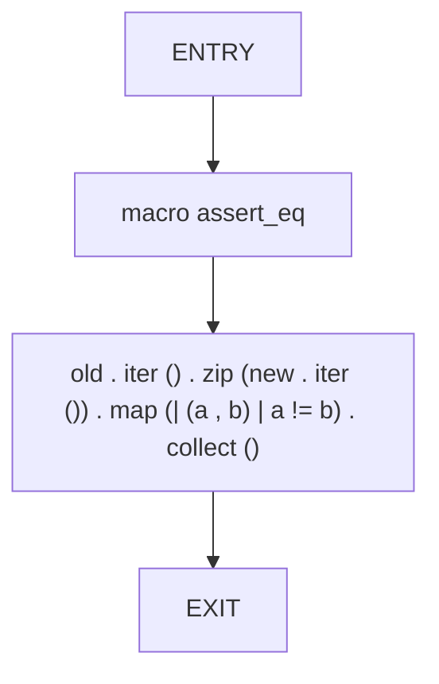

## Function: `load_checkpoint`

- File: MMSB/src/01_page/checkpoint.rs
- Branches: 4
- Loops: 1
- Nodes: 62
- Edges: 65

```mermaid
flowchart TD
    load_checkpoint_0["ENTRY"]
    load_checkpoint_1["macro eprintln"]
    load_checkpoint_2["let mut reader = BufReader :: new (File :: open (path) ?)"]
    load_checkpoint_3["let mut magic = [0u8 ; 8]"]
    load_checkpoint_4["reader . read_exact (& mut magic) ?"]
    load_checkpoint_5["if & magic != SNAPSHOT_MAGIC"]
    load_checkpoint_6["return Err (std :: io :: Error :: new (std :: io :: ErrorKind :: InvalidData , forma..."]
    load_checkpoint_7["if join"]
    load_checkpoint_8["macro eprintln"]
    load_checkpoint_9["let mut version_bytes = [0u8 ; 4]"]
    load_checkpoint_10["reader . read_exact (& mut version_bytes) ?"]
    load_checkpoint_11["let version = u32 :: from_le_bytes (version_bytes)"]
    load_checkpoint_12["if version != SNAPSHOT_VERSION"]
    load_checkpoint_13["return Err (std :: io :: Error :: new (std :: io :: ErrorKind :: InvalidData , forma..."]
    load_checkpoint_14["if join"]
    load_checkpoint_15["macro eprintln"]
    load_checkpoint_16["let mut page_count_bytes = [0u8 ; 4]"]
    load_checkpoint_17["reader . read_exact (& mut page_count_bytes) ?"]
    load_checkpoint_18["let page_count = u32 :: from_le_bytes (page_count_bytes) as usize"]
    load_checkpoint_19["macro eprintln"]
    load_checkpoint_20["let mut log_offset_bytes = [0u8 ; 8]"]
    load_checkpoint_21["reader . read_exact (& mut log_offset_bytes) ?"]
    load_checkpoint_22["macro eprintln"]
    load_checkpoint_23["let mut snapshots = Vec :: with_capacity (page_count)"]
    load_checkpoint_24["for i in 0 .. page_count"]
    load_checkpoint_25["let mut id_bytes = [0u8 ; 8]"]
    load_checkpoint_26["reader . read_exact (& mut id_bytes) ?"]
    load_checkpoint_27["let id = PageID (u64 :: from_le_bytes (id_bytes))"]
    load_checkpoint_28["let mut size_bytes = [0u8 ; 8]"]
    load_checkpoint_29["reader . read_exact (& mut size_bytes) ?"]
    load_checkpoint_30["let size = u64 :: from_le_bytes (size_bytes) as usize"]
    load_checkpoint_31["let mut epoch_bytes = [0u8 ; 4]"]
    load_checkpoint_32["reader . read_exact (& mut epoch_bytes) ?"]
    load_checkpoint_33["let epoch = u32 :: from_le_bytes (epoch_bytes)"]
    load_checkpoint_34["let mut loc_bytes = [0u8 ; 4]"]
    load_checkpoint_35["reader . read_exact (& mut loc_bytes) ?"]
    load_checkpoint_36["let location_tag = i32 :: from_le_bytes (loc_bytes)"]
    load_checkpoint_37["let location = PageLocation :: from_tag (location_tag) . map_err (| _ | { std :: io :: Error..."]
    load_checkpoint_38["let mut metadata_len_bytes = [0u8 ; 4]"]
    load_checkpoint_39["reader . read_exact (& mut metadata_len_bytes) ?"]
    load_checkpoint_40["let metadata_len = u32 :: from_le_bytes (metadata_len_bytes) as usize"]
    load_checkpoint_41["let mut metadata_blob = vec ! [0u8 ; metadata_len]"]
    load_checkpoint_42["reader . read_exact (& mut metadata_blob) ?"]
    load_checkpoint_43["let mut data_len_bytes = [0u8 ; 4]"]
    load_checkpoint_44["reader . read_exact (& mut data_len_bytes) ?"]
    load_checkpoint_45["let data_len = u32 :: from_le_bytes (data_len_bytes) as usize"]
    load_checkpoint_46["let mut data = vec ! [0u8 ; data_len]"]
    load_checkpoint_47["reader . read_exact (& mut data) ?"]
    load_checkpoint_48["macro eprintln"]
    load_checkpoint_49["snapshots . push (PageSnapshotData { page_id : id , size , epoch , location ,..."]
    load_checkpoint_50["after for"]
    load_checkpoint_51["macro eprintln"]
    load_checkpoint_52["match allocator . restore_from_snapshot (snapshots)"]
    load_checkpoint_53["arm Ok (_)"]
    load_checkpoint_54["macro eprintln"]
    load_checkpoint_55["Ok (())"]
    load_checkpoint_56["arm Err (e)"]
    load_checkpoint_57["macro eprintln"]
    load_checkpoint_58["macro eprintln"]
    load_checkpoint_59["Err (std :: io :: Error :: new (std :: io :: ErrorKind :: Other , format ! ('..."]
    load_checkpoint_60["match join"]
    load_checkpoint_61["EXIT"]
    load_checkpoint_0 --> load_checkpoint_1
    load_checkpoint_1 --> load_checkpoint_2
    load_checkpoint_2 --> load_checkpoint_3
    load_checkpoint_3 --> load_checkpoint_4
    load_checkpoint_4 --> load_checkpoint_5
    load_checkpoint_5 --> load_checkpoint_6
    load_checkpoint_6 --> load_checkpoint_7
    load_checkpoint_5 --> load_checkpoint_7
    load_checkpoint_7 --> load_checkpoint_8
    load_checkpoint_8 --> load_checkpoint_9
    load_checkpoint_9 --> load_checkpoint_10
    load_checkpoint_10 --> load_checkpoint_11
    load_checkpoint_11 --> load_checkpoint_12
    load_checkpoint_12 --> load_checkpoint_13
    load_checkpoint_13 --> load_checkpoint_14
    load_checkpoint_12 --> load_checkpoint_14
    load_checkpoint_14 --> load_checkpoint_15
    load_checkpoint_15 --> load_checkpoint_16
    load_checkpoint_16 --> load_checkpoint_17
    load_checkpoint_17 --> load_checkpoint_18
    load_checkpoint_18 --> load_checkpoint_19
    load_checkpoint_19 --> load_checkpoint_20
    load_checkpoint_20 --> load_checkpoint_21
    load_checkpoint_21 --> load_checkpoint_22
    load_checkpoint_22 --> load_checkpoint_23
    load_checkpoint_23 --> load_checkpoint_24
    load_checkpoint_24 --> load_checkpoint_25
    load_checkpoint_25 --> load_checkpoint_26
    load_checkpoint_26 --> load_checkpoint_27
    load_checkpoint_27 --> load_checkpoint_28
    load_checkpoint_28 --> load_checkpoint_29
    load_checkpoint_29 --> load_checkpoint_30
    load_checkpoint_30 --> load_checkpoint_31
    load_checkpoint_31 --> load_checkpoint_32
    load_checkpoint_32 --> load_checkpoint_33
    load_checkpoint_33 --> load_checkpoint_34
    load_checkpoint_34 --> load_checkpoint_35
    load_checkpoint_35 --> load_checkpoint_36
    load_checkpoint_36 --> load_checkpoint_37
    load_checkpoint_37 --> load_checkpoint_38
    load_checkpoint_38 --> load_checkpoint_39
    load_checkpoint_39 --> load_checkpoint_40
    load_checkpoint_40 --> load_checkpoint_41
    load_checkpoint_41 --> load_checkpoint_42
    load_checkpoint_42 --> load_checkpoint_43
    load_checkpoint_43 --> load_checkpoint_44
    load_checkpoint_44 --> load_checkpoint_45
    load_checkpoint_45 --> load_checkpoint_46
    load_checkpoint_46 --> load_checkpoint_47
    load_checkpoint_47 --> load_checkpoint_48
    load_checkpoint_48 --> load_checkpoint_49
    load_checkpoint_49 --> load_checkpoint_24
    load_checkpoint_24 --> load_checkpoint_50
    load_checkpoint_50 --> load_checkpoint_51
    load_checkpoint_51 --> load_checkpoint_52
    load_checkpoint_52 --> load_checkpoint_53
    load_checkpoint_53 --> load_checkpoint_54
    load_checkpoint_54 --> load_checkpoint_55
    load_checkpoint_52 --> load_checkpoint_56
    load_checkpoint_56 --> load_checkpoint_57
    load_checkpoint_57 --> load_checkpoint_58
    load_checkpoint_58 --> load_checkpoint_59
    load_checkpoint_55 --> load_checkpoint_60
    load_checkpoint_59 --> load_checkpoint_60
    load_checkpoint_60 --> load_checkpoint_61
```

## Function: `merge_deltas`

- File: MMSB/src/01_page/delta_merge.rs
- Branches: 0
- Loops: 0
- Nodes: 3
- Edges: 2

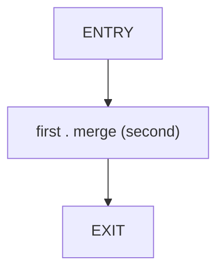

## Function: `merge_dense_avx2`

- File: MMSB/src/01_page/delta_merge.rs
- Branches: 1
- Loops: 4
- Nodes: 34
- Edges: 38

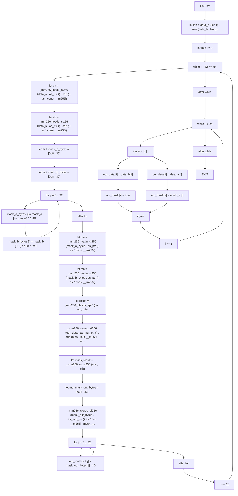

## Function: `merge_dense_avx512`

- File: MMSB/src/01_page/delta_merge.rs
- Branches: 1
- Loops: 4
- Nodes: 29
- Edges: 33

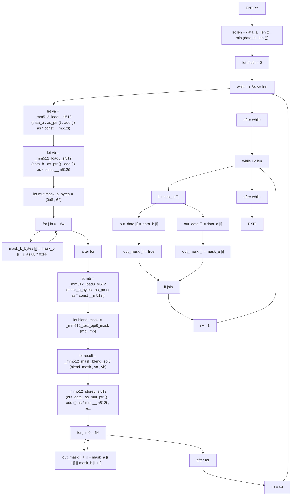

## Function: `merge_dense_simd`

- File: MMSB/src/01_page/delta_merge.rs
- Branches: 3
- Loops: 1
- Nodes: 19
- Edges: 22

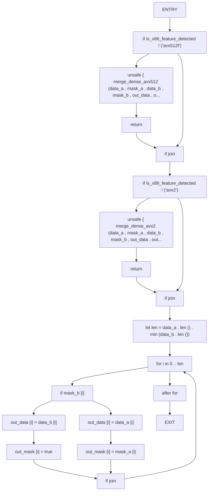

## Function: `now_ns`

- File: MMSB/src/01_page/delta.rs
- Branches: 0
- Loops: 0
- Nodes: 3
- Edges: 2

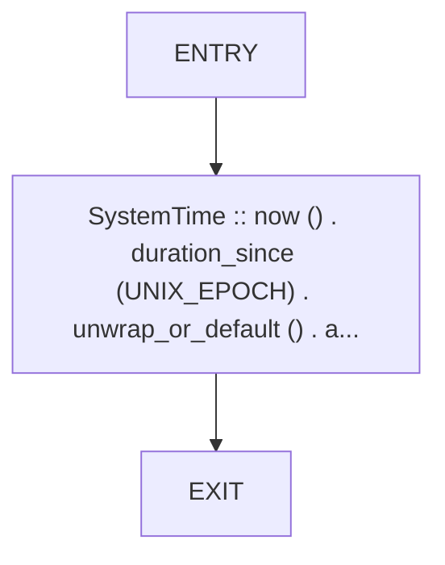

## Function: `read_bytes`

- File: MMSB/src/01_page/page.rs
- Branches: 1
- Loops: 0
- Nodes: 8
- Edges: 8

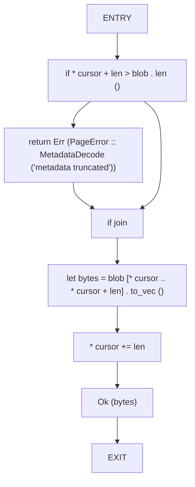

## Function: `read_frame`

- File: MMSB/src/01_page/tlog.rs
- Branches: 3
- Loops: 0
- Nodes: 37
- Edges: 38

```mermaid
flowchart TD
    read_frame_0["ENTRY"]
    read_frame_1["let mut delta_id = [0u8 ; 8]"]
    read_frame_2["match reader . read_exact (& mut delta_id)"]
    read_frame_3["arm Ok (())"]
    read_frame_4["arm Err (err) if guard"]
    read_frame_5["return Ok (None)"]
    read_frame_6["arm Err (err)"]
    read_frame_7["return Err (err)"]
    read_frame_8["match join"]
    read_frame_9["let mut page_id = [0u8 ; 8]"]
    read_frame_10["reader . read_exact (& mut page_id) ?"]
    read_frame_11["let mut epoch = [0u8 ; 4]"]
    read_frame_12["reader . read_exact (& mut epoch) ?"]
    read_frame_13["let mut mask_len_bytes = [0u8 ; 4]"]
    read_frame_14["reader . read_exact (& mut mask_len_bytes) ?"]
    read_frame_15["let mask_len = u32 :: from_le_bytes (mask_len_bytes) as usize"]
    read_frame_16["let mut mask_raw = vec ! [0u8 ; mask_len]"]
    read_frame_17["reader . read_exact (& mut mask_raw) ?"]
    read_frame_18["let mask = mask_raw . iter () . map (| b | * b != 0) . collect :: < Vec < bool > > ()"]
    read_frame_19["let mut payload_len_bytes = [0u8 ; 4]"]
    read_frame_20["reader . read_exact (& mut payload_len_bytes) ?"]
    read_frame_21["let payload_len = u32 :: from_le_bytes (payload_len_bytes) as usize"]
    read_frame_22["let mut payload = vec ! [0u8 ; payload_len]"]
    read_frame_23["reader . read_exact (& mut payload) ?"]
    read_frame_24["let mut sparse_flag = [0u8 ; 1]"]
    read_frame_25["reader . read_exact (& mut sparse_flag) ?"]
    read_frame_26["let mut timestamp_bytes = [0u8 ; 8]"]
    read_frame_27["reader . read_exact (& mut timestamp_bytes) ?"]
    read_frame_28["let mut source_len_bytes = [0u8 ; 4]"]
    read_frame_29["reader . read_exact (& mut source_len_bytes) ?"]
    read_frame_30["let source_len = u32 :: from_le_bytes (source_len_bytes) as usize"]
    read_frame_31["let mut source_buf = vec ! [0u8 ; source_len]"]
    read_frame_32["reader . read_exact (& mut source_buf) ?"]
    read_frame_33["let source = Source (String :: from_utf8_lossy (& source_buf) . to_string ())"]
    read_frame_34["let intent_metadata = if version >= 2 { let mut metadata_len_bytes = [0u8 ; 4] ; if reader . read_e..."]
    read_frame_35["Ok (Some (Delta { delta_id : DeltaID (u64 :: from_le_bytes (delta_id)) , page..."]
    read_frame_36["EXIT"]
    read_frame_0 --> read_frame_1
    read_frame_1 --> read_frame_2
    read_frame_2 --> read_frame_3
    read_frame_2 --> read_frame_4
    read_frame_4 --> read_frame_5
    read_frame_2 --> read_frame_6
    read_frame_6 --> read_frame_7
    read_frame_3 --> read_frame_8
    read_frame_5 --> read_frame_8
    read_frame_7 --> read_frame_8
    read_frame_8 --> read_frame_9
    read_frame_9 --> read_frame_10
    read_frame_10 --> read_frame_11
    read_frame_11 --> read_frame_12
    read_frame_12 --> read_frame_13
    read_frame_13 --> read_frame_14
    read_frame_14 --> read_frame_15
    read_frame_15 --> read_frame_16
    read_frame_16 --> read_frame_17
    read_frame_17 --> read_frame_18
    read_frame_18 --> read_frame_19
    read_frame_19 --> read_frame_20
    read_frame_20 --> read_frame_21
    read_frame_21 --> read_frame_22
    read_frame_22 --> read_frame_23
    read_frame_23 --> read_frame_24
    read_frame_24 --> read_frame_25
    read_frame_25 --> read_frame_26
    read_frame_26 --> read_frame_27
    read_frame_27 --> read_frame_28
    read_frame_28 --> read_frame_29
    read_frame_29 --> read_frame_30
    read_frame_30 --> read_frame_31
    read_frame_31 --> read_frame_32
    read_frame_32 --> read_frame_33
    read_frame_33 --> read_frame_34
    read_frame_34 --> read_frame_35
    read_frame_35 --> read_frame_36
```

## Function: `read_log`

- File: MMSB/src/01_page/tlog_serialization.rs
- Branches: 2
- Loops: 1
- Nodes: 49
- Edges: 51

```mermaid
flowchart TD
    read_log_0["ENTRY"]
    read_log_1["let file = File :: open (path) ?"]
    read_log_2["let mut reader = BufReader :: new (file)"]
    read_log_3["let mut magic = [0u8 ; 8]"]
    read_log_4["reader . read_exact (& mut magic) ?"]
    read_log_5["if & magic != b'MMSBLOG1'"]
    read_log_6["return Err (std :: io :: Error :: new (std :: io :: ErrorKind :: InvalidData , 'inva..."]
    read_log_7["if join"]
    read_log_8["let mut version_bytes = [0u8 ; 4]"]
    read_log_9["reader . read_exact (& mut version_bytes) ?"]
    read_log_10["let version = u32 :: from_le_bytes (version_bytes)"]
    read_log_11["let mut deltas = Vec :: new ()"]
    read_log_12["loop"]
    read_log_13["let mut delta_id = [0u8 ; 8]"]
    read_log_14["if reader . read_exact (& mut delta_id) . is_err ()"]
    read_log_15["break"]
    read_log_16["if join"]
    read_log_17["let mut page_id = [0u8 ; 8]"]
    read_log_18["reader . read_exact (& mut page_id) ?"]
    read_log_19["let mut epoch = [0u8 ; 4]"]
    read_log_20["reader . read_exact (& mut epoch) ?"]
    read_log_21["let mut mask_len_bytes = [0u8 ; 4]"]
    read_log_22["reader . read_exact (& mut mask_len_bytes) ?"]
    read_log_23["let mask_len = u32 :: from_le_bytes (mask_len_bytes) as usize"]
    read_log_24["let mut mask_bytes = vec ! [0u8 ; mask_len]"]
    read_log_25["reader . read_exact (& mut mask_bytes) ?"]
    read_log_26["let mask = mask_bytes . iter () . map (| b | * b != 0) . collect ()"]
    read_log_27["let mut payload_len_bytes = [0u8 ; 4]"]
    read_log_28["reader . read_exact (& mut payload_len_bytes) ?"]
    read_log_29["let payload_len = u32 :: from_le_bytes (payload_len_bytes) as usize"]
    read_log_30["let mut payload = vec ! [0u8 ; payload_len]"]
    read_log_31["reader . read_exact (& mut payload) ?"]
    read_log_32["let mut sparse_flag = [0u8 ; 1]"]
    read_log_33["reader . read_exact (& mut sparse_flag) ?"]
    read_log_34["let is_sparse = sparse_flag [0] != 0"]
    read_log_35["let mut timestamp_bytes = [0u8 ; 8]"]
    read_log_36["reader . read_exact (& mut timestamp_bytes) ?"]
    read_log_37["let timestamp = u64 :: from_le_bytes (timestamp_bytes)"]
    read_log_38["let mut source_len_bytes = [0u8 ; 4]"]
    read_log_39["reader . read_exact (& mut source_len_bytes) ?"]
    read_log_40["let source_len = u32 :: from_le_bytes (source_len_bytes) as usize"]
    read_log_41["let mut source_buf = vec ! [0u8 ; source_len]"]
    read_log_42["reader . read_exact (& mut source_buf) ?"]
    read_log_43["let source = Source (String :: from_utf8_lossy (& source_buf) . to_string ())"]
    read_log_44["let intent_metadata = if version >= 2 { let mut metadata_len_bytes = [0u8 ; 4] ; if reader . read_e..."]
    read_log_45["deltas . push (Delta { delta_id : DeltaID (u64 :: from_le_bytes (delta_id)) ,..."]
    read_log_46["loop break"]
    read_log_47["Ok (deltas)"]
    read_log_48["EXIT"]
    read_log_0 --> read_log_1
    read_log_1 --> read_log_2
    read_log_2 --> read_log_3
    read_log_3 --> read_log_4
    read_log_4 --> read_log_5
    read_log_5 --> read_log_6
    read_log_6 --> read_log_7
    read_log_5 --> read_log_7
    read_log_7 --> read_log_8
    read_log_8 --> read_log_9
    read_log_9 --> read_log_10
    read_log_10 --> read_log_11
    read_log_11 --> read_log_12
    read_log_12 --> read_log_13
    read_log_13 --> read_log_14
    read_log_14 --> read_log_15
    read_log_15 --> read_log_16
    read_log_14 --> read_log_16
    read_log_16 --> read_log_17
    read_log_17 --> read_log_18
    read_log_18 --> read_log_19
    read_log_19 --> read_log_20
    read_log_20 --> read_log_21
    read_log_21 --> read_log_22
    read_log_22 --> read_log_23
    read_log_23 --> read_log_24
    read_log_24 --> read_log_25
    read_log_25 --> read_log_26
    read_log_26 --> read_log_27
    read_log_27 --> read_log_28
    read_log_28 --> read_log_29
    read_log_29 --> read_log_30
    read_log_30 --> read_log_31
    read_log_31 --> read_log_32
    read_log_32 --> read_log_33
    read_log_33 --> read_log_34
    read_log_34 --> read_log_35
    read_log_35 --> read_log_36
    read_log_36 --> read_log_37
    read_log_37 --> read_log_38
    read_log_38 --> read_log_39
    read_log_39 --> read_log_40
    read_log_40 --> read_log_41
    read_log_41 --> read_log_42
    read_log_42 --> read_log_43
    read_log_43 --> read_log_44
    read_log_44 --> read_log_45
    read_log_45 --> read_log_12
    read_log_12 --> read_log_46
    read_log_46 --> read_log_47
    read_log_47 --> read_log_48
```

## Function: `read_u32`

- File: MMSB/src/01_page/page.rs
- Branches: 1
- Loops: 0
- Nodes: 8
- Edges: 8

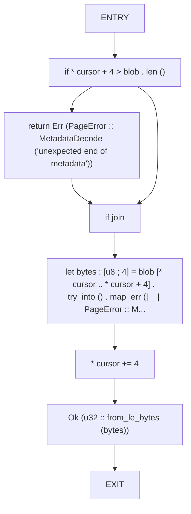

## Function: `serialize_frame`

- File: MMSB/src/01_page/tlog.rs
- Branches: 1
- Loops: 1
- Nodes: 24
- Edges: 25

```mermaid
flowchart TD
    serialize_frame_0["ENTRY"]
    serialize_frame_1["writer . write_all (& delta . delta_id . 0 . to_le_bytes ()) ?"]
    serialize_frame_2["writer . write_all (& delta . page_id . 0 . to_le_bytes ()) ?"]
    serialize_frame_3["writer . write_all (& delta . epoch . 0 . to_le_bytes ()) ?"]
    serialize_frame_4["let mask_len = delta . mask . len () as u32"]
    serialize_frame_5["writer . write_all (& mask_len . to_le_bytes ()) ?"]
    serialize_frame_6["for flag in & delta . mask"]
    serialize_frame_7["writer . write_all (& [* flag as u8]) ?"]
    serialize_frame_8["after for"]
    serialize_frame_9["let payload_len = delta . payload . len () as u32"]
    serialize_frame_10["writer . write_all (& payload_len . to_le_bytes ()) ?"]
    serialize_frame_11["writer . write_all (& delta . payload) ?"]
    serialize_frame_12["writer . write_all (& [delta . is_sparse as u8]) ?"]
    serialize_frame_13["writer . write_all (& delta . timestamp . to_le_bytes ()) ?"]
    serialize_frame_14["let source_bytes = delta . source . 0 . as_bytes ()"]
    serialize_frame_15["writer . write_all (& (source_bytes . len () as u32) . to_le_bytes ()) ?"]
    serialize_frame_16["writer . write_all (source_bytes) ?"]
    serialize_frame_17["let metadata_len = delta . intent_metadata . as_ref () . map (| s | s . as_bytes () . len () as ..."]
    serialize_frame_18["writer . write_all (& metadata_len . to_le_bytes ()) ?"]
    serialize_frame_19["if let Some (metadata) = & delta . intent_metadata"]
    serialize_frame_20["writer . write_all (metadata . as_bytes ()) ?"]
    serialize_frame_21["if join"]
    serialize_frame_22["Ok (())"]
    serialize_frame_23["EXIT"]
    serialize_frame_0 --> serialize_frame_1
    serialize_frame_1 --> serialize_frame_2
    serialize_frame_2 --> serialize_frame_3
    serialize_frame_3 --> serialize_frame_4
    serialize_frame_4 --> serialize_frame_5
    serialize_frame_5 --> serialize_frame_6
    serialize_frame_6 --> serialize_frame_7
    serialize_frame_7 --> serialize_frame_6
    serialize_frame_6 --> serialize_frame_8
    serialize_frame_8 --> serialize_frame_9
    serialize_frame_9 --> serialize_frame_10
    serialize_frame_10 --> serialize_frame_11
    serialize_frame_11 --> serialize_frame_12
    serialize_frame_12 --> serialize_frame_13
    serialize_frame_13 --> serialize_frame_14
    serialize_frame_14 --> serialize_frame_15
    serialize_frame_15 --> serialize_frame_16
    serialize_frame_16 --> serialize_frame_17
    serialize_frame_17 --> serialize_frame_18
    serialize_frame_18 --> serialize_frame_19
    serialize_frame_19 --> serialize_frame_20
    serialize_frame_20 --> serialize_frame_21
    serialize_frame_19 --> serialize_frame_21
    serialize_frame_21 --> serialize_frame_22
    serialize_frame_22 --> serialize_frame_23
```

## Function: `summary`

- File: MMSB/src/01_page/tlog.rs
- Branches: 1
- Loops: 1
- Nodes: 16
- Edges: 17

```mermaid
flowchart TD
    summary_0["ENTRY"]
    summary_1["let file = match File :: open (path . as_ref ()) { Ok (file) => file , Err (err) if err ..."]
    summary_2["if file . metadata () ? . len () == 0"]
    summary_3["return Ok (LogSummary :: default ())"]
    summary_4["if join"]
    summary_5["let mut reader = BufReader :: new (file)"]
    summary_6["let version = validate_header (& mut reader) ?"]
    summary_7["let mut summary = LogSummary :: default ()"]
    summary_8["while let Ok (Some (delta)) = read_frame (& mut reader , version)"]
    summary_9["summary . total_deltas += 1"]
    summary_10["let metadata_bytes = delta . intent_metadata . as_ref () . map (| m | m . as_bytes () . len () as ..."]
    summary_11["summary . total_bytes += delta . mask . len () as u64 + delta . payload . len..."]
    summary_12["summary . last_epoch = summary . last_epoch . max (delta . epoch . 0)"]
    summary_13["after while"]
    summary_14["Ok (summary)"]
    summary_15["EXIT"]
    summary_0 --> summary_1
    summary_1 --> summary_2
    summary_2 --> summary_3
    summary_3 --> summary_4
    summary_2 --> summary_4
    summary_4 --> summary_5
    summary_5 --> summary_6
    summary_6 --> summary_7
    summary_7 --> summary_8
    summary_8 --> summary_9
    summary_9 --> summary_10
    summary_10 --> summary_11
    summary_11 --> summary_12
    summary_12 --> summary_8
    summary_8 --> summary_13
    summary_13 --> summary_14
    summary_14 --> summary_15
```

## Function: `validate_delta`

- File: MMSB/src/01_page/delta_validation.rs
- Branches: 3
- Loops: 0
- Nodes: 12
- Edges: 14

```mermaid
flowchart TD
    validate_delta_0["ENTRY"]
    validate_delta_1["if delta . is_sparse"]
    validate_delta_2["let changed = delta . mask . iter () . filter (| & & bit | bit) . count ()"]
    validate_delta_3["if changed != delta . payload . len ()"]
    validate_delta_4["return Err (DeltaError :: SizeMismatch { mask_len : changed , payload_len : delta . ..."]
    validate_delta_5["if join"]
    validate_delta_6["if delta . mask . len () != delta . payload . len ()"]
    validate_delta_7["return Err (DeltaError :: SizeMismatch { mask_len : delta . mask . len () , payload_..."]
    validate_delta_8["if join"]
    validate_delta_9["if join"]
    validate_delta_10["Ok (())"]
    validate_delta_11["EXIT"]
    validate_delta_0 --> validate_delta_1
    validate_delta_1 --> validate_delta_2
    validate_delta_2 --> validate_delta_3
    validate_delta_3 --> validate_delta_4
    validate_delta_4 --> validate_delta_5
    validate_delta_3 --> validate_delta_5
    validate_delta_1 --> validate_delta_6
    validate_delta_6 --> validate_delta_7
    validate_delta_7 --> validate_delta_8
    validate_delta_6 --> validate_delta_8
    validate_delta_5 --> validate_delta_9
    validate_delta_8 --> validate_delta_9
    validate_delta_9 --> validate_delta_10
    validate_delta_10 --> validate_delta_11
```

## Function: `validate_header`

- File: MMSB/src/01_page/tlog.rs
- Branches: 2
- Loops: 0
- Nodes: 15
- Edges: 16

```mermaid
flowchart TD
    validate_header_0["ENTRY"]
    validate_header_1["reader . seek (SeekFrom :: Start (0)) ?"]
    validate_header_2["let mut magic = [0u8 ; 8]"]
    validate_header_3["reader . read_exact (& mut magic) ?"]
    validate_header_4["if & magic != MAGIC"]
    validate_header_5["return Err (std :: io :: Error :: new (std :: io :: ErrorKind :: InvalidData , 'inva..."]
    validate_header_6["if join"]
    validate_header_7["let mut version_bytes = [0u8 ; 4]"]
    validate_header_8["reader . read_exact (& mut version_bytes) ?"]
    validate_header_9["let version = u32 :: from_le_bytes (version_bytes)"]
    validate_header_10["if version < 1 || version > VERSION"]
    validate_header_11["return Err (std :: io :: Error :: new (std :: io :: ErrorKind :: InvalidData , 'unsu..."]
    validate_header_12["if join"]
    validate_header_13["Ok (version)"]
    validate_header_14["EXIT"]
    validate_header_0 --> validate_header_1
    validate_header_1 --> validate_header_2
    validate_header_2 --> validate_header_3
    validate_header_3 --> validate_header_4
    validate_header_4 --> validate_header_5
    validate_header_5 --> validate_header_6
    validate_header_4 --> validate_header_6
    validate_header_6 --> validate_header_7
    validate_header_7 --> validate_header_8
    validate_header_8 --> validate_header_9
    validate_header_9 --> validate_header_10
    validate_header_10 --> validate_header_11
    validate_header_11 --> validate_header_12
    validate_header_10 --> validate_header_12
    validate_header_12 --> validate_header_13
    validate_header_13 --> validate_header_14
```

## Function: `write_checkpoint`

- File: MMSB/src/01_page/checkpoint.rs
- Branches: 0
- Loops: 1
- Nodes: 21
- Edges: 21

```mermaid
flowchart TD
    write_checkpoint_0["ENTRY"]
    write_checkpoint_1["let pages = allocator . snapshot_pages ()"]
    write_checkpoint_2["let log_offset = tlog . current_offset () ?"]
    write_checkpoint_3["let mut writer = BufWriter :: new (File :: create (path) ?)"]
    write_checkpoint_4["writer . write_all (SNAPSHOT_MAGIC) ?"]
    write_checkpoint_5["writer . write_all (& SNAPSHOT_VERSION . to_le_bytes ()) ?"]
    write_checkpoint_6["writer . write_all (& (pages . len () as u32) . to_le_bytes ()) ?"]
    write_checkpoint_7["writer . write_all (& log_offset . to_le_bytes ()) ?"]
    write_checkpoint_8["for page in pages"]
    write_checkpoint_9["writer . write_all (& page . page_id . 0 . to_le_bytes ()) ?"]
    write_checkpoint_10["writer . write_all (& (page . size as u64) . to_le_bytes ()) ?"]
    write_checkpoint_11["writer . write_all (& page . epoch . to_le_bytes ()) ?"]
    write_checkpoint_12["writer . write_all (& (page . location as i32) . to_le_bytes ()) ?"]
    write_checkpoint_13["writer . write_all (& (page . metadata_blob . len () as u32) . to_le_bytes ()) ?"]
    write_checkpoint_14["writer . write_all (& page . metadata_blob) ?"]
    write_checkpoint_15["writer . write_all (& (page . data . len () as u32) . to_le_bytes ()) ?"]
    write_checkpoint_16["writer . write_all (& page . data) ?"]
    write_checkpoint_17["after for"]
    write_checkpoint_18["writer . flush () ?"]
    write_checkpoint_19["Ok (())"]
    write_checkpoint_20["EXIT"]
    write_checkpoint_0 --> write_checkpoint_1
    write_checkpoint_1 --> write_checkpoint_2
    write_checkpoint_2 --> write_checkpoint_3
    write_checkpoint_3 --> write_checkpoint_4
    write_checkpoint_4 --> write_checkpoint_5
    write_checkpoint_5 --> write_checkpoint_6
    write_checkpoint_6 --> write_checkpoint_7
    write_checkpoint_7 --> write_checkpoint_8
    write_checkpoint_8 --> write_checkpoint_9
    write_checkpoint_9 --> write_checkpoint_10
    write_checkpoint_10 --> write_checkpoint_11
    write_checkpoint_11 --> write_checkpoint_12
    write_checkpoint_12 --> write_checkpoint_13
    write_checkpoint_13 --> write_checkpoint_14
    write_checkpoint_14 --> write_checkpoint_15
    write_checkpoint_15 --> write_checkpoint_16
    write_checkpoint_16 --> write_checkpoint_8
    write_checkpoint_8 --> write_checkpoint_17
    write_checkpoint_17 --> write_checkpoint_18
    write_checkpoint_18 --> write_checkpoint_19
    write_checkpoint_19 --> write_checkpoint_20
```

