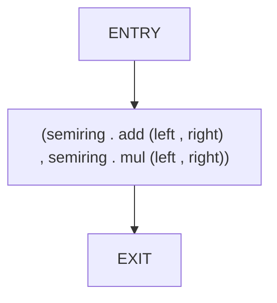
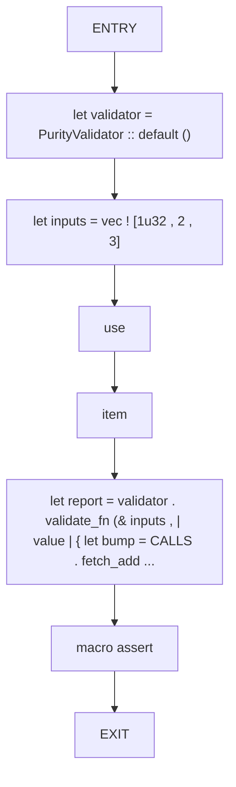
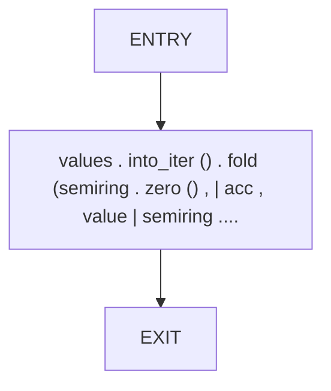
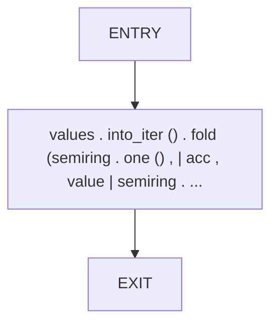
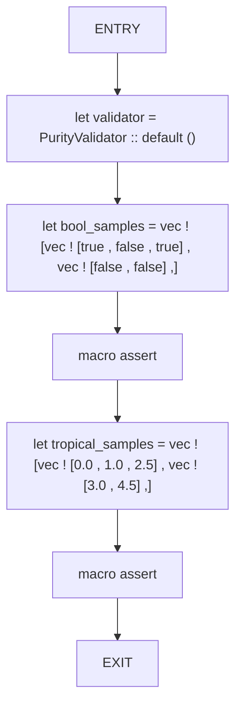

# CFG Group: src/02_semiring

## Function: `accumulate`

- File: MMSB/src/02_semiring/semiring_ops.rs
- Branches: 0
- Loops: 0
- Nodes: 3
- Edges: 2

## Function: `detects_impure_function`

- File: MMSB/src/02_semiring/purity_validator.rs
- Branches: 0
- Loops: 0
- Nodes: 8
- Edges: 7

## Function: `fold_add`

- File: MMSB/src/02_semiring/semiring_ops.rs
- Branches: 0
- Loops: 0
- Nodes: 3
- Edges: 2

## Function: `fold_mul`

- File: MMSB/src/02_semiring/semiring_ops.rs
- Branches: 0
- Loops: 0
- Nodes: 3
- Edges: 2

## Function: `validates_semiring_operations`

- File: MMSB/src/02_semiring/purity_validator.rs
- Branches: 0
- Loops: 0
- Nodes: 7
- Edges: 6

