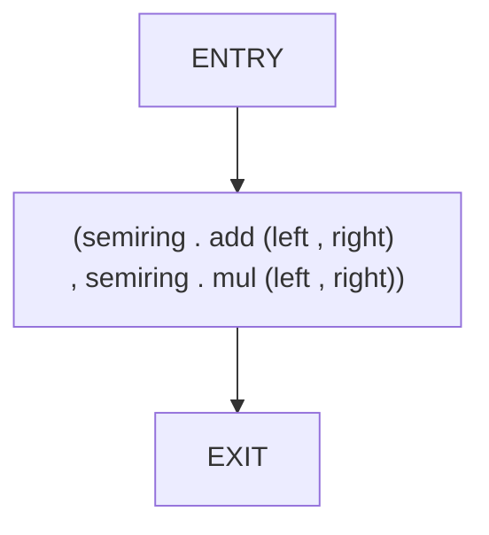
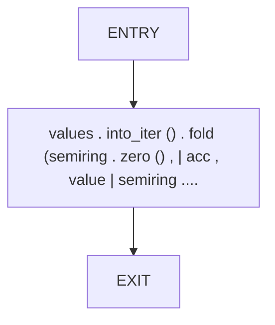
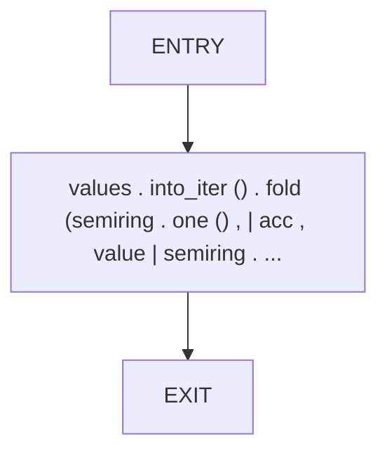

# CFG Group: src/02_semiring

## Function: `accumulate`

- File: MMSB/src/02_semiring/semiring_ops.rs
- Branches: 0
- Loops: 0
- Nodes: 3
- Edges: 2

## Function: `fold_add`

- File: MMSB/src/02_semiring/semiring_ops.rs
- Branches: 0
- Loops: 0
- Nodes: 3
- Edges: 2

## Function: `fold_mul`

- File: MMSB/src/02_semiring/semiring_ops.rs
- Branches: 0
- Loops: 0
- Nodes: 3
- Edges: 2

