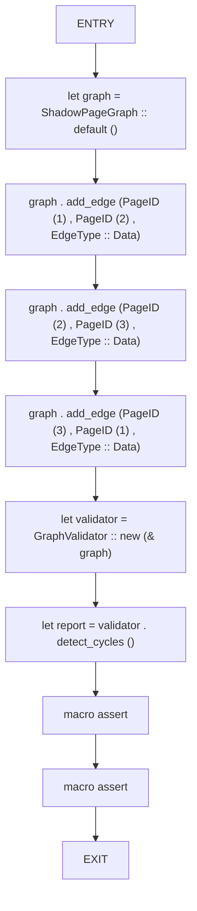
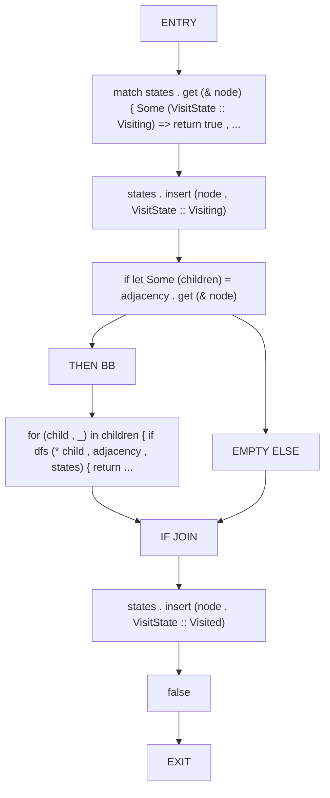
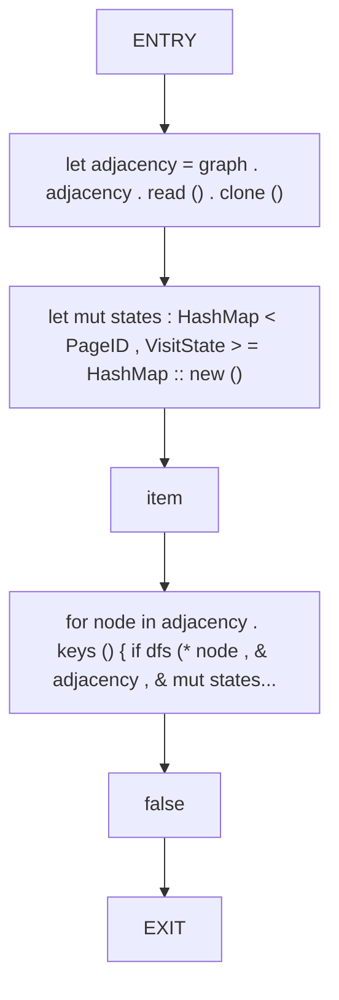
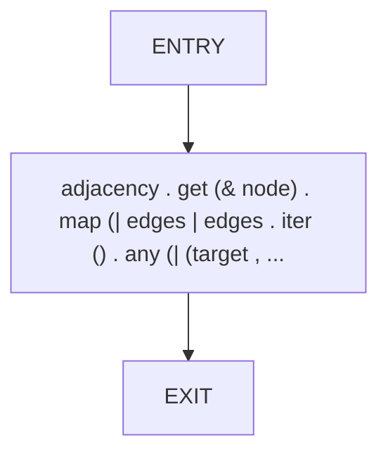
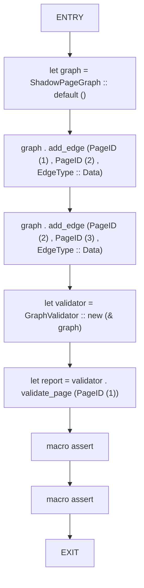
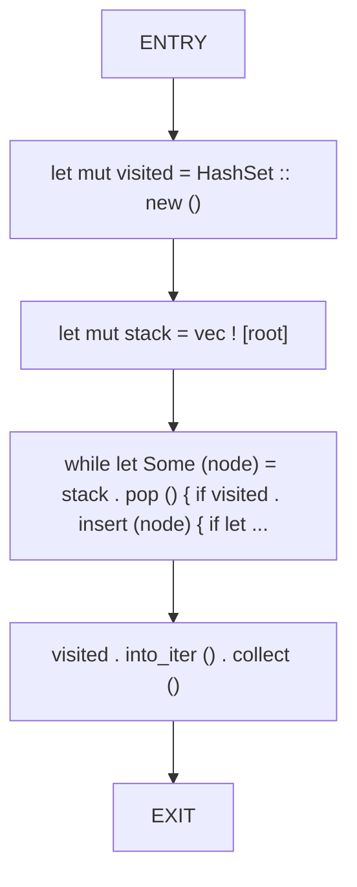
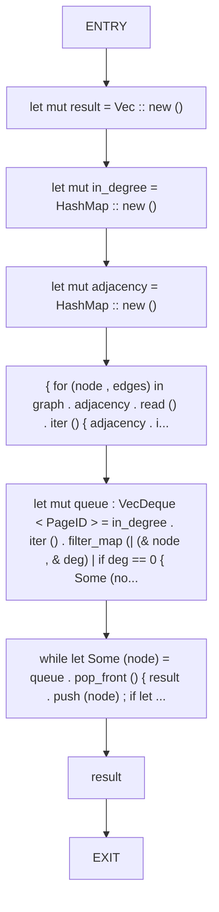

# CFG Group: src/03_dag

## Function: `detects_cycle`

- File: MMSB/src/03_dag/graph_validator.rs
- Branches: 0
- Loops: 0
- Nodes: 10
- Edges: 9

## Function: `dfs`

- File: MMSB/src/03_dag/cycle_detection.rs
- Branches: 1
- Loops: 0
- Nodes: 11
- Edges: 11

## Function: `has_cycle`

- File: MMSB/src/03_dag/cycle_detection.rs
- Branches: 0
- Loops: 0
- Nodes: 7
- Edges: 6

## Function: `is_self_loop`

- File: MMSB/src/03_dag/graph_validator.rs
- Branches: 0
- Loops: 0
- Nodes: 3
- Edges: 2

## Function: `per_page_validation`

- File: MMSB/src/03_dag/graph_validator.rs
- Branches: 0
- Loops: 0
- Nodes: 9
- Edges: 8

## Function: `reachable`

- File: MMSB/src/03_dag/graph_validator.rs
- Branches: 0
- Loops: 0
- Nodes: 6
- Edges: 5

## Function: `strong_connect`

- File: MMSB/src/03_dag/graph_validator.rs
- Branches: 4
- Loops: 1
- Nodes: 36
- Edges: 40

```mermaid
flowchart TD
    strong_connect_0["ENTRY"]
    strong_connect_1["indices . insert (node , * index)"]
    strong_connect_2["lowlink . insert (node , * index)"]
    strong_connect_3["* index += 1"]
    strong_connect_4["stack . push (node)"]
    strong_connect_5["on_stack . insert (node)"]
    strong_connect_6["if let Some (children) = adjacency . get (& node)"]
    strong_connect_7["THEN BB"]
    strong_connect_8["for (child , _) in children { if ! indices . contains_key (child) { strong_co..."]
    strong_connect_9["EMPTY ELSE"]
    strong_connect_10["IF JOIN"]
    strong_connect_11["let node_low = * lowlink . get (& node) . unwrap ()"]
    strong_connect_12["let node_index = * indices . get (& node) . unwrap ()"]
    strong_connect_13["if node_low == node_index"]
    strong_connect_14["THEN BB"]
    strong_connect_15["let mut component = Vec :: new ()"]
    strong_connect_16["LOOP"]
    strong_connect_17["LOOP BB"]
    strong_connect_18["let popped = stack . pop () . unwrap ()"]
    strong_connect_19["on_stack . remove (& popped)"]
    strong_connect_20["component . push (popped)"]
    strong_connect_21["if popped == node"]
    strong_connect_22["THEN BB"]
    strong_connect_23["break"]
    strong_connect_24["EMPTY ELSE"]
    strong_connect_25["IF JOIN"]
    strong_connect_26["AFTER LOOP"]
    strong_connect_27["if component . len () > 1 || is_self_loop (adjacency , node)"]
    strong_connect_28["THEN BB"]
    strong_connect_29["* cycle = component"]
    strong_connect_30["* has_cycle = true"]
    strong_connect_31["EMPTY ELSE"]
    strong_connect_32["IF JOIN"]
    strong_connect_33["EMPTY ELSE"]
    strong_connect_34["IF JOIN"]
    strong_connect_35["EXIT"]
    strong_connect_0 --> strong_connect_1
    strong_connect_1 --> strong_connect_2
    strong_connect_2 --> strong_connect_3
    strong_connect_3 --> strong_connect_4
    strong_connect_4 --> strong_connect_5
    strong_connect_5 --> strong_connect_6
    strong_connect_6 --> strong_connect_7
    strong_connect_7 --> strong_connect_8
    strong_connect_6 --> strong_connect_9
    strong_connect_8 --> strong_connect_10
    strong_connect_9 --> strong_connect_10
    strong_connect_10 --> strong_connect_11
    strong_connect_11 --> strong_connect_12
    strong_connect_12 --> strong_connect_13
    strong_connect_13 --> strong_connect_14
    strong_connect_14 --> strong_connect_15
    strong_connect_15 --> strong_connect_16
    strong_connect_16 --> strong_connect_17
    strong_connect_17 --> strong_connect_18
    strong_connect_18 --> strong_connect_19
    strong_connect_19 --> strong_connect_20
    strong_connect_20 --> strong_connect_21
    strong_connect_21 --> strong_connect_22
    strong_connect_22 --> strong_connect_23
    strong_connect_21 --> strong_connect_24
    strong_connect_23 --> strong_connect_25
    strong_connect_24 --> strong_connect_25
    strong_connect_25 --> strong_connect_16
    strong_connect_25 --> strong_connect_26
    strong_connect_26 --> strong_connect_27
    strong_connect_27 --> strong_connect_28
    strong_connect_28 --> strong_connect_29
    strong_connect_29 --> strong_connect_30
    strong_connect_27 --> strong_connect_31
    strong_connect_30 --> strong_connect_32
    strong_connect_31 --> strong_connect_32
    strong_connect_13 --> strong_connect_33
    strong_connect_32 --> strong_connect_34
    strong_connect_33 --> strong_connect_34
    strong_connect_34 --> strong_connect_35
```

## Function: `topological_sort`

- File: MMSB/src/03_dag/shadow_graph_traversal.rs
- Branches: 0
- Loops: 0
- Nodes: 9
- Edges: 8

