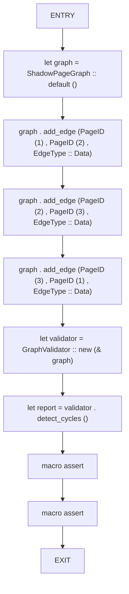
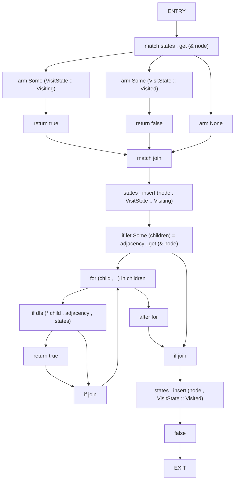
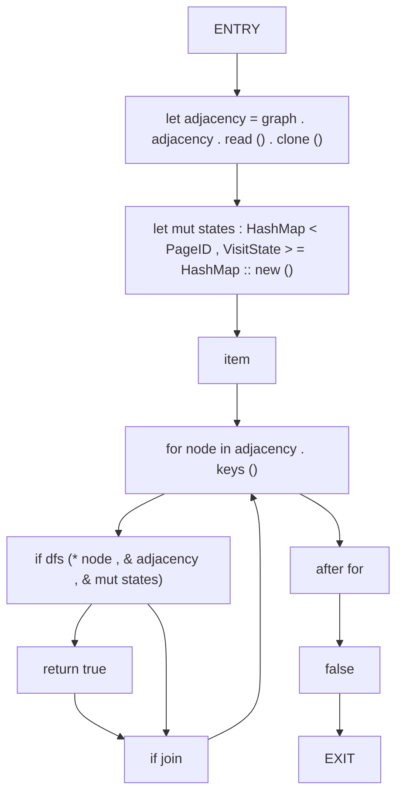
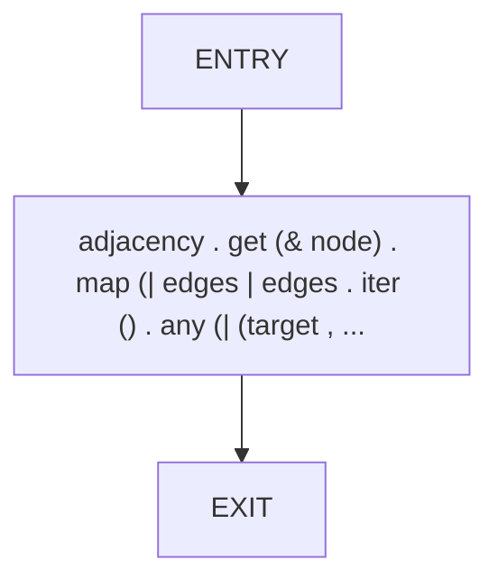
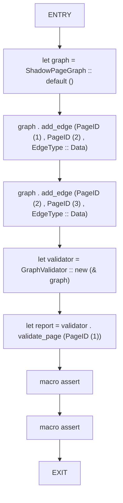
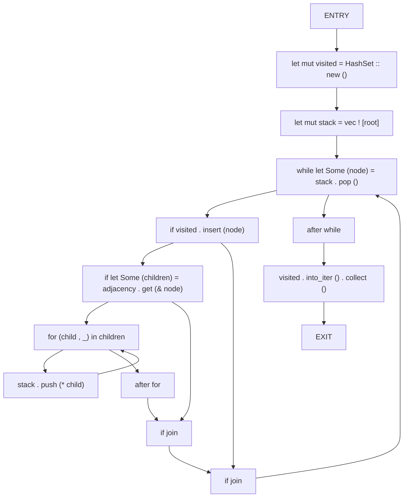
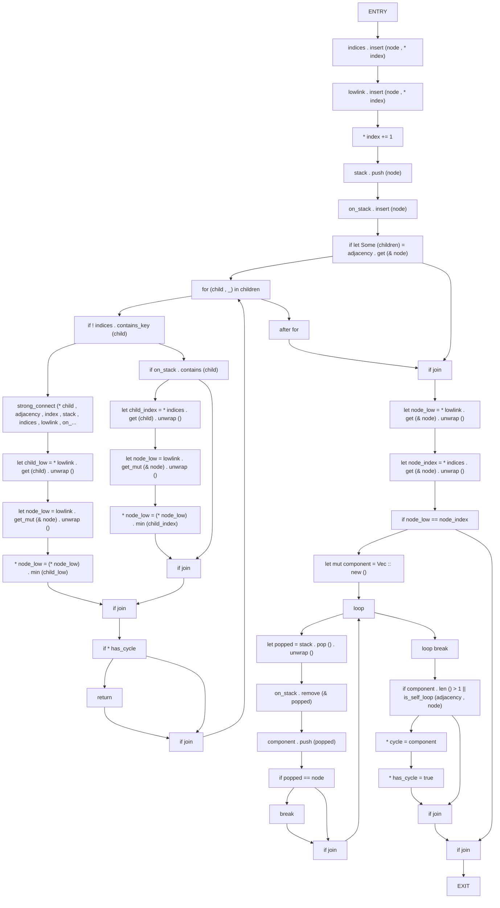
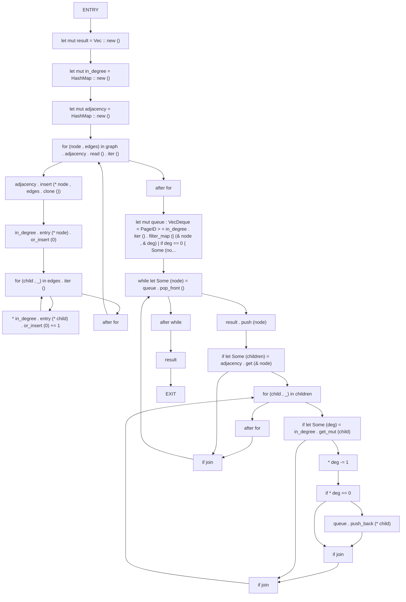

# CFG Group: src/03_dag

## Function: `detects_cycle`

- File: MMSB/src/03_dag/graph_validator.rs
- Branches: 0
- Loops: 0
- Nodes: 10
- Edges: 9

## Function: `dfs`

- File: MMSB/src/03_dag/cycle_detection.rs
- Branches: 5
- Loops: 1
- Nodes: 19
- Edges: 23

## Function: `has_cycle`

- File: MMSB/src/03_dag/cycle_detection.rs
- Branches: 1
- Loops: 1
- Nodes: 11
- Edges: 12

## Function: `is_self_loop`

- File: MMSB/src/03_dag/graph_validator.rs
- Branches: 0
- Loops: 0
- Nodes: 3
- Edges: 2

## Function: `per_page_validation`

- File: MMSB/src/03_dag/graph_validator.rs
- Branches: 0
- Loops: 0
- Nodes: 9
- Edges: 8

## Function: `reachable`

- File: MMSB/src/03_dag/graph_validator.rs
- Branches: 2
- Loops: 2
- Nodes: 14
- Edges: 17

## Function: `strong_connect`

- File: MMSB/src/03_dag/graph_validator.rs
- Branches: 7
- Loops: 2
- Nodes: 42
- Edges: 50

## Function: `topological_sort`

- File: MMSB/src/03_dag/shadow_graph_traversal.rs
- Branches: 3
- Loops: 4
- Nodes: 27
- Edges: 33

