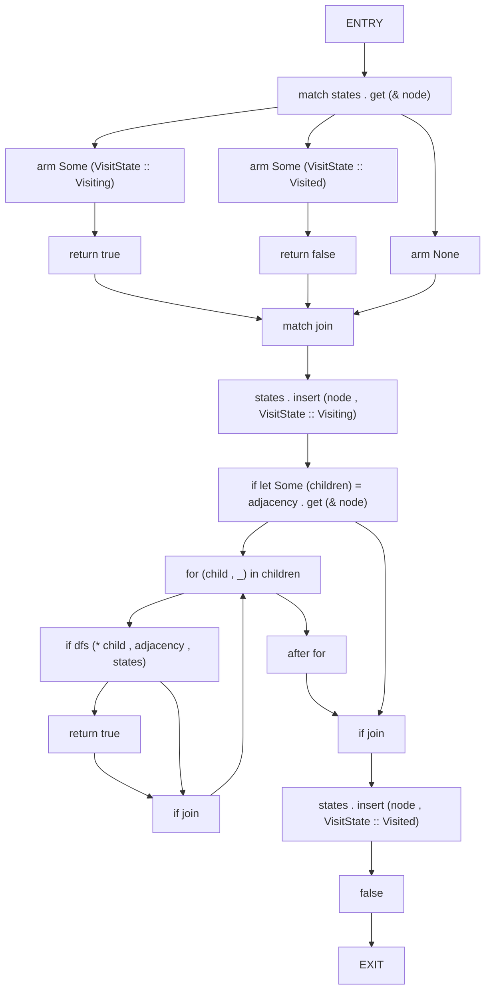
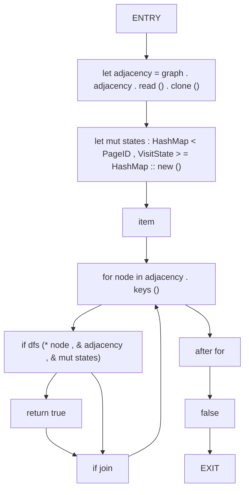
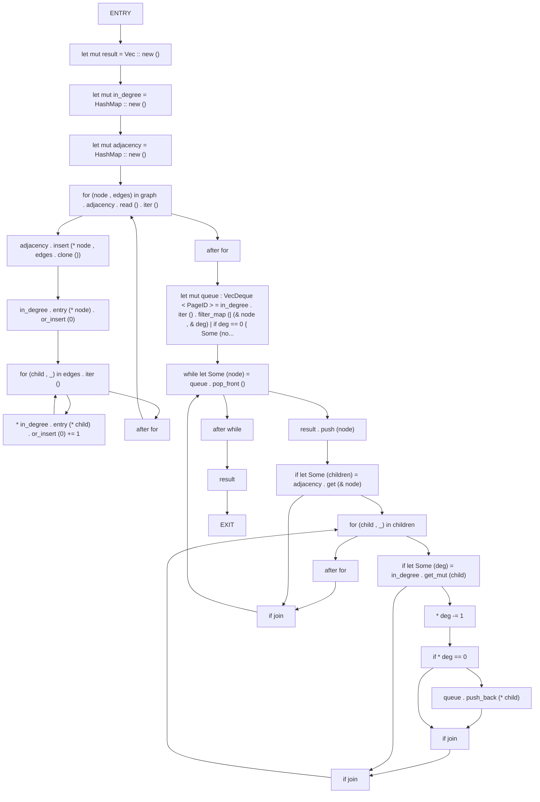

# CFG Group: src/03_dag

## Function: `dfs`

- File: MMSB/src/03_dag/cycle_detection.rs
- Branches: 5
- Loops: 1
- Nodes: 19
- Edges: 23

## Function: `has_cycle`

- File: MMSB/src/03_dag/cycle_detection.rs
- Branches: 1
- Loops: 1
- Nodes: 11
- Edges: 12

## Function: `topological_sort`

- File: MMSB/src/03_dag/shadow_graph_traversal.rs
- Branches: 3
- Loops: 4
- Nodes: 27
- Edges: 33

