# CFG Group: src/04_propagation

## Function: `applies_batches_in_parallel`

- File: MMSB/src/04_propagation/throughput_engine.rs
- Branches: 0
- Loops: 0
- Nodes: 10
- Edges: 9

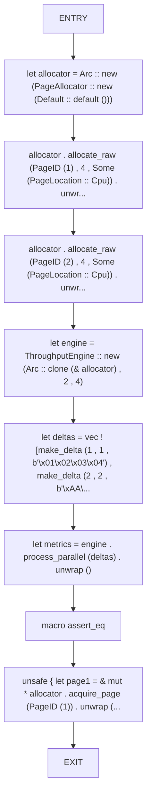

## Function: `chunk_partitions`

- File: MMSB/src/04_propagation/throughput_engine.rs
- Branches: 2
- Loops: 0
- Nodes: 17
- Edges: 18

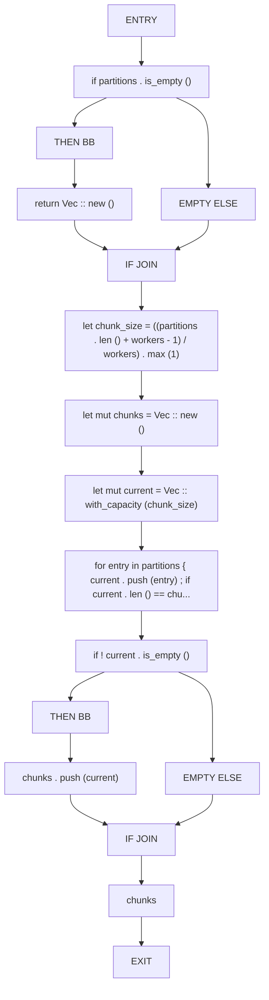

## Function: `command`

- File: MMSB/src/04_propagation/propagation_queue.rs
- Branches: 0
- Loops: 0
- Nodes: 4
- Edges: 3

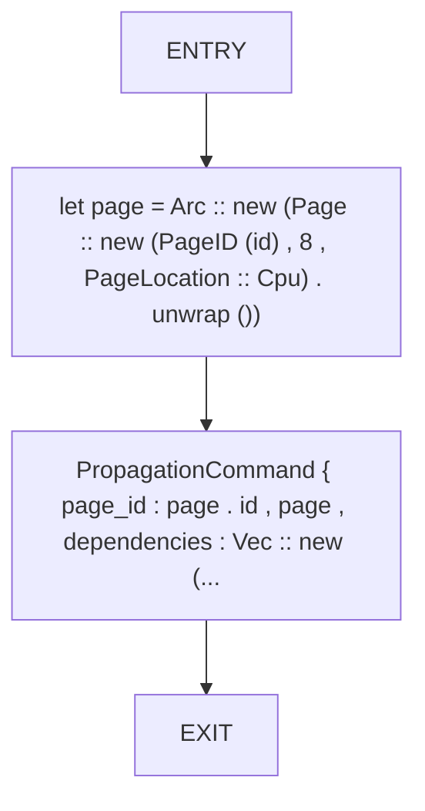

## Function: `delta_error_to_page`

- File: MMSB/src/04_propagation/throughput_engine.rs
- Branches: 0
- Loops: 0
- Nodes: 3
- Edges: 2

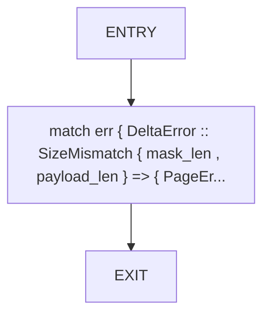

## Function: `drain_batch_respects_bounds`

- File: MMSB/src/04_propagation/propagation_queue.rs
- Branches: 0
- Loops: 0
- Nodes: 7
- Edges: 6

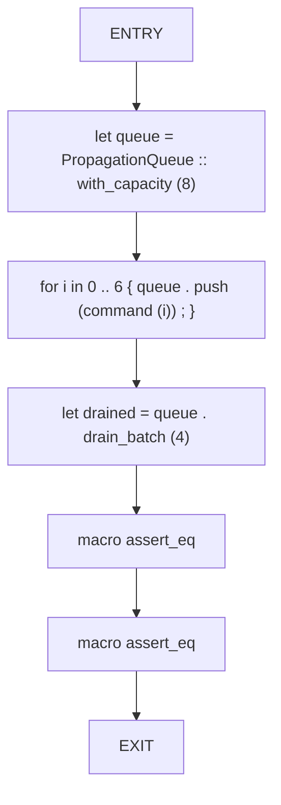

## Function: `enqueue_sparse`

- File: MMSB/src/04_propagation/sparse_message_passing.rs
- Branches: 0
- Loops: 0
- Nodes: 3
- Edges: 2

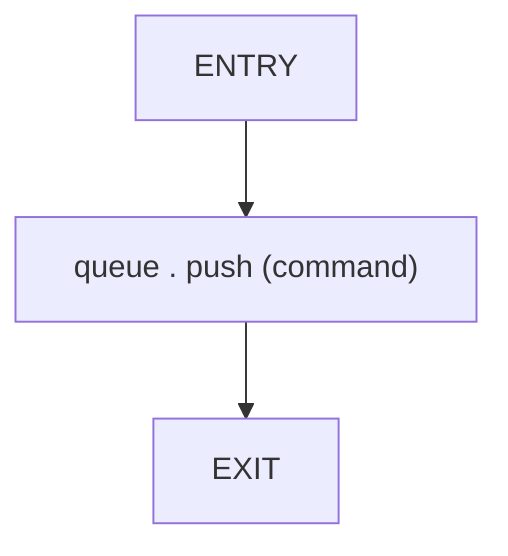

## Function: `gc_invoked_when_threshold_low`

- File: MMSB/src/04_propagation/tick_orchestrator.rs
- Branches: 0
- Loops: 0
- Nodes: 6
- Edges: 5

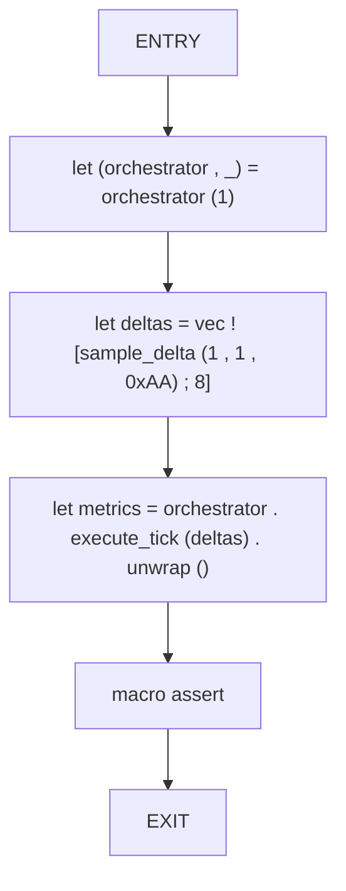

## Function: `make_delta`

- File: MMSB/src/04_propagation/throughput_engine.rs
- Branches: 0
- Loops: 0
- Nodes: 3
- Edges: 2

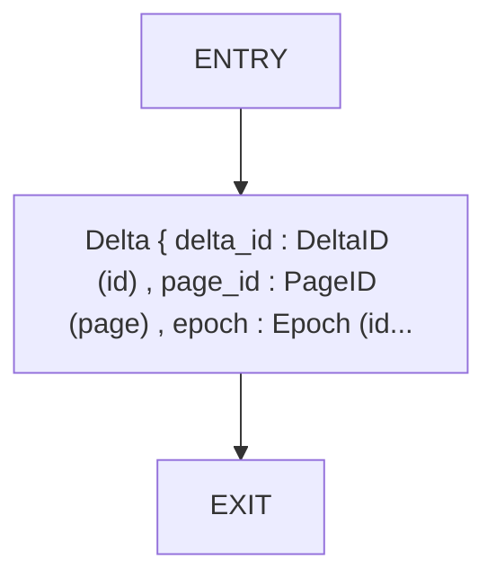

## Function: `merges_multiple_deltas_per_page`

- File: MMSB/src/04_propagation/throughput_engine.rs
- Branches: 0
- Loops: 0
- Nodes: 9
- Edges: 8

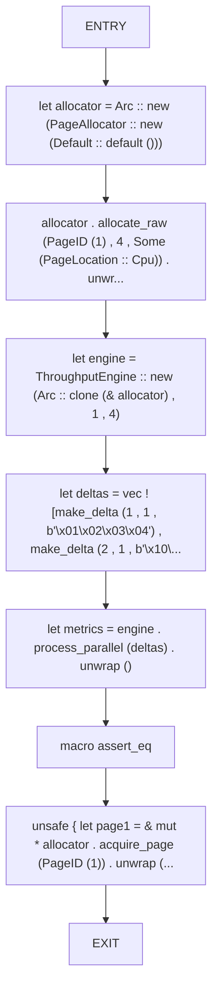

## Function: `orchestrator`

- File: MMSB/src/04_propagation/tick_orchestrator.rs
- Branches: 0
- Loops: 0
- Nodes: 9
- Edges: 8

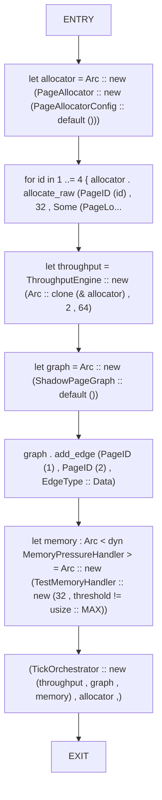

## Function: `partition_by_page`

- File: MMSB/src/04_propagation/throughput_engine.rs
- Branches: 0
- Loops: 0
- Nodes: 5
- Edges: 4

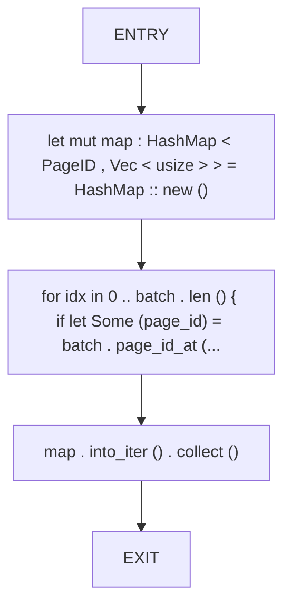

## Function: `passthrough`

- File: MMSB/src/04_propagation/propagation_fastpath.rs
- Branches: 0
- Loops: 0
- Nodes: 2
- Edges: 1

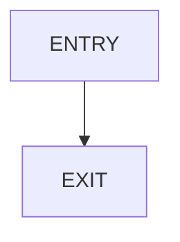

## Function: `process_chunk`

- File: MMSB/src/04_propagation/throughput_engine.rs
- Branches: 0
- Loops: 0
- Nodes: 5
- Edges: 4

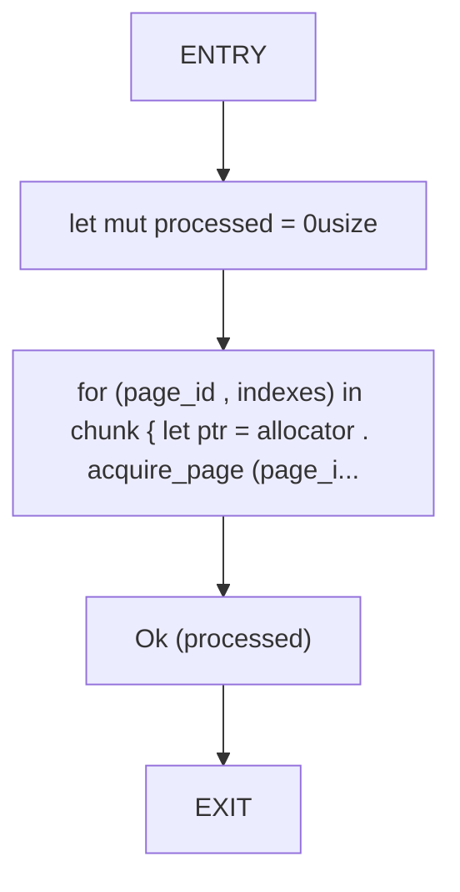

## Function: `queue_roundtrip`

- File: MMSB/src/04_propagation/propagation_queue.rs
- Branches: 0
- Loops: 0
- Nodes: 7
- Edges: 6

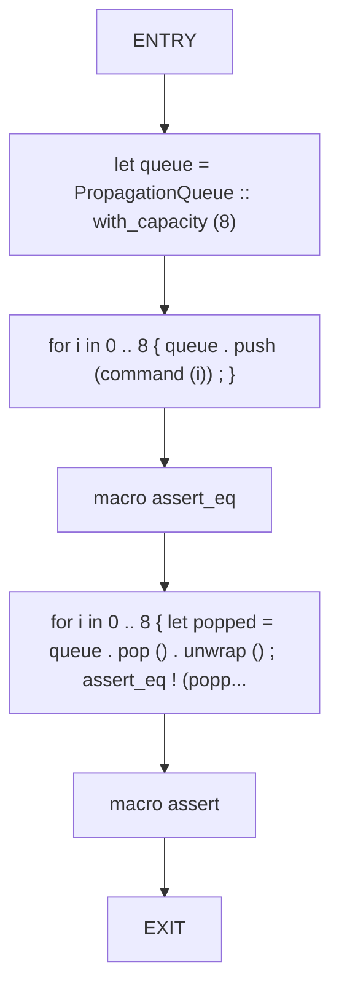

## Function: `reports_nonzero_throughput_for_large_batches`

- File: MMSB/src/04_propagation/throughput_engine.rs
- Branches: 0
- Loops: 0
- Nodes: 11
- Edges: 10

```mermaid
flowchart TD
    reports_nonzero_throughput_for_large_batches_0["ENTRY"]
    reports_nonzero_throughput_for_large_batches_1["let allocator = Arc :: new (PageAllocator :: new (Default :: default ()))"]
    reports_nonzero_throughput_for_large_batches_2["for id in 1 ..= 8 { allocator . allocate_raw (PageID (id) , 8 , Some (PageLoc..."]
    reports_nonzero_throughput_for_large_batches_3["let engine = ThroughputEngine :: new (Arc :: clone (& allocator) , 4 , 256)"]
    reports_nonzero_throughput_for_large_batches_4["let mut deltas = Vec :: new ()"]
    reports_nonzero_throughput_for_large_batches_5["for i in 0 .. 2000u64 { let page = 1 + (i % 8) ; deltas . push (make_delta (i..."]
    reports_nonzero_throughput_for_large_batches_6["let metrics = engine . process_parallel (deltas) . unwrap ()"]
    reports_nonzero_throughput_for_large_batches_7["macro assert_eq"]
    reports_nonzero_throughput_for_large_batches_8["macro assert"]
    reports_nonzero_throughput_for_large_batches_9["macro assert"]
    reports_nonzero_throughput_for_large_batches_10["EXIT"]
    reports_nonzero_throughput_for_large_batches_0 --> reports_nonzero_throughput_for_large_batches_1
    reports_nonzero_throughput_for_large_batches_1 --> reports_nonzero_throughput_for_large_batches_2
    reports_nonzero_throughput_for_large_batches_2 --> reports_nonzero_throughput_for_large_batches_3
    reports_nonzero_throughput_for_large_batches_3 --> reports_nonzero_throughput_for_large_batches_4
    reports_nonzero_throughput_for_large_batches_4 --> reports_nonzero_throughput_for_large_batches_5
    reports_nonzero_throughput_for_large_batches_5 --> reports_nonzero_throughput_for_large_batches_6
    reports_nonzero_throughput_for_large_batches_6 --> reports_nonzero_throughput_for_large_batches_7
    reports_nonzero_throughput_for_large_batches_7 --> reports_nonzero_throughput_for_large_batches_8
    reports_nonzero_throughput_for_large_batches_8 --> reports_nonzero_throughput_for_large_batches_9
    reports_nonzero_throughput_for_large_batches_9 --> reports_nonzero_throughput_for_large_batches_10
```

## Function: `sample_delta`

- File: MMSB/src/04_propagation/tick_orchestrator.rs
- Branches: 0
- Loops: 0
- Nodes: 3
- Edges: 2

## Function: `test_basic_push_pop`

- File: MMSB/src/04_propagation/ring_buffer.rs
- Branches: 0
- Loops: 0
- Nodes: 9
- Edges: 8

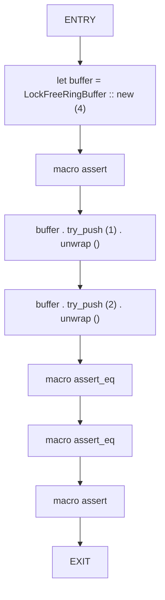

## Function: `test_concurrent_producers_consumers`

- File: MMSB/src/04_propagation/ring_buffer.rs
- Branches: 0
- Loops: 0
- Nodes: 12
- Edges: 11

```mermaid
flowchart TD
    test_concurrent_producers_consumers_0["ENTRY"]
    test_concurrent_producers_consumers_1["let buffer = Arc :: new (LockFreeRingBuffer :: new (128))"]
    test_concurrent_producers_consumers_2["let total = 10_000"]
    test_concurrent_producers_consumers_3["let produced = Arc :: new (AtomicUsize :: new (0))"]
    test_concurrent_producers_consumers_4["let consumed = Arc :: new (AtomicUsize :: new (0))"]
    test_concurrent_producers_consumers_5["let mut handles = Vec :: new ()"]
    test_concurrent_producers_consumers_6["for _ in 0 .. 4 { let buf = Arc :: clone (& buffer) ; let counter = Arc :: cl..."]
    test_concurrent_producers_consumers_7["for _ in 0 .. 2 { let buf = Arc :: clone (& buffer) ; let counter = Arc :: cl..."]
    test_concurrent_producers_consumers_8["for handle in handles { handle . join () . unwrap () ; }"]
    test_concurrent_producers_consumers_9["macro assert_eq"]
    test_concurrent_producers_consumers_10["macro assert"]
    test_concurrent_producers_consumers_11["EXIT"]
    test_concurrent_producers_consumers_0 --> test_concurrent_producers_consumers_1
    test_concurrent_producers_consumers_1 --> test_concurrent_producers_consumers_2
    test_concurrent_producers_consumers_2 --> test_concurrent_producers_consumers_3
    test_concurrent_producers_consumers_3 --> test_concurrent_producers_consumers_4
    test_concurrent_producers_consumers_4 --> test_concurrent_producers_consumers_5
    test_concurrent_producers_consumers_5 --> test_concurrent_producers_consumers_6
    test_concurrent_producers_consumers_6 --> test_concurrent_producers_consumers_7
    test_concurrent_producers_consumers_7 --> test_concurrent_producers_consumers_8
    test_concurrent_producers_consumers_8 --> test_concurrent_producers_consumers_9
    test_concurrent_producers_consumers_9 --> test_concurrent_producers_consumers_10
    test_concurrent_producers_consumers_10 --> test_concurrent_producers_consumers_11
```

## Function: `test_wraparound_behavior`

- File: MMSB/src/04_propagation/ring_buffer.rs
- Branches: 0
- Loops: 0
- Nodes: 9
- Edges: 8

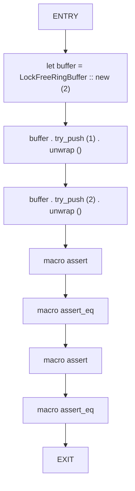

## Function: `tick_metrics_capture_all_phases`

- File: MMSB/src/04_propagation/tick_orchestrator.rs
- Branches: 0
- Loops: 0
- Nodes: 8
- Edges: 7

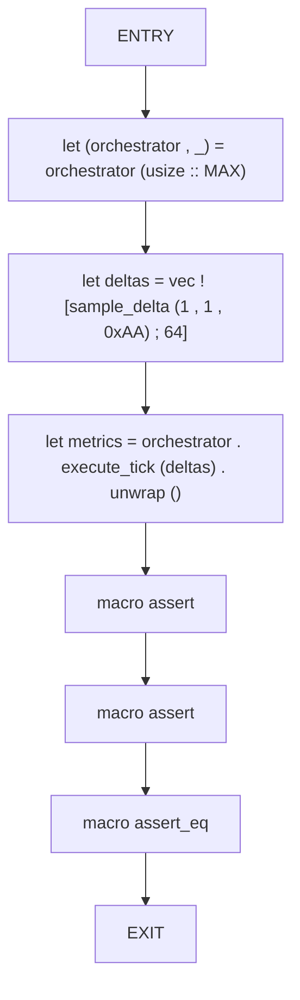

