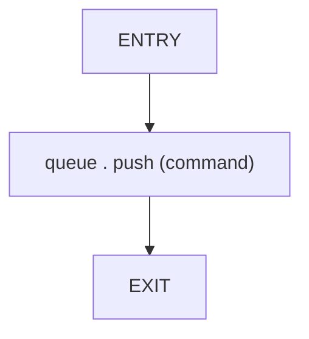
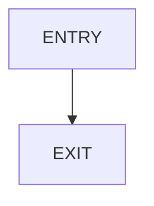

# CFG Group: src/04_propagation

## Function: `enqueue_sparse`

- File: MMSB/src/04_propagation/sparse_message_passing.rs
- Branches: 0
- Loops: 0
- Nodes: 3
- Edges: 2

## Function: `passthrough`

- File: MMSB/src/04_propagation/propagation_fastpath.rs
- Branches: 0
- Loops: 0
- Nodes: 2
- Edges: 1

