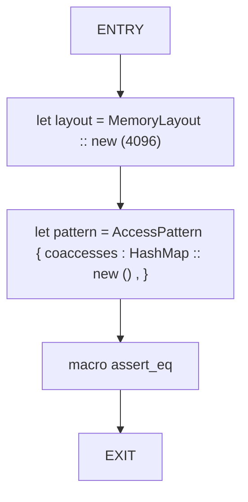
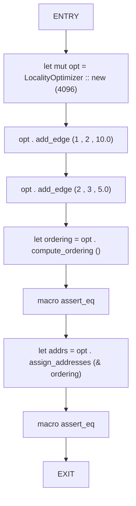
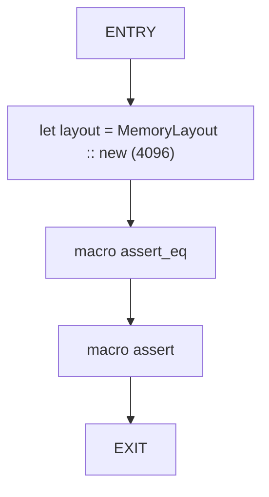
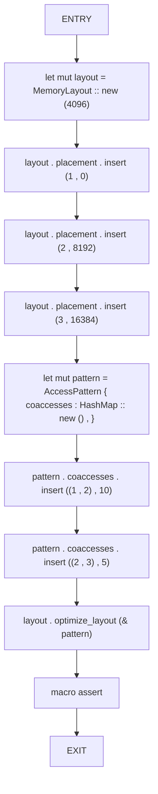
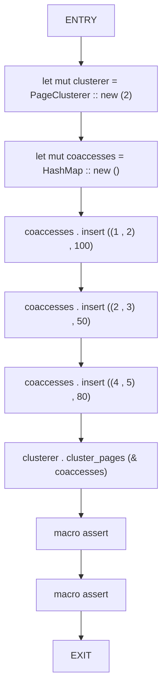

# CFG Group: src/05_adaptive

## Function: `test_locality_cost_empty`

- File: MMSB/src/05_adaptive/memory_layout.rs
- Branches: 0
- Loops: 0
- Nodes: 5
- Edges: 4

## Function: `test_locality_optimizer`

- File: MMSB/src/05_adaptive/locality_optimizer.rs
- Branches: 0
- Loops: 0
- Nodes: 9
- Edges: 8

## Function: `test_memory_layout_creation`

- File: MMSB/src/05_adaptive/memory_layout.rs
- Branches: 0
- Loops: 0
- Nodes: 5
- Edges: 4

## Function: `test_optimize_layout`

- File: MMSB/src/05_adaptive/memory_layout.rs
- Branches: 0
- Loops: 0
- Nodes: 11
- Edges: 10

## Function: `test_page_clustering`

- File: MMSB/src/05_adaptive/page_clustering.rs
- Branches: 0
- Loops: 0
- Nodes: 10
- Edges: 9

