# CFG Group: src/06_utility

## Function: `allocator`

- File: MMSB/src/06_utility/memory_monitor.rs
- Branches: 0
- Loops: 0
- Nodes: 3
- Edges: 2

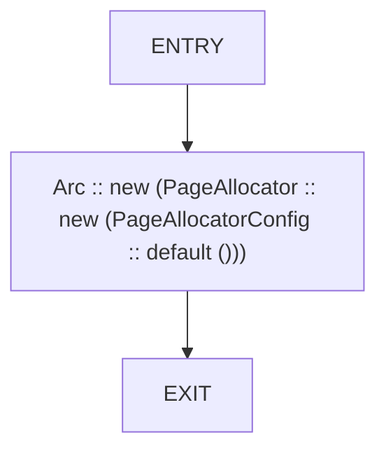

## Function: `cache_does_not_grow_unbounded`

- File: MMSB/src/06_utility/provenance_tracker.rs
- Branches: 0
- Loops: 0
- Nodes: 7
- Edges: 6

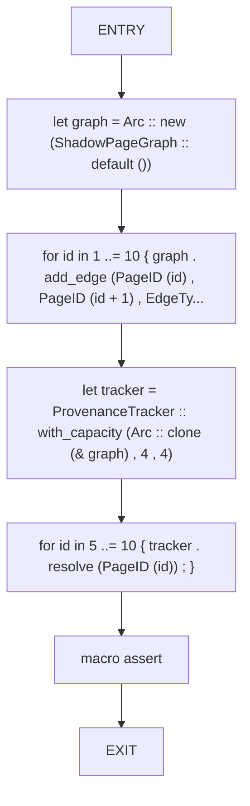

## Function: `cpu_has_avx2`

- File: MMSB/src/06_utility/cpu_features.rs
- Branches: 0
- Loops: 0
- Nodes: 3
- Edges: 2

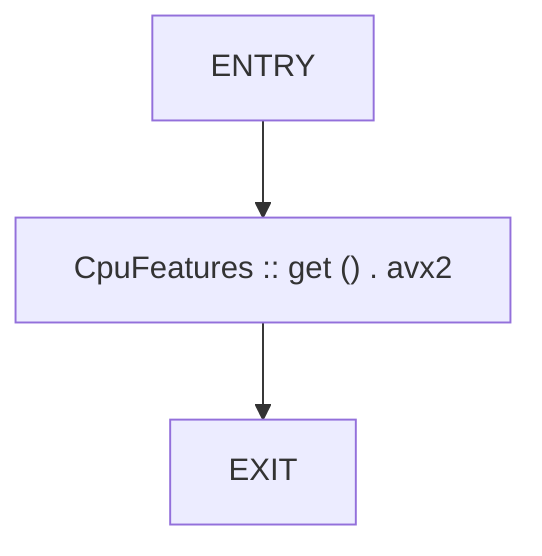

## Function: `cpu_has_avx512`

- File: MMSB/src/06_utility/cpu_features.rs
- Branches: 0
- Loops: 0
- Nodes: 3
- Edges: 2

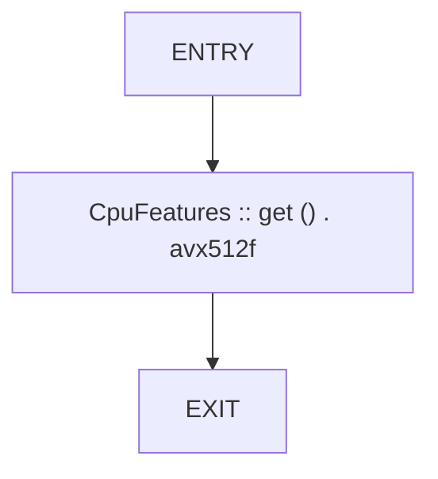

## Function: `cpu_has_sse42`

- File: MMSB/src/06_utility/cpu_features.rs
- Branches: 0
- Loops: 0
- Nodes: 3
- Edges: 2

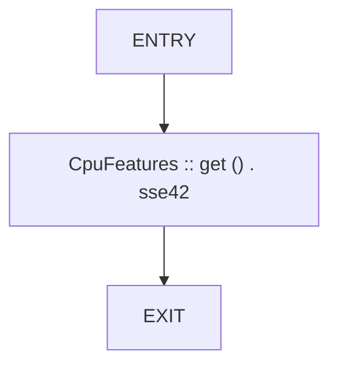

## Function: `epoch_invariant_detects_regressions`

- File: MMSB/src/06_utility/invariant_checker.rs
- Branches: 0
- Loops: 0
- Nodes: 11
- Edges: 10

```mermaid
flowchart TD
    epoch_invariant_detects_regressions_0["ENTRY"]
    epoch_invariant_detects_regressions_1["let allocator = PageAllocator :: new (PageAllocatorConfig :: default ())"]
    epoch_invariant_detects_regressions_2["allocator . allocate_raw (PageID (1) , 8 , Some (PageLocation :: Cpu)) . unwr..."]
    epoch_invariant_detects_regressions_3["{ let page = allocator . acquire_page (PageID (1)) . unwrap () ; unsafe { (* ..."]
    epoch_invariant_detects_regressions_4["let ctx = InvariantContext { allocator : Some (& allocator) , graph : None , registry :..."]
    epoch_invariant_detects_regressions_5["let mut checker = InvariantChecker :: new ()"]
    epoch_invariant_detects_regressions_6["checker . register (EpochMonotonicity :: default ())"]
    epoch_invariant_detects_regressions_7["macro assert"]
    epoch_invariant_detects_regressions_8["{ let page = allocator . acquire_page (PageID (1)) . unwrap () ; unsafe { (* ..."]
    epoch_invariant_detects_regressions_9["macro assert"]
    epoch_invariant_detects_regressions_10["EXIT"]
    epoch_invariant_detects_regressions_0 --> epoch_invariant_detects_regressions_1
    epoch_invariant_detects_regressions_1 --> epoch_invariant_detects_regressions_2
    epoch_invariant_detects_regressions_2 --> epoch_invariant_detects_regressions_3
    epoch_invariant_detects_regressions_3 --> epoch_invariant_detects_regressions_4
    epoch_invariant_detects_regressions_4 --> epoch_invariant_detects_regressions_5
    epoch_invariant_detects_regressions_5 --> epoch_invariant_detects_regressions_6
    epoch_invariant_detects_regressions_6 --> epoch_invariant_detects_regressions_7
    epoch_invariant_detects_regressions_7 --> epoch_invariant_detects_regressions_8
    epoch_invariant_detects_regressions_8 --> epoch_invariant_detects_regressions_9
    epoch_invariant_detects_regressions_9 --> epoch_invariant_detects_regressions_10
```

## Function: `gc_trigger_depends_on_threshold`

- File: MMSB/src/06_utility/memory_monitor.rs
- Branches: 0
- Loops: 0
- Nodes: 9
- Edges: 8

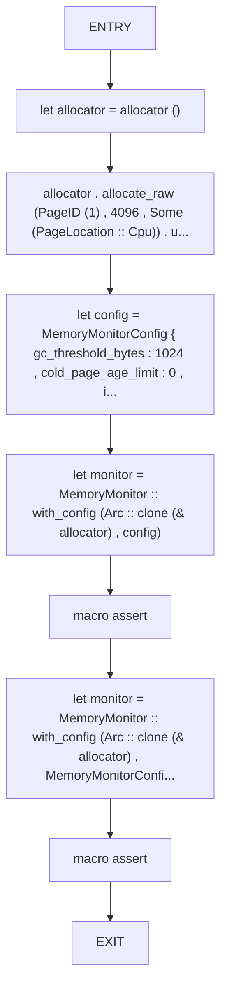

## Function: `graph_acyclicity_detects_cycles`

- File: MMSB/src/06_utility/invariant_checker.rs
- Branches: 0
- Loops: 0
- Nodes: 9
- Edges: 8

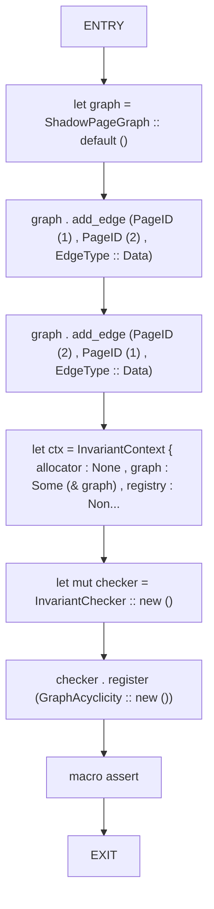

## Function: `incremental_gc_reclaims_pages_under_budget`

- File: MMSB/src/06_utility/memory_monitor.rs
- Branches: 0
- Loops: 0
- Nodes: 10
- Edges: 9

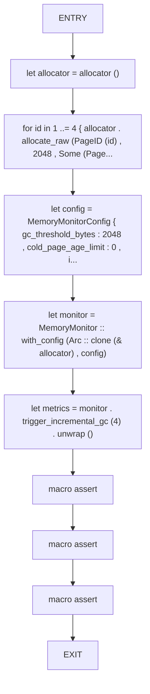

## Function: `read_bytes`

- File: MMSB/src/06_utility/invariant_checker.rs
- Branches: 1
- Loops: 0
- Nodes: 9
- Edges: 9

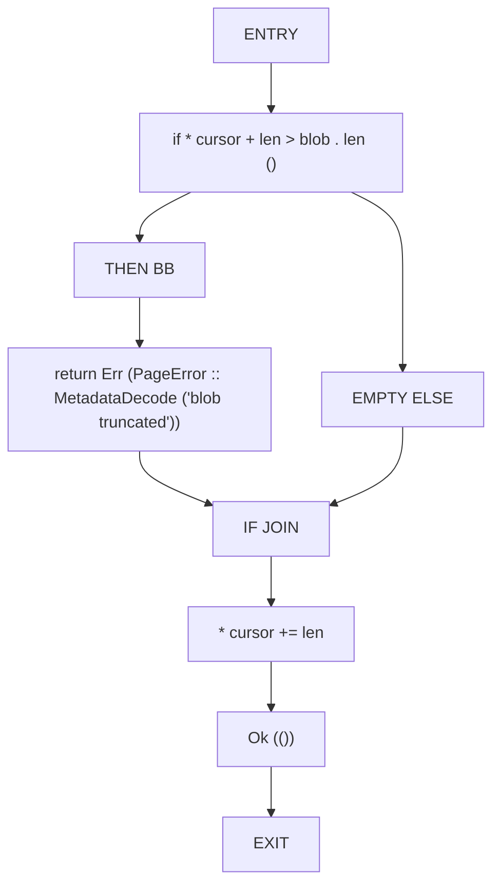

## Function: `read_u32`

- File: MMSB/src/06_utility/invariant_checker.rs
- Branches: 1
- Loops: 0
- Nodes: 10
- Edges: 10

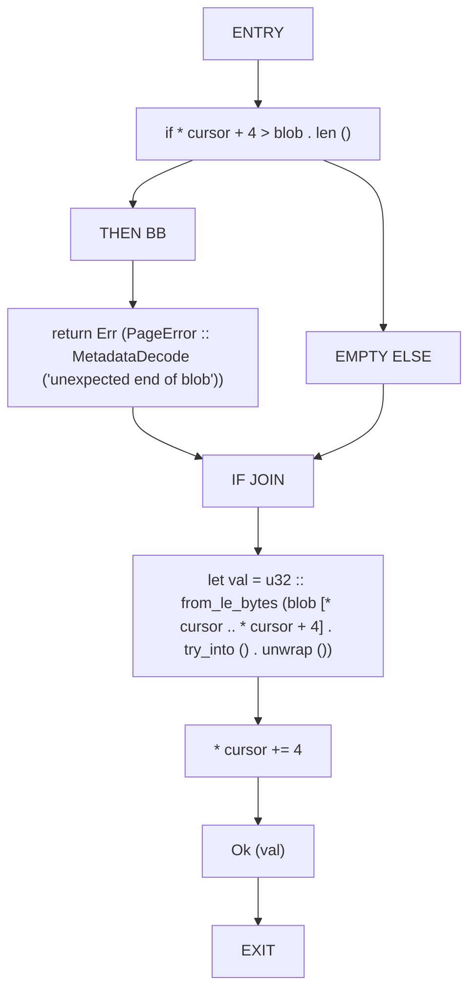

## Function: `resolves_chain_with_depth_limit`

- File: MMSB/src/06_utility/provenance_tracker.rs
- Branches: 0
- Loops: 0
- Nodes: 12
- Edges: 11

```mermaid
flowchart TD
    resolves_chain_with_depth_limit_0["ENTRY"]
    resolves_chain_with_depth_limit_1["let graph = Arc :: new (ShadowPageGraph :: default ())"]
    resolves_chain_with_depth_limit_2["graph . add_edge (PageID (1) , PageID (2) , EdgeType :: Data)"]
    resolves_chain_with_depth_limit_3["graph . add_edge (PageID (2) , PageID (3) , EdgeType :: Data)"]
    resolves_chain_with_depth_limit_4["graph . add_edge (PageID (3) , PageID (4) , EdgeType :: Data)"]
    resolves_chain_with_depth_limit_5["let tracker = ProvenanceTracker :: with_capacity (Arc :: clone (& graph) , 16 , 2)"]
    resolves_chain_with_depth_limit_6["let result = tracker . resolve (PageID (4))"]
    resolves_chain_with_depth_limit_7["macro assert_eq"]
    resolves_chain_with_depth_limit_8["macro assert"]
    resolves_chain_with_depth_limit_9["let cached = tracker . resolve (PageID (4))"]
    resolves_chain_with_depth_limit_10["macro assert"]
    resolves_chain_with_depth_limit_11["EXIT"]
    resolves_chain_with_depth_limit_0 --> resolves_chain_with_depth_limit_1
    resolves_chain_with_depth_limit_1 --> resolves_chain_with_depth_limit_2
    resolves_chain_with_depth_limit_2 --> resolves_chain_with_depth_limit_3
    resolves_chain_with_depth_limit_3 --> resolves_chain_with_depth_limit_4
    resolves_chain_with_depth_limit_4 --> resolves_chain_with_depth_limit_5
    resolves_chain_with_depth_limit_5 --> resolves_chain_with_depth_limit_6
    resolves_chain_with_depth_limit_6 --> resolves_chain_with_depth_limit_7
    resolves_chain_with_depth_limit_7 --> resolves_chain_with_depth_limit_8
    resolves_chain_with_depth_limit_8 --> resolves_chain_with_depth_limit_9
    resolves_chain_with_depth_limit_9 --> resolves_chain_with_depth_limit_10
    resolves_chain_with_depth_limit_10 --> resolves_chain_with_depth_limit_11
```

## Function: `snapshot_identifies_cold_pages`

- File: MMSB/src/06_utility/memory_monitor.rs
- Branches: 0
- Loops: 0
- Nodes: 13
- Edges: 12

```mermaid
flowchart TD
    snapshot_identifies_cold_pages_0["ENTRY"]
    snapshot_identifies_cold_pages_1["let allocator = allocator ()"]
    snapshot_identifies_cold_pages_2["allocator . allocate_raw (PageID (1) , 1024 , Some (PageLocation :: Cpu)) . u..."]
    snapshot_identifies_cold_pages_3["let config = MemoryMonitorConfig { gc_threshold_bytes : 1024 , cold_page_age_limit : 1 , i..."]
    snapshot_identifies_cold_pages_4["let monitor = MemoryMonitor :: with_config (Arc :: clone (& allocator) , config)"]
    snapshot_identifies_cold_pages_5["let first = monitor . snapshot ()"]
    snapshot_identifies_cold_pages_6["macro assert"]
    snapshot_identifies_cold_pages_7["let second = monitor . snapshot ()"]
    snapshot_identifies_cold_pages_8["macro assert_eq"]
    snapshot_identifies_cold_pages_9["unsafe { let page = & mut * allocator . acquire_page (PageID (1)) . unwrap ()..."]
    snapshot_identifies_cold_pages_10["let third = monitor . snapshot ()"]
    snapshot_identifies_cold_pages_11["macro assert"]
    snapshot_identifies_cold_pages_12["EXIT"]
    snapshot_identifies_cold_pages_0 --> snapshot_identifies_cold_pages_1
    snapshot_identifies_cold_pages_1 --> snapshot_identifies_cold_pages_2
    snapshot_identifies_cold_pages_2 --> snapshot_identifies_cold_pages_3
    snapshot_identifies_cold_pages_3 --> snapshot_identifies_cold_pages_4
    snapshot_identifies_cold_pages_4 --> snapshot_identifies_cold_pages_5
    snapshot_identifies_cold_pages_5 --> snapshot_identifies_cold_pages_6
    snapshot_identifies_cold_pages_6 --> snapshot_identifies_cold_pages_7
    snapshot_identifies_cold_pages_7 --> snapshot_identifies_cold_pages_8
    snapshot_identifies_cold_pages_8 --> snapshot_identifies_cold_pages_9
    snapshot_identifies_cold_pages_9 --> snapshot_identifies_cold_pages_10
    snapshot_identifies_cold_pages_10 --> snapshot_identifies_cold_pages_11
    snapshot_identifies_cold_pages_11 --> snapshot_identifies_cold_pages_12
```

## Function: `snapshot_reflects_allocator_state`

- File: MMSB/src/06_utility/memory_monitor.rs
- Branches: 0
- Loops: 0
- Nodes: 10
- Edges: 9

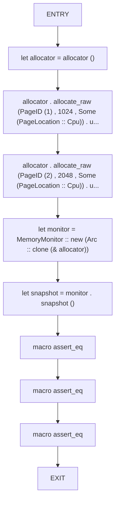

## Function: `test_cache_hit_rate`

- File: MMSB/src/06_utility/telemetry.rs
- Branches: 0
- Loops: 0
- Nodes: 9
- Edges: 8

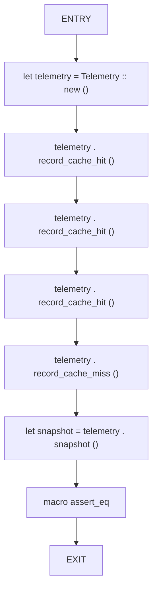

## Function: `test_reset`

- File: MMSB/src/06_utility/telemetry.rs
- Branches: 0
- Loops: 0
- Nodes: 7
- Edges: 6

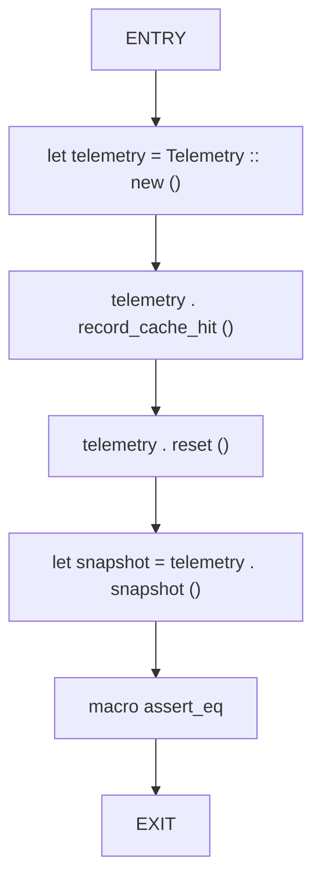

## Function: `test_telemetry_basic`

- File: MMSB/src/06_utility/telemetry.rs
- Branches: 0
- Loops: 0
- Nodes: 11
- Edges: 10

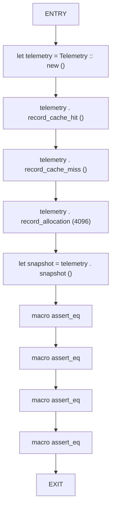

## Function: `validate_metadata_blob`

- File: MMSB/src/06_utility/invariant_checker.rs
- Branches: 1
- Loops: 0
- Nodes: 11
- Edges: 11

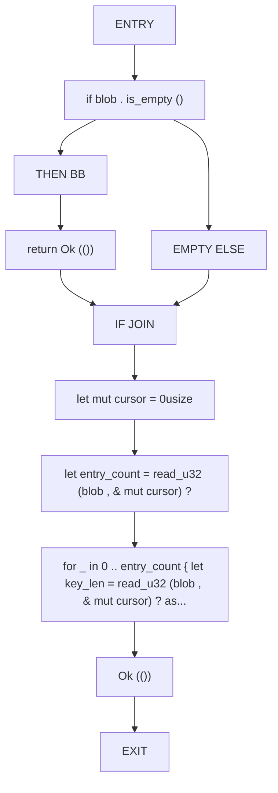

