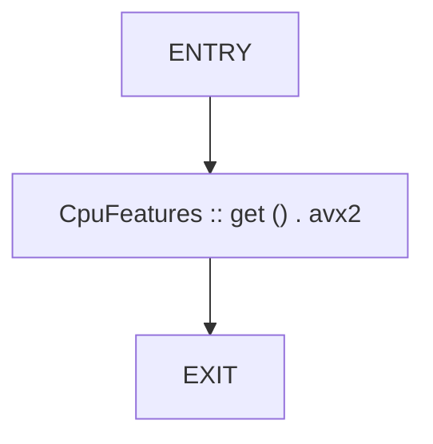
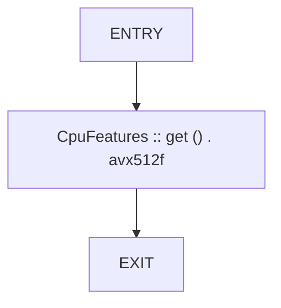
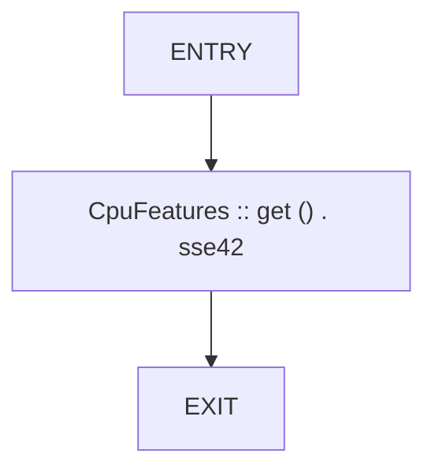
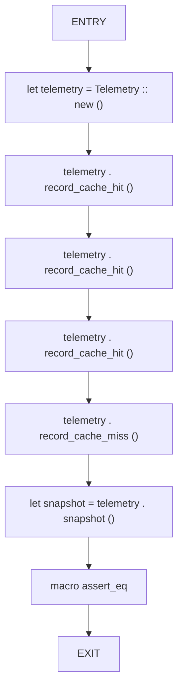
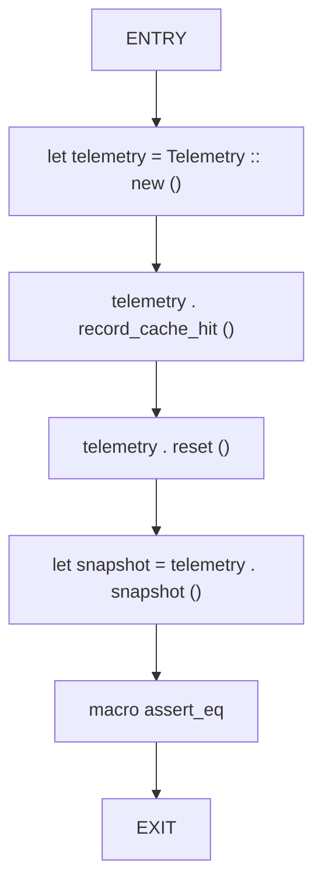
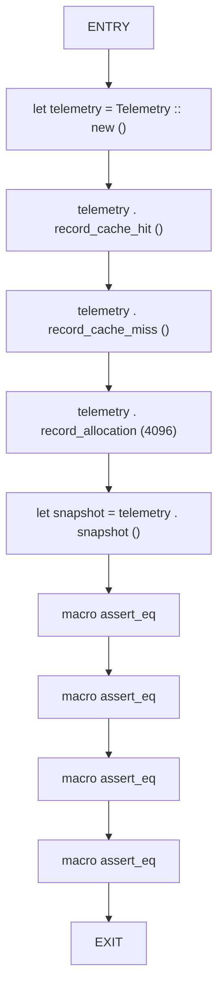

# CFG Group: src/06_utility

## Function: `cpu_has_avx2`

- File: MMSB/src/06_utility/cpu_features.rs
- Branches: 0
- Loops: 0
- Nodes: 3
- Edges: 2

## Function: `cpu_has_avx512`

- File: MMSB/src/06_utility/cpu_features.rs
- Branches: 0
- Loops: 0
- Nodes: 3
- Edges: 2

## Function: `cpu_has_sse42`

- File: MMSB/src/06_utility/cpu_features.rs
- Branches: 0
- Loops: 0
- Nodes: 3
- Edges: 2

## Function: `test_cache_hit_rate`

- File: MMSB/src/06_utility/telemetry.rs
- Branches: 0
- Loops: 0
- Nodes: 9
- Edges: 8

## Function: `test_reset`

- File: MMSB/src/06_utility/telemetry.rs
- Branches: 0
- Loops: 0
- Nodes: 7
- Edges: 6

## Function: `test_telemetry_basic`

- File: MMSB/src/06_utility/telemetry.rs
- Branches: 0
- Loops: 0
- Nodes: 11
- Edges: 10

