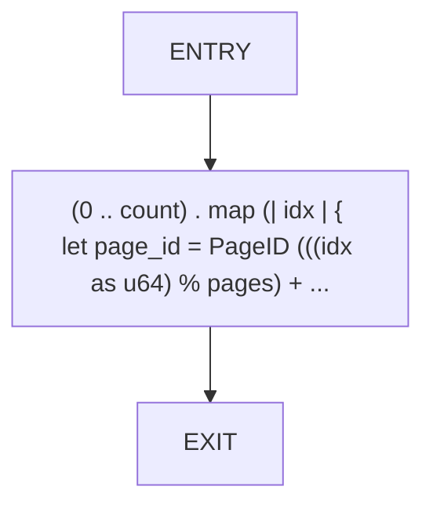
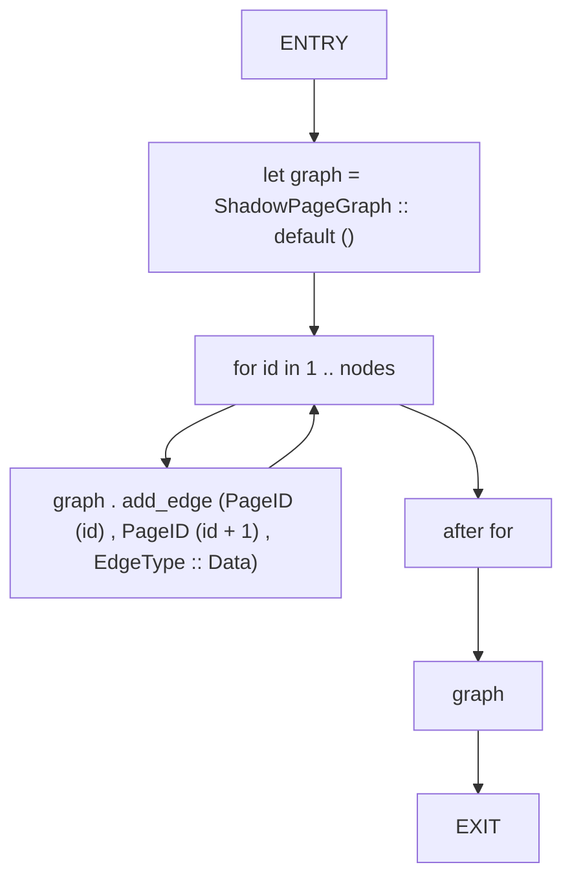
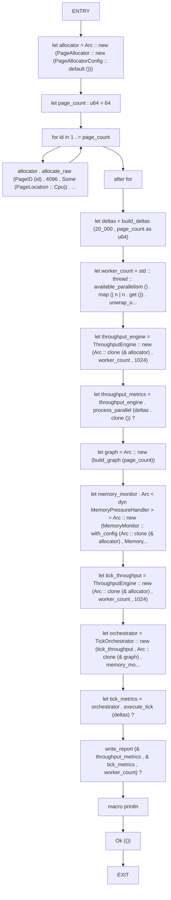
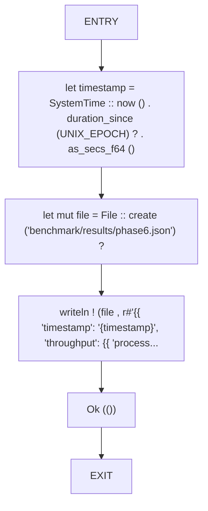

# CFG Group: src/bin

## Function: `build_deltas`

- File: MMSB/src/bin/phase6_bench.rs
- Branches: 0
- Loops: 0
- Nodes: 3
- Edges: 2

## Function: `build_graph`

- File: MMSB/src/bin/phase6_bench.rs
- Branches: 0
- Loops: 1
- Nodes: 7
- Edges: 7

## Function: `main`

- File: MMSB/src/bin/phase6_bench.rs
- Branches: 0
- Loops: 1
- Nodes: 19
- Edges: 19

## Function: `write_report`

- File: MMSB/src/bin/phase6_bench.rs
- Branches: 0
- Loops: 0
- Nodes: 6
- Edges: 5

