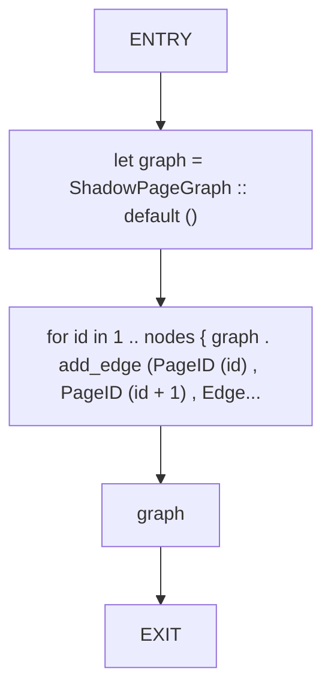

# CFG Group: src/bin

## Function: `build_deltas`

- File: MMSB/src/bin/phase6_bench.rs
- Branches: 0
- Loops: 0
- Nodes: 3
- Edges: 2

## Function: `build_graph`

- File: MMSB/src/bin/phase6_bench.rs
- Branches: 0
- Loops: 0
- Nodes: 5
- Edges: 4

## Function: `main`

- File: MMSB/src/bin/phase6_bench.rs
- Branches: 0
- Loops: 0
- Nodes: 17
- Edges: 16

```mermaid
flowchart TD
    main_0["ENTRY"]
    main_1["let allocator = Arc :: new (PageAllocator :: new (PageAllocatorConfig :: default ()))"]
    main_2["let page_count : u64 = 64"]
    main_3["for id in 1 ..= page_count { allocator . allocate_raw (PageID (id) , 4096 , S..."]
    main_4["let deltas = build_deltas (20_000 , page_count as u64)"]
    main_5["let worker_count = std :: thread :: available_parallelism () . map (| n | n . get ()) . unwrap_o..."]
    main_6["let throughput_engine = ThroughputEngine :: new (Arc :: clone (& allocator) , worker_count , 1024)"]
    main_7["let throughput_metrics = throughput_engine . process_parallel (deltas . clone ()) ?"]
    main_8["let graph = Arc :: new (build_graph (page_count))"]
    main_9["let memory_monitor : Arc < dyn MemoryPressureHandler > = Arc :: new (MemoryMonitor :: with_config (Arc :: clone (& allocator) , Memory..."]
    main_10["let tick_throughput = ThroughputEngine :: new (Arc :: clone (& allocator) , worker_count , 1024)"]
    main_11["let orchestrator = TickOrchestrator :: new (tick_throughput , Arc :: clone (& graph) , memory_mo..."]
    main_12["let tick_metrics = orchestrator . execute_tick (deltas) ?"]
    main_13["write_report (& throughput_metrics , & tick_metrics , worker_count) ?"]
    main_14["macro println"]
    main_15["Ok (())"]
    main_16["EXIT"]
    main_0 --> main_1
    main_1 --> main_2
    main_2 --> main_3
    main_3 --> main_4
    main_4 --> main_5
    main_5 --> main_6
    main_6 --> main_7
    main_7 --> main_8
    main_8 --> main_9
    main_9 --> main_10
    main_10 --> main_11
    main_11 --> main_12
    main_12 --> main_13
    main_13 --> main_14
    main_14 --> main_15
    main_15 --> main_16
```

## Function: `write_report`

- File: MMSB/src/bin/phase6_bench.rs
- Branches: 0
- Loops: 0
- Nodes: 6
- Edges: 5

