# CFG Group: src/ffi.rs

## Function: `convert_location`

- File: MMSB/src/ffi.rs
- Branches: 0
- Loops: 0
- Nodes: 3
- Edges: 2

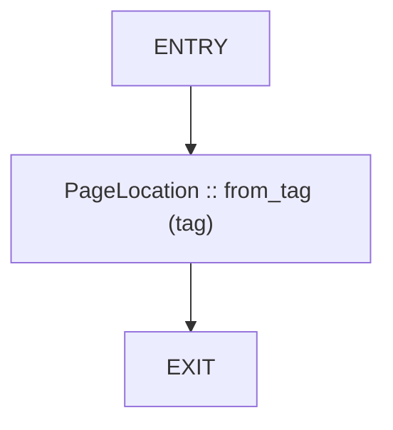

## Function: `log_error_code`

- File: MMSB/src/ffi.rs
- Branches: 1
- Loops: 0
- Nodes: 6
- Edges: 6

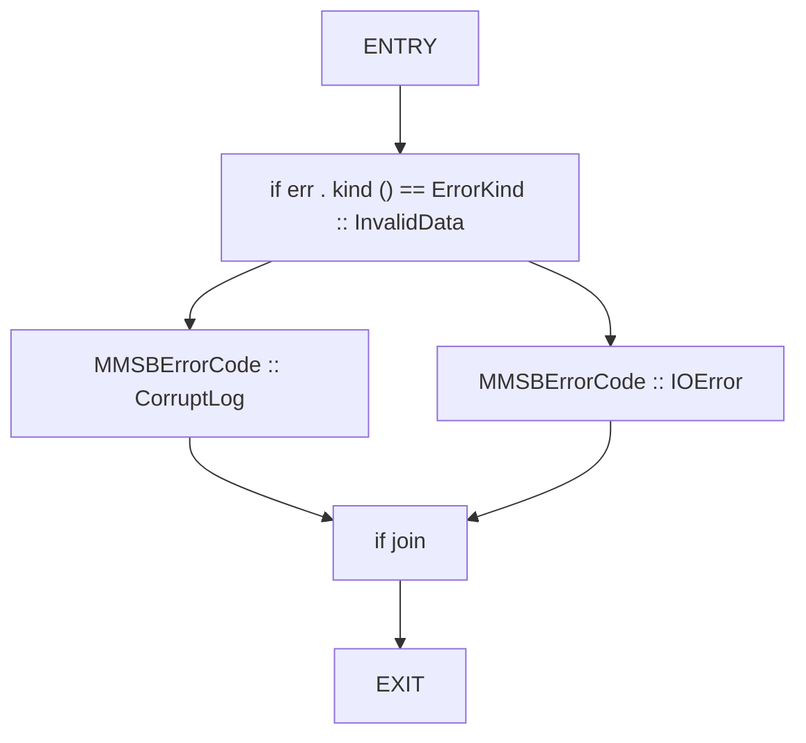

## Function: `mask_from_bytes`

- File: MMSB/src/ffi.rs
- Branches: 3
- Loops: 2
- Nodes: 20
- Edges: 24

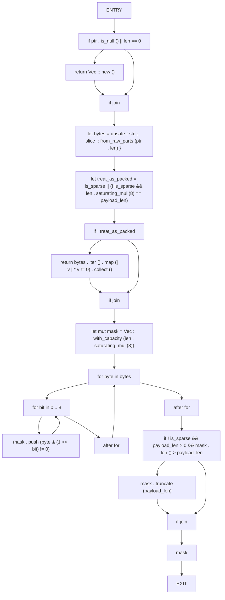

## Function: `mmsb_allocator_allocate`

- File: MMSB/src/ffi.rs
- Branches: 4
- Loops: 0
- Nodes: 24
- Edges: 26

```mermaid
flowchart TD
    mmsb_allocator_allocate_0["ENTRY"]
    mmsb_allocator_allocate_1["macro ffi_debug"]
    mmsb_allocator_allocate_2["macro ffi_debug"]
    mmsb_allocator_allocate_3["if handle . ptr . is_null ()"]
    mmsb_allocator_allocate_4["set_last_error (MMSBErrorCode :: InvalidHandle)"]
    mmsb_allocator_allocate_5["return PageHandle :: null ()"]
    mmsb_allocator_allocate_6["if join"]
    mmsb_allocator_allocate_7["if size == 0"]
    mmsb_allocator_allocate_8["set_last_error (MMSBErrorCode :: AllocError)"]
    mmsb_allocator_allocate_9["return PageHandle :: null ()"]
    mmsb_allocator_allocate_10["if join"]
    mmsb_allocator_allocate_11["let allocator = unsafe { & * handle . ptr }"]
    mmsb_allocator_allocate_12["let loc = match PageLocation :: from_tag (location) { Ok (loc) => Some (loc) , Err (_) ..."]
    mmsb_allocator_allocate_13["match allocator . allocate_raw (PageID (page_id_hint) , size , loc)"]
    mmsb_allocator_allocate_14["arm Ok (page_ptr)"]
    mmsb_allocator_allocate_15["macro ffi_debug"]
    mmsb_allocator_allocate_16["macro ffi_debug"]
    mmsb_allocator_allocate_17["PageHandle { ptr : page_ptr }"]
    mmsb_allocator_allocate_18["arm Err (_)"]
    mmsb_allocator_allocate_19["macro ffi_debug"]
    mmsb_allocator_allocate_20["set_last_error (MMSBErrorCode :: AllocError)"]
    mmsb_allocator_allocate_21["PageHandle :: null ()"]
    mmsb_allocator_allocate_22["match join"]
    mmsb_allocator_allocate_23["EXIT"]
    mmsb_allocator_allocate_0 --> mmsb_allocator_allocate_1
    mmsb_allocator_allocate_1 --> mmsb_allocator_allocate_2
    mmsb_allocator_allocate_2 --> mmsb_allocator_allocate_3
    mmsb_allocator_allocate_3 --> mmsb_allocator_allocate_4
    mmsb_allocator_allocate_4 --> mmsb_allocator_allocate_5
    mmsb_allocator_allocate_5 --> mmsb_allocator_allocate_6
    mmsb_allocator_allocate_3 --> mmsb_allocator_allocate_6
    mmsb_allocator_allocate_6 --> mmsb_allocator_allocate_7
    mmsb_allocator_allocate_7 --> mmsb_allocator_allocate_8
    mmsb_allocator_allocate_8 --> mmsb_allocator_allocate_9
    mmsb_allocator_allocate_9 --> mmsb_allocator_allocate_10
    mmsb_allocator_allocate_7 --> mmsb_allocator_allocate_10
    mmsb_allocator_allocate_10 --> mmsb_allocator_allocate_11
    mmsb_allocator_allocate_11 --> mmsb_allocator_allocate_12
    mmsb_allocator_allocate_12 --> mmsb_allocator_allocate_13
    mmsb_allocator_allocate_13 --> mmsb_allocator_allocate_14
    mmsb_allocator_allocate_14 --> mmsb_allocator_allocate_15
    mmsb_allocator_allocate_15 --> mmsb_allocator_allocate_16
    mmsb_allocator_allocate_16 --> mmsb_allocator_allocate_17
    mmsb_allocator_allocate_13 --> mmsb_allocator_allocate_18
    mmsb_allocator_allocate_18 --> mmsb_allocator_allocate_19
    mmsb_allocator_allocate_19 --> mmsb_allocator_allocate_20
    mmsb_allocator_allocate_20 --> mmsb_allocator_allocate_21
    mmsb_allocator_allocate_17 --> mmsb_allocator_allocate_22
    mmsb_allocator_allocate_21 --> mmsb_allocator_allocate_22
    mmsb_allocator_allocate_22 --> mmsb_allocator_allocate_23
```

## Function: `mmsb_allocator_free`

- File: MMSB/src/ffi.rs
- Branches: 1
- Loops: 0
- Nodes: 6
- Edges: 6

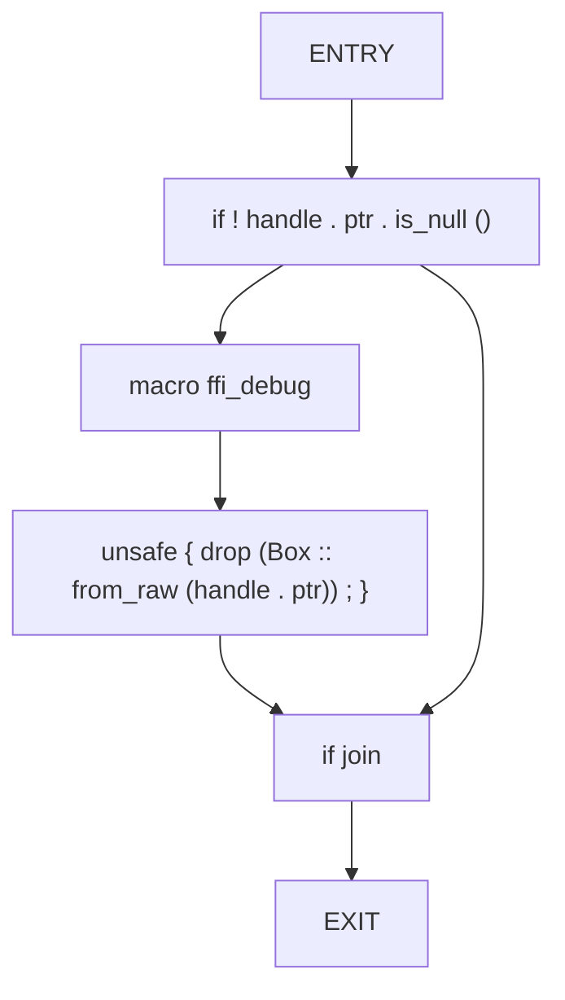

## Function: `mmsb_allocator_get_page`

- File: MMSB/src/ffi.rs
- Branches: 3
- Loops: 0
- Nodes: 14
- Edges: 15

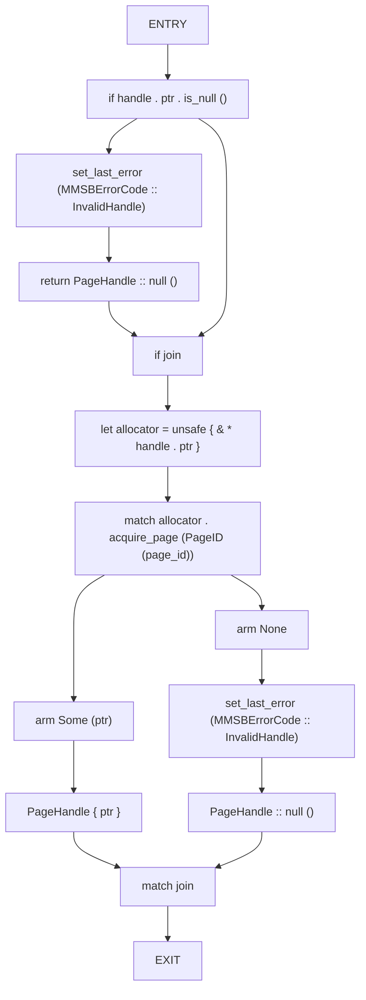

## Function: `mmsb_allocator_list_pages`

- File: MMSB/src/ffi.rs
- Branches: 1
- Loops: 0
- Nodes: 11
- Edges: 11

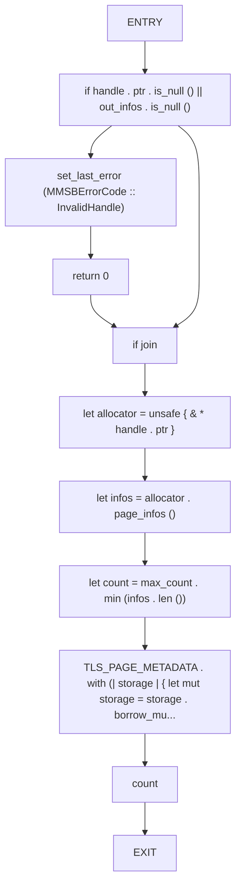

## Function: `mmsb_allocator_new`

- File: MMSB/src/ffi.rs
- Branches: 0
- Loops: 0
- Nodes: 10
- Edges: 9

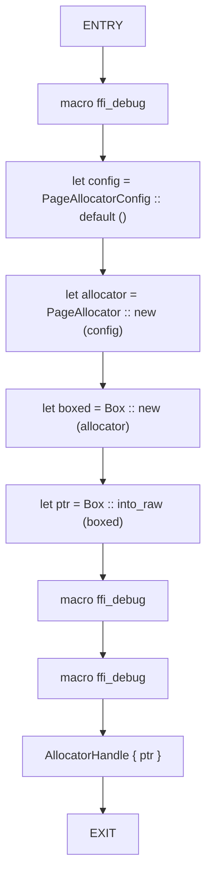

## Function: `mmsb_allocator_page_count`

- File: MMSB/src/ffi.rs
- Branches: 1
- Loops: 0
- Nodes: 8
- Edges: 8

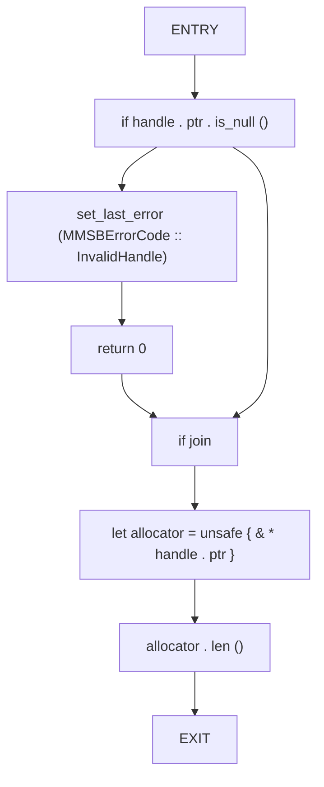

## Function: `mmsb_allocator_release`

- File: MMSB/src/ffi.rs
- Branches: 1
- Loops: 0
- Nodes: 8
- Edges: 8

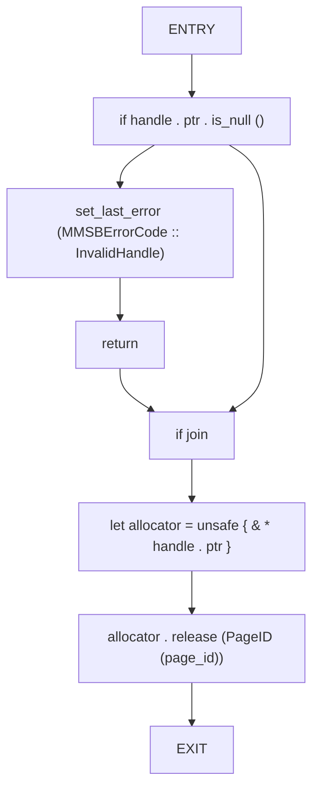

## Function: `mmsb_checkpoint_load`

- File: MMSB/src/ffi.rs
- Branches: 3
- Loops: 0
- Nodes: 25
- Edges: 26


## Function: `mmsb_checkpoint_write`

- File: MMSB/src/ffi.rs
- Branches: 3
- Loops: 0
- Nodes: 25
- Edges: 26

```mermaid
flowchart TD
    mmsb_checkpoint_write_0["ENTRY"]
    mmsb_checkpoint_write_1["macro eprintln"]
    mmsb_checkpoint_write_2["macro eprintln"]
    mmsb_checkpoint_write_3["macro eprintln"]
    mmsb_checkpoint_write_4["let path_str_display = if path . is_null () { '<null>' } else { match unsafe { CStr :: from_ptr (pat..."]
    mmsb_checkpoint_write_5["macro eprintln"]
    mmsb_checkpoint_write_6["if allocator . ptr . is_null () || log . ptr . is_null () || path . is_null ()"]
    mmsb_checkpoint_write_7["macro eprintln"]
    mmsb_checkpoint_write_8["set_last_error (MMSBErrorCode :: InvalidHandle)"]
    mmsb_checkpoint_write_9["return - 1"]
    mmsb_checkpoint_write_10["if join"]
    mmsb_checkpoint_write_11["let allocator_ref = unsafe { & * allocator . ptr }"]
    mmsb_checkpoint_write_12["let log_ref = unsafe { & * log . ptr }"]
    mmsb_checkpoint_write_13["let path_str = match unsafe { CStr :: from_ptr (path) . to_str () } { Ok (s) => s . to_owned..."]
    mmsb_checkpoint_write_14["macro eprintln"]
    mmsb_checkpoint_write_15["match checkpoint :: write_checkpoint (allocator_ref , log_ref , path_str)"]
    mmsb_checkpoint_write_16["arm Ok (_)"]
    mmsb_checkpoint_write_17["macro eprintln"]
    mmsb_checkpoint_write_18["0"]
    mmsb_checkpoint_write_19["arm Err (e)"]
    mmsb_checkpoint_write_20["macro eprintln"]
    mmsb_checkpoint_write_21["set_last_error (MMSBErrorCode :: SnapshotError)"]
    mmsb_checkpoint_write_22["- 1"]
    mmsb_checkpoint_write_23["match join"]
    mmsb_checkpoint_write_24["EXIT"]
    mmsb_checkpoint_write_0 --> mmsb_checkpoint_write_1
    mmsb_checkpoint_write_1 --> mmsb_checkpoint_write_2
    mmsb_checkpoint_write_2 --> mmsb_checkpoint_write_3
    mmsb_checkpoint_write_3 --> mmsb_checkpoint_write_4
    mmsb_checkpoint_write_4 --> mmsb_checkpoint_write_5
    mmsb_checkpoint_write_5 --> mmsb_checkpoint_write_6
    mmsb_checkpoint_write_6 --> mmsb_checkpoint_write_7
    mmsb_checkpoint_write_7 --> mmsb_checkpoint_write_8
    mmsb_checkpoint_write_8 --> mmsb_checkpoint_write_9
    mmsb_checkpoint_write_9 --> mmsb_checkpoint_write_10
    mmsb_checkpoint_write_6 --> mmsb_checkpoint_write_10
    mmsb_checkpoint_write_10 --> mmsb_checkpoint_write_11
    mmsb_checkpoint_write_11 --> mmsb_checkpoint_write_12
    mmsb_checkpoint_write_12 --> mmsb_checkpoint_write_13
    mmsb_checkpoint_write_13 --> mmsb_checkpoint_write_14
    mmsb_checkpoint_write_14 --> mmsb_checkpoint_write_15
    mmsb_checkpoint_write_15 --> mmsb_checkpoint_write_16
    mmsb_checkpoint_write_16 --> mmsb_checkpoint_write_17
    mmsb_checkpoint_write_17 --> mmsb_checkpoint_write_18
    mmsb_checkpoint_write_15 --> mmsb_checkpoint_write_19
    mmsb_checkpoint_write_19 --> mmsb_checkpoint_write_20
    mmsb_checkpoint_write_20 --> mmsb_checkpoint_write_21
    mmsb_checkpoint_write_21 --> mmsb_checkpoint_write_22
    mmsb_checkpoint_write_18 --> mmsb_checkpoint_write_23
    mmsb_checkpoint_write_22 --> mmsb_checkpoint_write_23
    mmsb_checkpoint_write_23 --> mmsb_checkpoint_write_24
```

## Function: `mmsb_delta_apply`

- File: MMSB/src/ffi.rs
- Branches: 3
- Loops: 0
- Nodes: 15
- Edges: 16

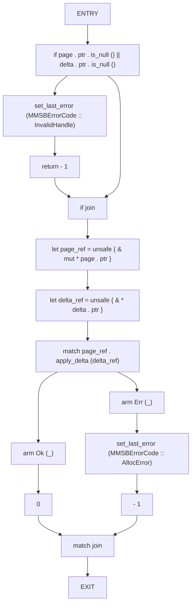

## Function: `mmsb_delta_copy_intent_metadata`

- File: MMSB/src/ffi.rs
- Branches: 1
- Loops: 0
- Nodes: 12
- Edges: 12

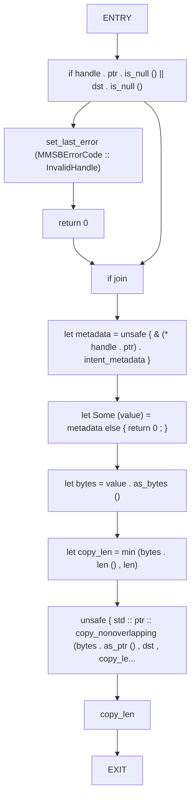

## Function: `mmsb_delta_copy_mask`

- File: MMSB/src/ffi.rs
- Branches: 1
- Loops: 1
- Nodes: 12
- Edges: 13

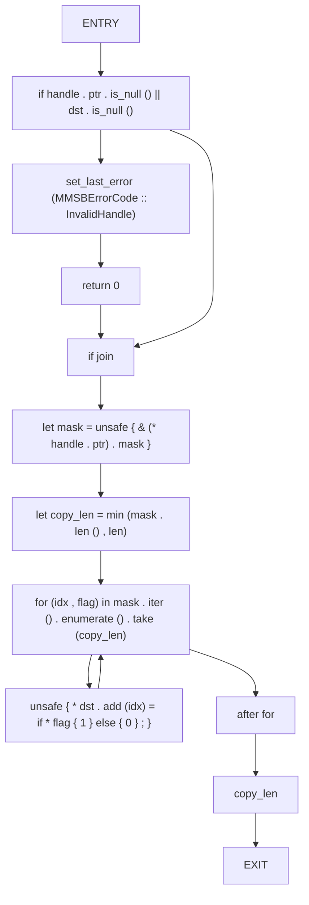

## Function: `mmsb_delta_copy_payload`

- File: MMSB/src/ffi.rs
- Branches: 1
- Loops: 0
- Nodes: 10
- Edges: 10

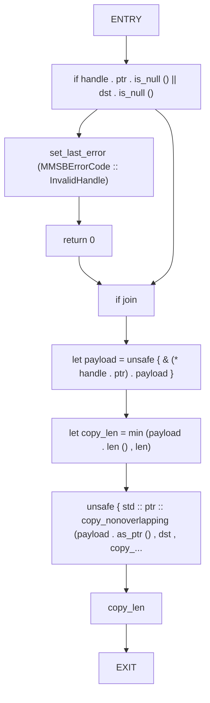

## Function: `mmsb_delta_copy_source`

- File: MMSB/src/ffi.rs
- Branches: 1
- Loops: 0
- Nodes: 11
- Edges: 11

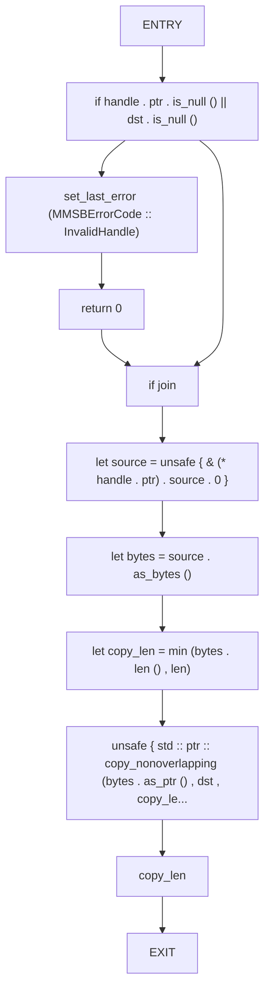

## Function: `mmsb_delta_epoch`

- File: MMSB/src/ffi.rs
- Branches: 1
- Loops: 0
- Nodes: 7
- Edges: 7


## Function: `mmsb_delta_free`

- File: MMSB/src/ffi.rs
- Branches: 1
- Loops: 0
- Nodes: 5
- Edges: 5

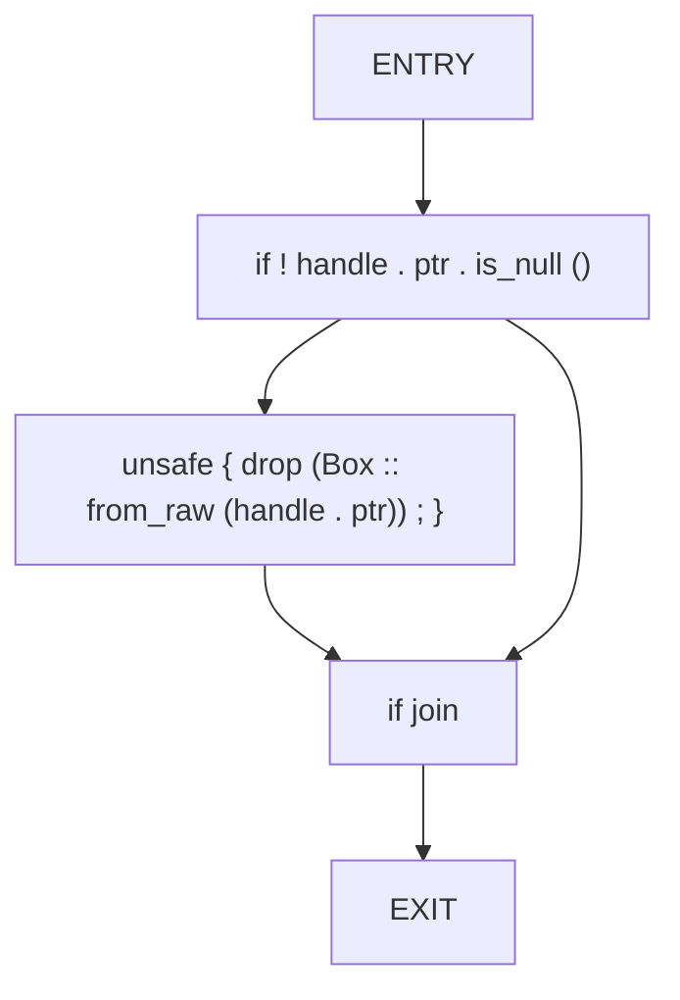

## Function: `mmsb_delta_id`

- File: MMSB/src/ffi.rs
- Branches: 1
- Loops: 0
- Nodes: 7
- Edges: 7

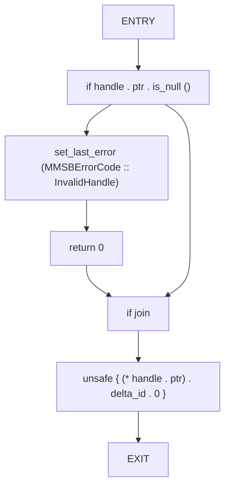

## Function: `mmsb_delta_intent_metadata_len`

- File: MMSB/src/ffi.rs
- Branches: 1
- Loops: 0
- Nodes: 7
- Edges: 7

```mermaid
flowchart TD
    mmsb_delta_intent_metadata_len_0["ENTRY"]
    mmsb_delta_intent_metadata_len_1["if handle . ptr . is_null ()"]
    mmsb_delta_intent_metadata_len_2["set_last_error (MMSBErrorCode :: InvalidHandle)"]
    mmsb_delta_intent_metadata_len_3["return 0"]
    mmsb_delta_intent_metadata_len_4["if join"]
    mmsb_delta_intent_metadata_len_5["unsafe { (* handle . ptr) . intent_metadata . as_ref () . map (| value | valu..."]
    mmsb_delta_intent_metadata_len_6["EXIT"]
    mmsb_delta_intent_metadata_len_0 --> mmsb_delta_intent_metadata_len_1
    mmsb_delta_intent_metadata_len_1 --> mmsb_delta_intent_metadata_len_2
    mmsb_delta_intent_metadata_len_2 --> mmsb_delta_intent_metadata_len_3
    mmsb_delta_intent_metadata_len_3 --> mmsb_delta_intent_metadata_len_4
    mmsb_delta_intent_metadata_len_1 --> mmsb_delta_intent_metadata_len_4
    mmsb_delta_intent_metadata_len_4 --> mmsb_delta_intent_metadata_len_5
    mmsb_delta_intent_metadata_len_5 --> mmsb_delta_intent_metadata_len_6
```

## Function: `mmsb_delta_is_sparse`

- File: MMSB/src/ffi.rs
- Branches: 1
- Loops: 0
- Nodes: 7
- Edges: 7

```mermaid
flowchart TD
    mmsb_delta_is_sparse_0["ENTRY"]
    mmsb_delta_is_sparse_1["if handle . ptr . is_null ()"]
    mmsb_delta_is_sparse_2["set_last_error (MMSBErrorCode :: InvalidHandle)"]
    mmsb_delta_is_sparse_3["return 0"]
    mmsb_delta_is_sparse_4["if join"]
    mmsb_delta_is_sparse_5["unsafe { (* handle . ptr) . is_sparse as u8 }"]
    mmsb_delta_is_sparse_6["EXIT"]
    mmsb_delta_is_sparse_0 --> mmsb_delta_is_sparse_1
    mmsb_delta_is_sparse_1 --> mmsb_delta_is_sparse_2
    mmsb_delta_is_sparse_2 --> mmsb_delta_is_sparse_3
    mmsb_delta_is_sparse_3 --> mmsb_delta_is_sparse_4
    mmsb_delta_is_sparse_1 --> mmsb_delta_is_sparse_4
    mmsb_delta_is_sparse_4 --> mmsb_delta_is_sparse_5
    mmsb_delta_is_sparse_5 --> mmsb_delta_is_sparse_6
```

## Function: `mmsb_delta_mask_len`

- File: MMSB/src/ffi.rs
- Branches: 1
- Loops: 0
- Nodes: 7
- Edges: 7

```mermaid
flowchart TD
    mmsb_delta_mask_len_0["ENTRY"]
    mmsb_delta_mask_len_1["if handle . ptr . is_null ()"]
    mmsb_delta_mask_len_2["set_last_error (MMSBErrorCode :: InvalidHandle)"]
    mmsb_delta_mask_len_3["return 0"]
    mmsb_delta_mask_len_4["if join"]
    mmsb_delta_mask_len_5["unsafe { (* handle . ptr) . mask . len () }"]
    mmsb_delta_mask_len_6["EXIT"]
    mmsb_delta_mask_len_0 --> mmsb_delta_mask_len_1
    mmsb_delta_mask_len_1 --> mmsb_delta_mask_len_2
    mmsb_delta_mask_len_2 --> mmsb_delta_mask_len_3
    mmsb_delta_mask_len_3 --> mmsb_delta_mask_len_4
    mmsb_delta_mask_len_1 --> mmsb_delta_mask_len_4
    mmsb_delta_mask_len_4 --> mmsb_delta_mask_len_5
    mmsb_delta_mask_len_5 --> mmsb_delta_mask_len_6
```

## Function: `mmsb_delta_new`

- File: MMSB/src/ffi.rs
- Branches: 0
- Loops: 0
- Nodes: 9
- Edges: 8

```mermaid
flowchart TD
    mmsb_delta_new_0["ENTRY"]
    mmsb_delta_new_1["let sparse = is_sparse != 0"]
    mmsb_delta_new_2["let mask = mask_from_bytes (mask_ptr , mask_len , payload_len , sparse)"]
    mmsb_delta_new_3["let payload = vec_from_ptr (payload_ptr , payload_len)"]
    mmsb_delta_new_4["let source = if source_ptr . is_null () { 'ffi_delta_new' . to_string () } else { unsafe {..."]
    mmsb_delta_new_5["let delta = Delta { delta_id : DeltaID (delta_id) , page_id : PageID (page_id) , epoch : ..."]
    mmsb_delta_new_6["let boxed = Box :: new (delta)"]
    mmsb_delta_new_7["DeltaHandle { ptr : Box :: into_raw (boxed) , }"]
    mmsb_delta_new_8["EXIT"]
    mmsb_delta_new_0 --> mmsb_delta_new_1
    mmsb_delta_new_1 --> mmsb_delta_new_2
    mmsb_delta_new_2 --> mmsb_delta_new_3
    mmsb_delta_new_3 --> mmsb_delta_new_4
    mmsb_delta_new_4 --> mmsb_delta_new_5
    mmsb_delta_new_5 --> mmsb_delta_new_6
    mmsb_delta_new_6 --> mmsb_delta_new_7
    mmsb_delta_new_7 --> mmsb_delta_new_8
```

## Function: `mmsb_delta_page_id`

- File: MMSB/src/ffi.rs
- Branches: 1
- Loops: 0
- Nodes: 7
- Edges: 7

```mermaid
flowchart TD
    mmsb_delta_page_id_0["ENTRY"]
    mmsb_delta_page_id_1["if handle . ptr . is_null ()"]
    mmsb_delta_page_id_2["set_last_error (MMSBErrorCode :: InvalidHandle)"]
    mmsb_delta_page_id_3["return 0"]
    mmsb_delta_page_id_4["if join"]
    mmsb_delta_page_id_5["unsafe { (* handle . ptr) . page_id . 0 }"]
    mmsb_delta_page_id_6["EXIT"]
    mmsb_delta_page_id_0 --> mmsb_delta_page_id_1
    mmsb_delta_page_id_1 --> mmsb_delta_page_id_2
    mmsb_delta_page_id_2 --> mmsb_delta_page_id_3
    mmsb_delta_page_id_3 --> mmsb_delta_page_id_4
    mmsb_delta_page_id_1 --> mmsb_delta_page_id_4
    mmsb_delta_page_id_4 --> mmsb_delta_page_id_5
    mmsb_delta_page_id_5 --> mmsb_delta_page_id_6
```

## Function: `mmsb_delta_payload_len`

- File: MMSB/src/ffi.rs
- Branches: 1
- Loops: 0
- Nodes: 7
- Edges: 7

```mermaid
flowchart TD
    mmsb_delta_payload_len_0["ENTRY"]
    mmsb_delta_payload_len_1["if handle . ptr . is_null ()"]
    mmsb_delta_payload_len_2["set_last_error (MMSBErrorCode :: InvalidHandle)"]
    mmsb_delta_payload_len_3["return 0"]
    mmsb_delta_payload_len_4["if join"]
    mmsb_delta_payload_len_5["unsafe { (* handle . ptr) . payload . len () }"]
    mmsb_delta_payload_len_6["EXIT"]
    mmsb_delta_payload_len_0 --> mmsb_delta_payload_len_1
    mmsb_delta_payload_len_1 --> mmsb_delta_payload_len_2
    mmsb_delta_payload_len_2 --> mmsb_delta_payload_len_3
    mmsb_delta_payload_len_3 --> mmsb_delta_payload_len_4
    mmsb_delta_payload_len_1 --> mmsb_delta_payload_len_4
    mmsb_delta_payload_len_4 --> mmsb_delta_payload_len_5
    mmsb_delta_payload_len_5 --> mmsb_delta_payload_len_6
```

## Function: `mmsb_delta_set_intent_metadata`

- File: MMSB/src/ffi.rs
- Branches: 4
- Loops: 0
- Nodes: 19
- Edges: 21

```mermaid
flowchart TD
    mmsb_delta_set_intent_metadata_0["ENTRY"]
    mmsb_delta_set_intent_metadata_1["if handle . ptr . is_null ()"]
    mmsb_delta_set_intent_metadata_2["set_last_error (MMSBErrorCode :: InvalidHandle)"]
    mmsb_delta_set_intent_metadata_3["return - 1"]
    mmsb_delta_set_intent_metadata_4["if join"]
    mmsb_delta_set_intent_metadata_5["if metadata_ptr . is_null () || metadata_len == 0"]
    mmsb_delta_set_intent_metadata_6["unsafe { (* handle . ptr) . intent_metadata = None ; }"]
    mmsb_delta_set_intent_metadata_7["return 0"]
    mmsb_delta_set_intent_metadata_8["if join"]
    mmsb_delta_set_intent_metadata_9["let bytes = unsafe { std :: slice :: from_raw_parts (metadata_ptr , metadata_len) }"]
    mmsb_delta_set_intent_metadata_10["match std :: str :: from_utf8 (bytes)"]
    mmsb_delta_set_intent_metadata_11["arm Ok (value)"]
    mmsb_delta_set_intent_metadata_12["unsafe { (* handle . ptr) . intent_metadata = Some (value . to_string ()) ; }"]
    mmsb_delta_set_intent_metadata_13["0"]
    mmsb_delta_set_intent_metadata_14["arm Err (_)"]
    mmsb_delta_set_intent_metadata_15["set_last_error (MMSBErrorCode :: InvalidHandle)"]
    mmsb_delta_set_intent_metadata_16["- 1"]
    mmsb_delta_set_intent_metadata_17["match join"]
    mmsb_delta_set_intent_metadata_18["EXIT"]
    mmsb_delta_set_intent_metadata_0 --> mmsb_delta_set_intent_metadata_1
    mmsb_delta_set_intent_metadata_1 --> mmsb_delta_set_intent_metadata_2
    mmsb_delta_set_intent_metadata_2 --> mmsb_delta_set_intent_metadata_3
    mmsb_delta_set_intent_metadata_3 --> mmsb_delta_set_intent_metadata_4
    mmsb_delta_set_intent_metadata_1 --> mmsb_delta_set_intent_metadata_4
    mmsb_delta_set_intent_metadata_4 --> mmsb_delta_set_intent_metadata_5
    mmsb_delta_set_intent_metadata_5 --> mmsb_delta_set_intent_metadata_6
    mmsb_delta_set_intent_metadata_6 --> mmsb_delta_set_intent_metadata_7
    mmsb_delta_set_intent_metadata_7 --> mmsb_delta_set_intent_metadata_8
    mmsb_delta_set_intent_metadata_5 --> mmsb_delta_set_intent_metadata_8
    mmsb_delta_set_intent_metadata_8 --> mmsb_delta_set_intent_metadata_9
    mmsb_delta_set_intent_metadata_9 --> mmsb_delta_set_intent_metadata_10
    mmsb_delta_set_intent_metadata_10 --> mmsb_delta_set_intent_metadata_11
    mmsb_delta_set_intent_metadata_11 --> mmsb_delta_set_intent_metadata_12
    mmsb_delta_set_intent_metadata_12 --> mmsb_delta_set_intent_metadata_13
    mmsb_delta_set_intent_metadata_10 --> mmsb_delta_set_intent_metadata_14
    mmsb_delta_set_intent_metadata_14 --> mmsb_delta_set_intent_metadata_15
    mmsb_delta_set_intent_metadata_15 --> mmsb_delta_set_intent_metadata_16
    mmsb_delta_set_intent_metadata_13 --> mmsb_delta_set_intent_metadata_17
    mmsb_delta_set_intent_metadata_16 --> mmsb_delta_set_intent_metadata_17
    mmsb_delta_set_intent_metadata_17 --> mmsb_delta_set_intent_metadata_18
```

## Function: `mmsb_delta_source_len`

- File: MMSB/src/ffi.rs
- Branches: 1
- Loops: 0
- Nodes: 7
- Edges: 7

```mermaid
flowchart TD
    mmsb_delta_source_len_0["ENTRY"]
    mmsb_delta_source_len_1["if handle . ptr . is_null ()"]
    mmsb_delta_source_len_2["set_last_error (MMSBErrorCode :: InvalidHandle)"]
    mmsb_delta_source_len_3["return 0"]
    mmsb_delta_source_len_4["if join"]
    mmsb_delta_source_len_5["unsafe { (& (* handle . ptr) . source . 0) . len () }"]
    mmsb_delta_source_len_6["EXIT"]
    mmsb_delta_source_len_0 --> mmsb_delta_source_len_1
    mmsb_delta_source_len_1 --> mmsb_delta_source_len_2
    mmsb_delta_source_len_2 --> mmsb_delta_source_len_3
    mmsb_delta_source_len_3 --> mmsb_delta_source_len_4
    mmsb_delta_source_len_1 --> mmsb_delta_source_len_4
    mmsb_delta_source_len_4 --> mmsb_delta_source_len_5
    mmsb_delta_source_len_5 --> mmsb_delta_source_len_6
```

## Function: `mmsb_delta_timestamp`

- File: MMSB/src/ffi.rs
- Branches: 1
- Loops: 0
- Nodes: 7
- Edges: 7

```mermaid
flowchart TD
    mmsb_delta_timestamp_0["ENTRY"]
    mmsb_delta_timestamp_1["if handle . ptr . is_null ()"]
    mmsb_delta_timestamp_2["set_last_error (MMSBErrorCode :: InvalidHandle)"]
    mmsb_delta_timestamp_3["return 0"]
    mmsb_delta_timestamp_4["if join"]
    mmsb_delta_timestamp_5["unsafe { (* handle . ptr) . timestamp }"]
    mmsb_delta_timestamp_6["EXIT"]
    mmsb_delta_timestamp_0 --> mmsb_delta_timestamp_1
    mmsb_delta_timestamp_1 --> mmsb_delta_timestamp_2
    mmsb_delta_timestamp_2 --> mmsb_delta_timestamp_3
    mmsb_delta_timestamp_3 --> mmsb_delta_timestamp_4
    mmsb_delta_timestamp_1 --> mmsb_delta_timestamp_4
    mmsb_delta_timestamp_4 --> mmsb_delta_timestamp_5
    mmsb_delta_timestamp_5 --> mmsb_delta_timestamp_6
```

## Function: `mmsb_error_is_fatal`

- File: MMSB/src/ffi.rs
- Branches: 0
- Loops: 0
- Nodes: 3
- Edges: 2

```mermaid
flowchart TD
    mmsb_error_is_fatal_0["ENTRY"]
    mmsb_error_is_fatal_1["code . is_fatal ()"]
    mmsb_error_is_fatal_2["EXIT"]
    mmsb_error_is_fatal_0 --> mmsb_error_is_fatal_1
    mmsb_error_is_fatal_1 --> mmsb_error_is_fatal_2
```

## Function: `mmsb_error_is_retryable`

- File: MMSB/src/ffi.rs
- Branches: 0
- Loops: 0
- Nodes: 3
- Edges: 2

```mermaid
flowchart TD
    mmsb_error_is_retryable_0["ENTRY"]
    mmsb_error_is_retryable_1["code . is_retryable ()"]
    mmsb_error_is_retryable_2["EXIT"]
    mmsb_error_is_retryable_0 --> mmsb_error_is_retryable_1
    mmsb_error_is_retryable_1 --> mmsb_error_is_retryable_2
```

## Function: `mmsb_get_last_error`

- File: MMSB/src/ffi.rs
- Branches: 0
- Loops: 0
- Nodes: 3
- Edges: 2

```mermaid
flowchart TD
    mmsb_get_last_error_0["ENTRY"]
    mmsb_get_last_error_1["TLS_LAST_ERROR . with (| cell | { let mut guard = cell . borrow_mut () ; let ..."]
    mmsb_get_last_error_2["EXIT"]
    mmsb_get_last_error_0 --> mmsb_get_last_error_1
    mmsb_get_last_error_1 --> mmsb_get_last_error_2
```

## Function: `mmsb_page_epoch`

- File: MMSB/src/ffi.rs
- Branches: 1
- Loops: 0
- Nodes: 8
- Edges: 8

```mermaid
flowchart TD
    mmsb_page_epoch_0["ENTRY"]
    mmsb_page_epoch_1["if handle . ptr . is_null ()"]
    mmsb_page_epoch_2["set_last_error (MMSBErrorCode :: InvalidHandle)"]
    mmsb_page_epoch_3["return 0"]
    mmsb_page_epoch_4["if join"]
    mmsb_page_epoch_5["let page = unsafe { & * handle . ptr }"]
    mmsb_page_epoch_6["page . epoch () . 0"]
    mmsb_page_epoch_7["EXIT"]
    mmsb_page_epoch_0 --> mmsb_page_epoch_1
    mmsb_page_epoch_1 --> mmsb_page_epoch_2
    mmsb_page_epoch_2 --> mmsb_page_epoch_3
    mmsb_page_epoch_3 --> mmsb_page_epoch_4
    mmsb_page_epoch_1 --> mmsb_page_epoch_4
    mmsb_page_epoch_4 --> mmsb_page_epoch_5
    mmsb_page_epoch_5 --> mmsb_page_epoch_6
    mmsb_page_epoch_6 --> mmsb_page_epoch_7
```

## Function: `mmsb_page_metadata_export`

- File: MMSB/src/ffi.rs
- Branches: 1
- Loops: 0
- Nodes: 11
- Edges: 11

```mermaid
flowchart TD
    mmsb_page_metadata_export_0["ENTRY"]
    mmsb_page_metadata_export_1["if handle . ptr . is_null () || dst . is_null ()"]
    mmsb_page_metadata_export_2["set_last_error (MMSBErrorCode :: InvalidHandle)"]
    mmsb_page_metadata_export_3["return 0"]
    mmsb_page_metadata_export_4["if join"]
    mmsb_page_metadata_export_5["let page = unsafe { & * handle . ptr }"]
    mmsb_page_metadata_export_6["let blob = page . metadata_blob ()"]
    mmsb_page_metadata_export_7["let copy_len = len . min (blob . len ())"]
    mmsb_page_metadata_export_8["unsafe { std :: ptr :: copy_nonoverlapping (blob . as_ptr () , dst , copy_len..."]
    mmsb_page_metadata_export_9["copy_len"]
    mmsb_page_metadata_export_10["EXIT"]
    mmsb_page_metadata_export_0 --> mmsb_page_metadata_export_1
    mmsb_page_metadata_export_1 --> mmsb_page_metadata_export_2
    mmsb_page_metadata_export_2 --> mmsb_page_metadata_export_3
    mmsb_page_metadata_export_3 --> mmsb_page_metadata_export_4
    mmsb_page_metadata_export_1 --> mmsb_page_metadata_export_4
    mmsb_page_metadata_export_4 --> mmsb_page_metadata_export_5
    mmsb_page_metadata_export_5 --> mmsb_page_metadata_export_6
    mmsb_page_metadata_export_6 --> mmsb_page_metadata_export_7
    mmsb_page_metadata_export_7 --> mmsb_page_metadata_export_8
    mmsb_page_metadata_export_8 --> mmsb_page_metadata_export_9
    mmsb_page_metadata_export_9 --> mmsb_page_metadata_export_10
```

## Function: `mmsb_page_metadata_import`

- File: MMSB/src/ffi.rs
- Branches: 3
- Loops: 0
- Nodes: 15
- Edges: 16

```mermaid
flowchart TD
    mmsb_page_metadata_import_0["ENTRY"]
    mmsb_page_metadata_import_1["if handle . ptr . is_null () || src . is_null ()"]
    mmsb_page_metadata_import_2["set_last_error (MMSBErrorCode :: InvalidHandle)"]
    mmsb_page_metadata_import_3["return - 1"]
    mmsb_page_metadata_import_4["if join"]
    mmsb_page_metadata_import_5["let page = unsafe { & mut * handle . ptr }"]
    mmsb_page_metadata_import_6["let blob = unsafe { std :: slice :: from_raw_parts (src , len) }"]
    mmsb_page_metadata_import_7["match page . set_metadata_blob (blob)"]
    mmsb_page_metadata_import_8["arm Ok (_)"]
    mmsb_page_metadata_import_9["0"]
    mmsb_page_metadata_import_10["arm Err (_)"]
    mmsb_page_metadata_import_11["set_last_error (MMSBErrorCode :: AllocError)"]
    mmsb_page_metadata_import_12["- 1"]
    mmsb_page_metadata_import_13["match join"]
    mmsb_page_metadata_import_14["EXIT"]
    mmsb_page_metadata_import_0 --> mmsb_page_metadata_import_1
    mmsb_page_metadata_import_1 --> mmsb_page_metadata_import_2
    mmsb_page_metadata_import_2 --> mmsb_page_metadata_import_3
    mmsb_page_metadata_import_3 --> mmsb_page_metadata_import_4
    mmsb_page_metadata_import_1 --> mmsb_page_metadata_import_4
    mmsb_page_metadata_import_4 --> mmsb_page_metadata_import_5
    mmsb_page_metadata_import_5 --> mmsb_page_metadata_import_6
    mmsb_page_metadata_import_6 --> mmsb_page_metadata_import_7
    mmsb_page_metadata_import_7 --> mmsb_page_metadata_import_8
    mmsb_page_metadata_import_8 --> mmsb_page_metadata_import_9
    mmsb_page_metadata_import_7 --> mmsb_page_metadata_import_10
    mmsb_page_metadata_import_10 --> mmsb_page_metadata_import_11
    mmsb_page_metadata_import_11 --> mmsb_page_metadata_import_12
    mmsb_page_metadata_import_9 --> mmsb_page_metadata_import_13
    mmsb_page_metadata_import_12 --> mmsb_page_metadata_import_13
    mmsb_page_metadata_import_13 --> mmsb_page_metadata_import_14
```

## Function: `mmsb_page_metadata_size`

- File: MMSB/src/ffi.rs
- Branches: 1
- Loops: 0
- Nodes: 8
- Edges: 8

```mermaid
flowchart TD
    mmsb_page_metadata_size_0["ENTRY"]
    mmsb_page_metadata_size_1["if handle . ptr . is_null ()"]
    mmsb_page_metadata_size_2["set_last_error (MMSBErrorCode :: InvalidHandle)"]
    mmsb_page_metadata_size_3["return 0"]
    mmsb_page_metadata_size_4["if join"]
    mmsb_page_metadata_size_5["let page = unsafe { & * handle . ptr }"]
    mmsb_page_metadata_size_6["page . metadata_blob () . len ()"]
    mmsb_page_metadata_size_7["EXIT"]
    mmsb_page_metadata_size_0 --> mmsb_page_metadata_size_1
    mmsb_page_metadata_size_1 --> mmsb_page_metadata_size_2
    mmsb_page_metadata_size_2 --> mmsb_page_metadata_size_3
    mmsb_page_metadata_size_3 --> mmsb_page_metadata_size_4
    mmsb_page_metadata_size_1 --> mmsb_page_metadata_size_4
    mmsb_page_metadata_size_4 --> mmsb_page_metadata_size_5
    mmsb_page_metadata_size_5 --> mmsb_page_metadata_size_6
    mmsb_page_metadata_size_6 --> mmsb_page_metadata_size_7
```

## Function: `mmsb_page_read`

- File: MMSB/src/ffi.rs
- Branches: 3
- Loops: 0
- Nodes: 30
- Edges: 32

```mermaid
flowchart TD
    mmsb_page_read_0["ENTRY"]
    mmsb_page_read_1["macro ffi_debug"]
    mmsb_page_read_2["macro ffi_debug"]
    mmsb_page_read_3["macro ffi_debug"]
    mmsb_page_read_4["macro ffi_debug"]
    mmsb_page_read_5["if handle . ptr . is_null ()"]
    mmsb_page_read_6["macro ffi_debug"]
    mmsb_page_read_7["set_last_error (MMSBErrorCode :: InvalidHandle)"]
    mmsb_page_read_8["return 0"]
    mmsb_page_read_9["if join"]
    mmsb_page_read_10["if len == 0"]
    mmsb_page_read_11["let page = unsafe { & * handle . ptr }"]
    mmsb_page_read_12["let size = page . size ()"]
    mmsb_page_read_13["macro ffi_debug"]
    mmsb_page_read_14["return size"]
    mmsb_page_read_15["if join"]
    mmsb_page_read_16["if dst . is_null ()"]
    mmsb_page_read_17["macro ffi_debug"]
    mmsb_page_read_18["set_last_error (MMSBErrorCode :: InvalidHandle)"]
    mmsb_page_read_19["return 0"]
    mmsb_page_read_20["if join"]
    mmsb_page_read_21["let page = unsafe { & * handle . ptr }"]
    mmsb_page_read_22["let page_size = page . size ()"]
    mmsb_page_read_23["let bytes_to_copy = len . min (page_size)"]
    mmsb_page_read_24["macro ffi_debug"]
    mmsb_page_read_25["let src_slice = page . data_slice ()"]
    mmsb_page_read_26["unsafe { std :: ptr :: copy_nonoverlapping (src_slice . as_ptr () , dst , byt..."]
    mmsb_page_read_27["macro ffi_debug"]
    mmsb_page_read_28["bytes_to_copy"]
    mmsb_page_read_29["EXIT"]
    mmsb_page_read_0 --> mmsb_page_read_1
    mmsb_page_read_1 --> mmsb_page_read_2
    mmsb_page_read_2 --> mmsb_page_read_3
    mmsb_page_read_3 --> mmsb_page_read_4
    mmsb_page_read_4 --> mmsb_page_read_5
    mmsb_page_read_5 --> mmsb_page_read_6
    mmsb_page_read_6 --> mmsb_page_read_7
    mmsb_page_read_7 --> mmsb_page_read_8
    mmsb_page_read_8 --> mmsb_page_read_9
    mmsb_page_read_5 --> mmsb_page_read_9
    mmsb_page_read_9 --> mmsb_page_read_10
    mmsb_page_read_10 --> mmsb_page_read_11
    mmsb_page_read_11 --> mmsb_page_read_12
    mmsb_page_read_12 --> mmsb_page_read_13
    mmsb_page_read_13 --> mmsb_page_read_14
    mmsb_page_read_14 --> mmsb_page_read_15
    mmsb_page_read_10 --> mmsb_page_read_15
    mmsb_page_read_15 --> mmsb_page_read_16
    mmsb_page_read_16 --> mmsb_page_read_17
    mmsb_page_read_17 --> mmsb_page_read_18
    mmsb_page_read_18 --> mmsb_page_read_19
    mmsb_page_read_19 --> mmsb_page_read_20
    mmsb_page_read_16 --> mmsb_page_read_20
    mmsb_page_read_20 --> mmsb_page_read_21
    mmsb_page_read_21 --> mmsb_page_read_22
    mmsb_page_read_22 --> mmsb_page_read_23
    mmsb_page_read_23 --> mmsb_page_read_24
    mmsb_page_read_24 --> mmsb_page_read_25
    mmsb_page_read_25 --> mmsb_page_read_26
    mmsb_page_read_26 --> mmsb_page_read_27
    mmsb_page_read_27 --> mmsb_page_read_28
    mmsb_page_read_28 --> mmsb_page_read_29
```

## Function: `mmsb_page_write_masked`

- File: MMSB/src/ffi.rs
- Branches: 3
- Loops: 0
- Nodes: 18
- Edges: 19

```mermaid
flowchart TD
    mmsb_page_write_masked_0["ENTRY"]
    mmsb_page_write_masked_1["if handle . ptr . is_null ()"]
    mmsb_page_write_masked_2["set_last_error (MMSBErrorCode :: InvalidHandle)"]
    mmsb_page_write_masked_3["return - 1"]
    mmsb_page_write_masked_4["if join"]
    mmsb_page_write_masked_5["let sparse = is_sparse != 0"]
    mmsb_page_write_masked_6["let mask = mask_from_bytes (mask_ptr , mask_len , payload_len , sparse)"]
    mmsb_page_write_masked_7["let payload = vec_from_ptr (payload_ptr , payload_len)"]
    mmsb_page_write_masked_8["let delta = Delta { delta_id : DeltaID (0) , page_id : unsafe { (* handle . ptr) . id } ,..."]
    mmsb_page_write_masked_9["let page = unsafe { & mut * handle . ptr }"]
    mmsb_page_write_masked_10["match page . apply_delta (& delta)"]
    mmsb_page_write_masked_11["arm Ok (_)"]
    mmsb_page_write_masked_12["0"]
    mmsb_page_write_masked_13["arm Err (_)"]
    mmsb_page_write_masked_14["set_last_error (MMSBErrorCode :: AllocError)"]
    mmsb_page_write_masked_15["- 1"]
    mmsb_page_write_masked_16["match join"]
    mmsb_page_write_masked_17["EXIT"]
    mmsb_page_write_masked_0 --> mmsb_page_write_masked_1
    mmsb_page_write_masked_1 --> mmsb_page_write_masked_2
    mmsb_page_write_masked_2 --> mmsb_page_write_masked_3
    mmsb_page_write_masked_3 --> mmsb_page_write_masked_4
    mmsb_page_write_masked_1 --> mmsb_page_write_masked_4
    mmsb_page_write_masked_4 --> mmsb_page_write_masked_5
    mmsb_page_write_masked_5 --> mmsb_page_write_masked_6
    mmsb_page_write_masked_6 --> mmsb_page_write_masked_7
    mmsb_page_write_masked_7 --> mmsb_page_write_masked_8
    mmsb_page_write_masked_8 --> mmsb_page_write_masked_9
    mmsb_page_write_masked_9 --> mmsb_page_write_masked_10
    mmsb_page_write_masked_10 --> mmsb_page_write_masked_11
    mmsb_page_write_masked_11 --> mmsb_page_write_masked_12
    mmsb_page_write_masked_10 --> mmsb_page_write_masked_13
    mmsb_page_write_masked_13 --> mmsb_page_write_masked_14
    mmsb_page_write_masked_14 --> mmsb_page_write_masked_15
    mmsb_page_write_masked_12 --> mmsb_page_write_masked_16
    mmsb_page_write_masked_15 --> mmsb_page_write_masked_16
    mmsb_page_write_masked_16 --> mmsb_page_write_masked_17
```

## Function: `mmsb_semiring_boolean_accumulate`

- File: MMSB/src/ffi.rs
- Branches: 0
- Loops: 0
- Nodes: 5
- Edges: 4

```mermaid
flowchart TD
    mmsb_semiring_boolean_accumulate_0["ENTRY"]
    mmsb_semiring_boolean_accumulate_1["let semiring = BooleanSemiring"]
    mmsb_semiring_boolean_accumulate_2["let (add , mul) = accumulate (& semiring , & (left != 0) , & (right != 0))"]
    mmsb_semiring_boolean_accumulate_3["SemiringPairBool { add : add as u8 , mul : mul as u8 , }"]
    mmsb_semiring_boolean_accumulate_4["EXIT"]
    mmsb_semiring_boolean_accumulate_0 --> mmsb_semiring_boolean_accumulate_1
    mmsb_semiring_boolean_accumulate_1 --> mmsb_semiring_boolean_accumulate_2
    mmsb_semiring_boolean_accumulate_2 --> mmsb_semiring_boolean_accumulate_3
    mmsb_semiring_boolean_accumulate_3 --> mmsb_semiring_boolean_accumulate_4
```

## Function: `mmsb_semiring_boolean_fold_add`

- File: MMSB/src/ffi.rs
- Branches: 1
- Loops: 0
- Nodes: 10
- Edges: 10

```mermaid
flowchart TD
    mmsb_semiring_boolean_fold_add_0["ENTRY"]
    mmsb_semiring_boolean_fold_add_1["let semiring = BooleanSemiring"]
    mmsb_semiring_boolean_fold_add_2["if len == 0"]
    mmsb_semiring_boolean_fold_add_3["return semiring . zero () as u8"]
    mmsb_semiring_boolean_fold_add_4["if join"]
    mmsb_semiring_boolean_fold_add_5["let slice = slice_from_ptr (values , len)"]
    mmsb_semiring_boolean_fold_add_6["let iter = slice . iter () . map (| v | * v != 0)"]
    mmsb_semiring_boolean_fold_add_7["let result = fold_add (& semiring , iter)"]
    mmsb_semiring_boolean_fold_add_8["result as u8"]
    mmsb_semiring_boolean_fold_add_9["EXIT"]
    mmsb_semiring_boolean_fold_add_0 --> mmsb_semiring_boolean_fold_add_1
    mmsb_semiring_boolean_fold_add_1 --> mmsb_semiring_boolean_fold_add_2
    mmsb_semiring_boolean_fold_add_2 --> mmsb_semiring_boolean_fold_add_3
    mmsb_semiring_boolean_fold_add_3 --> mmsb_semiring_boolean_fold_add_4
    mmsb_semiring_boolean_fold_add_2 --> mmsb_semiring_boolean_fold_add_4
    mmsb_semiring_boolean_fold_add_4 --> mmsb_semiring_boolean_fold_add_5
    mmsb_semiring_boolean_fold_add_5 --> mmsb_semiring_boolean_fold_add_6
    mmsb_semiring_boolean_fold_add_6 --> mmsb_semiring_boolean_fold_add_7
    mmsb_semiring_boolean_fold_add_7 --> mmsb_semiring_boolean_fold_add_8
    mmsb_semiring_boolean_fold_add_8 --> mmsb_semiring_boolean_fold_add_9
```

## Function: `mmsb_semiring_boolean_fold_mul`

- File: MMSB/src/ffi.rs
- Branches: 1
- Loops: 0
- Nodes: 10
- Edges: 10

```mermaid
flowchart TD
    mmsb_semiring_boolean_fold_mul_0["ENTRY"]
    mmsb_semiring_boolean_fold_mul_1["let semiring = BooleanSemiring"]
    mmsb_semiring_boolean_fold_mul_2["if len == 0"]
    mmsb_semiring_boolean_fold_mul_3["return semiring . one () as u8"]
    mmsb_semiring_boolean_fold_mul_4["if join"]
    mmsb_semiring_boolean_fold_mul_5["let slice = slice_from_ptr (values , len)"]
    mmsb_semiring_boolean_fold_mul_6["let iter = slice . iter () . map (| v | * v != 0)"]
    mmsb_semiring_boolean_fold_mul_7["let result = fold_mul (& semiring , iter)"]
    mmsb_semiring_boolean_fold_mul_8["result as u8"]
    mmsb_semiring_boolean_fold_mul_9["EXIT"]
    mmsb_semiring_boolean_fold_mul_0 --> mmsb_semiring_boolean_fold_mul_1
    mmsb_semiring_boolean_fold_mul_1 --> mmsb_semiring_boolean_fold_mul_2
    mmsb_semiring_boolean_fold_mul_2 --> mmsb_semiring_boolean_fold_mul_3
    mmsb_semiring_boolean_fold_mul_3 --> mmsb_semiring_boolean_fold_mul_4
    mmsb_semiring_boolean_fold_mul_2 --> mmsb_semiring_boolean_fold_mul_4
    mmsb_semiring_boolean_fold_mul_4 --> mmsb_semiring_boolean_fold_mul_5
    mmsb_semiring_boolean_fold_mul_5 --> mmsb_semiring_boolean_fold_mul_6
    mmsb_semiring_boolean_fold_mul_6 --> mmsb_semiring_boolean_fold_mul_7
    mmsb_semiring_boolean_fold_mul_7 --> mmsb_semiring_boolean_fold_mul_8
    mmsb_semiring_boolean_fold_mul_8 --> mmsb_semiring_boolean_fold_mul_9
```

## Function: `mmsb_semiring_tropical_accumulate`

- File: MMSB/src/ffi.rs
- Branches: 0
- Loops: 0
- Nodes: 5
- Edges: 4

```mermaid
flowchart TD
    mmsb_semiring_tropical_accumulate_0["ENTRY"]
    mmsb_semiring_tropical_accumulate_1["let semiring = TropicalSemiring"]
    mmsb_semiring_tropical_accumulate_2["let (add , mul) = accumulate (& semiring , & left , & right)"]
    mmsb_semiring_tropical_accumulate_3["SemiringPairF64 { add , mul }"]
    mmsb_semiring_tropical_accumulate_4["EXIT"]
    mmsb_semiring_tropical_accumulate_0 --> mmsb_semiring_tropical_accumulate_1
    mmsb_semiring_tropical_accumulate_1 --> mmsb_semiring_tropical_accumulate_2
    mmsb_semiring_tropical_accumulate_2 --> mmsb_semiring_tropical_accumulate_3
    mmsb_semiring_tropical_accumulate_3 --> mmsb_semiring_tropical_accumulate_4
```

## Function: `mmsb_semiring_tropical_fold_add`

- File: MMSB/src/ffi.rs
- Branches: 1
- Loops: 0
- Nodes: 8
- Edges: 8

```mermaid
flowchart TD
    mmsb_semiring_tropical_fold_add_0["ENTRY"]
    mmsb_semiring_tropical_fold_add_1["let semiring = TropicalSemiring"]
    mmsb_semiring_tropical_fold_add_2["if len == 0"]
    mmsb_semiring_tropical_fold_add_3["return semiring . zero ()"]
    mmsb_semiring_tropical_fold_add_4["if join"]
    mmsb_semiring_tropical_fold_add_5["let slice = slice_from_ptr (values , len)"]
    mmsb_semiring_tropical_fold_add_6["fold_add (& semiring , slice . iter () . copied ())"]
    mmsb_semiring_tropical_fold_add_7["EXIT"]
    mmsb_semiring_tropical_fold_add_0 --> mmsb_semiring_tropical_fold_add_1
    mmsb_semiring_tropical_fold_add_1 --> mmsb_semiring_tropical_fold_add_2
    mmsb_semiring_tropical_fold_add_2 --> mmsb_semiring_tropical_fold_add_3
    mmsb_semiring_tropical_fold_add_3 --> mmsb_semiring_tropical_fold_add_4
    mmsb_semiring_tropical_fold_add_2 --> mmsb_semiring_tropical_fold_add_4
    mmsb_semiring_tropical_fold_add_4 --> mmsb_semiring_tropical_fold_add_5
    mmsb_semiring_tropical_fold_add_5 --> mmsb_semiring_tropical_fold_add_6
    mmsb_semiring_tropical_fold_add_6 --> mmsb_semiring_tropical_fold_add_7
```

## Function: `mmsb_semiring_tropical_fold_mul`

- File: MMSB/src/ffi.rs
- Branches: 1
- Loops: 0
- Nodes: 8
- Edges: 8

```mermaid
flowchart TD
    mmsb_semiring_tropical_fold_mul_0["ENTRY"]
    mmsb_semiring_tropical_fold_mul_1["let semiring = TropicalSemiring"]
    mmsb_semiring_tropical_fold_mul_2["if len == 0"]
    mmsb_semiring_tropical_fold_mul_3["return semiring . one ()"]
    mmsb_semiring_tropical_fold_mul_4["if join"]
    mmsb_semiring_tropical_fold_mul_5["let slice = slice_from_ptr (values , len)"]
    mmsb_semiring_tropical_fold_mul_6["fold_mul (& semiring , slice . iter () . copied ())"]
    mmsb_semiring_tropical_fold_mul_7["EXIT"]
    mmsb_semiring_tropical_fold_mul_0 --> mmsb_semiring_tropical_fold_mul_1
    mmsb_semiring_tropical_fold_mul_1 --> mmsb_semiring_tropical_fold_mul_2
    mmsb_semiring_tropical_fold_mul_2 --> mmsb_semiring_tropical_fold_mul_3
    mmsb_semiring_tropical_fold_mul_3 --> mmsb_semiring_tropical_fold_mul_4
    mmsb_semiring_tropical_fold_mul_2 --> mmsb_semiring_tropical_fold_mul_4
    mmsb_semiring_tropical_fold_mul_4 --> mmsb_semiring_tropical_fold_mul_5
    mmsb_semiring_tropical_fold_mul_5 --> mmsb_semiring_tropical_fold_mul_6
    mmsb_semiring_tropical_fold_mul_6 --> mmsb_semiring_tropical_fold_mul_7
```

## Function: `mmsb_tlog_append`

- File: MMSB/src/ffi.rs
- Branches: 3
- Loops: 0
- Nodes: 15
- Edges: 16

```mermaid
flowchart TD
    mmsb_tlog_append_0["ENTRY"]
    mmsb_tlog_append_1["if handle . ptr . is_null () || delta . ptr . is_null ()"]
    mmsb_tlog_append_2["set_last_error (MMSBErrorCode :: InvalidHandle)"]
    mmsb_tlog_append_3["return - 1"]
    mmsb_tlog_append_4["if join"]
    mmsb_tlog_append_5["let log = unsafe { & * handle . ptr }"]
    mmsb_tlog_append_6["let delta_ref = unsafe { & * delta . ptr }"]
    mmsb_tlog_append_7["match log . append (delta_ref . clone ())"]
    mmsb_tlog_append_8["arm Ok (_)"]
    mmsb_tlog_append_9["0"]
    mmsb_tlog_append_10["arm Err (err)"]
    mmsb_tlog_append_11["set_last_error (log_error_code (& err))"]
    mmsb_tlog_append_12["- 1"]
    mmsb_tlog_append_13["match join"]
    mmsb_tlog_append_14["EXIT"]
    mmsb_tlog_append_0 --> mmsb_tlog_append_1
    mmsb_tlog_append_1 --> mmsb_tlog_append_2
    mmsb_tlog_append_2 --> mmsb_tlog_append_3
    mmsb_tlog_append_3 --> mmsb_tlog_append_4
    mmsb_tlog_append_1 --> mmsb_tlog_append_4
    mmsb_tlog_append_4 --> mmsb_tlog_append_5
    mmsb_tlog_append_5 --> mmsb_tlog_append_6
    mmsb_tlog_append_6 --> mmsb_tlog_append_7
    mmsb_tlog_append_7 --> mmsb_tlog_append_8
    mmsb_tlog_append_8 --> mmsb_tlog_append_9
    mmsb_tlog_append_7 --> mmsb_tlog_append_10
    mmsb_tlog_append_10 --> mmsb_tlog_append_11
    mmsb_tlog_append_11 --> mmsb_tlog_append_12
    mmsb_tlog_append_9 --> mmsb_tlog_append_13
    mmsb_tlog_append_12 --> mmsb_tlog_append_13
    mmsb_tlog_append_13 --> mmsb_tlog_append_14
```

## Function: `mmsb_tlog_free`

- File: MMSB/src/ffi.rs
- Branches: 1
- Loops: 0
- Nodes: 5
- Edges: 5

```mermaid
flowchart TD
    mmsb_tlog_free_0["ENTRY"]
    mmsb_tlog_free_1["if ! handle . ptr . is_null ()"]
    mmsb_tlog_free_2["unsafe { drop (Box :: from_raw (handle . ptr)) ; }"]
    mmsb_tlog_free_3["if join"]
    mmsb_tlog_free_4["EXIT"]
    mmsb_tlog_free_0 --> mmsb_tlog_free_1
    mmsb_tlog_free_1 --> mmsb_tlog_free_2
    mmsb_tlog_free_2 --> mmsb_tlog_free_3
    mmsb_tlog_free_1 --> mmsb_tlog_free_3
    mmsb_tlog_free_3 --> mmsb_tlog_free_4
```

## Function: `mmsb_tlog_new`

- File: MMSB/src/ffi.rs
- Branches: 3
- Loops: 0
- Nodes: 16
- Edges: 17

```mermaid
flowchart TD
    mmsb_tlog_new_0["ENTRY"]
    mmsb_tlog_new_1["if path . is_null ()"]
    mmsb_tlog_new_2["set_last_error (MMSBErrorCode :: InvalidHandle)"]
    mmsb_tlog_new_3["return TLogHandle :: null ()"]
    mmsb_tlog_new_4["if join"]
    mmsb_tlog_new_5["let c_str = unsafe { CStr :: from_ptr (path) }"]
    mmsb_tlog_new_6["let Ok (path_str) = c_str . to_str () else { set_last_error (MMSBErrorCode :: InvalidHandle) ; return TLogHandle :: null..."]
    mmsb_tlog_new_7["let owned = path_str . to_owned ()"]
    mmsb_tlog_new_8["match TransactionLog :: new (owned)"]
    mmsb_tlog_new_9["arm Ok (log)"]
    mmsb_tlog_new_10["TLogHandle { ptr : Box :: into_raw (Box :: new (log)) , }"]
    mmsb_tlog_new_11["arm Err (err)"]
    mmsb_tlog_new_12["set_last_error (log_error_code (& err))"]
    mmsb_tlog_new_13["TLogHandle :: null ()"]
    mmsb_tlog_new_14["match join"]
    mmsb_tlog_new_15["EXIT"]
    mmsb_tlog_new_0 --> mmsb_tlog_new_1
    mmsb_tlog_new_1 --> mmsb_tlog_new_2
    mmsb_tlog_new_2 --> mmsb_tlog_new_3
    mmsb_tlog_new_3 --> mmsb_tlog_new_4
    mmsb_tlog_new_1 --> mmsb_tlog_new_4
    mmsb_tlog_new_4 --> mmsb_tlog_new_5
    mmsb_tlog_new_5 --> mmsb_tlog_new_6
    mmsb_tlog_new_6 --> mmsb_tlog_new_7
    mmsb_tlog_new_7 --> mmsb_tlog_new_8
    mmsb_tlog_new_8 --> mmsb_tlog_new_9
    mmsb_tlog_new_9 --> mmsb_tlog_new_10
    mmsb_tlog_new_8 --> mmsb_tlog_new_11
    mmsb_tlog_new_11 --> mmsb_tlog_new_12
    mmsb_tlog_new_12 --> mmsb_tlog_new_13
    mmsb_tlog_new_10 --> mmsb_tlog_new_14
    mmsb_tlog_new_13 --> mmsb_tlog_new_14
    mmsb_tlog_new_14 --> mmsb_tlog_new_15
```

## Function: `mmsb_tlog_reader_free`

- File: MMSB/src/ffi.rs
- Branches: 1
- Loops: 0
- Nodes: 5
- Edges: 5

```mermaid
flowchart TD
    mmsb_tlog_reader_free_0["ENTRY"]
    mmsb_tlog_reader_free_1["if ! handle . ptr . is_null ()"]
    mmsb_tlog_reader_free_2["unsafe { drop (Box :: from_raw (handle . ptr)) ; }"]
    mmsb_tlog_reader_free_3["if join"]
    mmsb_tlog_reader_free_4["EXIT"]
    mmsb_tlog_reader_free_0 --> mmsb_tlog_reader_free_1
    mmsb_tlog_reader_free_1 --> mmsb_tlog_reader_free_2
    mmsb_tlog_reader_free_2 --> mmsb_tlog_reader_free_3
    mmsb_tlog_reader_free_1 --> mmsb_tlog_reader_free_3
    mmsb_tlog_reader_free_3 --> mmsb_tlog_reader_free_4
```

## Function: `mmsb_tlog_reader_new`

- File: MMSB/src/ffi.rs
- Branches: 3
- Loops: 0
- Nodes: 14
- Edges: 15

```mermaid
flowchart TD
    mmsb_tlog_reader_new_0["ENTRY"]
    mmsb_tlog_reader_new_1["if path . is_null ()"]
    mmsb_tlog_reader_new_2["set_last_error (MMSBErrorCode :: InvalidHandle)"]
    mmsb_tlog_reader_new_3["return TLogReaderHandle :: null ()"]
    mmsb_tlog_reader_new_4["if join"]
    mmsb_tlog_reader_new_5["let path_str = match unsafe { CStr :: from_ptr (path) . to_str () } { Ok (s) => s . to_owned..."]
    mmsb_tlog_reader_new_6["match TransactionLogReader :: open (path_str)"]
    mmsb_tlog_reader_new_7["arm Ok (reader)"]
    mmsb_tlog_reader_new_8["TLogReaderHandle { ptr : Box :: into_raw (Box :: new (reader)) , }"]
    mmsb_tlog_reader_new_9["arm Err (err)"]
    mmsb_tlog_reader_new_10["set_last_error (log_error_code (& err))"]
    mmsb_tlog_reader_new_11["TLogReaderHandle :: null ()"]
    mmsb_tlog_reader_new_12["match join"]
    mmsb_tlog_reader_new_13["EXIT"]
    mmsb_tlog_reader_new_0 --> mmsb_tlog_reader_new_1
    mmsb_tlog_reader_new_1 --> mmsb_tlog_reader_new_2
    mmsb_tlog_reader_new_2 --> mmsb_tlog_reader_new_3
    mmsb_tlog_reader_new_3 --> mmsb_tlog_reader_new_4
    mmsb_tlog_reader_new_1 --> mmsb_tlog_reader_new_4
    mmsb_tlog_reader_new_4 --> mmsb_tlog_reader_new_5
    mmsb_tlog_reader_new_5 --> mmsb_tlog_reader_new_6
    mmsb_tlog_reader_new_6 --> mmsb_tlog_reader_new_7
    mmsb_tlog_reader_new_7 --> mmsb_tlog_reader_new_8
    mmsb_tlog_reader_new_6 --> mmsb_tlog_reader_new_9
    mmsb_tlog_reader_new_9 --> mmsb_tlog_reader_new_10
    mmsb_tlog_reader_new_10 --> mmsb_tlog_reader_new_11
    mmsb_tlog_reader_new_8 --> mmsb_tlog_reader_new_12
    mmsb_tlog_reader_new_11 --> mmsb_tlog_reader_new_12
    mmsb_tlog_reader_new_12 --> mmsb_tlog_reader_new_13
```

## Function: `mmsb_tlog_reader_next`

- File: MMSB/src/ffi.rs
- Branches: 4
- Loops: 0
- Nodes: 17
- Edges: 19

```mermaid
flowchart TD
    mmsb_tlog_reader_next_0["ENTRY"]
    mmsb_tlog_reader_next_1["if handle . ptr . is_null ()"]
    mmsb_tlog_reader_next_2["set_last_error (MMSBErrorCode :: InvalidHandle)"]
    mmsb_tlog_reader_next_3["return DeltaHandle :: null ()"]
    mmsb_tlog_reader_next_4["if join"]
    mmsb_tlog_reader_next_5["let reader = unsafe { & mut * handle . ptr }"]
    mmsb_tlog_reader_next_6["match reader . next ()"]
    mmsb_tlog_reader_next_7["arm Ok (Some (delta))"]
    mmsb_tlog_reader_next_8["let boxed = Box :: new (delta)"]
    mmsb_tlog_reader_next_9["DeltaHandle { ptr : Box :: into_raw (boxed) , }"]
    mmsb_tlog_reader_next_10["arm Ok (None)"]
    mmsb_tlog_reader_next_11["DeltaHandle :: null ()"]
    mmsb_tlog_reader_next_12["arm Err (err)"]
    mmsb_tlog_reader_next_13["set_last_error (log_error_code (& err))"]
    mmsb_tlog_reader_next_14["DeltaHandle :: null ()"]
    mmsb_tlog_reader_next_15["match join"]
    mmsb_tlog_reader_next_16["EXIT"]
    mmsb_tlog_reader_next_0 --> mmsb_tlog_reader_next_1
    mmsb_tlog_reader_next_1 --> mmsb_tlog_reader_next_2
    mmsb_tlog_reader_next_2 --> mmsb_tlog_reader_next_3
    mmsb_tlog_reader_next_3 --> mmsb_tlog_reader_next_4
    mmsb_tlog_reader_next_1 --> mmsb_tlog_reader_next_4
    mmsb_tlog_reader_next_4 --> mmsb_tlog_reader_next_5
    mmsb_tlog_reader_next_5 --> mmsb_tlog_reader_next_6
    mmsb_tlog_reader_next_6 --> mmsb_tlog_reader_next_7
    mmsb_tlog_reader_next_7 --> mmsb_tlog_reader_next_8
    mmsb_tlog_reader_next_8 --> mmsb_tlog_reader_next_9
    mmsb_tlog_reader_next_6 --> mmsb_tlog_reader_next_10
    mmsb_tlog_reader_next_10 --> mmsb_tlog_reader_next_11
    mmsb_tlog_reader_next_6 --> mmsb_tlog_reader_next_12
    mmsb_tlog_reader_next_12 --> mmsb_tlog_reader_next_13
    mmsb_tlog_reader_next_13 --> mmsb_tlog_reader_next_14
    mmsb_tlog_reader_next_9 --> mmsb_tlog_reader_next_15
    mmsb_tlog_reader_next_11 --> mmsb_tlog_reader_next_15
    mmsb_tlog_reader_next_14 --> mmsb_tlog_reader_next_15
    mmsb_tlog_reader_next_15 --> mmsb_tlog_reader_next_16
```

## Function: `mmsb_tlog_summary`

- File: MMSB/src/ffi.rs
- Branches: 3
- Loops: 0
- Nodes: 15
- Edges: 16

```mermaid
flowchart TD
    mmsb_tlog_summary_0["ENTRY"]
    mmsb_tlog_summary_1["if path . is_null () || out . is_null ()"]
    mmsb_tlog_summary_2["set_last_error (MMSBErrorCode :: InvalidHandle)"]
    mmsb_tlog_summary_3["return - 1"]
    mmsb_tlog_summary_4["if join"]
    mmsb_tlog_summary_5["let path_str = match unsafe { CStr :: from_ptr (path) . to_str () } { Ok (s) => s , Err (_) ..."]
    mmsb_tlog_summary_6["match crate :: page :: tlog :: summary (path_str)"]
    mmsb_tlog_summary_7["arm Ok (summary)"]
    mmsb_tlog_summary_8["unsafe { (* out) . total_deltas = summary . total_deltas ; (* out) . total_by..."]
    mmsb_tlog_summary_9["0"]
    mmsb_tlog_summary_10["arm Err (e)"]
    mmsb_tlog_summary_11["set_last_error (log_error_code (& e))"]
    mmsb_tlog_summary_12["- 1"]
    mmsb_tlog_summary_13["match join"]
    mmsb_tlog_summary_14["EXIT"]
    mmsb_tlog_summary_0 --> mmsb_tlog_summary_1
    mmsb_tlog_summary_1 --> mmsb_tlog_summary_2
    mmsb_tlog_summary_2 --> mmsb_tlog_summary_3
    mmsb_tlog_summary_3 --> mmsb_tlog_summary_4
    mmsb_tlog_summary_1 --> mmsb_tlog_summary_4
    mmsb_tlog_summary_4 --> mmsb_tlog_summary_5
    mmsb_tlog_summary_5 --> mmsb_tlog_summary_6
    mmsb_tlog_summary_6 --> mmsb_tlog_summary_7
    mmsb_tlog_summary_7 --> mmsb_tlog_summary_8
    mmsb_tlog_summary_8 --> mmsb_tlog_summary_9
    mmsb_tlog_summary_6 --> mmsb_tlog_summary_10
    mmsb_tlog_summary_10 --> mmsb_tlog_summary_11
    mmsb_tlog_summary_11 --> mmsb_tlog_summary_12
    mmsb_tlog_summary_9 --> mmsb_tlog_summary_13
    mmsb_tlog_summary_12 --> mmsb_tlog_summary_13
    mmsb_tlog_summary_13 --> mmsb_tlog_summary_14
```

## Function: `set_last_error`

- File: MMSB/src/ffi.rs
- Branches: 0
- Loops: 0
- Nodes: 3
- Edges: 2

```mermaid
flowchart TD
    set_last_error_0["ENTRY"]
    set_last_error_1["TLS_LAST_ERROR . with (| cell | { * cell . borrow_mut () = code ; })"]
    set_last_error_2["EXIT"]
    set_last_error_0 --> set_last_error_1
    set_last_error_1 --> set_last_error_2
```

## Function: `slice_from_ptr`

- File: MMSB/src/ffi.rs
- Branches: 1
- Loops: 0
- Nodes: 6
- Edges: 6

```mermaid
flowchart TD
    slice_from_ptr_0["ENTRY"]
    slice_from_ptr_1["if ptr . is_null () || len == 0"]
    slice_from_ptr_2["& []"]
    slice_from_ptr_3["unsafe { slice :: from_raw_parts (ptr , len) }"]
    slice_from_ptr_4["if join"]
    slice_from_ptr_5["EXIT"]
    slice_from_ptr_0 --> slice_from_ptr_1
    slice_from_ptr_1 --> slice_from_ptr_2
    slice_from_ptr_1 --> slice_from_ptr_3
    slice_from_ptr_2 --> slice_from_ptr_4
    slice_from_ptr_3 --> slice_from_ptr_4
    slice_from_ptr_4 --> slice_from_ptr_5
```

## Function: `vec_from_ptr`

- File: MMSB/src/ffi.rs
- Branches: 1
- Loops: 0
- Nodes: 6
- Edges: 6

```mermaid
flowchart TD
    vec_from_ptr_0["ENTRY"]
    vec_from_ptr_1["if ptr . is_null () || len == 0"]
    vec_from_ptr_2["return Vec :: new ()"]
    vec_from_ptr_3["if join"]
    vec_from_ptr_4["unsafe { std :: slice :: from_raw_parts (ptr , len) } . to_vec ()"]
    vec_from_ptr_5["EXIT"]
    vec_from_ptr_0 --> vec_from_ptr_1
    vec_from_ptr_1 --> vec_from_ptr_2
    vec_from_ptr_2 --> vec_from_ptr_3
    vec_from_ptr_1 --> vec_from_ptr_3
    vec_from_ptr_3 --> vec_from_ptr_4
    vec_from_ptr_4 --> vec_from_ptr_5
```

