# CFG Group: src/ffi.rs

## Function: `convert_location`

- File: MMSB/src/ffi.rs
- Branches: 0
- Loops: 0
- Nodes: 3
- Edges: 2


## Function: `log_error_code`

- File: MMSB/src/ffi.rs
- Branches: 1
- Loops: 0
- Nodes: 8
- Edges: 8

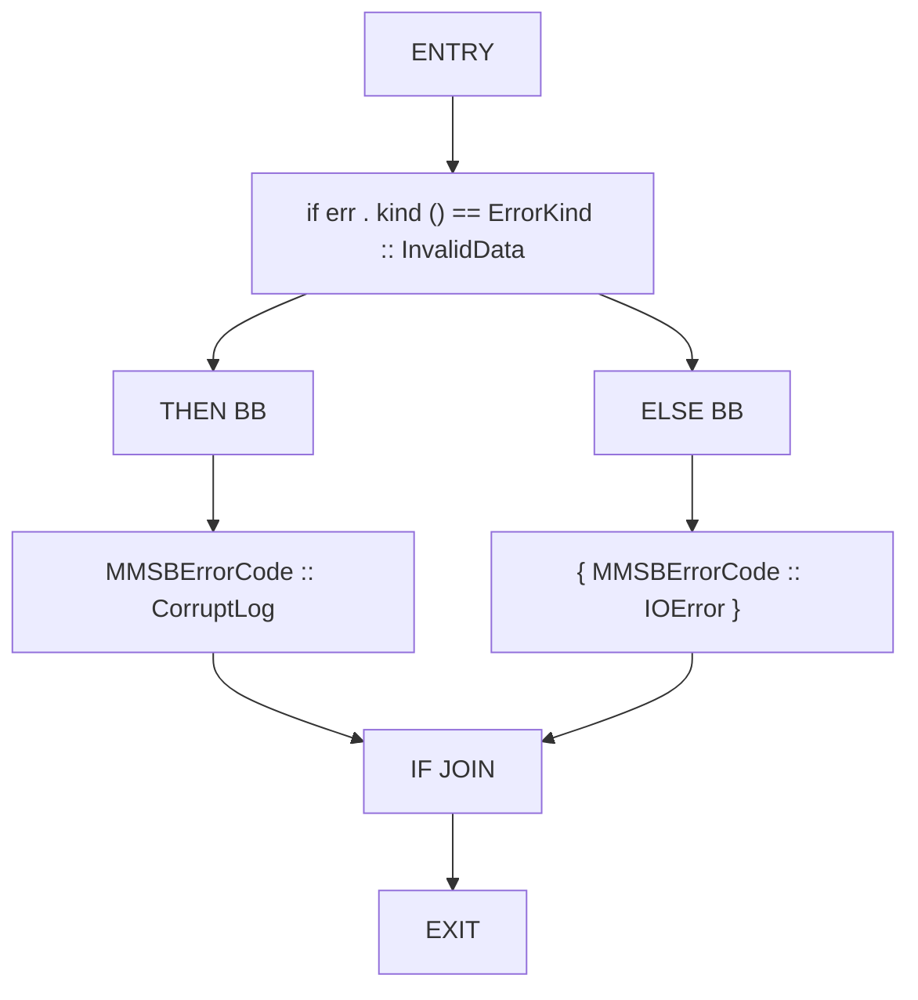

## Function: `mask_from_bytes`

- File: MMSB/src/ffi.rs
- Branches: 3
- Loops: 0
- Nodes: 22
- Edges: 24

```mermaid
flowchart TD
    mask_from_bytes_0["ENTRY"]
    mask_from_bytes_1["if ptr . is_null () || len == 0"]
    mask_from_bytes_2["THEN BB"]
    mask_from_bytes_3["return Vec :: new ()"]
    mask_from_bytes_4["EMPTY ELSE"]
    mask_from_bytes_5["IF JOIN"]
    mask_from_bytes_6["let bytes = unsafe { std :: slice :: from_raw_parts (ptr , len) }"]
    mask_from_bytes_7["let treat_as_packed = is_sparse || (! is_sparse && len . saturating_mul (8) == payload_len)"]
    mask_from_bytes_8["if ! treat_as_packed"]
    mask_from_bytes_9["THEN BB"]
    mask_from_bytes_10["return bytes . iter () . map (| v | * v != 0) . collect ()"]
    mask_from_bytes_11["EMPTY ELSE"]
    mask_from_bytes_12["IF JOIN"]
    mask_from_bytes_13["let mut mask = Vec :: with_capacity (len . saturating_mul (8))"]
    mask_from_bytes_14["for byte in bytes { for bit in 0 .. 8 { mask . push (byte & (1 << bit) != 0) ..."]
    mask_from_bytes_15["if ! is_sparse && payload_len > 0 && mask . len () > payload_len"]
    mask_from_bytes_16["THEN BB"]
    mask_from_bytes_17["mask . truncate (payload_len)"]
    mask_from_bytes_18["EMPTY ELSE"]
    mask_from_bytes_19["IF JOIN"]
    mask_from_bytes_20["mask"]
    mask_from_bytes_21["EXIT"]
    mask_from_bytes_0 --> mask_from_bytes_1
    mask_from_bytes_1 --> mask_from_bytes_2
    mask_from_bytes_2 --> mask_from_bytes_3
    mask_from_bytes_1 --> mask_from_bytes_4
    mask_from_bytes_3 --> mask_from_bytes_5
    mask_from_bytes_4 --> mask_from_bytes_5
    mask_from_bytes_5 --> mask_from_bytes_6
    mask_from_bytes_6 --> mask_from_bytes_7
    mask_from_bytes_7 --> mask_from_bytes_8
    mask_from_bytes_8 --> mask_from_bytes_9
    mask_from_bytes_9 --> mask_from_bytes_10
    mask_from_bytes_8 --> mask_from_bytes_11
    mask_from_bytes_10 --> mask_from_bytes_12
    mask_from_bytes_11 --> mask_from_bytes_12
    mask_from_bytes_12 --> mask_from_bytes_13
    mask_from_bytes_13 --> mask_from_bytes_14
    mask_from_bytes_14 --> mask_from_bytes_15
    mask_from_bytes_15 --> mask_from_bytes_16
    mask_from_bytes_16 --> mask_from_bytes_17
    mask_from_bytes_15 --> mask_from_bytes_18
    mask_from_bytes_17 --> mask_from_bytes_19
    mask_from_bytes_18 --> mask_from_bytes_19
    mask_from_bytes_19 --> mask_from_bytes_20
    mask_from_bytes_20 --> mask_from_bytes_21
```

## Function: `mmsb_allocator_allocate`

- File: MMSB/src/ffi.rs
- Branches: 2
- Loops: 0
- Nodes: 19
- Edges: 20

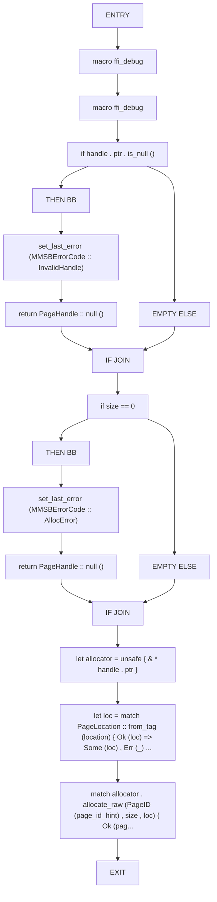

## Function: `mmsb_allocator_clear`

- File: MMSB/src/ffi.rs
- Branches: 1
- Loops: 0
- Nodes: 11
- Edges: 11

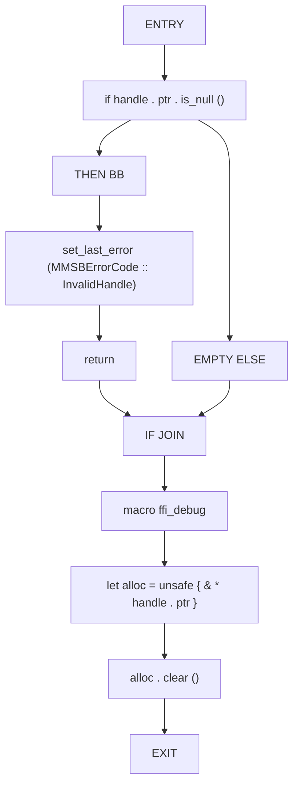

## Function: `mmsb_allocator_free`

- File: MMSB/src/ffi.rs
- Branches: 1
- Loops: 0
- Nodes: 8
- Edges: 8

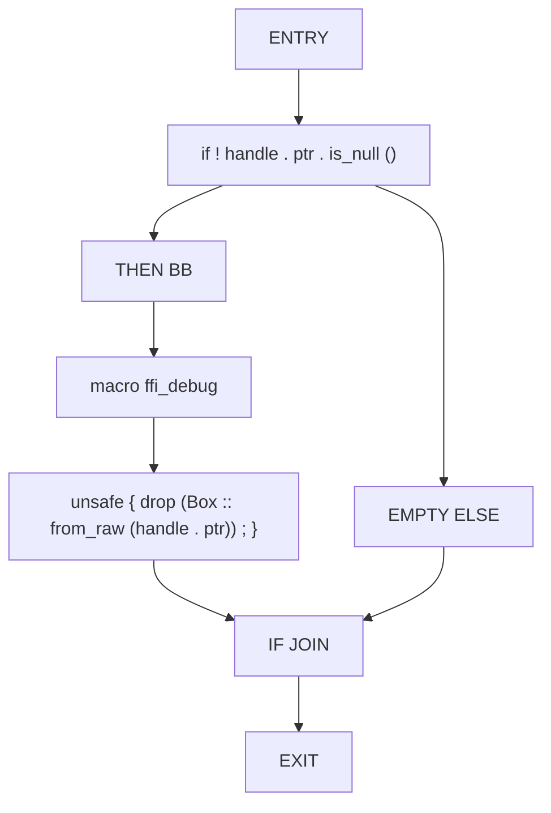

## Function: `mmsb_allocator_get_page`

- File: MMSB/src/ffi.rs
- Branches: 1
- Loops: 0
- Nodes: 10
- Edges: 10

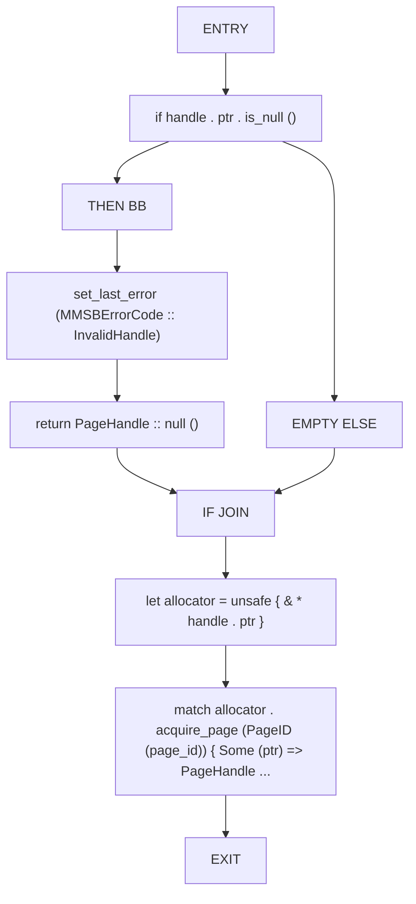

## Function: `mmsb_allocator_list_pages`

- File: MMSB/src/ffi.rs
- Branches: 1
- Loops: 0
- Nodes: 13
- Edges: 13

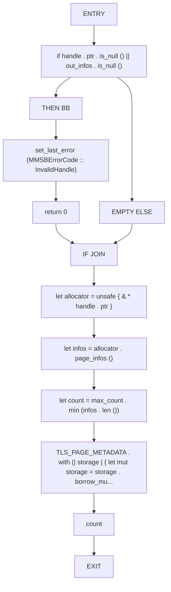

## Function: `mmsb_allocator_new`

- File: MMSB/src/ffi.rs
- Branches: 0
- Loops: 0
- Nodes: 10
- Edges: 9


## Function: `mmsb_allocator_page_count`

- File: MMSB/src/ffi.rs
- Branches: 1
- Loops: 0
- Nodes: 10
- Edges: 10

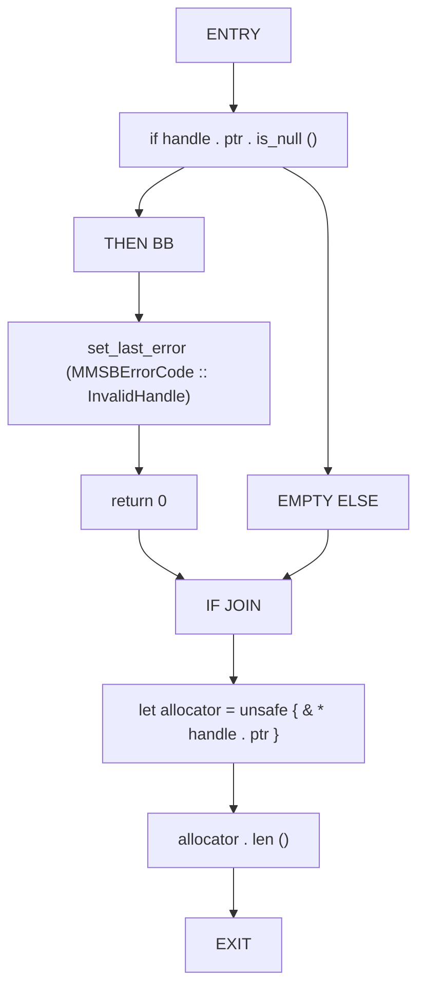

## Function: `mmsb_allocator_release`

- File: MMSB/src/ffi.rs
- Branches: 1
- Loops: 0
- Nodes: 10
- Edges: 10

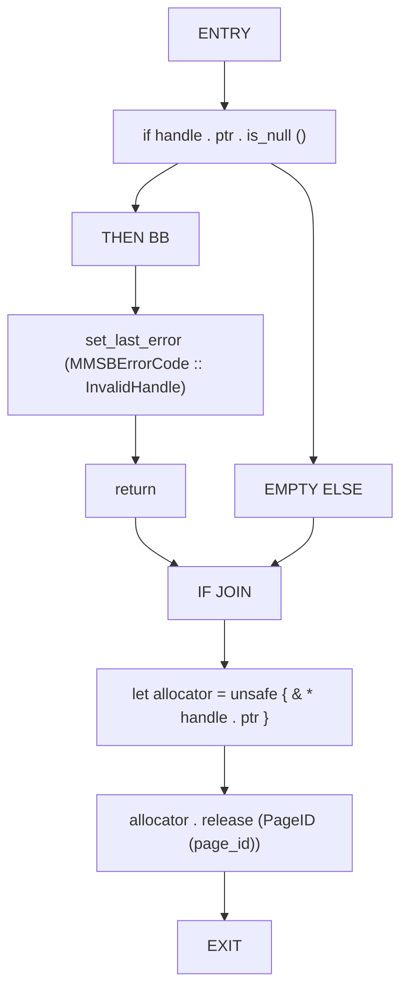

## Function: `mmsb_checkpoint_load`

- File: MMSB/src/ffi.rs
- Branches: 1
- Loops: 0
- Nodes: 19
- Edges: 19

```mermaid
flowchart TD
    mmsb_checkpoint_load_0["ENTRY"]
    mmsb_checkpoint_load_1["macro eprintln"]
    mmsb_checkpoint_load_2["macro eprintln"]
    mmsb_checkpoint_load_3["macro eprintln"]
    mmsb_checkpoint_load_4["let path_str_display = if path . is_null () { '<null>' } else { match unsafe { CStr :: from_ptr (pat..."]
    mmsb_checkpoint_load_5["macro eprintln"]
    mmsb_checkpoint_load_6["if allocator . ptr . is_null () || log . ptr . is_null () || path . is_null ()"]
    mmsb_checkpoint_load_7["THEN BB"]
    mmsb_checkpoint_load_8["macro eprintln"]
    mmsb_checkpoint_load_9["set_last_error (MMSBErrorCode :: InvalidHandle)"]
    mmsb_checkpoint_load_10["return - 1"]
    mmsb_checkpoint_load_11["EMPTY ELSE"]
    mmsb_checkpoint_load_12["IF JOIN"]
    mmsb_checkpoint_load_13["let allocator_ref = unsafe { & * allocator . ptr }"]
    mmsb_checkpoint_load_14["let log_ref = unsafe { & * log . ptr }"]
    mmsb_checkpoint_load_15["let path_str = match unsafe { CStr :: from_ptr (path) . to_str () } { Ok (s) => s . to_owned..."]
    mmsb_checkpoint_load_16["macro eprintln"]
    mmsb_checkpoint_load_17["match checkpoint :: load_checkpoint (allocator_ref , log_ref , path_str) { Ok..."]
    mmsb_checkpoint_load_18["EXIT"]
    mmsb_checkpoint_load_0 --> mmsb_checkpoint_load_1
    mmsb_checkpoint_load_1 --> mmsb_checkpoint_load_2
    mmsb_checkpoint_load_2 --> mmsb_checkpoint_load_3
    mmsb_checkpoint_load_3 --> mmsb_checkpoint_load_4
    mmsb_checkpoint_load_4 --> mmsb_checkpoint_load_5
    mmsb_checkpoint_load_5 --> mmsb_checkpoint_load_6
    mmsb_checkpoint_load_6 --> mmsb_checkpoint_load_7
    mmsb_checkpoint_load_7 --> mmsb_checkpoint_load_8
    mmsb_checkpoint_load_8 --> mmsb_checkpoint_load_9
    mmsb_checkpoint_load_9 --> mmsb_checkpoint_load_10
    mmsb_checkpoint_load_6 --> mmsb_checkpoint_load_11
    mmsb_checkpoint_load_10 --> mmsb_checkpoint_load_12
    mmsb_checkpoint_load_11 --> mmsb_checkpoint_load_12
    mmsb_checkpoint_load_12 --> mmsb_checkpoint_load_13
    mmsb_checkpoint_load_13 --> mmsb_checkpoint_load_14
    mmsb_checkpoint_load_14 --> mmsb_checkpoint_load_15
    mmsb_checkpoint_load_15 --> mmsb_checkpoint_load_16
    mmsb_checkpoint_load_16 --> mmsb_checkpoint_load_17
    mmsb_checkpoint_load_17 --> mmsb_checkpoint_load_18
```

## Function: `mmsb_checkpoint_write`

- File: MMSB/src/ffi.rs
- Branches: 1
- Loops: 0
- Nodes: 19
- Edges: 19

```mermaid
flowchart TD
    mmsb_checkpoint_write_0["ENTRY"]
    mmsb_checkpoint_write_1["macro eprintln"]
    mmsb_checkpoint_write_2["macro eprintln"]
    mmsb_checkpoint_write_3["macro eprintln"]
    mmsb_checkpoint_write_4["let path_str_display = if path . is_null () { '<null>' } else { match unsafe { CStr :: from_ptr (pat..."]
    mmsb_checkpoint_write_5["macro eprintln"]
    mmsb_checkpoint_write_6["if allocator . ptr . is_null () || log . ptr . is_null () || path . is_null ()"]
    mmsb_checkpoint_write_7["THEN BB"]
    mmsb_checkpoint_write_8["macro eprintln"]
    mmsb_checkpoint_write_9["set_last_error (MMSBErrorCode :: InvalidHandle)"]
    mmsb_checkpoint_write_10["return - 1"]
    mmsb_checkpoint_write_11["EMPTY ELSE"]
    mmsb_checkpoint_write_12["IF JOIN"]
    mmsb_checkpoint_write_13["let allocator_ref = unsafe { & * allocator . ptr }"]
    mmsb_checkpoint_write_14["let log_ref = unsafe { & * log . ptr }"]
    mmsb_checkpoint_write_15["let path_str = match unsafe { CStr :: from_ptr (path) . to_str () } { Ok (s) => s . to_owned..."]
    mmsb_checkpoint_write_16["macro eprintln"]
    mmsb_checkpoint_write_17["match checkpoint :: write_checkpoint (allocator_ref , log_ref , path_str) { O..."]
    mmsb_checkpoint_write_18["EXIT"]
    mmsb_checkpoint_write_0 --> mmsb_checkpoint_write_1
    mmsb_checkpoint_write_1 --> mmsb_checkpoint_write_2
    mmsb_checkpoint_write_2 --> mmsb_checkpoint_write_3
    mmsb_checkpoint_write_3 --> mmsb_checkpoint_write_4
    mmsb_checkpoint_write_4 --> mmsb_checkpoint_write_5
    mmsb_checkpoint_write_5 --> mmsb_checkpoint_write_6
    mmsb_checkpoint_write_6 --> mmsb_checkpoint_write_7
    mmsb_checkpoint_write_7 --> mmsb_checkpoint_write_8
    mmsb_checkpoint_write_8 --> mmsb_checkpoint_write_9
    mmsb_checkpoint_write_9 --> mmsb_checkpoint_write_10
    mmsb_checkpoint_write_6 --> mmsb_checkpoint_write_11
    mmsb_checkpoint_write_10 --> mmsb_checkpoint_write_12
    mmsb_checkpoint_write_11 --> mmsb_checkpoint_write_12
    mmsb_checkpoint_write_12 --> mmsb_checkpoint_write_13
    mmsb_checkpoint_write_13 --> mmsb_checkpoint_write_14
    mmsb_checkpoint_write_14 --> mmsb_checkpoint_write_15
    mmsb_checkpoint_write_15 --> mmsb_checkpoint_write_16
    mmsb_checkpoint_write_16 --> mmsb_checkpoint_write_17
    mmsb_checkpoint_write_17 --> mmsb_checkpoint_write_18
```

## Function: `mmsb_delta_apply`

- File: MMSB/src/ffi.rs
- Branches: 1
- Loops: 0
- Nodes: 11
- Edges: 11

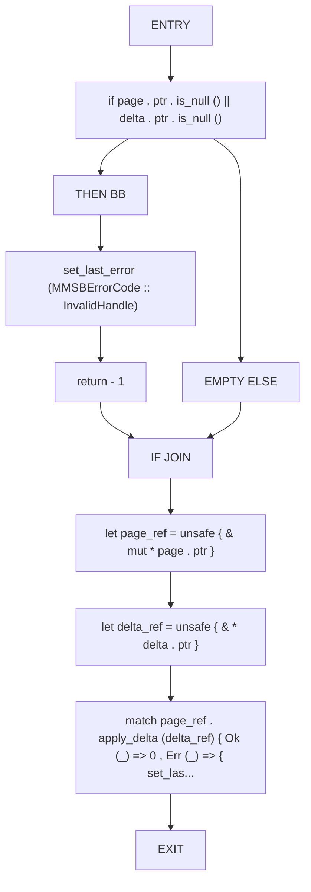

## Function: `mmsb_delta_copy_intent_metadata`

- File: MMSB/src/ffi.rs
- Branches: 1
- Loops: 0
- Nodes: 14
- Edges: 14

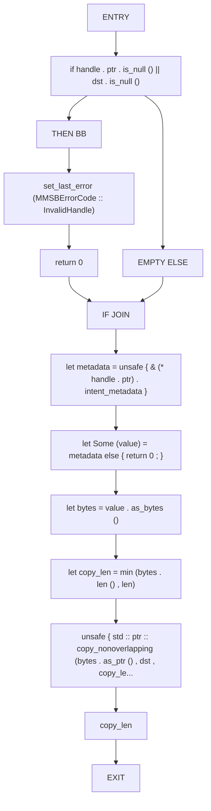

## Function: `mmsb_delta_copy_mask`

- File: MMSB/src/ffi.rs
- Branches: 1
- Loops: 0
- Nodes: 12
- Edges: 12

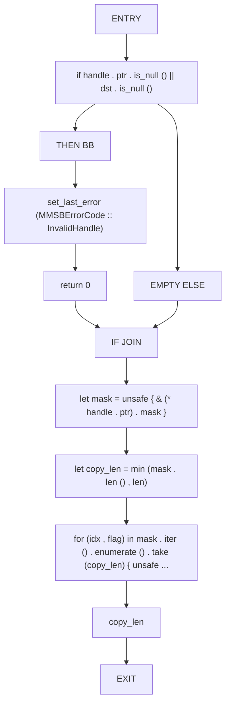

## Function: `mmsb_delta_copy_payload`

- File: MMSB/src/ffi.rs
- Branches: 1
- Loops: 0
- Nodes: 12
- Edges: 12

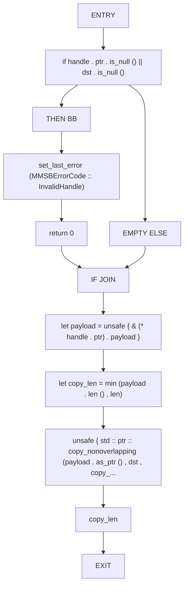

## Function: `mmsb_delta_copy_source`

- File: MMSB/src/ffi.rs
- Branches: 1
- Loops: 0
- Nodes: 13
- Edges: 13

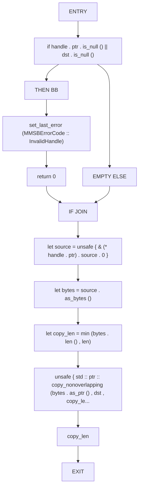

## Function: `mmsb_delta_epoch`

- File: MMSB/src/ffi.rs
- Branches: 1
- Loops: 0
- Nodes: 9
- Edges: 9

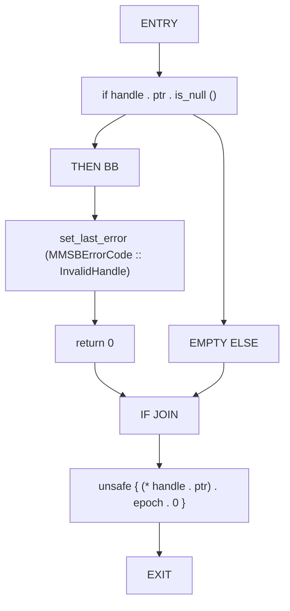

## Function: `mmsb_delta_free`

- File: MMSB/src/ffi.rs
- Branches: 1
- Loops: 0
- Nodes: 7
- Edges: 7

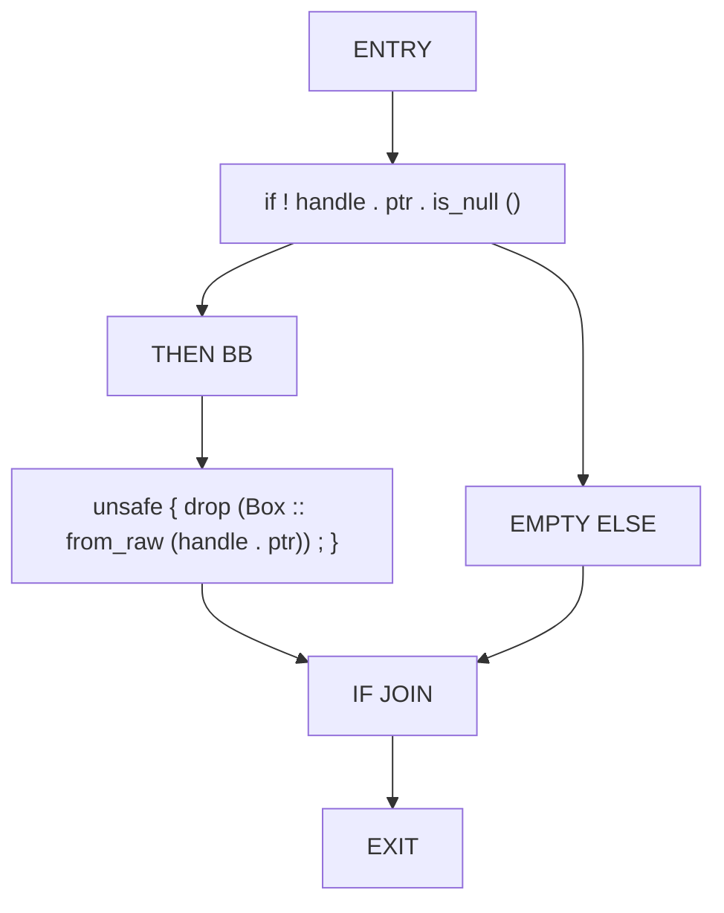

## Function: `mmsb_delta_id`

- File: MMSB/src/ffi.rs
- Branches: 1
- Loops: 0
- Nodes: 9
- Edges: 9

```mermaid
flowchart TD
    mmsb_delta_id_0["ENTRY"]
    mmsb_delta_id_1["if handle . ptr . is_null ()"]
    mmsb_delta_id_2["THEN BB"]
    mmsb_delta_id_3["set_last_error (MMSBErrorCode :: InvalidHandle)"]
    mmsb_delta_id_4["return 0"]
    mmsb_delta_id_5["EMPTY ELSE"]
    mmsb_delta_id_6["IF JOIN"]
    mmsb_delta_id_7["unsafe { (* handle . ptr) . delta_id . 0 }"]
    mmsb_delta_id_8["EXIT"]
    mmsb_delta_id_0 --> mmsb_delta_id_1
    mmsb_delta_id_1 --> mmsb_delta_id_2
    mmsb_delta_id_2 --> mmsb_delta_id_3
    mmsb_delta_id_3 --> mmsb_delta_id_4
    mmsb_delta_id_1 --> mmsb_delta_id_5
    mmsb_delta_id_4 --> mmsb_delta_id_6
    mmsb_delta_id_5 --> mmsb_delta_id_6
    mmsb_delta_id_6 --> mmsb_delta_id_7
    mmsb_delta_id_7 --> mmsb_delta_id_8
```

## Function: `mmsb_delta_intent_metadata_len`

- File: MMSB/src/ffi.rs
- Branches: 1
- Loops: 0
- Nodes: 9
- Edges: 9

```mermaid
flowchart TD
    mmsb_delta_intent_metadata_len_0["ENTRY"]
    mmsb_delta_intent_metadata_len_1["if handle . ptr . is_null ()"]
    mmsb_delta_intent_metadata_len_2["THEN BB"]
    mmsb_delta_intent_metadata_len_3["set_last_error (MMSBErrorCode :: InvalidHandle)"]
    mmsb_delta_intent_metadata_len_4["return 0"]
    mmsb_delta_intent_metadata_len_5["EMPTY ELSE"]
    mmsb_delta_intent_metadata_len_6["IF JOIN"]
    mmsb_delta_intent_metadata_len_7["unsafe { (* handle . ptr) . intent_metadata . as_ref () . map (| value | valu..."]
    mmsb_delta_intent_metadata_len_8["EXIT"]
    mmsb_delta_intent_metadata_len_0 --> mmsb_delta_intent_metadata_len_1
    mmsb_delta_intent_metadata_len_1 --> mmsb_delta_intent_metadata_len_2
    mmsb_delta_intent_metadata_len_2 --> mmsb_delta_intent_metadata_len_3
    mmsb_delta_intent_metadata_len_3 --> mmsb_delta_intent_metadata_len_4
    mmsb_delta_intent_metadata_len_1 --> mmsb_delta_intent_metadata_len_5
    mmsb_delta_intent_metadata_len_4 --> mmsb_delta_intent_metadata_len_6
    mmsb_delta_intent_metadata_len_5 --> mmsb_delta_intent_metadata_len_6
    mmsb_delta_intent_metadata_len_6 --> mmsb_delta_intent_metadata_len_7
    mmsb_delta_intent_metadata_len_7 --> mmsb_delta_intent_metadata_len_8
```

## Function: `mmsb_delta_is_sparse`

- File: MMSB/src/ffi.rs
- Branches: 1
- Loops: 0
- Nodes: 9
- Edges: 9

```mermaid
flowchart TD
    mmsb_delta_is_sparse_0["ENTRY"]
    mmsb_delta_is_sparse_1["if handle . ptr . is_null ()"]
    mmsb_delta_is_sparse_2["THEN BB"]
    mmsb_delta_is_sparse_3["set_last_error (MMSBErrorCode :: InvalidHandle)"]
    mmsb_delta_is_sparse_4["return 0"]
    mmsb_delta_is_sparse_5["EMPTY ELSE"]
    mmsb_delta_is_sparse_6["IF JOIN"]
    mmsb_delta_is_sparse_7["unsafe { (* handle . ptr) . is_sparse as u8 }"]
    mmsb_delta_is_sparse_8["EXIT"]
    mmsb_delta_is_sparse_0 --> mmsb_delta_is_sparse_1
    mmsb_delta_is_sparse_1 --> mmsb_delta_is_sparse_2
    mmsb_delta_is_sparse_2 --> mmsb_delta_is_sparse_3
    mmsb_delta_is_sparse_3 --> mmsb_delta_is_sparse_4
    mmsb_delta_is_sparse_1 --> mmsb_delta_is_sparse_5
    mmsb_delta_is_sparse_4 --> mmsb_delta_is_sparse_6
    mmsb_delta_is_sparse_5 --> mmsb_delta_is_sparse_6
    mmsb_delta_is_sparse_6 --> mmsb_delta_is_sparse_7
    mmsb_delta_is_sparse_7 --> mmsb_delta_is_sparse_8
```

## Function: `mmsb_delta_mask_len`

- File: MMSB/src/ffi.rs
- Branches: 1
- Loops: 0
- Nodes: 9
- Edges: 9

```mermaid
flowchart TD
    mmsb_delta_mask_len_0["ENTRY"]
    mmsb_delta_mask_len_1["if handle . ptr . is_null ()"]
    mmsb_delta_mask_len_2["THEN BB"]
    mmsb_delta_mask_len_3["set_last_error (MMSBErrorCode :: InvalidHandle)"]
    mmsb_delta_mask_len_4["return 0"]
    mmsb_delta_mask_len_5["EMPTY ELSE"]
    mmsb_delta_mask_len_6["IF JOIN"]
    mmsb_delta_mask_len_7["unsafe { (* handle . ptr) . mask . len () }"]
    mmsb_delta_mask_len_8["EXIT"]
    mmsb_delta_mask_len_0 --> mmsb_delta_mask_len_1
    mmsb_delta_mask_len_1 --> mmsb_delta_mask_len_2
    mmsb_delta_mask_len_2 --> mmsb_delta_mask_len_3
    mmsb_delta_mask_len_3 --> mmsb_delta_mask_len_4
    mmsb_delta_mask_len_1 --> mmsb_delta_mask_len_5
    mmsb_delta_mask_len_4 --> mmsb_delta_mask_len_6
    mmsb_delta_mask_len_5 --> mmsb_delta_mask_len_6
    mmsb_delta_mask_len_6 --> mmsb_delta_mask_len_7
    mmsb_delta_mask_len_7 --> mmsb_delta_mask_len_8
```

## Function: `mmsb_delta_new`

- File: MMSB/src/ffi.rs
- Branches: 0
- Loops: 0
- Nodes: 9
- Edges: 8

```mermaid
flowchart TD
    mmsb_delta_new_0["ENTRY"]
    mmsb_delta_new_1["let sparse = is_sparse != 0"]
    mmsb_delta_new_2["let mask = mask_from_bytes (mask_ptr , mask_len , payload_len , sparse)"]
    mmsb_delta_new_3["let payload = vec_from_ptr (payload_ptr , payload_len)"]
    mmsb_delta_new_4["let source = if source_ptr . is_null () { 'ffi_delta_new' . to_string () } else { unsafe {..."]
    mmsb_delta_new_5["let delta = Delta { delta_id : DeltaID (delta_id) , page_id : PageID (page_id) , epoch : ..."]
    mmsb_delta_new_6["let boxed = Box :: new (delta)"]
    mmsb_delta_new_7["DeltaHandle { ptr : Box :: into_raw (boxed) , }"]
    mmsb_delta_new_8["EXIT"]
    mmsb_delta_new_0 --> mmsb_delta_new_1
    mmsb_delta_new_1 --> mmsb_delta_new_2
    mmsb_delta_new_2 --> mmsb_delta_new_3
    mmsb_delta_new_3 --> mmsb_delta_new_4
    mmsb_delta_new_4 --> mmsb_delta_new_5
    mmsb_delta_new_5 --> mmsb_delta_new_6
    mmsb_delta_new_6 --> mmsb_delta_new_7
    mmsb_delta_new_7 --> mmsb_delta_new_8
```

## Function: `mmsb_delta_page_id`

- File: MMSB/src/ffi.rs
- Branches: 1
- Loops: 0
- Nodes: 9
- Edges: 9

```mermaid
flowchart TD
    mmsb_delta_page_id_0["ENTRY"]
    mmsb_delta_page_id_1["if handle . ptr . is_null ()"]
    mmsb_delta_page_id_2["THEN BB"]
    mmsb_delta_page_id_3["set_last_error (MMSBErrorCode :: InvalidHandle)"]
    mmsb_delta_page_id_4["return 0"]
    mmsb_delta_page_id_5["EMPTY ELSE"]
    mmsb_delta_page_id_6["IF JOIN"]
    mmsb_delta_page_id_7["unsafe { (* handle . ptr) . page_id . 0 }"]
    mmsb_delta_page_id_8["EXIT"]
    mmsb_delta_page_id_0 --> mmsb_delta_page_id_1
    mmsb_delta_page_id_1 --> mmsb_delta_page_id_2
    mmsb_delta_page_id_2 --> mmsb_delta_page_id_3
    mmsb_delta_page_id_3 --> mmsb_delta_page_id_4
    mmsb_delta_page_id_1 --> mmsb_delta_page_id_5
    mmsb_delta_page_id_4 --> mmsb_delta_page_id_6
    mmsb_delta_page_id_5 --> mmsb_delta_page_id_6
    mmsb_delta_page_id_6 --> mmsb_delta_page_id_7
    mmsb_delta_page_id_7 --> mmsb_delta_page_id_8
```

## Function: `mmsb_delta_payload_len`

- File: MMSB/src/ffi.rs
- Branches: 1
- Loops: 0
- Nodes: 9
- Edges: 9

```mermaid
flowchart TD
    mmsb_delta_payload_len_0["ENTRY"]
    mmsb_delta_payload_len_1["if handle . ptr . is_null ()"]
    mmsb_delta_payload_len_2["THEN BB"]
    mmsb_delta_payload_len_3["set_last_error (MMSBErrorCode :: InvalidHandle)"]
    mmsb_delta_payload_len_4["return 0"]
    mmsb_delta_payload_len_5["EMPTY ELSE"]
    mmsb_delta_payload_len_6["IF JOIN"]
    mmsb_delta_payload_len_7["unsafe { (* handle . ptr) . payload . len () }"]
    mmsb_delta_payload_len_8["EXIT"]
    mmsb_delta_payload_len_0 --> mmsb_delta_payload_len_1
    mmsb_delta_payload_len_1 --> mmsb_delta_payload_len_2
    mmsb_delta_payload_len_2 --> mmsb_delta_payload_len_3
    mmsb_delta_payload_len_3 --> mmsb_delta_payload_len_4
    mmsb_delta_payload_len_1 --> mmsb_delta_payload_len_5
    mmsb_delta_payload_len_4 --> mmsb_delta_payload_len_6
    mmsb_delta_payload_len_5 --> mmsb_delta_payload_len_6
    mmsb_delta_payload_len_6 --> mmsb_delta_payload_len_7
    mmsb_delta_payload_len_7 --> mmsb_delta_payload_len_8
```

## Function: `mmsb_delta_set_intent_metadata`

- File: MMSB/src/ffi.rs
- Branches: 2
- Loops: 0
- Nodes: 16
- Edges: 17

```mermaid
flowchart TD
    mmsb_delta_set_intent_metadata_0["ENTRY"]
    mmsb_delta_set_intent_metadata_1["if handle . ptr . is_null ()"]
    mmsb_delta_set_intent_metadata_2["THEN BB"]
    mmsb_delta_set_intent_metadata_3["set_last_error (MMSBErrorCode :: InvalidHandle)"]
    mmsb_delta_set_intent_metadata_4["return - 1"]
    mmsb_delta_set_intent_metadata_5["EMPTY ELSE"]
    mmsb_delta_set_intent_metadata_6["IF JOIN"]
    mmsb_delta_set_intent_metadata_7["if metadata_ptr . is_null () || metadata_len == 0"]
    mmsb_delta_set_intent_metadata_8["THEN BB"]
    mmsb_delta_set_intent_metadata_9["unsafe { (* handle . ptr) . intent_metadata = None ; }"]
    mmsb_delta_set_intent_metadata_10["return 0"]
    mmsb_delta_set_intent_metadata_11["EMPTY ELSE"]
    mmsb_delta_set_intent_metadata_12["IF JOIN"]
    mmsb_delta_set_intent_metadata_13["let bytes = unsafe { std :: slice :: from_raw_parts (metadata_ptr , metadata_len) }"]
    mmsb_delta_set_intent_metadata_14["match std :: str :: from_utf8 (bytes) { Ok (value) => { unsafe { (* handle . ..."]
    mmsb_delta_set_intent_metadata_15["EXIT"]
    mmsb_delta_set_intent_metadata_0 --> mmsb_delta_set_intent_metadata_1
    mmsb_delta_set_intent_metadata_1 --> mmsb_delta_set_intent_metadata_2
    mmsb_delta_set_intent_metadata_2 --> mmsb_delta_set_intent_metadata_3
    mmsb_delta_set_intent_metadata_3 --> mmsb_delta_set_intent_metadata_4
    mmsb_delta_set_intent_metadata_1 --> mmsb_delta_set_intent_metadata_5
    mmsb_delta_set_intent_metadata_4 --> mmsb_delta_set_intent_metadata_6
    mmsb_delta_set_intent_metadata_5 --> mmsb_delta_set_intent_metadata_6
    mmsb_delta_set_intent_metadata_6 --> mmsb_delta_set_intent_metadata_7
    mmsb_delta_set_intent_metadata_7 --> mmsb_delta_set_intent_metadata_8
    mmsb_delta_set_intent_metadata_8 --> mmsb_delta_set_intent_metadata_9
    mmsb_delta_set_intent_metadata_9 --> mmsb_delta_set_intent_metadata_10
    mmsb_delta_set_intent_metadata_7 --> mmsb_delta_set_intent_metadata_11
    mmsb_delta_set_intent_metadata_10 --> mmsb_delta_set_intent_metadata_12
    mmsb_delta_set_intent_metadata_11 --> mmsb_delta_set_intent_metadata_12
    mmsb_delta_set_intent_metadata_12 --> mmsb_delta_set_intent_metadata_13
    mmsb_delta_set_intent_metadata_13 --> mmsb_delta_set_intent_metadata_14
    mmsb_delta_set_intent_metadata_14 --> mmsb_delta_set_intent_metadata_15
```

## Function: `mmsb_delta_source_len`

- File: MMSB/src/ffi.rs
- Branches: 1
- Loops: 0
- Nodes: 9
- Edges: 9

```mermaid
flowchart TD
    mmsb_delta_source_len_0["ENTRY"]
    mmsb_delta_source_len_1["if handle . ptr . is_null ()"]
    mmsb_delta_source_len_2["THEN BB"]
    mmsb_delta_source_len_3["set_last_error (MMSBErrorCode :: InvalidHandle)"]
    mmsb_delta_source_len_4["return 0"]
    mmsb_delta_source_len_5["EMPTY ELSE"]
    mmsb_delta_source_len_6["IF JOIN"]
    mmsb_delta_source_len_7["unsafe { (& (* handle . ptr) . source . 0) . len () }"]
    mmsb_delta_source_len_8["EXIT"]
    mmsb_delta_source_len_0 --> mmsb_delta_source_len_1
    mmsb_delta_source_len_1 --> mmsb_delta_source_len_2
    mmsb_delta_source_len_2 --> mmsb_delta_source_len_3
    mmsb_delta_source_len_3 --> mmsb_delta_source_len_4
    mmsb_delta_source_len_1 --> mmsb_delta_source_len_5
    mmsb_delta_source_len_4 --> mmsb_delta_source_len_6
    mmsb_delta_source_len_5 --> mmsb_delta_source_len_6
    mmsb_delta_source_len_6 --> mmsb_delta_source_len_7
    mmsb_delta_source_len_7 --> mmsb_delta_source_len_8
```

## Function: `mmsb_delta_timestamp`

- File: MMSB/src/ffi.rs
- Branches: 1
- Loops: 0
- Nodes: 9
- Edges: 9

```mermaid
flowchart TD
    mmsb_delta_timestamp_0["ENTRY"]
    mmsb_delta_timestamp_1["if handle . ptr . is_null ()"]
    mmsb_delta_timestamp_2["THEN BB"]
    mmsb_delta_timestamp_3["set_last_error (MMSBErrorCode :: InvalidHandle)"]
    mmsb_delta_timestamp_4["return 0"]
    mmsb_delta_timestamp_5["EMPTY ELSE"]
    mmsb_delta_timestamp_6["IF JOIN"]
    mmsb_delta_timestamp_7["unsafe { (* handle . ptr) . timestamp }"]
    mmsb_delta_timestamp_8["EXIT"]
    mmsb_delta_timestamp_0 --> mmsb_delta_timestamp_1
    mmsb_delta_timestamp_1 --> mmsb_delta_timestamp_2
    mmsb_delta_timestamp_2 --> mmsb_delta_timestamp_3
    mmsb_delta_timestamp_3 --> mmsb_delta_timestamp_4
    mmsb_delta_timestamp_1 --> mmsb_delta_timestamp_5
    mmsb_delta_timestamp_4 --> mmsb_delta_timestamp_6
    mmsb_delta_timestamp_5 --> mmsb_delta_timestamp_6
    mmsb_delta_timestamp_6 --> mmsb_delta_timestamp_7
    mmsb_delta_timestamp_7 --> mmsb_delta_timestamp_8
```

## Function: `mmsb_error_is_fatal`

- File: MMSB/src/ffi.rs
- Branches: 0
- Loops: 0
- Nodes: 3
- Edges: 2

```mermaid
flowchart TD
    mmsb_error_is_fatal_0["ENTRY"]
    mmsb_error_is_fatal_1["code . is_fatal ()"]
    mmsb_error_is_fatal_2["EXIT"]
    mmsb_error_is_fatal_0 --> mmsb_error_is_fatal_1
    mmsb_error_is_fatal_1 --> mmsb_error_is_fatal_2
```

## Function: `mmsb_error_is_retryable`

- File: MMSB/src/ffi.rs
- Branches: 0
- Loops: 0
- Nodes: 3
- Edges: 2

```mermaid
flowchart TD
    mmsb_error_is_retryable_0["ENTRY"]
    mmsb_error_is_retryable_1["code . is_retryable ()"]
    mmsb_error_is_retryable_2["EXIT"]
    mmsb_error_is_retryable_0 --> mmsb_error_is_retryable_1
    mmsb_error_is_retryable_1 --> mmsb_error_is_retryable_2
```

## Function: `mmsb_get_last_error`

- File: MMSB/src/ffi.rs
- Branches: 0
- Loops: 0
- Nodes: 3
- Edges: 2

```mermaid
flowchart TD
    mmsb_get_last_error_0["ENTRY"]
    mmsb_get_last_error_1["TLS_LAST_ERROR . with (| cell | { let mut guard = cell . borrow_mut () ; let ..."]
    mmsb_get_last_error_2["EXIT"]
    mmsb_get_last_error_0 --> mmsb_get_last_error_1
    mmsb_get_last_error_1 --> mmsb_get_last_error_2
```

## Function: `mmsb_page_epoch`

- File: MMSB/src/ffi.rs
- Branches: 1
- Loops: 0
- Nodes: 10
- Edges: 10

```mermaid
flowchart TD
    mmsb_page_epoch_0["ENTRY"]
    mmsb_page_epoch_1["if handle . ptr . is_null ()"]
    mmsb_page_epoch_2["THEN BB"]
    mmsb_page_epoch_3["set_last_error (MMSBErrorCode :: InvalidHandle)"]
    mmsb_page_epoch_4["return 0"]
    mmsb_page_epoch_5["EMPTY ELSE"]
    mmsb_page_epoch_6["IF JOIN"]
    mmsb_page_epoch_7["let page = unsafe { & * handle . ptr }"]
    mmsb_page_epoch_8["page . epoch () . 0"]
    mmsb_page_epoch_9["EXIT"]
    mmsb_page_epoch_0 --> mmsb_page_epoch_1
    mmsb_page_epoch_1 --> mmsb_page_epoch_2
    mmsb_page_epoch_2 --> mmsb_page_epoch_3
    mmsb_page_epoch_3 --> mmsb_page_epoch_4
    mmsb_page_epoch_1 --> mmsb_page_epoch_5
    mmsb_page_epoch_4 --> mmsb_page_epoch_6
    mmsb_page_epoch_5 --> mmsb_page_epoch_6
    mmsb_page_epoch_6 --> mmsb_page_epoch_7
    mmsb_page_epoch_7 --> mmsb_page_epoch_8
    mmsb_page_epoch_8 --> mmsb_page_epoch_9
```

## Function: `mmsb_page_metadata_export`

- File: MMSB/src/ffi.rs
- Branches: 1
- Loops: 0
- Nodes: 13
- Edges: 13

```mermaid
flowchart TD
    mmsb_page_metadata_export_0["ENTRY"]
    mmsb_page_metadata_export_1["if handle . ptr . is_null () || dst . is_null ()"]
    mmsb_page_metadata_export_2["THEN BB"]
    mmsb_page_metadata_export_3["set_last_error (MMSBErrorCode :: InvalidHandle)"]
    mmsb_page_metadata_export_4["return 0"]
    mmsb_page_metadata_export_5["EMPTY ELSE"]
    mmsb_page_metadata_export_6["IF JOIN"]
    mmsb_page_metadata_export_7["let page = unsafe { & * handle . ptr }"]
    mmsb_page_metadata_export_8["let blob = page . metadata_blob ()"]
    mmsb_page_metadata_export_9["let copy_len = len . min (blob . len ())"]
    mmsb_page_metadata_export_10["unsafe { std :: ptr :: copy_nonoverlapping (blob . as_ptr () , dst , copy_len..."]
    mmsb_page_metadata_export_11["copy_len"]
    mmsb_page_metadata_export_12["EXIT"]
    mmsb_page_metadata_export_0 --> mmsb_page_metadata_export_1
    mmsb_page_metadata_export_1 --> mmsb_page_metadata_export_2
    mmsb_page_metadata_export_2 --> mmsb_page_metadata_export_3
    mmsb_page_metadata_export_3 --> mmsb_page_metadata_export_4
    mmsb_page_metadata_export_1 --> mmsb_page_metadata_export_5
    mmsb_page_metadata_export_4 --> mmsb_page_metadata_export_6
    mmsb_page_metadata_export_5 --> mmsb_page_metadata_export_6
    mmsb_page_metadata_export_6 --> mmsb_page_metadata_export_7
    mmsb_page_metadata_export_7 --> mmsb_page_metadata_export_8
    mmsb_page_metadata_export_8 --> mmsb_page_metadata_export_9
    mmsb_page_metadata_export_9 --> mmsb_page_metadata_export_10
    mmsb_page_metadata_export_10 --> mmsb_page_metadata_export_11
    mmsb_page_metadata_export_11 --> mmsb_page_metadata_export_12
```

## Function: `mmsb_page_metadata_import`

- File: MMSB/src/ffi.rs
- Branches: 1
- Loops: 0
- Nodes: 11
- Edges: 11

```mermaid
flowchart TD
    mmsb_page_metadata_import_0["ENTRY"]
    mmsb_page_metadata_import_1["if handle . ptr . is_null () || src . is_null ()"]
    mmsb_page_metadata_import_2["THEN BB"]
    mmsb_page_metadata_import_3["set_last_error (MMSBErrorCode :: InvalidHandle)"]
    mmsb_page_metadata_import_4["return - 1"]
    mmsb_page_metadata_import_5["EMPTY ELSE"]
    mmsb_page_metadata_import_6["IF JOIN"]
    mmsb_page_metadata_import_7["let page = unsafe { & mut * handle . ptr }"]
    mmsb_page_metadata_import_8["let blob = unsafe { std :: slice :: from_raw_parts (src , len) }"]
    mmsb_page_metadata_import_9["match page . set_metadata_blob (blob) { Ok (_) => 0 , Err (_) => { set_last_e..."]
    mmsb_page_metadata_import_10["EXIT"]
    mmsb_page_metadata_import_0 --> mmsb_page_metadata_import_1
    mmsb_page_metadata_import_1 --> mmsb_page_metadata_import_2
    mmsb_page_metadata_import_2 --> mmsb_page_metadata_import_3
    mmsb_page_metadata_import_3 --> mmsb_page_metadata_import_4
    mmsb_page_metadata_import_1 --> mmsb_page_metadata_import_5
    mmsb_page_metadata_import_4 --> mmsb_page_metadata_import_6
    mmsb_page_metadata_import_5 --> mmsb_page_metadata_import_6
    mmsb_page_metadata_import_6 --> mmsb_page_metadata_import_7
    mmsb_page_metadata_import_7 --> mmsb_page_metadata_import_8
    mmsb_page_metadata_import_8 --> mmsb_page_metadata_import_9
    mmsb_page_metadata_import_9 --> mmsb_page_metadata_import_10
```

## Function: `mmsb_page_metadata_size`

- File: MMSB/src/ffi.rs
- Branches: 1
- Loops: 0
- Nodes: 10
- Edges: 10

```mermaid
flowchart TD
    mmsb_page_metadata_size_0["ENTRY"]
    mmsb_page_metadata_size_1["if handle . ptr . is_null ()"]
    mmsb_page_metadata_size_2["THEN BB"]
    mmsb_page_metadata_size_3["set_last_error (MMSBErrorCode :: InvalidHandle)"]
    mmsb_page_metadata_size_4["return 0"]
    mmsb_page_metadata_size_5["EMPTY ELSE"]
    mmsb_page_metadata_size_6["IF JOIN"]
    mmsb_page_metadata_size_7["let page = unsafe { & * handle . ptr }"]
    mmsb_page_metadata_size_8["page . metadata_blob () . len ()"]
    mmsb_page_metadata_size_9["EXIT"]
    mmsb_page_metadata_size_0 --> mmsb_page_metadata_size_1
    mmsb_page_metadata_size_1 --> mmsb_page_metadata_size_2
    mmsb_page_metadata_size_2 --> mmsb_page_metadata_size_3
    mmsb_page_metadata_size_3 --> mmsb_page_metadata_size_4
    mmsb_page_metadata_size_1 --> mmsb_page_metadata_size_5
    mmsb_page_metadata_size_4 --> mmsb_page_metadata_size_6
    mmsb_page_metadata_size_5 --> mmsb_page_metadata_size_6
    mmsb_page_metadata_size_6 --> mmsb_page_metadata_size_7
    mmsb_page_metadata_size_7 --> mmsb_page_metadata_size_8
    mmsb_page_metadata_size_8 --> mmsb_page_metadata_size_9
```

## Function: `mmsb_page_read`

- File: MMSB/src/ffi.rs
- Branches: 3
- Loops: 0
- Nodes: 36
- Edges: 38

```mermaid
flowchart TD
    mmsb_page_read_0["ENTRY"]
    mmsb_page_read_1["macro ffi_debug"]
    mmsb_page_read_2["macro ffi_debug"]
    mmsb_page_read_3["macro ffi_debug"]
    mmsb_page_read_4["macro ffi_debug"]
    mmsb_page_read_5["if handle . ptr . is_null ()"]
    mmsb_page_read_6["THEN BB"]
    mmsb_page_read_7["macro ffi_debug"]
    mmsb_page_read_8["set_last_error (MMSBErrorCode :: InvalidHandle)"]
    mmsb_page_read_9["return 0"]
    mmsb_page_read_10["EMPTY ELSE"]
    mmsb_page_read_11["IF JOIN"]
    mmsb_page_read_12["if len == 0"]
    mmsb_page_read_13["THEN BB"]
    mmsb_page_read_14["let page = unsafe { & * handle . ptr }"]
    mmsb_page_read_15["let size = page . size ()"]
    mmsb_page_read_16["macro ffi_debug"]
    mmsb_page_read_17["return size"]
    mmsb_page_read_18["EMPTY ELSE"]
    mmsb_page_read_19["IF JOIN"]
    mmsb_page_read_20["if dst . is_null ()"]
    mmsb_page_read_21["THEN BB"]
    mmsb_page_read_22["macro ffi_debug"]
    mmsb_page_read_23["set_last_error (MMSBErrorCode :: InvalidHandle)"]
    mmsb_page_read_24["return 0"]
    mmsb_page_read_25["EMPTY ELSE"]
    mmsb_page_read_26["IF JOIN"]
    mmsb_page_read_27["let page = unsafe { & * handle . ptr }"]
    mmsb_page_read_28["let page_size = page . size ()"]
    mmsb_page_read_29["let bytes_to_copy = len . min (page_size)"]
    mmsb_page_read_30["macro ffi_debug"]
    mmsb_page_read_31["let src_slice = page . data_slice ()"]
    mmsb_page_read_32["unsafe { std :: ptr :: copy_nonoverlapping (src_slice . as_ptr () , dst , byt..."]
    mmsb_page_read_33["macro ffi_debug"]
    mmsb_page_read_34["bytes_to_copy"]
    mmsb_page_read_35["EXIT"]
    mmsb_page_read_0 --> mmsb_page_read_1
    mmsb_page_read_1 --> mmsb_page_read_2
    mmsb_page_read_2 --> mmsb_page_read_3
    mmsb_page_read_3 --> mmsb_page_read_4
    mmsb_page_read_4 --> mmsb_page_read_5
    mmsb_page_read_5 --> mmsb_page_read_6
    mmsb_page_read_6 --> mmsb_page_read_7
    mmsb_page_read_7 --> mmsb_page_read_8
    mmsb_page_read_8 --> mmsb_page_read_9
    mmsb_page_read_5 --> mmsb_page_read_10
    mmsb_page_read_9 --> mmsb_page_read_11
    mmsb_page_read_10 --> mmsb_page_read_11
    mmsb_page_read_11 --> mmsb_page_read_12
    mmsb_page_read_12 --> mmsb_page_read_13
    mmsb_page_read_13 --> mmsb_page_read_14
    mmsb_page_read_14 --> mmsb_page_read_15
    mmsb_page_read_15 --> mmsb_page_read_16
    mmsb_page_read_16 --> mmsb_page_read_17
    mmsb_page_read_12 --> mmsb_page_read_18
    mmsb_page_read_17 --> mmsb_page_read_19
    mmsb_page_read_18 --> mmsb_page_read_19
    mmsb_page_read_19 --> mmsb_page_read_20
    mmsb_page_read_20 --> mmsb_page_read_21
    mmsb_page_read_21 --> mmsb_page_read_22
    mmsb_page_read_22 --> mmsb_page_read_23
    mmsb_page_read_23 --> mmsb_page_read_24
    mmsb_page_read_20 --> mmsb_page_read_25
    mmsb_page_read_24 --> mmsb_page_read_26
    mmsb_page_read_25 --> mmsb_page_read_26
    mmsb_page_read_26 --> mmsb_page_read_27
    mmsb_page_read_27 --> mmsb_page_read_28
    mmsb_page_read_28 --> mmsb_page_read_29
    mmsb_page_read_29 --> mmsb_page_read_30
    mmsb_page_read_30 --> mmsb_page_read_31
    mmsb_page_read_31 --> mmsb_page_read_32
    mmsb_page_read_32 --> mmsb_page_read_33
    mmsb_page_read_33 --> mmsb_page_read_34
    mmsb_page_read_34 --> mmsb_page_read_35
```

## Function: `mmsb_page_write_masked`

- File: MMSB/src/ffi.rs
- Branches: 1
- Loops: 0
- Nodes: 14
- Edges: 14

```mermaid
flowchart TD
    mmsb_page_write_masked_0["ENTRY"]
    mmsb_page_write_masked_1["if handle . ptr . is_null ()"]
    mmsb_page_write_masked_2["THEN BB"]
    mmsb_page_write_masked_3["set_last_error (MMSBErrorCode :: InvalidHandle)"]
    mmsb_page_write_masked_4["return - 1"]
    mmsb_page_write_masked_5["EMPTY ELSE"]
    mmsb_page_write_masked_6["IF JOIN"]
    mmsb_page_write_masked_7["let sparse = is_sparse != 0"]
    mmsb_page_write_masked_8["let mask = mask_from_bytes (mask_ptr , mask_len , payload_len , sparse)"]
    mmsb_page_write_masked_9["let payload = vec_from_ptr (payload_ptr , payload_len)"]
    mmsb_page_write_masked_10["let delta = Delta { delta_id : DeltaID (0) , page_id : unsafe { (* handle . ptr) . id } ,..."]
    mmsb_page_write_masked_11["let page = unsafe { & mut * handle . ptr }"]
    mmsb_page_write_masked_12["match page . apply_delta (& delta) { Ok (_) => 0 , Err (_) => { set_last_erro..."]
    mmsb_page_write_masked_13["EXIT"]
    mmsb_page_write_masked_0 --> mmsb_page_write_masked_1
    mmsb_page_write_masked_1 --> mmsb_page_write_masked_2
    mmsb_page_write_masked_2 --> mmsb_page_write_masked_3
    mmsb_page_write_masked_3 --> mmsb_page_write_masked_4
    mmsb_page_write_masked_1 --> mmsb_page_write_masked_5
    mmsb_page_write_masked_4 --> mmsb_page_write_masked_6
    mmsb_page_write_masked_5 --> mmsb_page_write_masked_6
    mmsb_page_write_masked_6 --> mmsb_page_write_masked_7
    mmsb_page_write_masked_7 --> mmsb_page_write_masked_8
    mmsb_page_write_masked_8 --> mmsb_page_write_masked_9
    mmsb_page_write_masked_9 --> mmsb_page_write_masked_10
    mmsb_page_write_masked_10 --> mmsb_page_write_masked_11
    mmsb_page_write_masked_11 --> mmsb_page_write_masked_12
    mmsb_page_write_masked_12 --> mmsb_page_write_masked_13
```

## Function: `mmsb_semiring_boolean_accumulate`

- File: MMSB/src/ffi.rs
- Branches: 0
- Loops: 0
- Nodes: 5
- Edges: 4

```mermaid
flowchart TD
    mmsb_semiring_boolean_accumulate_0["ENTRY"]
    mmsb_semiring_boolean_accumulate_1["let semiring = BooleanSemiring"]
    mmsb_semiring_boolean_accumulate_2["let (add , mul) = accumulate (& semiring , & (left != 0) , & (right != 0))"]
    mmsb_semiring_boolean_accumulate_3["SemiringPairBool { add : add as u8 , mul : mul as u8 , }"]
    mmsb_semiring_boolean_accumulate_4["EXIT"]
    mmsb_semiring_boolean_accumulate_0 --> mmsb_semiring_boolean_accumulate_1
    mmsb_semiring_boolean_accumulate_1 --> mmsb_semiring_boolean_accumulate_2
    mmsb_semiring_boolean_accumulate_2 --> mmsb_semiring_boolean_accumulate_3
    mmsb_semiring_boolean_accumulate_3 --> mmsb_semiring_boolean_accumulate_4
```

## Function: `mmsb_semiring_boolean_fold_add`

- File: MMSB/src/ffi.rs
- Branches: 1
- Loops: 0
- Nodes: 12
- Edges: 12

```mermaid
flowchart TD
    mmsb_semiring_boolean_fold_add_0["ENTRY"]
    mmsb_semiring_boolean_fold_add_1["let semiring = BooleanSemiring"]
    mmsb_semiring_boolean_fold_add_2["if len == 0"]
    mmsb_semiring_boolean_fold_add_3["THEN BB"]
    mmsb_semiring_boolean_fold_add_4["return semiring . zero () as u8"]
    mmsb_semiring_boolean_fold_add_5["EMPTY ELSE"]
    mmsb_semiring_boolean_fold_add_6["IF JOIN"]
    mmsb_semiring_boolean_fold_add_7["let slice = slice_from_ptr (values , len)"]
    mmsb_semiring_boolean_fold_add_8["let iter = slice . iter () . map (| v | * v != 0)"]
    mmsb_semiring_boolean_fold_add_9["let result = fold_add (& semiring , iter)"]
    mmsb_semiring_boolean_fold_add_10["result as u8"]
    mmsb_semiring_boolean_fold_add_11["EXIT"]
    mmsb_semiring_boolean_fold_add_0 --> mmsb_semiring_boolean_fold_add_1
    mmsb_semiring_boolean_fold_add_1 --> mmsb_semiring_boolean_fold_add_2
    mmsb_semiring_boolean_fold_add_2 --> mmsb_semiring_boolean_fold_add_3
    mmsb_semiring_boolean_fold_add_3 --> mmsb_semiring_boolean_fold_add_4
    mmsb_semiring_boolean_fold_add_2 --> mmsb_semiring_boolean_fold_add_5
    mmsb_semiring_boolean_fold_add_4 --> mmsb_semiring_boolean_fold_add_6
    mmsb_semiring_boolean_fold_add_5 --> mmsb_semiring_boolean_fold_add_6
    mmsb_semiring_boolean_fold_add_6 --> mmsb_semiring_boolean_fold_add_7
    mmsb_semiring_boolean_fold_add_7 --> mmsb_semiring_boolean_fold_add_8
    mmsb_semiring_boolean_fold_add_8 --> mmsb_semiring_boolean_fold_add_9
    mmsb_semiring_boolean_fold_add_9 --> mmsb_semiring_boolean_fold_add_10
    mmsb_semiring_boolean_fold_add_10 --> mmsb_semiring_boolean_fold_add_11
```

## Function: `mmsb_semiring_boolean_fold_mul`

- File: MMSB/src/ffi.rs
- Branches: 1
- Loops: 0
- Nodes: 12
- Edges: 12

```mermaid
flowchart TD
    mmsb_semiring_boolean_fold_mul_0["ENTRY"]
    mmsb_semiring_boolean_fold_mul_1["let semiring = BooleanSemiring"]
    mmsb_semiring_boolean_fold_mul_2["if len == 0"]
    mmsb_semiring_boolean_fold_mul_3["THEN BB"]
    mmsb_semiring_boolean_fold_mul_4["return semiring . one () as u8"]
    mmsb_semiring_boolean_fold_mul_5["EMPTY ELSE"]
    mmsb_semiring_boolean_fold_mul_6["IF JOIN"]
    mmsb_semiring_boolean_fold_mul_7["let slice = slice_from_ptr (values , len)"]
    mmsb_semiring_boolean_fold_mul_8["let iter = slice . iter () . map (| v | * v != 0)"]
    mmsb_semiring_boolean_fold_mul_9["let result = fold_mul (& semiring , iter)"]
    mmsb_semiring_boolean_fold_mul_10["result as u8"]
    mmsb_semiring_boolean_fold_mul_11["EXIT"]
    mmsb_semiring_boolean_fold_mul_0 --> mmsb_semiring_boolean_fold_mul_1
    mmsb_semiring_boolean_fold_mul_1 --> mmsb_semiring_boolean_fold_mul_2
    mmsb_semiring_boolean_fold_mul_2 --> mmsb_semiring_boolean_fold_mul_3
    mmsb_semiring_boolean_fold_mul_3 --> mmsb_semiring_boolean_fold_mul_4
    mmsb_semiring_boolean_fold_mul_2 --> mmsb_semiring_boolean_fold_mul_5
    mmsb_semiring_boolean_fold_mul_4 --> mmsb_semiring_boolean_fold_mul_6
    mmsb_semiring_boolean_fold_mul_5 --> mmsb_semiring_boolean_fold_mul_6
    mmsb_semiring_boolean_fold_mul_6 --> mmsb_semiring_boolean_fold_mul_7
    mmsb_semiring_boolean_fold_mul_7 --> mmsb_semiring_boolean_fold_mul_8
    mmsb_semiring_boolean_fold_mul_8 --> mmsb_semiring_boolean_fold_mul_9
    mmsb_semiring_boolean_fold_mul_9 --> mmsb_semiring_boolean_fold_mul_10
    mmsb_semiring_boolean_fold_mul_10 --> mmsb_semiring_boolean_fold_mul_11
```

## Function: `mmsb_semiring_tropical_accumulate`

- File: MMSB/src/ffi.rs
- Branches: 0
- Loops: 0
- Nodes: 5
- Edges: 4

```mermaid
flowchart TD
    mmsb_semiring_tropical_accumulate_0["ENTRY"]
    mmsb_semiring_tropical_accumulate_1["let semiring = TropicalSemiring"]
    mmsb_semiring_tropical_accumulate_2["let (add , mul) = accumulate (& semiring , & left , & right)"]
    mmsb_semiring_tropical_accumulate_3["SemiringPairF64 { add , mul }"]
    mmsb_semiring_tropical_accumulate_4["EXIT"]
    mmsb_semiring_tropical_accumulate_0 --> mmsb_semiring_tropical_accumulate_1
    mmsb_semiring_tropical_accumulate_1 --> mmsb_semiring_tropical_accumulate_2
    mmsb_semiring_tropical_accumulate_2 --> mmsb_semiring_tropical_accumulate_3
    mmsb_semiring_tropical_accumulate_3 --> mmsb_semiring_tropical_accumulate_4
```

## Function: `mmsb_semiring_tropical_fold_add`

- File: MMSB/src/ffi.rs
- Branches: 1
- Loops: 0
- Nodes: 10
- Edges: 10

```mermaid
flowchart TD
    mmsb_semiring_tropical_fold_add_0["ENTRY"]
    mmsb_semiring_tropical_fold_add_1["let semiring = TropicalSemiring"]
    mmsb_semiring_tropical_fold_add_2["if len == 0"]
    mmsb_semiring_tropical_fold_add_3["THEN BB"]
    mmsb_semiring_tropical_fold_add_4["return semiring . zero ()"]
    mmsb_semiring_tropical_fold_add_5["EMPTY ELSE"]
    mmsb_semiring_tropical_fold_add_6["IF JOIN"]
    mmsb_semiring_tropical_fold_add_7["let slice = slice_from_ptr (values , len)"]
    mmsb_semiring_tropical_fold_add_8["fold_add (& semiring , slice . iter () . copied ())"]
    mmsb_semiring_tropical_fold_add_9["EXIT"]
    mmsb_semiring_tropical_fold_add_0 --> mmsb_semiring_tropical_fold_add_1
    mmsb_semiring_tropical_fold_add_1 --> mmsb_semiring_tropical_fold_add_2
    mmsb_semiring_tropical_fold_add_2 --> mmsb_semiring_tropical_fold_add_3
    mmsb_semiring_tropical_fold_add_3 --> mmsb_semiring_tropical_fold_add_4
    mmsb_semiring_tropical_fold_add_2 --> mmsb_semiring_tropical_fold_add_5
    mmsb_semiring_tropical_fold_add_4 --> mmsb_semiring_tropical_fold_add_6
    mmsb_semiring_tropical_fold_add_5 --> mmsb_semiring_tropical_fold_add_6
    mmsb_semiring_tropical_fold_add_6 --> mmsb_semiring_tropical_fold_add_7
    mmsb_semiring_tropical_fold_add_7 --> mmsb_semiring_tropical_fold_add_8
    mmsb_semiring_tropical_fold_add_8 --> mmsb_semiring_tropical_fold_add_9
```

## Function: `mmsb_semiring_tropical_fold_mul`

- File: MMSB/src/ffi.rs
- Branches: 1
- Loops: 0
- Nodes: 10
- Edges: 10

```mermaid
flowchart TD
    mmsb_semiring_tropical_fold_mul_0["ENTRY"]
    mmsb_semiring_tropical_fold_mul_1["let semiring = TropicalSemiring"]
    mmsb_semiring_tropical_fold_mul_2["if len == 0"]
    mmsb_semiring_tropical_fold_mul_3["THEN BB"]
    mmsb_semiring_tropical_fold_mul_4["return semiring . one ()"]
    mmsb_semiring_tropical_fold_mul_5["EMPTY ELSE"]
    mmsb_semiring_tropical_fold_mul_6["IF JOIN"]
    mmsb_semiring_tropical_fold_mul_7["let slice = slice_from_ptr (values , len)"]
    mmsb_semiring_tropical_fold_mul_8["fold_mul (& semiring , slice . iter () . copied ())"]
    mmsb_semiring_tropical_fold_mul_9["EXIT"]
    mmsb_semiring_tropical_fold_mul_0 --> mmsb_semiring_tropical_fold_mul_1
    mmsb_semiring_tropical_fold_mul_1 --> mmsb_semiring_tropical_fold_mul_2
    mmsb_semiring_tropical_fold_mul_2 --> mmsb_semiring_tropical_fold_mul_3
    mmsb_semiring_tropical_fold_mul_3 --> mmsb_semiring_tropical_fold_mul_4
    mmsb_semiring_tropical_fold_mul_2 --> mmsb_semiring_tropical_fold_mul_5
    mmsb_semiring_tropical_fold_mul_4 --> mmsb_semiring_tropical_fold_mul_6
    mmsb_semiring_tropical_fold_mul_5 --> mmsb_semiring_tropical_fold_mul_6
    mmsb_semiring_tropical_fold_mul_6 --> mmsb_semiring_tropical_fold_mul_7
    mmsb_semiring_tropical_fold_mul_7 --> mmsb_semiring_tropical_fold_mul_8
    mmsb_semiring_tropical_fold_mul_8 --> mmsb_semiring_tropical_fold_mul_9
```

## Function: `mmsb_tlog_append`

- File: MMSB/src/ffi.rs
- Branches: 1
- Loops: 0
- Nodes: 11
- Edges: 11

```mermaid
flowchart TD
    mmsb_tlog_append_0["ENTRY"]
    mmsb_tlog_append_1["if handle . ptr . is_null () || delta . ptr . is_null ()"]
    mmsb_tlog_append_2["THEN BB"]
    mmsb_tlog_append_3["set_last_error (MMSBErrorCode :: InvalidHandle)"]
    mmsb_tlog_append_4["return - 1"]
    mmsb_tlog_append_5["EMPTY ELSE"]
    mmsb_tlog_append_6["IF JOIN"]
    mmsb_tlog_append_7["let log = unsafe { & * handle . ptr }"]
    mmsb_tlog_append_8["let delta_ref = unsafe { & * delta . ptr }"]
    mmsb_tlog_append_9["match log . append (delta_ref . clone ()) { Ok (_) => 0 , Err (err) => { set_..."]
    mmsb_tlog_append_10["EXIT"]
    mmsb_tlog_append_0 --> mmsb_tlog_append_1
    mmsb_tlog_append_1 --> mmsb_tlog_append_2
    mmsb_tlog_append_2 --> mmsb_tlog_append_3
    mmsb_tlog_append_3 --> mmsb_tlog_append_4
    mmsb_tlog_append_1 --> mmsb_tlog_append_5
    mmsb_tlog_append_4 --> mmsb_tlog_append_6
    mmsb_tlog_append_5 --> mmsb_tlog_append_6
    mmsb_tlog_append_6 --> mmsb_tlog_append_7
    mmsb_tlog_append_7 --> mmsb_tlog_append_8
    mmsb_tlog_append_8 --> mmsb_tlog_append_9
    mmsb_tlog_append_9 --> mmsb_tlog_append_10
```

## Function: `mmsb_tlog_clear_entries`

- File: MMSB/src/ffi.rs
- Branches: 1
- Loops: 0
- Nodes: 10
- Edges: 10

```mermaid
flowchart TD
    mmsb_tlog_clear_entries_0["ENTRY"]
    mmsb_tlog_clear_entries_1["if handle . ptr . is_null ()"]
    mmsb_tlog_clear_entries_2["THEN BB"]
    mmsb_tlog_clear_entries_3["set_last_error (MMSBErrorCode :: InvalidHandle)"]
    mmsb_tlog_clear_entries_4["return"]
    mmsb_tlog_clear_entries_5["EMPTY ELSE"]
    mmsb_tlog_clear_entries_6["IF JOIN"]
    mmsb_tlog_clear_entries_7["let log = unsafe { & * handle . ptr }"]
    mmsb_tlog_clear_entries_8["log . clear_entries ()"]
    mmsb_tlog_clear_entries_9["EXIT"]
    mmsb_tlog_clear_entries_0 --> mmsb_tlog_clear_entries_1
    mmsb_tlog_clear_entries_1 --> mmsb_tlog_clear_entries_2
    mmsb_tlog_clear_entries_2 --> mmsb_tlog_clear_entries_3
    mmsb_tlog_clear_entries_3 --> mmsb_tlog_clear_entries_4
    mmsb_tlog_clear_entries_1 --> mmsb_tlog_clear_entries_5
    mmsb_tlog_clear_entries_4 --> mmsb_tlog_clear_entries_6
    mmsb_tlog_clear_entries_5 --> mmsb_tlog_clear_entries_6
    mmsb_tlog_clear_entries_6 --> mmsb_tlog_clear_entries_7
    mmsb_tlog_clear_entries_7 --> mmsb_tlog_clear_entries_8
    mmsb_tlog_clear_entries_8 --> mmsb_tlog_clear_entries_9
```

## Function: `mmsb_tlog_free`

- File: MMSB/src/ffi.rs
- Branches: 1
- Loops: 0
- Nodes: 7
- Edges: 7

```mermaid
flowchart TD
    mmsb_tlog_free_0["ENTRY"]
    mmsb_tlog_free_1["if ! handle . ptr . is_null ()"]
    mmsb_tlog_free_2["THEN BB"]
    mmsb_tlog_free_3["unsafe { drop (Box :: from_raw (handle . ptr)) ; }"]
    mmsb_tlog_free_4["EMPTY ELSE"]
    mmsb_tlog_free_5["IF JOIN"]
    mmsb_tlog_free_6["EXIT"]
    mmsb_tlog_free_0 --> mmsb_tlog_free_1
    mmsb_tlog_free_1 --> mmsb_tlog_free_2
    mmsb_tlog_free_2 --> mmsb_tlog_free_3
    mmsb_tlog_free_1 --> mmsb_tlog_free_4
    mmsb_tlog_free_3 --> mmsb_tlog_free_5
    mmsb_tlog_free_4 --> mmsb_tlog_free_5
    mmsb_tlog_free_5 --> mmsb_tlog_free_6
```

## Function: `mmsb_tlog_new`

- File: MMSB/src/ffi.rs
- Branches: 1
- Loops: 0
- Nodes: 12
- Edges: 12

```mermaid
flowchart TD
    mmsb_tlog_new_0["ENTRY"]
    mmsb_tlog_new_1["if path . is_null ()"]
    mmsb_tlog_new_2["THEN BB"]
    mmsb_tlog_new_3["set_last_error (MMSBErrorCode :: InvalidHandle)"]
    mmsb_tlog_new_4["return TLogHandle :: null ()"]
    mmsb_tlog_new_5["EMPTY ELSE"]
    mmsb_tlog_new_6["IF JOIN"]
    mmsb_tlog_new_7["let c_str = unsafe { CStr :: from_ptr (path) }"]
    mmsb_tlog_new_8["let Ok (path_str) = c_str . to_str () else { set_last_error (MMSBErrorCode :: InvalidHandle) ; return TLogHandle :: null..."]
    mmsb_tlog_new_9["let owned = path_str . to_owned ()"]
    mmsb_tlog_new_10["match TransactionLog :: new (owned) { Ok (log) => TLogHandle { ptr : Box :: i..."]
    mmsb_tlog_new_11["EXIT"]
    mmsb_tlog_new_0 --> mmsb_tlog_new_1
    mmsb_tlog_new_1 --> mmsb_tlog_new_2
    mmsb_tlog_new_2 --> mmsb_tlog_new_3
    mmsb_tlog_new_3 --> mmsb_tlog_new_4
    mmsb_tlog_new_1 --> mmsb_tlog_new_5
    mmsb_tlog_new_4 --> mmsb_tlog_new_6
    mmsb_tlog_new_5 --> mmsb_tlog_new_6
    mmsb_tlog_new_6 --> mmsb_tlog_new_7
    mmsb_tlog_new_7 --> mmsb_tlog_new_8
    mmsb_tlog_new_8 --> mmsb_tlog_new_9
    mmsb_tlog_new_9 --> mmsb_tlog_new_10
    mmsb_tlog_new_10 --> mmsb_tlog_new_11
```

## Function: `mmsb_tlog_reader_free`

- File: MMSB/src/ffi.rs
- Branches: 1
- Loops: 0
- Nodes: 7
- Edges: 7

```mermaid
flowchart TD
    mmsb_tlog_reader_free_0["ENTRY"]
    mmsb_tlog_reader_free_1["if ! handle . ptr . is_null ()"]
    mmsb_tlog_reader_free_2["THEN BB"]
    mmsb_tlog_reader_free_3["unsafe { drop (Box :: from_raw (handle . ptr)) ; }"]
    mmsb_tlog_reader_free_4["EMPTY ELSE"]
    mmsb_tlog_reader_free_5["IF JOIN"]
    mmsb_tlog_reader_free_6["EXIT"]
    mmsb_tlog_reader_free_0 --> mmsb_tlog_reader_free_1
    mmsb_tlog_reader_free_1 --> mmsb_tlog_reader_free_2
    mmsb_tlog_reader_free_2 --> mmsb_tlog_reader_free_3
    mmsb_tlog_reader_free_1 --> mmsb_tlog_reader_free_4
    mmsb_tlog_reader_free_3 --> mmsb_tlog_reader_free_5
    mmsb_tlog_reader_free_4 --> mmsb_tlog_reader_free_5
    mmsb_tlog_reader_free_5 --> mmsb_tlog_reader_free_6
```

## Function: `mmsb_tlog_reader_new`

- File: MMSB/src/ffi.rs
- Branches: 1
- Loops: 0
- Nodes: 10
- Edges: 10

```mermaid
flowchart TD
    mmsb_tlog_reader_new_0["ENTRY"]
    mmsb_tlog_reader_new_1["if path . is_null ()"]
    mmsb_tlog_reader_new_2["THEN BB"]
    mmsb_tlog_reader_new_3["set_last_error (MMSBErrorCode :: InvalidHandle)"]
    mmsb_tlog_reader_new_4["return TLogReaderHandle :: null ()"]
    mmsb_tlog_reader_new_5["EMPTY ELSE"]
    mmsb_tlog_reader_new_6["IF JOIN"]
    mmsb_tlog_reader_new_7["let path_str = match unsafe { CStr :: from_ptr (path) . to_str () } { Ok (s) => s . to_owned..."]
    mmsb_tlog_reader_new_8["match TransactionLogReader :: open (path_str) { Ok (reader) => TLogReaderHand..."]
    mmsb_tlog_reader_new_9["EXIT"]
    mmsb_tlog_reader_new_0 --> mmsb_tlog_reader_new_1
    mmsb_tlog_reader_new_1 --> mmsb_tlog_reader_new_2
    mmsb_tlog_reader_new_2 --> mmsb_tlog_reader_new_3
    mmsb_tlog_reader_new_3 --> mmsb_tlog_reader_new_4
    mmsb_tlog_reader_new_1 --> mmsb_tlog_reader_new_5
    mmsb_tlog_reader_new_4 --> mmsb_tlog_reader_new_6
    mmsb_tlog_reader_new_5 --> mmsb_tlog_reader_new_6
    mmsb_tlog_reader_new_6 --> mmsb_tlog_reader_new_7
    mmsb_tlog_reader_new_7 --> mmsb_tlog_reader_new_8
    mmsb_tlog_reader_new_8 --> mmsb_tlog_reader_new_9
```

## Function: `mmsb_tlog_reader_next`

- File: MMSB/src/ffi.rs
- Branches: 1
- Loops: 0
- Nodes: 10
- Edges: 10

```mermaid
flowchart TD
    mmsb_tlog_reader_next_0["ENTRY"]
    mmsb_tlog_reader_next_1["if handle . ptr . is_null ()"]
    mmsb_tlog_reader_next_2["THEN BB"]
    mmsb_tlog_reader_next_3["set_last_error (MMSBErrorCode :: InvalidHandle)"]
    mmsb_tlog_reader_next_4["return DeltaHandle :: null ()"]
    mmsb_tlog_reader_next_5["EMPTY ELSE"]
    mmsb_tlog_reader_next_6["IF JOIN"]
    mmsb_tlog_reader_next_7["let reader = unsafe { & mut * handle . ptr }"]
    mmsb_tlog_reader_next_8["match reader . next () { Ok (Some (delta)) => { let boxed = Box :: new (delta..."]
    mmsb_tlog_reader_next_9["EXIT"]
    mmsb_tlog_reader_next_0 --> mmsb_tlog_reader_next_1
    mmsb_tlog_reader_next_1 --> mmsb_tlog_reader_next_2
    mmsb_tlog_reader_next_2 --> mmsb_tlog_reader_next_3
    mmsb_tlog_reader_next_3 --> mmsb_tlog_reader_next_4
    mmsb_tlog_reader_next_1 --> mmsb_tlog_reader_next_5
    mmsb_tlog_reader_next_4 --> mmsb_tlog_reader_next_6
    mmsb_tlog_reader_next_5 --> mmsb_tlog_reader_next_6
    mmsb_tlog_reader_next_6 --> mmsb_tlog_reader_next_7
    mmsb_tlog_reader_next_7 --> mmsb_tlog_reader_next_8
    mmsb_tlog_reader_next_8 --> mmsb_tlog_reader_next_9
```

## Function: `mmsb_tlog_summary`

- File: MMSB/src/ffi.rs
- Branches: 1
- Loops: 0
- Nodes: 10
- Edges: 10

```mermaid
flowchart TD
    mmsb_tlog_summary_0["ENTRY"]
    mmsb_tlog_summary_1["if path . is_null () || out . is_null ()"]
    mmsb_tlog_summary_2["THEN BB"]
    mmsb_tlog_summary_3["set_last_error (MMSBErrorCode :: InvalidHandle)"]
    mmsb_tlog_summary_4["return - 1"]
    mmsb_tlog_summary_5["EMPTY ELSE"]
    mmsb_tlog_summary_6["IF JOIN"]
    mmsb_tlog_summary_7["let path_str = match unsafe { CStr :: from_ptr (path) . to_str () } { Ok (s) => s , Err (_) ..."]
    mmsb_tlog_summary_8["match crate :: page :: tlog :: summary (path_str) { Ok (summary) => { unsafe ..."]
    mmsb_tlog_summary_9["EXIT"]
    mmsb_tlog_summary_0 --> mmsb_tlog_summary_1
    mmsb_tlog_summary_1 --> mmsb_tlog_summary_2
    mmsb_tlog_summary_2 --> mmsb_tlog_summary_3
    mmsb_tlog_summary_3 --> mmsb_tlog_summary_4
    mmsb_tlog_summary_1 --> mmsb_tlog_summary_5
    mmsb_tlog_summary_4 --> mmsb_tlog_summary_6
    mmsb_tlog_summary_5 --> mmsb_tlog_summary_6
    mmsb_tlog_summary_6 --> mmsb_tlog_summary_7
    mmsb_tlog_summary_7 --> mmsb_tlog_summary_8
    mmsb_tlog_summary_8 --> mmsb_tlog_summary_9
```

## Function: `set_last_error`

- File: MMSB/src/ffi.rs
- Branches: 0
- Loops: 0
- Nodes: 3
- Edges: 2

```mermaid
flowchart TD
    set_last_error_0["ENTRY"]
    set_last_error_1["TLS_LAST_ERROR . with (| cell | { * cell . borrow_mut () = code ; })"]
    set_last_error_2["EXIT"]
    set_last_error_0 --> set_last_error_1
    set_last_error_1 --> set_last_error_2
```

## Function: `slice_from_ptr`

- File: MMSB/src/ffi.rs
- Branches: 1
- Loops: 0
- Nodes: 8
- Edges: 8

```mermaid
flowchart TD
    slice_from_ptr_0["ENTRY"]
    slice_from_ptr_1["if ptr . is_null () || len == 0"]
    slice_from_ptr_2["THEN BB"]
    slice_from_ptr_3["& []"]
    slice_from_ptr_4["ELSE BB"]
    slice_from_ptr_5["{ unsafe { slice :: from_raw_parts (ptr , len) } }"]
    slice_from_ptr_6["IF JOIN"]
    slice_from_ptr_7["EXIT"]
    slice_from_ptr_0 --> slice_from_ptr_1
    slice_from_ptr_1 --> slice_from_ptr_2
    slice_from_ptr_2 --> slice_from_ptr_3
    slice_from_ptr_1 --> slice_from_ptr_4
    slice_from_ptr_4 --> slice_from_ptr_5
    slice_from_ptr_3 --> slice_from_ptr_6
    slice_from_ptr_5 --> slice_from_ptr_6
    slice_from_ptr_6 --> slice_from_ptr_7
```

## Function: `vec_from_ptr`

- File: MMSB/src/ffi.rs
- Branches: 1
- Loops: 0
- Nodes: 8
- Edges: 8

```mermaid
flowchart TD
    vec_from_ptr_0["ENTRY"]
    vec_from_ptr_1["if ptr . is_null () || len == 0"]
    vec_from_ptr_2["THEN BB"]
    vec_from_ptr_3["return Vec :: new ()"]
    vec_from_ptr_4["EMPTY ELSE"]
    vec_from_ptr_5["IF JOIN"]
    vec_from_ptr_6["unsafe { std :: slice :: from_raw_parts (ptr , len) } . to_vec ()"]
    vec_from_ptr_7["EXIT"]
    vec_from_ptr_0 --> vec_from_ptr_1
    vec_from_ptr_1 --> vec_from_ptr_2
    vec_from_ptr_2 --> vec_from_ptr_3
    vec_from_ptr_1 --> vec_from_ptr_4
    vec_from_ptr_3 --> vec_from_ptr_5
    vec_from_ptr_4 --> vec_from_ptr_5
    vec_from_ptr_5 --> vec_from_ptr_6
    vec_from_ptr_6 --> vec_from_ptr_7
```

