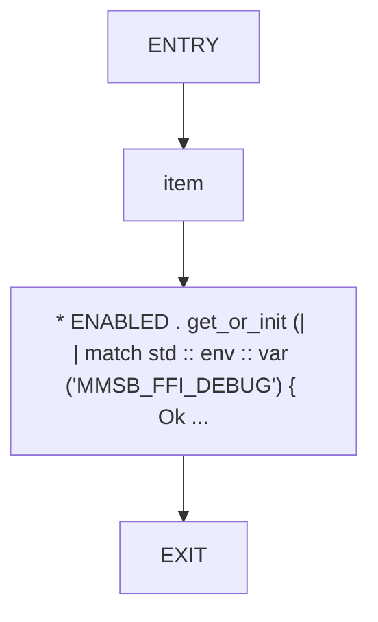
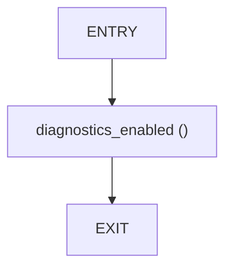

# CFG Group: src/logging.rs

## Function: `diagnostics_enabled`

- File: MMSB/src/logging.rs
- Branches: 0
- Loops: 0
- Nodes: 4
- Edges: 3

## Function: `is_enabled`

- File: MMSB/src/logging.rs
- Branches: 0
- Loops: 0
- Nodes: 3
- Edges: 2

