# CFG Group: tests

## Function: `delta`

- File: MMSB/tests/benchmark_06_tick_latency.rs
- Branches: 0
- Loops: 0
- Nodes: 3
- Edges: 2

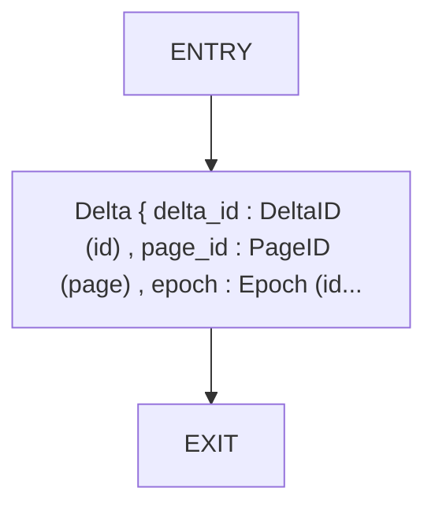

## Function: `dense_delta`

- File: MMSB/tests/delta_validation.rs
- Branches: 0
- Loops: 0
- Nodes: 3
- Edges: 2

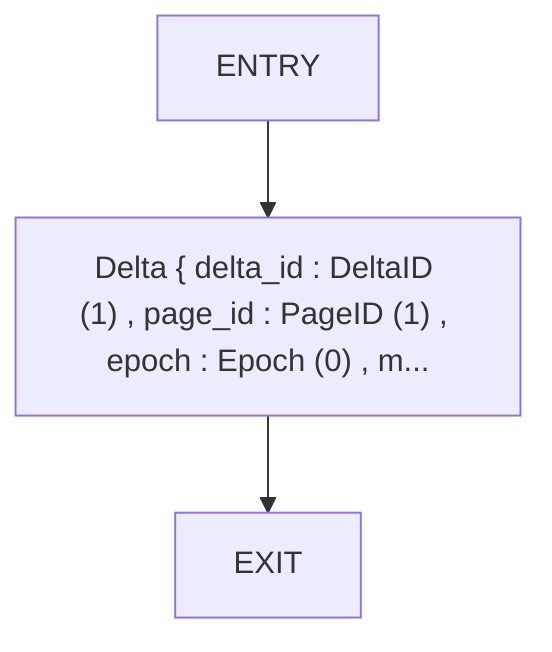

## Function: `divergence`

- File: MMSB/tests/benchmark_09_stability.rs
- Branches: 0
- Loops: 0
- Nodes: 3
- Edges: 2

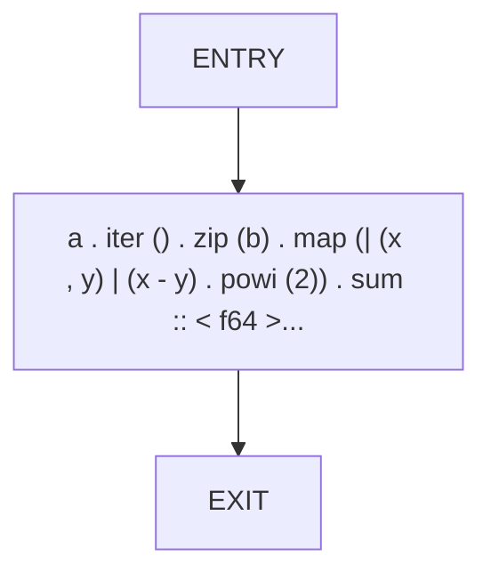

## Function: `example_checkpoint`

- File: MMSB/tests/examples_basic.rs
- Branches: 0
- Loops: 0
- Nodes: 3
- Edges: 2

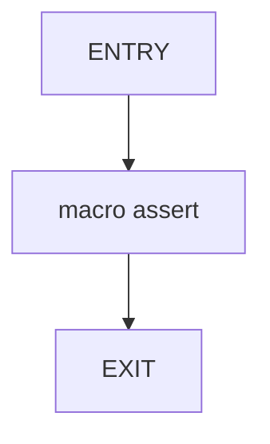

## Function: `example_delta_operations`

- File: MMSB/tests/examples_basic.rs
- Branches: 0
- Loops: 0
- Nodes: 6
- Edges: 5

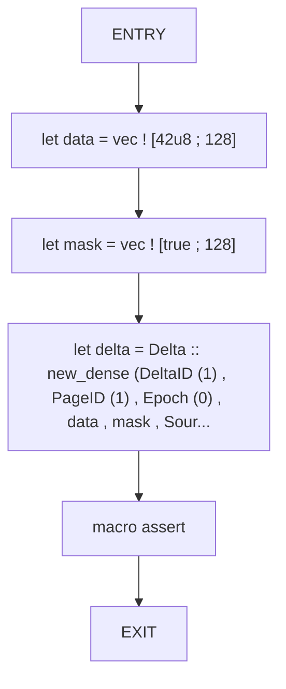

## Function: `example_page_allocation`

- File: MMSB/tests/examples_basic.rs
- Branches: 0
- Loops: 0
- Nodes: 8
- Edges: 7

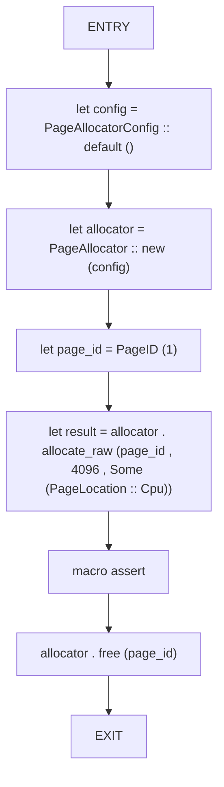

## Function: `graph_validator_detects_no_cycles`

- File: MMSB/tests/benchmark_03_graph.rs
- Branches: 0
- Loops: 0
- Nodes: 9
- Edges: 8

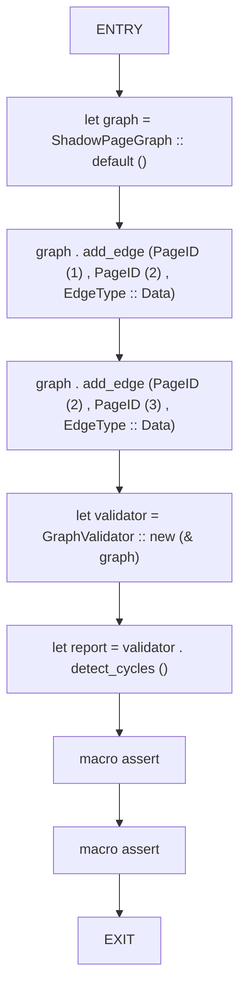

## Function: `integrity_checker_accepts_valid_delta`

- File: MMSB/tests/benchmark_02_integrity.rs
- Branches: 0
- Loops: 0
- Nodes: 9
- Edges: 8

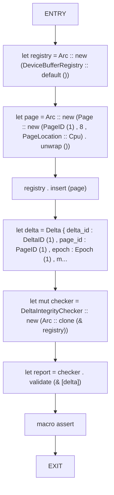

## Function: `invariant_checker_reports_success`

- File: MMSB/tests/benchmark_08_invariants.rs
- Branches: 0
- Loops: 1
- Nodes: 10
- Edges: 10

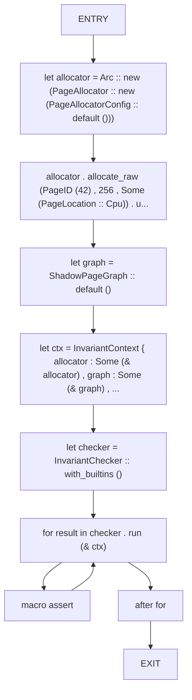

## Function: `make_delta`

- File: MMSB/tests/benchmark_05_throughput.rs
- Branches: 0
- Loops: 0
- Nodes: 3
- Edges: 2


## Function: `memory_monitor_enforces_limits`

- File: MMSB/tests/benchmark_07_memory.rs
- Branches: 0
- Loops: 1
- Nodes: 12
- Edges: 12

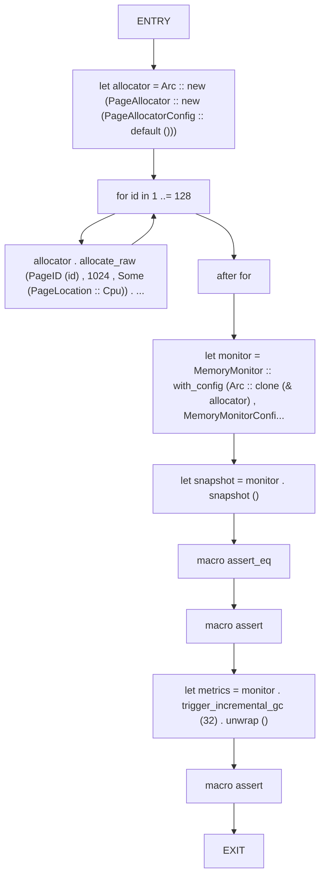

## Function: `provenance_tracker_resolves_with_cache`

- File: MMSB/tests/benchmark_10_provenance.rs
- Branches: 0
- Loops: 0
- Nodes: 12
- Edges: 11

```mermaid
flowchart TD
    provenance_tracker_resolves_with_cache_0["ENTRY"]
    provenance_tracker_resolves_with_cache_1["let graph = Arc :: new (ShadowPageGraph :: default ())"]
    provenance_tracker_resolves_with_cache_2["graph . add_edge (PageID (1) , PageID (2) , EdgeType :: Data)"]
    provenance_tracker_resolves_with_cache_3["graph . add_edge (PageID (2) , PageID (3) , EdgeType :: Data)"]
    provenance_tracker_resolves_with_cache_4["graph . add_edge (PageID (3) , PageID (4) , EdgeType :: Data)"]
    provenance_tracker_resolves_with_cache_5["let tracker = ProvenanceTracker :: with_capacity (Arc :: clone (& graph) , 8 , 8)"]
    provenance_tracker_resolves_with_cache_6["let result = tracker . resolve (PageID (4))"]
    provenance_tracker_resolves_with_cache_7["macro assert"]
    provenance_tracker_resolves_with_cache_8["macro assert"]
    provenance_tracker_resolves_with_cache_9["let cached = tracker . resolve (PageID (4))"]
    provenance_tracker_resolves_with_cache_10["macro assert"]
    provenance_tracker_resolves_with_cache_11["EXIT"]
    provenance_tracker_resolves_with_cache_0 --> provenance_tracker_resolves_with_cache_1
    provenance_tracker_resolves_with_cache_1 --> provenance_tracker_resolves_with_cache_2
    provenance_tracker_resolves_with_cache_2 --> provenance_tracker_resolves_with_cache_3
    provenance_tracker_resolves_with_cache_3 --> provenance_tracker_resolves_with_cache_4
    provenance_tracker_resolves_with_cache_4 --> provenance_tracker_resolves_with_cache_5
    provenance_tracker_resolves_with_cache_5 --> provenance_tracker_resolves_with_cache_6
    provenance_tracker_resolves_with_cache_6 --> provenance_tracker_resolves_with_cache_7
    provenance_tracker_resolves_with_cache_7 --> provenance_tracker_resolves_with_cache_8
    provenance_tracker_resolves_with_cache_8 --> provenance_tracker_resolves_with_cache_9
    provenance_tracker_resolves_with_cache_9 --> provenance_tracker_resolves_with_cache_10
    provenance_tracker_resolves_with_cache_10 --> provenance_tracker_resolves_with_cache_11
```

## Function: `purity_validator_covers_semiring_operations`

- File: MMSB/tests/benchmark_04_purity.rs
- Branches: 0
- Loops: 0
- Nodes: 7
- Edges: 6

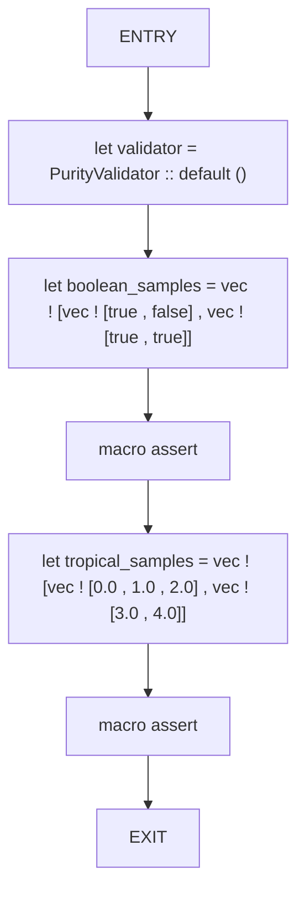

## Function: `read_page`

- File: MMSB/tests/mmsb_tests.rs
- Branches: 0
- Loops: 0
- Nodes: 3
- Edges: 2

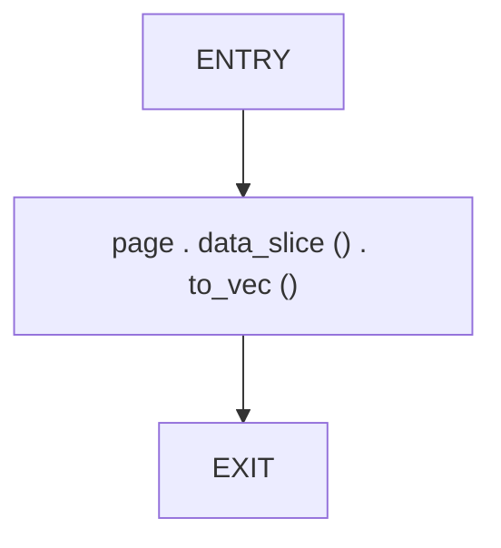

## Function: `rejects_mismatched_dense_lengths`

- File: MMSB/tests/delta_validation.rs
- Branches: 0
- Loops: 0
- Nodes: 4
- Edges: 3

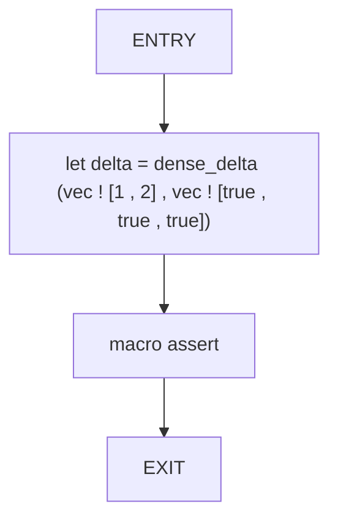

## Function: `replay_validator_divergence_under_threshold`

- File: MMSB/tests/benchmark_01_replay.rs
- Branches: 0
- Loops: 0
- Nodes: 11
- Edges: 10

```mermaid
flowchart TD
    replay_validator_divergence_under_threshold_0["ENTRY"]
    replay_validator_divergence_under_threshold_1["let path = temp_log_path ()"]
    replay_validator_divergence_under_threshold_2["let log = TransactionLog :: new (& path) . unwrap ()"]
    replay_validator_divergence_under_threshold_3["let allocator = PageAllocator :: new (PageAllocatorConfig :: default ())"]
    replay_validator_divergence_under_threshold_4["allocator . allocate_raw (PageID (1) , 1024 , Some (PageLocation :: Cpu)) . u..."]
    replay_validator_divergence_under_threshold_5["let mut validator = ReplayValidator :: new (1e-9)"]
    replay_validator_divergence_under_threshold_6["let checkpoint = validator . record_checkpoint (& allocator , & log) . unwrap ()"]
    replay_validator_divergence_under_threshold_7["let report = validator . validate_allocator (checkpoint , & allocator) . unwrap ()"]
    replay_validator_divergence_under_threshold_8["macro assert"]
    replay_validator_divergence_under_threshold_9["std :: fs :: remove_file (path) . ok ()"]
    replay_validator_divergence_under_threshold_10["EXIT"]
    replay_validator_divergence_under_threshold_0 --> replay_validator_divergence_under_threshold_1
    replay_validator_divergence_under_threshold_1 --> replay_validator_divergence_under_threshold_2
    replay_validator_divergence_under_threshold_2 --> replay_validator_divergence_under_threshold_3
    replay_validator_divergence_under_threshold_3 --> replay_validator_divergence_under_threshold_4
    replay_validator_divergence_under_threshold_4 --> replay_validator_divergence_under_threshold_5
    replay_validator_divergence_under_threshold_5 --> replay_validator_divergence_under_threshold_6
    replay_validator_divergence_under_threshold_6 --> replay_validator_divergence_under_threshold_7
    replay_validator_divergence_under_threshold_7 --> replay_validator_divergence_under_threshold_8
    replay_validator_divergence_under_threshold_8 --> replay_validator_divergence_under_threshold_9
    replay_validator_divergence_under_threshold_9 --> replay_validator_divergence_under_threshold_10
```

## Function: `simulate`

- File: MMSB/tests/benchmark_09_stability.rs
- Branches: 0
- Loops: 0
- Nodes: 3
- Edges: 2

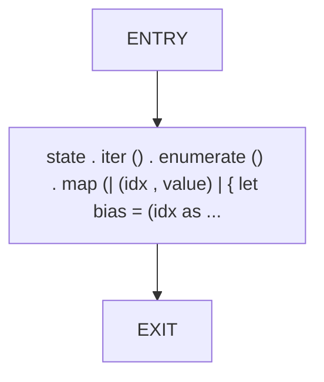

## Function: `stability_resists_small_noise`

- File: MMSB/tests/benchmark_09_stability.rs
- Branches: 0
- Loops: 1
- Nodes: 15
- Edges: 15

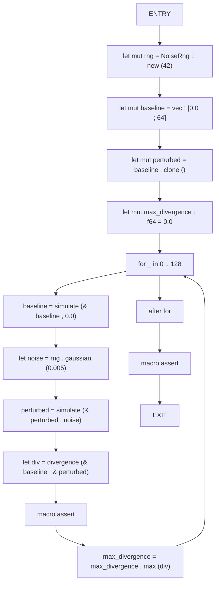

## Function: `temp_log_path`

- File: MMSB/tests/benchmark_01_replay.rs
- Branches: 0
- Loops: 0
- Nodes: 5
- Edges: 4

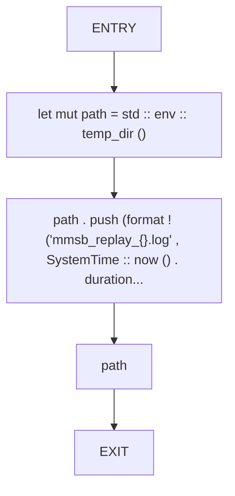

## Function: `test_allocator_cpu_gpu_latency`

- File: MMSB/tests/week27_31_integration.rs
- Branches: 0
- Loops: 0
- Nodes: 8
- Edges: 7

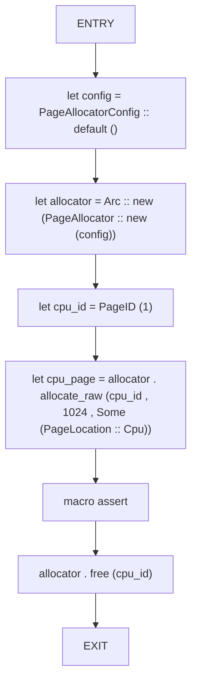

## Function: `test_api_public_interface`

- File: MMSB/tests/mmsb_tests.rs
- Branches: 0
- Loops: 0
- Nodes: 2
- Edges: 1

```mermaid
flowchart TD
    test_api_public_interface_0["ENTRY"]
    test_api_public_interface_1["EXIT"]
    test_api_public_interface_0 --> test_api_public_interface_1
```

## Function: `test_checkpoint_log_and_restore`

- File: MMSB/tests/mmsb_tests.rs
- Branches: 0
- Loops: 0
- Nodes: 23
- Edges: 22

```mermaid
flowchart TD
    test_checkpoint_log_and_restore_0["ENTRY"]
    test_checkpoint_log_and_restore_1["let allocator = PageAllocator :: new (PageAllocatorConfig :: default ())"]
    test_checkpoint_log_and_restore_2["let log = TransactionLog :: new ('test_log.mmsb' . to_string ()) . unwrap ()"]
    test_checkpoint_log_and_restore_3["let ptr = allocator . allocate_raw (PageID (0) , 64 , None) . unwrap ()"]
    test_checkpoint_log_and_restore_4["let page = unsafe { & * ptr }"]
    test_checkpoint_log_and_restore_5["let page_id = page . id"]
    test_checkpoint_log_and_restore_6["let msg = b'MMSB checkpoint test data 2025'"]
    test_checkpoint_log_and_restore_7["let mut data = vec ! [0u8 ; 64]"]
    test_checkpoint_log_and_restore_8["data [.. msg . len ()] . copy_from_slice (msg)"]
    test_checkpoint_log_and_restore_9["let page_mut = unsafe { & mut * ptr }"]
    test_checkpoint_log_and_restore_10["page_mut . data_mut_slice () . copy_from_slice (& data)"]
    test_checkpoint_log_and_restore_11["let path = 'checkpoint.mmsb'"]
    test_checkpoint_log_and_restore_12["write_checkpoint (& allocator , & log , path . to_string ()) . unwrap ()"]
    test_checkpoint_log_and_restore_13["let new_allocator = PageAllocator :: new (PageAllocatorConfig :: default ())"]
    test_checkpoint_log_and_restore_14["let new_log = TransactionLog :: new ('restored_log.mmsb' . to_string ()) . unwrap ()"]
    test_checkpoint_log_and_restore_15["load_checkpoint (& new_allocator , & new_log , path) . unwrap ()"]
    test_checkpoint_log_and_restore_16["let restored_ptr = new_allocator . acquire_page (page_id) . expect ('restored page must exist')"]
    test_checkpoint_log_and_restore_17["let restored_page = unsafe { & * restored_ptr }"]
    test_checkpoint_log_and_restore_18["macro assert_eq"]
    test_checkpoint_log_and_restore_19["let _ = std :: fs :: remove_file (path)"]
    test_checkpoint_log_and_restore_20["let _ = std :: fs :: remove_file ('test_log.mmsb')"]
    test_checkpoint_log_and_restore_21["let _ = std :: fs :: remove_file ('restored_log.mmsb')"]
    test_checkpoint_log_and_restore_22["EXIT"]
    test_checkpoint_log_and_restore_0 --> test_checkpoint_log_and_restore_1
    test_checkpoint_log_and_restore_1 --> test_checkpoint_log_and_restore_2
    test_checkpoint_log_and_restore_2 --> test_checkpoint_log_and_restore_3
    test_checkpoint_log_and_restore_3 --> test_checkpoint_log_and_restore_4
    test_checkpoint_log_and_restore_4 --> test_checkpoint_log_and_restore_5
    test_checkpoint_log_and_restore_5 --> test_checkpoint_log_and_restore_6
    test_checkpoint_log_and_restore_6 --> test_checkpoint_log_and_restore_7
    test_checkpoint_log_and_restore_7 --> test_checkpoint_log_and_restore_8
    test_checkpoint_log_and_restore_8 --> test_checkpoint_log_and_restore_9
    test_checkpoint_log_and_restore_9 --> test_checkpoint_log_and_restore_10
    test_checkpoint_log_and_restore_10 --> test_checkpoint_log_and_restore_11
    test_checkpoint_log_and_restore_11 --> test_checkpoint_log_and_restore_12
    test_checkpoint_log_and_restore_12 --> test_checkpoint_log_and_restore_13
    test_checkpoint_log_and_restore_13 --> test_checkpoint_log_and_restore_14
    test_checkpoint_log_and_restore_14 --> test_checkpoint_log_and_restore_15
    test_checkpoint_log_and_restore_15 --> test_checkpoint_log_and_restore_16
    test_checkpoint_log_and_restore_16 --> test_checkpoint_log_and_restore_17
    test_checkpoint_log_and_restore_17 --> test_checkpoint_log_and_restore_18
    test_checkpoint_log_and_restore_18 --> test_checkpoint_log_and_restore_19
    test_checkpoint_log_and_restore_19 --> test_checkpoint_log_and_restore_20
    test_checkpoint_log_and_restore_20 --> test_checkpoint_log_and_restore_21
    test_checkpoint_log_and_restore_21 --> test_checkpoint_log_and_restore_22
```

## Function: `test_cpu_features`

- File: MMSB/tests/week27_31_integration.rs
- Branches: 0
- Loops: 0
- Nodes: 5
- Edges: 4

```mermaid
flowchart TD
    test_cpu_features_0["ENTRY"]
    test_cpu_features_1["use"]
    test_cpu_features_2["let _features = CpuFeatures :: detect ()"]
    test_cpu_features_3["macro assert"]
    test_cpu_features_4["EXIT"]
    test_cpu_features_0 --> test_cpu_features_1
    test_cpu_features_1 --> test_cpu_features_2
    test_cpu_features_2 --> test_cpu_features_3
    test_cpu_features_3 --> test_cpu_features_4
```

## Function: `test_delta_merge_simd`

- File: MMSB/tests/week27_31_integration.rs
- Branches: 0
- Loops: 0
- Nodes: 11
- Edges: 10

```mermaid
flowchart TD
    test_delta_merge_simd_0["ENTRY"]
    test_delta_merge_simd_1["use"]
    test_delta_merge_simd_2["let data1 : Vec < u8 > = (0 .. 64) . collect ()"]
    test_delta_merge_simd_3["let mask1 = vec ! [true ; 64]"]
    test_delta_merge_simd_4["let delta1 = Delta :: new_dense (DeltaID (1) , PageID (1) , Epoch (0) , data1 , mask1 , So..."]
    test_delta_merge_simd_5["let data2 : Vec < u8 > = (100 .. 164) . collect ()"]
    test_delta_merge_simd_6["let mask2 = vec ! [true ; 64]"]
    test_delta_merge_simd_7["let delta2 = Delta :: new_dense (DeltaID (2) , PageID (1) , Epoch (0) , data2 , mask2 , So..."]
    test_delta_merge_simd_8["let merged = merge_deltas (& delta1 , & delta2)"]
    test_delta_merge_simd_9["macro assert"]
    test_delta_merge_simd_10["EXIT"]
    test_delta_merge_simd_0 --> test_delta_merge_simd_1
    test_delta_merge_simd_1 --> test_delta_merge_simd_2
    test_delta_merge_simd_2 --> test_delta_merge_simd_3
    test_delta_merge_simd_3 --> test_delta_merge_simd_4
    test_delta_merge_simd_4 --> test_delta_merge_simd_5
    test_delta_merge_simd_5 --> test_delta_merge_simd_6
    test_delta_merge_simd_6 --> test_delta_merge_simd_7
    test_delta_merge_simd_7 --> test_delta_merge_simd_8
    test_delta_merge_simd_8 --> test_delta_merge_simd_9
    test_delta_merge_simd_9 --> test_delta_merge_simd_10
```

## Function: `test_dense_delta_application`

- File: MMSB/tests/mmsb_tests.rs
- Branches: 0
- Loops: 0
- Nodes: 10
- Edges: 9

```mermaid
flowchart TD
    test_dense_delta_application_0["ENTRY"]
    test_dense_delta_application_1["let allocator = PageAllocator :: new (PageAllocatorConfig :: default ())"]
    test_dense_delta_application_2["let ptr = allocator . allocate_raw (PageID (0) , 4 , None) . unwrap ()"]
    test_dense_delta_application_3["let page = unsafe { & * ptr }"]
    test_dense_delta_application_4["let real_id = page . id"]
    test_dense_delta_application_5["let delta = Delta :: new_dense (DeltaID (8) , real_id , Epoch (20) , vec ! [99 , 88 , 77 ..."]
    test_dense_delta_application_6["let page_mut = unsafe { & mut * ptr }"]
    test_dense_delta_application_7["page_mut . apply_delta (& delta) . unwrap ()"]
    test_dense_delta_application_8["macro assert_eq"]
    test_dense_delta_application_9["EXIT"]
    test_dense_delta_application_0 --> test_dense_delta_application_1
    test_dense_delta_application_1 --> test_dense_delta_application_2
    test_dense_delta_application_2 --> test_dense_delta_application_3
    test_dense_delta_application_3 --> test_dense_delta_application_4
    test_dense_delta_application_4 --> test_dense_delta_application_5
    test_dense_delta_application_5 --> test_dense_delta_application_6
    test_dense_delta_application_6 --> test_dense_delta_application_7
    test_dense_delta_application_7 --> test_dense_delta_application_8
    test_dense_delta_application_8 --> test_dense_delta_application_9
```

## Function: `test_gpu_delta_kernels`

- File: MMSB/tests/mmsb_tests.rs
- Branches: 0
- Loops: 0
- Nodes: 2
- Edges: 1

```mermaid
flowchart TD
    test_gpu_delta_kernels_0["ENTRY"]
    test_gpu_delta_kernels_1["EXIT"]
    test_gpu_delta_kernels_0 --> test_gpu_delta_kernels_1
```

## Function: `test_invalid_page_deletion_is_safe`

- File: MMSB/tests/mmsb_tests.rs
- Branches: 0
- Loops: 0
- Nodes: 5
- Edges: 4

```mermaid
flowchart TD
    test_invalid_page_deletion_is_safe_0["ENTRY"]
    test_invalid_page_deletion_is_safe_1["let allocator = PageAllocator :: new (PageAllocatorConfig :: default ())"]
    test_invalid_page_deletion_is_safe_2["allocator . release (PageID (9999))"]
    test_invalid_page_deletion_is_safe_3["macro assert_eq"]
    test_invalid_page_deletion_is_safe_4["EXIT"]
    test_invalid_page_deletion_is_safe_0 --> test_invalid_page_deletion_is_safe_1
    test_invalid_page_deletion_is_safe_1 --> test_invalid_page_deletion_is_safe_2
    test_invalid_page_deletion_is_safe_2 --> test_invalid_page_deletion_is_safe_3
    test_invalid_page_deletion_is_safe_3 --> test_invalid_page_deletion_is_safe_4
```

## Function: `test_lockfree_allocator`

- File: MMSB/tests/week27_31_integration.rs
- Branches: 0
- Loops: 0
- Nodes: 8
- Edges: 7

```mermaid
flowchart TD
    test_lockfree_allocator_0["ENTRY"]
    test_lockfree_allocator_1["use"]
    test_lockfree_allocator_2["let allocator = LockFreeAllocator :: new ()"]
    test_lockfree_allocator_3["let (freelist_size , allocated , freed) = allocator . get_stats ()"]
    test_lockfree_allocator_4["macro assert_eq"]
    test_lockfree_allocator_5["macro assert_eq"]
    test_lockfree_allocator_6["macro assert_eq"]
    test_lockfree_allocator_7["EXIT"]
    test_lockfree_allocator_0 --> test_lockfree_allocator_1
    test_lockfree_allocator_1 --> test_lockfree_allocator_2
    test_lockfree_allocator_2 --> test_lockfree_allocator_3
    test_lockfree_allocator_3 --> test_lockfree_allocator_4
    test_lockfree_allocator_4 --> test_lockfree_allocator_5
    test_lockfree_allocator_5 --> test_lockfree_allocator_6
    test_lockfree_allocator_6 --> test_lockfree_allocator_7
```

## Function: `test_page_info_metadata_roundtrip`

- File: MMSB/tests/mmsb_tests.rs
- Branches: 0
- Loops: 0
- Nodes: 9
- Edges: 8

```mermaid
flowchart TD
    test_page_info_metadata_roundtrip_0["ENTRY"]
    test_page_info_metadata_roundtrip_1["let allocator = PageAllocator :: new (PageAllocatorConfig :: default ())"]
    test_page_info_metadata_roundtrip_2["let ptr = allocator . allocate_raw (PageID (0) , 128 , None) . unwrap ()"]
    test_page_info_metadata_roundtrip_3["let page = unsafe { & mut * ptr }"]
    test_page_info_metadata_roundtrip_4["page . set_metadata (vec ! [('key' . to_string () , b'abc123' . to_vec ())])"]
    test_page_info_metadata_roundtrip_5["let infos = allocator . page_infos ()"]
    test_page_info_metadata_roundtrip_6["macro assert_eq"]
    test_page_info_metadata_roundtrip_7["macro assert_eq"]
    test_page_info_metadata_roundtrip_8["EXIT"]
    test_page_info_metadata_roundtrip_0 --> test_page_info_metadata_roundtrip_1
    test_page_info_metadata_roundtrip_1 --> test_page_info_metadata_roundtrip_2
    test_page_info_metadata_roundtrip_2 --> test_page_info_metadata_roundtrip_3
    test_page_info_metadata_roundtrip_3 --> test_page_info_metadata_roundtrip_4
    test_page_info_metadata_roundtrip_4 --> test_page_info_metadata_roundtrip_5
    test_page_info_metadata_roundtrip_5 --> test_page_info_metadata_roundtrip_6
    test_page_info_metadata_roundtrip_6 --> test_page_info_metadata_roundtrip_7
    test_page_info_metadata_roundtrip_7 --> test_page_info_metadata_roundtrip_8
```

## Function: `test_page_snapshot_and_restore`

- File: MMSB/tests/mmsb_tests.rs
- Branches: 0
- Loops: 0
- Nodes: 12
- Edges: 11

```mermaid
flowchart TD
    test_page_snapshot_and_restore_0["ENTRY"]
    test_page_snapshot_and_restore_1["let allocator = PageAllocator :: new (PageAllocatorConfig :: default ())"]
    test_page_snapshot_and_restore_2["let ptr = allocator . allocate_raw (PageID (0) , 128 , None) . unwrap ()"]
    test_page_snapshot_and_restore_3["let page = unsafe { & mut * ptr }"]
    test_page_snapshot_and_restore_4["page . data_mut_slice () . fill (99)"]
    test_page_snapshot_and_restore_5["let snapshot = allocator . snapshot_pages ()"]
    test_page_snapshot_and_restore_6["let new_allocator = PageAllocator :: new (PageAllocatorConfig :: default ())"]
    test_page_snapshot_and_restore_7["new_allocator . restore_from_snapshot (snapshot) . unwrap ()"]
    test_page_snapshot_and_restore_8["let restored_ptr = new_allocator . acquire_page (page . id) . unwrap ()"]
    test_page_snapshot_and_restore_9["let restored_page = unsafe { & * restored_ptr }"]
    test_page_snapshot_and_restore_10["macro assert"]
    test_page_snapshot_and_restore_11["EXIT"]
    test_page_snapshot_and_restore_0 --> test_page_snapshot_and_restore_1
    test_page_snapshot_and_restore_1 --> test_page_snapshot_and_restore_2
    test_page_snapshot_and_restore_2 --> test_page_snapshot_and_restore_3
    test_page_snapshot_and_restore_3 --> test_page_snapshot_and_restore_4
    test_page_snapshot_and_restore_4 --> test_page_snapshot_and_restore_5
    test_page_snapshot_and_restore_5 --> test_page_snapshot_and_restore_6
    test_page_snapshot_and_restore_6 --> test_page_snapshot_and_restore_7
    test_page_snapshot_and_restore_7 --> test_page_snapshot_and_restore_8
    test_page_snapshot_and_restore_8 --> test_page_snapshot_and_restore_9
    test_page_snapshot_and_restore_9 --> test_page_snapshot_and_restore_10
    test_page_snapshot_and_restore_10 --> test_page_snapshot_and_restore_11
```

## Function: `test_propagation_queue`

- File: MMSB/tests/week27_31_integration.rs
- Branches: 0
- Loops: 0
- Nodes: 5
- Edges: 4

```mermaid
flowchart TD
    test_propagation_queue_0["ENTRY"]
    test_propagation_queue_1["use"]
    test_propagation_queue_2["let _queue = PropagationQueue :: new ()"]
    test_propagation_queue_3["macro assert"]
    test_propagation_queue_4["EXIT"]
    test_propagation_queue_0 --> test_propagation_queue_1
    test_propagation_queue_1 --> test_propagation_queue_2
    test_propagation_queue_2 --> test_propagation_queue_3
    test_propagation_queue_3 --> test_propagation_queue_4
```

## Function: `test_semiring_operations_tropical`

- File: MMSB/tests/week27_31_integration.rs
- Branches: 0
- Loops: 0
- Nodes: 4
- Edges: 3

```mermaid
flowchart TD
    test_semiring_operations_tropical_0["ENTRY"]
    test_semiring_operations_tropical_1["let _semiring = TropicalSemiring"]
    test_semiring_operations_tropical_2["macro assert"]
    test_semiring_operations_tropical_3["EXIT"]
    test_semiring_operations_tropical_0 --> test_semiring_operations_tropical_1
    test_semiring_operations_tropical_1 --> test_semiring_operations_tropical_2
    test_semiring_operations_tropical_2 --> test_semiring_operations_tropical_3
```

## Function: `test_sparse_delta_application`

- File: MMSB/tests/mmsb_tests.rs
- Branches: 0
- Loops: 0
- Nodes: 12
- Edges: 11

```mermaid
flowchart TD
    test_sparse_delta_application_0["ENTRY"]
    test_sparse_delta_application_1["let allocator = PageAllocator :: new (PageAllocatorConfig :: default ())"]
    test_sparse_delta_application_2["let ptr = allocator . allocate_raw (PageID (0) , 8 , None) . unwrap ()"]
    test_sparse_delta_application_3["let page = unsafe { & * ptr }"]
    test_sparse_delta_application_4["let real_id = page . id"]
    test_sparse_delta_application_5["let mask = vec ! [true , false , true , false , true , false , true , false]"]
    test_sparse_delta_application_6["let payload = vec ! [11 , 22 , 33 , 44]"]
    test_sparse_delta_application_7["let delta = Delta :: new_sparse (DeltaID (7) , real_id , Epoch (10) , mask , payload , So..."]
    test_sparse_delta_application_8["let page_mut = unsafe { & mut * ptr }"]
    test_sparse_delta_application_9["page_mut . apply_delta (& delta) . unwrap ()"]
    test_sparse_delta_application_10["macro assert_eq"]
    test_sparse_delta_application_11["EXIT"]
    test_sparse_delta_application_0 --> test_sparse_delta_application_1
    test_sparse_delta_application_1 --> test_sparse_delta_application_2
    test_sparse_delta_application_2 --> test_sparse_delta_application_3
    test_sparse_delta_application_3 --> test_sparse_delta_application_4
    test_sparse_delta_application_4 --> test_sparse_delta_application_5
    test_sparse_delta_application_5 --> test_sparse_delta_application_6
    test_sparse_delta_application_6 --> test_sparse_delta_application_7
    test_sparse_delta_application_7 --> test_sparse_delta_application_8
    test_sparse_delta_application_8 --> test_sparse_delta_application_9
    test_sparse_delta_application_9 --> test_sparse_delta_application_10
    test_sparse_delta_application_10 --> test_sparse_delta_application_11
```

## Function: `test_thread_safe_allocator`

- File: MMSB/tests/mmsb_tests.rs
- Branches: 0
- Loops: 1
- Nodes: 8
- Edges: 8

```mermaid
flowchart TD
    test_thread_safe_allocator_0["ENTRY"]
    test_thread_safe_allocator_1["let allocator = Arc :: new (PageAllocator :: new (PageAllocatorConfig :: default ()))"]
    test_thread_safe_allocator_2["let handles : Vec < _ > = (0 .. 16) . map (| i | { let alloc = Arc :: clone (& allocator) ; std :: thre..."]
    test_thread_safe_allocator_3["for h in handles"]
    test_thread_safe_allocator_4["h . join () . unwrap ()"]
    test_thread_safe_allocator_5["after for"]
    test_thread_safe_allocator_6["macro assert_eq"]
    test_thread_safe_allocator_7["EXIT"]
    test_thread_safe_allocator_0 --> test_thread_safe_allocator_1
    test_thread_safe_allocator_1 --> test_thread_safe_allocator_2
    test_thread_safe_allocator_2 --> test_thread_safe_allocator_3
    test_thread_safe_allocator_3 --> test_thread_safe_allocator_4
    test_thread_safe_allocator_4 --> test_thread_safe_allocator_3
    test_thread_safe_allocator_3 --> test_thread_safe_allocator_5
    test_thread_safe_allocator_5 --> test_thread_safe_allocator_6
    test_thread_safe_allocator_6 --> test_thread_safe_allocator_7
```

## Function: `throughput_engine_exceeds_minimum_rate`

- File: MMSB/tests/benchmark_05_throughput.rs
- Branches: 0
- Loops: 1
- Nodes: 11
- Edges: 11

```mermaid
flowchart TD
    throughput_engine_exceeds_minimum_rate_0["ENTRY"]
    throughput_engine_exceeds_minimum_rate_1["let allocator = Arc :: new (PageAllocator :: new (PageAllocatorConfig :: default ()))"]
    throughput_engine_exceeds_minimum_rate_2["for id in 1 ..= 8"]
    throughput_engine_exceeds_minimum_rate_3["allocator . allocate_raw (PageID (id) , 16 , Some (PageLocation :: Cpu)) . un..."]
    throughput_engine_exceeds_minimum_rate_4["after for"]
    throughput_engine_exceeds_minimum_rate_5["let engine = ThroughputEngine :: new (Arc :: clone (& allocator) , 2 , 32)"]
    throughput_engine_exceeds_minimum_rate_6["let deltas : Vec < _ > = (0 .. 512) . map (| idx | make_delta (idx , (idx % 8) + 1)) . collect ()"]
    throughput_engine_exceeds_minimum_rate_7["let metrics = engine . process_parallel (deltas) . unwrap ()"]
    throughput_engine_exceeds_minimum_rate_8["macro assert_eq"]
    throughput_engine_exceeds_minimum_rate_9["macro assert"]
    throughput_engine_exceeds_minimum_rate_10["EXIT"]
    throughput_engine_exceeds_minimum_rate_0 --> throughput_engine_exceeds_minimum_rate_1
    throughput_engine_exceeds_minimum_rate_1 --> throughput_engine_exceeds_minimum_rate_2
    throughput_engine_exceeds_minimum_rate_2 --> throughput_engine_exceeds_minimum_rate_3
    throughput_engine_exceeds_minimum_rate_3 --> throughput_engine_exceeds_minimum_rate_2
    throughput_engine_exceeds_minimum_rate_2 --> throughput_engine_exceeds_minimum_rate_4
    throughput_engine_exceeds_minimum_rate_4 --> throughput_engine_exceeds_minimum_rate_5
    throughput_engine_exceeds_minimum_rate_5 --> throughput_engine_exceeds_minimum_rate_6
    throughput_engine_exceeds_minimum_rate_6 --> throughput_engine_exceeds_minimum_rate_7
    throughput_engine_exceeds_minimum_rate_7 --> throughput_engine_exceeds_minimum_rate_8
    throughput_engine_exceeds_minimum_rate_8 --> throughput_engine_exceeds_minimum_rate_9
    throughput_engine_exceeds_minimum_rate_9 --> throughput_engine_exceeds_minimum_rate_10
```

## Function: `tick_latency_stays_within_budget`

- File: MMSB/tests/benchmark_06_tick_latency.rs
- Branches: 0
- Loops: 1
- Nodes: 15
- Edges: 15

```mermaid
flowchart TD
    tick_latency_stays_within_budget_0["ENTRY"]
    tick_latency_stays_within_budget_1["let allocator = Arc :: new (PageAllocator :: new (PageAllocatorConfig :: default ()))"]
    tick_latency_stays_within_budget_2["for id in 1 ..= 4"]
    tick_latency_stays_within_budget_3["allocator . allocate_raw (PageID (id) , 8 , Some (PageLocation :: Cpu)) . unw..."]
    tick_latency_stays_within_budget_4["after for"]
    tick_latency_stays_within_budget_5["let throughput = ThroughputEngine :: new (Arc :: clone (& allocator) , 2 , 16)"]
    tick_latency_stays_within_budget_6["let graph = Arc :: new (ShadowPageGraph :: default ())"]
    tick_latency_stays_within_budget_7["graph . add_edge (PageID (1) , PageID (2) , EdgeType :: Data)"]
    tick_latency_stays_within_budget_8["graph . add_edge (PageID (2) , PageID (3) , EdgeType :: Data)"]
    tick_latency_stays_within_budget_9["let memory = Arc :: new (MemoryMonitor :: with_config (Arc :: clone (& allocator) , Memory..."]
    tick_latency_stays_within_budget_10["let orchestrator = TickOrchestrator :: new (throughput , graph , memory)"]
    tick_latency_stays_within_budget_11["let deltas : Vec < _ > = (0 .. 64) . map (| idx | delta (idx , (idx % 4) + 1)) . collect ()"]
    tick_latency_stays_within_budget_12["let metrics = orchestrator . execute_tick (deltas) . unwrap ()"]
    tick_latency_stays_within_budget_13["macro assert"]
    tick_latency_stays_within_budget_14["EXIT"]
    tick_latency_stays_within_budget_0 --> tick_latency_stays_within_budget_1
    tick_latency_stays_within_budget_1 --> tick_latency_stays_within_budget_2
    tick_latency_stays_within_budget_2 --> tick_latency_stays_within_budget_3
    tick_latency_stays_within_budget_3 --> tick_latency_stays_within_budget_2
    tick_latency_stays_within_budget_2 --> tick_latency_stays_within_budget_4
    tick_latency_stays_within_budget_4 --> tick_latency_stays_within_budget_5
    tick_latency_stays_within_budget_5 --> tick_latency_stays_within_budget_6
    tick_latency_stays_within_budget_6 --> tick_latency_stays_within_budget_7
    tick_latency_stays_within_budget_7 --> tick_latency_stays_within_budget_8
    tick_latency_stays_within_budget_8 --> tick_latency_stays_within_budget_9
    tick_latency_stays_within_budget_9 --> tick_latency_stays_within_budget_10
    tick_latency_stays_within_budget_10 --> tick_latency_stays_within_budget_11
    tick_latency_stays_within_budget_11 --> tick_latency_stays_within_budget_12
    tick_latency_stays_within_budget_12 --> tick_latency_stays_within_budget_13
    tick_latency_stays_within_budget_13 --> tick_latency_stays_within_budget_14
```

## Function: `validates_dense_lengths`

- File: MMSB/tests/delta_validation.rs
- Branches: 0
- Loops: 0
- Nodes: 4
- Edges: 3

```mermaid
flowchart TD
    validates_dense_lengths_0["ENTRY"]
    validates_dense_lengths_1["let delta = dense_delta (vec ! [1 , 2 , 3] , vec ! [true , true , true])"]
    validates_dense_lengths_2["macro assert"]
    validates_dense_lengths_3["EXIT"]
    validates_dense_lengths_0 --> validates_dense_lengths_1
    validates_dense_lengths_1 --> validates_dense_lengths_2
    validates_dense_lengths_2 --> validates_dense_lengths_3
```

