# CFG Group: tests

## Function: `dense_delta`

- File: MMSB/tests/delta_validation.rs
- Branches: 0
- Loops: 0
- Nodes: 3
- Edges: 2

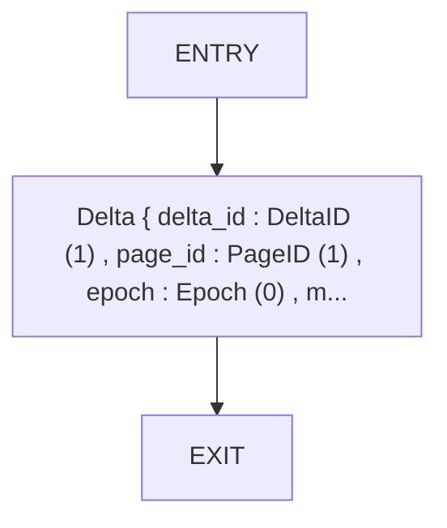

## Function: `example_checkpoint`

- File: MMSB/tests/examples_basic.rs
- Branches: 0
- Loops: 0
- Nodes: 4
- Edges: 3

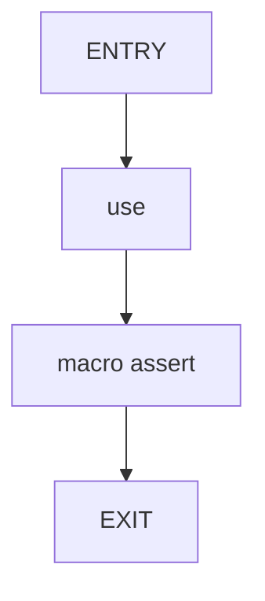

## Function: `example_delta_operations`

- File: MMSB/tests/examples_basic.rs
- Branches: 0
- Loops: 0
- Nodes: 6
- Edges: 5

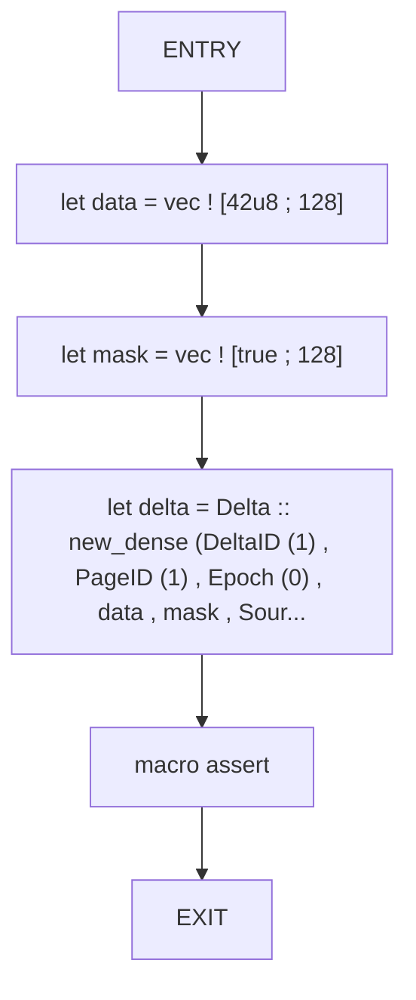

## Function: `example_page_allocation`

- File: MMSB/tests/examples_basic.rs
- Branches: 0
- Loops: 0
- Nodes: 8
- Edges: 7

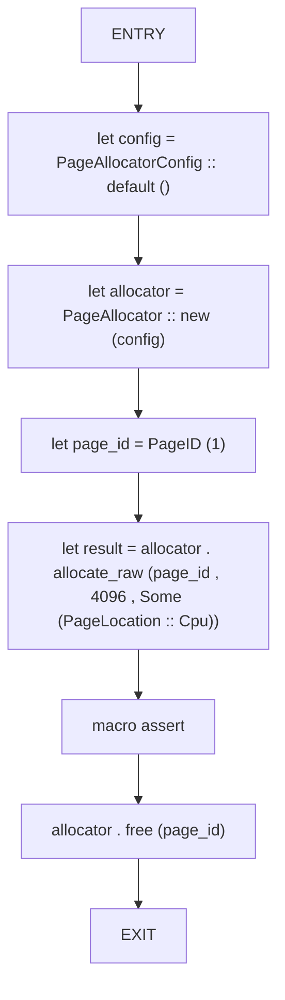

## Function: `read_page`

- File: MMSB/tests/mmsb_tests.rs
- Branches: 0
- Loops: 0
- Nodes: 3
- Edges: 2

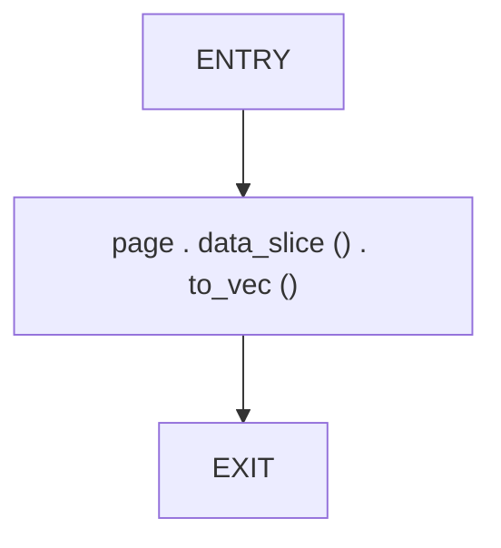

## Function: `rejects_mismatched_dense_lengths`

- File: MMSB/tests/delta_validation.rs
- Branches: 0
- Loops: 0
- Nodes: 4
- Edges: 3

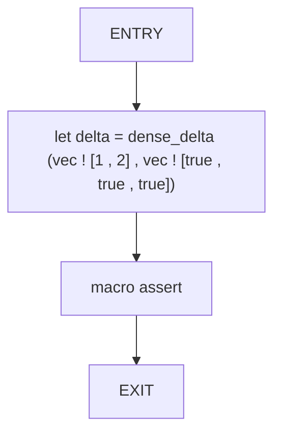

## Function: `test_allocator_cpu_gpu_latency`

- File: MMSB/tests/week27_31_integration.rs
- Branches: 0
- Loops: 0
- Nodes: 8
- Edges: 7

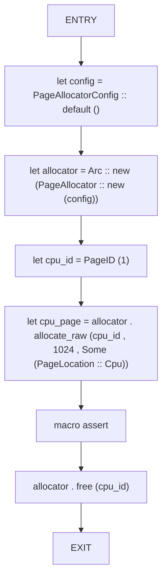

## Function: `test_api_public_interface`

- File: MMSB/tests/mmsb_tests.rs
- Branches: 0
- Loops: 0
- Nodes: 2
- Edges: 1

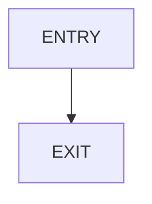

## Function: `test_checkpoint_log_and_restore`

- File: MMSB/tests/mmsb_tests.rs
- Branches: 0
- Loops: 0
- Nodes: 23
- Edges: 22

```mermaid
flowchart TD
    test_checkpoint_log_and_restore_0["ENTRY"]
    test_checkpoint_log_and_restore_1["let allocator = PageAllocator :: new (PageAllocatorConfig :: default ())"]
    test_checkpoint_log_and_restore_2["let log = TransactionLog :: new ('test_log.mmsb' . to_string ()) . unwrap ()"]
    test_checkpoint_log_and_restore_3["let ptr = allocator . allocate_raw (PageID (0) , 64 , None) . unwrap ()"]
    test_checkpoint_log_and_restore_4["let page = unsafe { & * ptr }"]
    test_checkpoint_log_and_restore_5["let page_id = page . id"]
    test_checkpoint_log_and_restore_6["let msg = b'MMSB checkpoint test data 2025'"]
    test_checkpoint_log_and_restore_7["let mut data = vec ! [0u8 ; 64]"]
    test_checkpoint_log_and_restore_8["data [.. msg . len ()] . copy_from_slice (msg)"]
    test_checkpoint_log_and_restore_9["let page_mut = unsafe { & mut * ptr }"]
    test_checkpoint_log_and_restore_10["page_mut . data_mut_slice () . copy_from_slice (& data)"]
    test_checkpoint_log_and_restore_11["let path = 'checkpoint.mmsb'"]
    test_checkpoint_log_and_restore_12["write_checkpoint (& allocator , & log , path . to_string ()) . unwrap ()"]
    test_checkpoint_log_and_restore_13["let new_allocator = PageAllocator :: new (PageAllocatorConfig :: default ())"]
    test_checkpoint_log_and_restore_14["let new_log = TransactionLog :: new ('restored_log.mmsb' . to_string ()) . unwrap ()"]
    test_checkpoint_log_and_restore_15["load_checkpoint (& new_allocator , & new_log , path) . unwrap ()"]
    test_checkpoint_log_and_restore_16["let restored_ptr = new_allocator . acquire_page (page_id) . expect ('restored page must exist')"]
    test_checkpoint_log_and_restore_17["let restored_page = unsafe { & * restored_ptr }"]
    test_checkpoint_log_and_restore_18["macro assert_eq"]
    test_checkpoint_log_and_restore_19["let _ = std :: fs :: remove_file (path)"]
    test_checkpoint_log_and_restore_20["let _ = std :: fs :: remove_file ('test_log.mmsb')"]
    test_checkpoint_log_and_restore_21["let _ = std :: fs :: remove_file ('restored_log.mmsb')"]
    test_checkpoint_log_and_restore_22["EXIT"]
    test_checkpoint_log_and_restore_0 --> test_checkpoint_log_and_restore_1
    test_checkpoint_log_and_restore_1 --> test_checkpoint_log_and_restore_2
    test_checkpoint_log_and_restore_2 --> test_checkpoint_log_and_restore_3
    test_checkpoint_log_and_restore_3 --> test_checkpoint_log_and_restore_4
    test_checkpoint_log_and_restore_4 --> test_checkpoint_log_and_restore_5
    test_checkpoint_log_and_restore_5 --> test_checkpoint_log_and_restore_6
    test_checkpoint_log_and_restore_6 --> test_checkpoint_log_and_restore_7
    test_checkpoint_log_and_restore_7 --> test_checkpoint_log_and_restore_8
    test_checkpoint_log_and_restore_8 --> test_checkpoint_log_and_restore_9
    test_checkpoint_log_and_restore_9 --> test_checkpoint_log_and_restore_10
    test_checkpoint_log_and_restore_10 --> test_checkpoint_log_and_restore_11
    test_checkpoint_log_and_restore_11 --> test_checkpoint_log_and_restore_12
    test_checkpoint_log_and_restore_12 --> test_checkpoint_log_and_restore_13
    test_checkpoint_log_and_restore_13 --> test_checkpoint_log_and_restore_14
    test_checkpoint_log_and_restore_14 --> test_checkpoint_log_and_restore_15
    test_checkpoint_log_and_restore_15 --> test_checkpoint_log_and_restore_16
    test_checkpoint_log_and_restore_16 --> test_checkpoint_log_and_restore_17
    test_checkpoint_log_and_restore_17 --> test_checkpoint_log_and_restore_18
    test_checkpoint_log_and_restore_18 --> test_checkpoint_log_and_restore_19
    test_checkpoint_log_and_restore_19 --> test_checkpoint_log_and_restore_20
    test_checkpoint_log_and_restore_20 --> test_checkpoint_log_and_restore_21
    test_checkpoint_log_and_restore_21 --> test_checkpoint_log_and_restore_22
```

## Function: `test_cpu_features`

- File: MMSB/tests/week27_31_integration.rs
- Branches: 0
- Loops: 0
- Nodes: 5
- Edges: 4

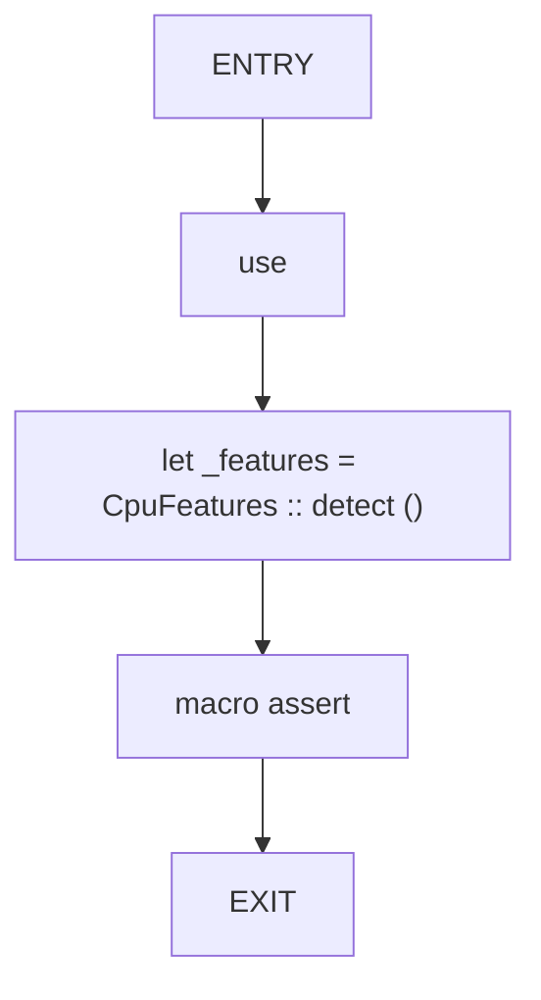

## Function: `test_delta_merge_simd`

- File: MMSB/tests/week27_31_integration.rs
- Branches: 0
- Loops: 0
- Nodes: 11
- Edges: 10

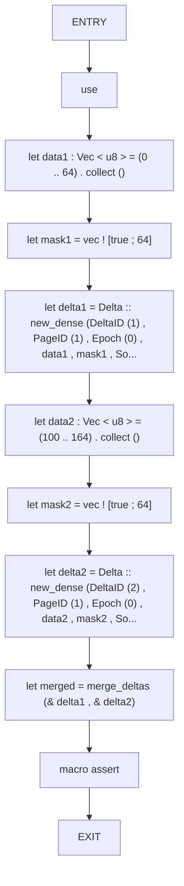

## Function: `test_dense_delta_application`

- File: MMSB/tests/mmsb_tests.rs
- Branches: 0
- Loops: 0
- Nodes: 10
- Edges: 9

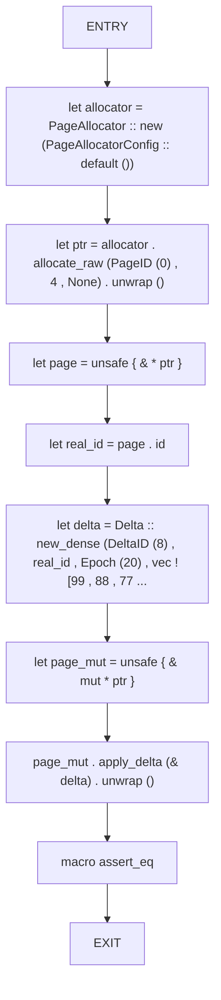

## Function: `test_gpu_delta_kernels`

- File: MMSB/tests/mmsb_tests.rs
- Branches: 0
- Loops: 0
- Nodes: 2
- Edges: 1


## Function: `test_invalid_page_deletion_is_safe`

- File: MMSB/tests/mmsb_tests.rs
- Branches: 0
- Loops: 0
- Nodes: 5
- Edges: 4

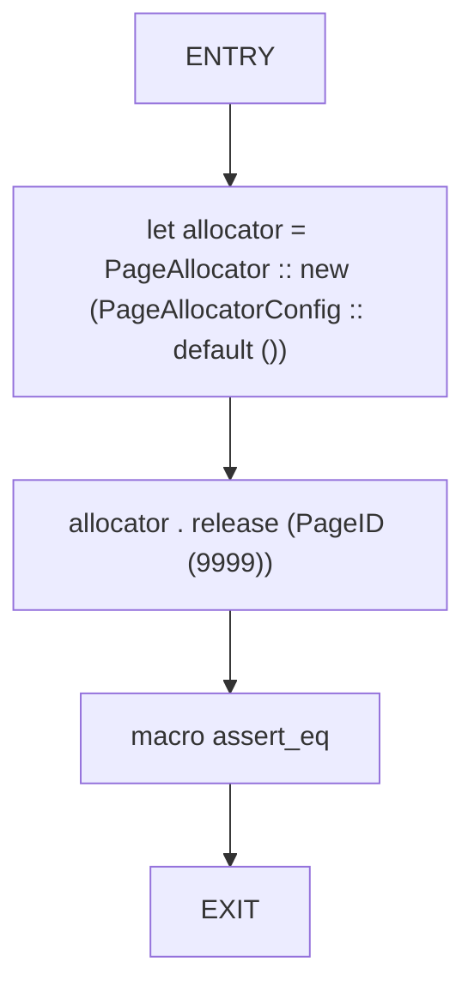

## Function: `test_lockfree_allocator`

- File: MMSB/tests/week27_31_integration.rs
- Branches: 0
- Loops: 0
- Nodes: 8
- Edges: 7

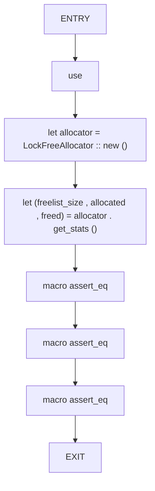

## Function: `test_page_info_metadata_roundtrip`

- File: MMSB/tests/mmsb_tests.rs
- Branches: 0
- Loops: 0
- Nodes: 9
- Edges: 8

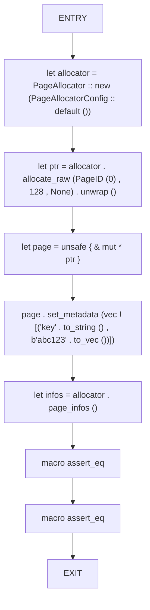

## Function: `test_page_snapshot_and_restore`

- File: MMSB/tests/mmsb_tests.rs
- Branches: 0
- Loops: 0
- Nodes: 12
- Edges: 11

```mermaid
flowchart TD
    test_page_snapshot_and_restore_0["ENTRY"]
    test_page_snapshot_and_restore_1["let allocator = PageAllocator :: new (PageAllocatorConfig :: default ())"]
    test_page_snapshot_and_restore_2["let ptr = allocator . allocate_raw (PageID (0) , 128 , None) . unwrap ()"]
    test_page_snapshot_and_restore_3["let page = unsafe { & mut * ptr }"]
    test_page_snapshot_and_restore_4["page . data_mut_slice () . fill (99)"]
    test_page_snapshot_and_restore_5["let snapshot = allocator . snapshot_pages ()"]
    test_page_snapshot_and_restore_6["let new_allocator = PageAllocator :: new (PageAllocatorConfig :: default ())"]
    test_page_snapshot_and_restore_7["new_allocator . restore_from_snapshot (snapshot) . unwrap ()"]
    test_page_snapshot_and_restore_8["let restored_ptr = new_allocator . acquire_page (page . id) . unwrap ()"]
    test_page_snapshot_and_restore_9["let restored_page = unsafe { & * restored_ptr }"]
    test_page_snapshot_and_restore_10["macro assert"]
    test_page_snapshot_and_restore_11["EXIT"]
    test_page_snapshot_and_restore_0 --> test_page_snapshot_and_restore_1
    test_page_snapshot_and_restore_1 --> test_page_snapshot_and_restore_2
    test_page_snapshot_and_restore_2 --> test_page_snapshot_and_restore_3
    test_page_snapshot_and_restore_3 --> test_page_snapshot_and_restore_4
    test_page_snapshot_and_restore_4 --> test_page_snapshot_and_restore_5
    test_page_snapshot_and_restore_5 --> test_page_snapshot_and_restore_6
    test_page_snapshot_and_restore_6 --> test_page_snapshot_and_restore_7
    test_page_snapshot_and_restore_7 --> test_page_snapshot_and_restore_8
    test_page_snapshot_and_restore_8 --> test_page_snapshot_and_restore_9
    test_page_snapshot_and_restore_9 --> test_page_snapshot_and_restore_10
    test_page_snapshot_and_restore_10 --> test_page_snapshot_and_restore_11
```

## Function: `test_propagation_queue`

- File: MMSB/tests/week27_31_integration.rs
- Branches: 0
- Loops: 0
- Nodes: 5
- Edges: 4

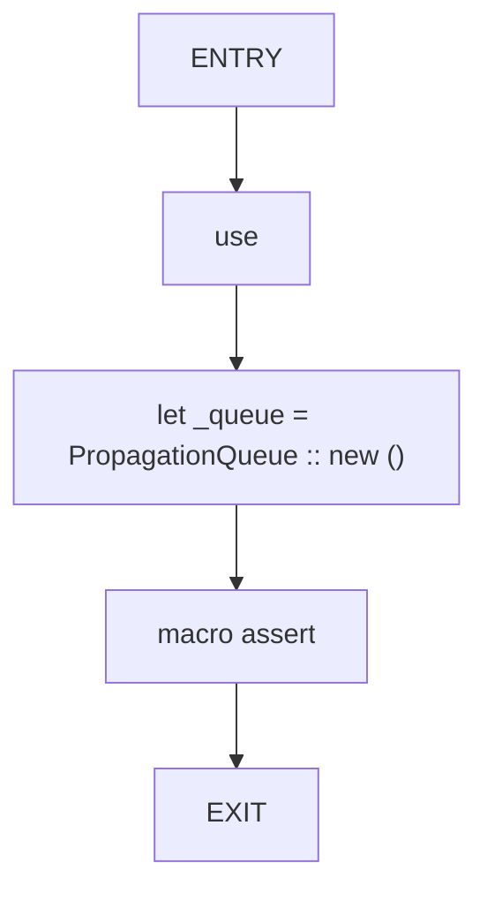

## Function: `test_semiring_operations_tropical`

- File: MMSB/tests/week27_31_integration.rs
- Branches: 0
- Loops: 0
- Nodes: 4
- Edges: 3

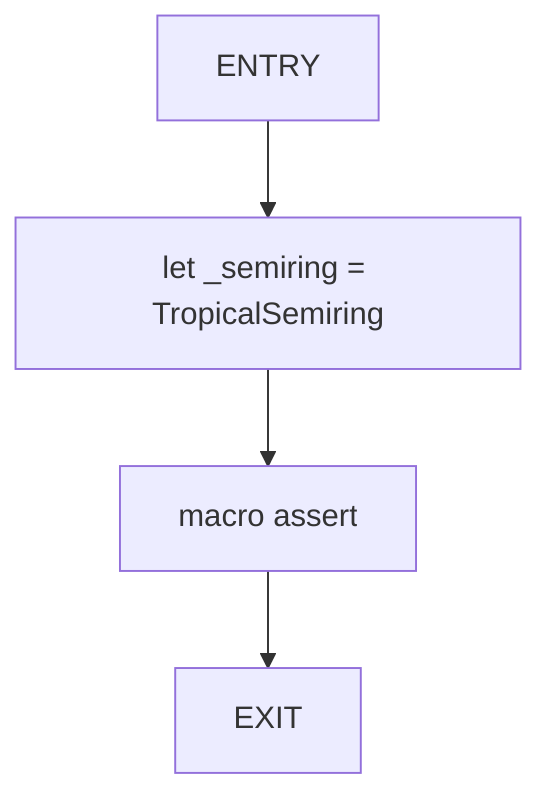

## Function: `test_sparse_delta_application`

- File: MMSB/tests/mmsb_tests.rs
- Branches: 0
- Loops: 0
- Nodes: 12
- Edges: 11

```mermaid
flowchart TD
    test_sparse_delta_application_0["ENTRY"]
    test_sparse_delta_application_1["let allocator = PageAllocator :: new (PageAllocatorConfig :: default ())"]
    test_sparse_delta_application_2["let ptr = allocator . allocate_raw (PageID (0) , 8 , None) . unwrap ()"]
    test_sparse_delta_application_3["let page = unsafe { & * ptr }"]
    test_sparse_delta_application_4["let real_id = page . id"]
    test_sparse_delta_application_5["let mask = vec ! [true , false , true , false , true , false , true , false]"]
    test_sparse_delta_application_6["let payload = vec ! [11 , 22 , 33 , 44]"]
    test_sparse_delta_application_7["let delta = Delta :: new_sparse (DeltaID (7) , real_id , Epoch (10) , mask , payload , So..."]
    test_sparse_delta_application_8["let page_mut = unsafe { & mut * ptr }"]
    test_sparse_delta_application_9["page_mut . apply_delta (& delta) . unwrap ()"]
    test_sparse_delta_application_10["macro assert_eq"]
    test_sparse_delta_application_11["EXIT"]
    test_sparse_delta_application_0 --> test_sparse_delta_application_1
    test_sparse_delta_application_1 --> test_sparse_delta_application_2
    test_sparse_delta_application_2 --> test_sparse_delta_application_3
    test_sparse_delta_application_3 --> test_sparse_delta_application_4
    test_sparse_delta_application_4 --> test_sparse_delta_application_5
    test_sparse_delta_application_5 --> test_sparse_delta_application_6
    test_sparse_delta_application_6 --> test_sparse_delta_application_7
    test_sparse_delta_application_7 --> test_sparse_delta_application_8
    test_sparse_delta_application_8 --> test_sparse_delta_application_9
    test_sparse_delta_application_9 --> test_sparse_delta_application_10
    test_sparse_delta_application_10 --> test_sparse_delta_application_11
```

## Function: `test_thread_safe_allocator`

- File: MMSB/tests/mmsb_tests.rs
- Branches: 0
- Loops: 1
- Nodes: 8
- Edges: 8

```mermaid
flowchart TD
    test_thread_safe_allocator_0["ENTRY"]
    test_thread_safe_allocator_1["let allocator = Arc :: new (PageAllocator :: new (PageAllocatorConfig :: default ()))"]
    test_thread_safe_allocator_2["let handles : Vec < _ > = (0 .. 16) . map (| i | { let alloc = Arc :: clone (& allocator) ; std :: thre..."]
    test_thread_safe_allocator_3["for h in handles"]
    test_thread_safe_allocator_4["h . join () . unwrap ()"]
    test_thread_safe_allocator_5["after for"]
    test_thread_safe_allocator_6["macro assert_eq"]
    test_thread_safe_allocator_7["EXIT"]
    test_thread_safe_allocator_0 --> test_thread_safe_allocator_1
    test_thread_safe_allocator_1 --> test_thread_safe_allocator_2
    test_thread_safe_allocator_2 --> test_thread_safe_allocator_3
    test_thread_safe_allocator_3 --> test_thread_safe_allocator_4
    test_thread_safe_allocator_4 --> test_thread_safe_allocator_3
    test_thread_safe_allocator_3 --> test_thread_safe_allocator_5
    test_thread_safe_allocator_5 --> test_thread_safe_allocator_6
    test_thread_safe_allocator_6 --> test_thread_safe_allocator_7
```

## Function: `validates_dense_lengths`

- File: MMSB/tests/delta_validation.rs
- Branches: 0
- Loops: 0
- Nodes: 4
- Edges: 3

```mermaid
flowchart TD
    validates_dense_lengths_0["ENTRY"]
    validates_dense_lengths_1["let delta = dense_delta (vec ! [1 , 2 , 3] , vec ! [true , true , true])"]
    validates_dense_lengths_2["macro assert"]
    validates_dense_lengths_3["EXIT"]
    validates_dense_lengths_0 --> validates_dense_lengths_1
    validates_dense_lengths_1 --> validates_dense_lengths_2
    validates_dense_lengths_2 --> validates_dense_lengths_3
```

