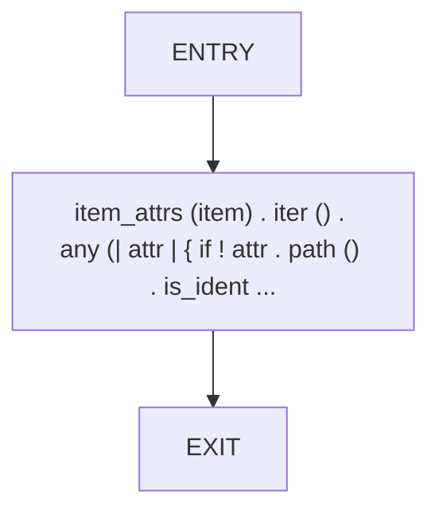

# CFG Group: src/030_is_cfg_test_item.rs

## Function: `is_cfg_test_item`

- File: src/030_is_cfg_test_item.rs
- Branches: 0
- Loops: 0
- Nodes: 3
- Edges: 2

```mermaid
flowchart TD
    is_cfg_test_item_0["ENTRY"]
    is_cfg_test_item_1["item_attrs (item) . iter () . any (| attr | { if ! attr . path () . is_ident ..."]
    is_cfg_test_item_2["EXIT"]
    is_cfg_test_item_0 --> is_cfg_test_item_1
    is_cfg_test_item_1 --> is_cfg_test_item_2
```

