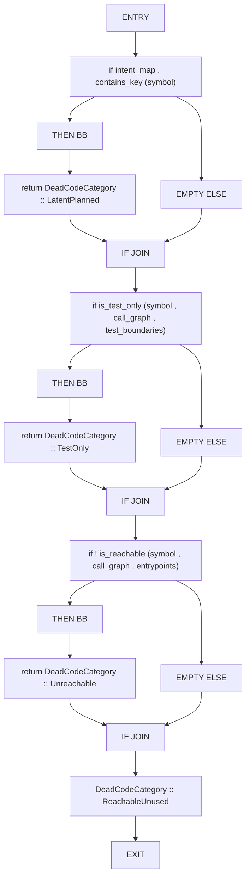

# CFG Group: src/040_classify_symbol.rs

## Function: `classify_symbol`

- File: src/040_classify_symbol.rs
- Branches: 3
- Loops: 0
- Nodes: 18
- Edges: 20

```mermaid
flowchart TD
    classify_symbol_0["ENTRY"]
    classify_symbol_1["if intent_map . contains_key (symbol)"]
    classify_symbol_2["THEN BB"]
    classify_symbol_3["return DeadCodeCategory :: LatentPlanned"]
    classify_symbol_4["EMPTY ELSE"]
    classify_symbol_5["IF JOIN"]
    classify_symbol_6["if is_test_only (symbol , call_graph , test_boundaries)"]
    classify_symbol_7["THEN BB"]
    classify_symbol_8["return DeadCodeCategory :: TestOnly"]
    classify_symbol_9["EMPTY ELSE"]
    classify_symbol_10["IF JOIN"]
    classify_symbol_11["if ! is_reachable (symbol , call_graph , entrypoints)"]
    classify_symbol_12["THEN BB"]
    classify_symbol_13["return DeadCodeCategory :: Unreachable"]
    classify_symbol_14["EMPTY ELSE"]
    classify_symbol_15["IF JOIN"]
    classify_symbol_16["DeadCodeCategory :: ReachableUnused"]
    classify_symbol_17["EXIT"]
    classify_symbol_0 --> classify_symbol_1
    classify_symbol_1 --> classify_symbol_2
    classify_symbol_2 --> classify_symbol_3
    classify_symbol_1 --> classify_symbol_4
    classify_symbol_3 --> classify_symbol_5
    classify_symbol_4 --> classify_symbol_5
    classify_symbol_5 --> classify_symbol_6
    classify_symbol_6 --> classify_symbol_7
    classify_symbol_7 --> classify_symbol_8
    classify_symbol_6 --> classify_symbol_9
    classify_symbol_8 --> classify_symbol_10
    classify_symbol_9 --> classify_symbol_10
    classify_symbol_10 --> classify_symbol_11
    classify_symbol_11 --> classify_symbol_12
    classify_symbol_12 --> classify_symbol_13
    classify_symbol_11 --> classify_symbol_14
    classify_symbol_13 --> classify_symbol_15
    classify_symbol_14 --> classify_symbol_15
    classify_symbol_15 --> classify_symbol_16
    classify_symbol_16 --> classify_symbol_17
```

