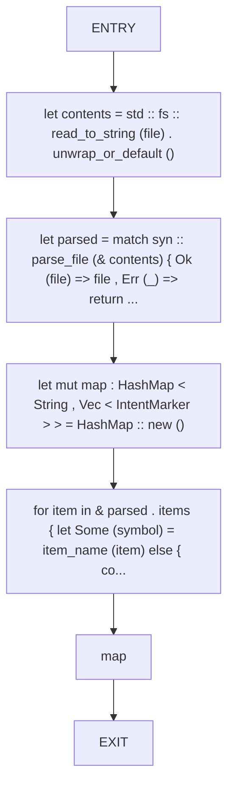

# CFG Group: src/211_dead_code_doc_comment_scanner.rs

## Function: `scan_doc_comments`

- File: src/211_dead_code_doc_comment_scanner.rs
- Branches: 0
- Loops: 0
- Nodes: 7
- Edges: 6

```mermaid
flowchart TD
    scan_doc_comments_0["ENTRY"]
    scan_doc_comments_1["let contents = std :: fs :: read_to_string (file) . unwrap_or_default ()"]
    scan_doc_comments_2["let parsed = match syn :: parse_file (& contents) { Ok (file) => file , Err (_) => return ..."]
    scan_doc_comments_3["let mut map : HashMap < String , Vec < IntentMarker > > = HashMap :: new ()"]
    scan_doc_comments_4["for item in & parsed . items { let Some (symbol) = item_name (item) else { co..."]
    scan_doc_comments_5["map"]
    scan_doc_comments_6["EXIT"]
    scan_doc_comments_0 --> scan_doc_comments_1
    scan_doc_comments_1 --> scan_doc_comments_2
    scan_doc_comments_2 --> scan_doc_comments_3
    scan_doc_comments_3 --> scan_doc_comments_4
    scan_doc_comments_4 --> scan_doc_comments_5
    scan_doc_comments_5 --> scan_doc_comments_6
```

