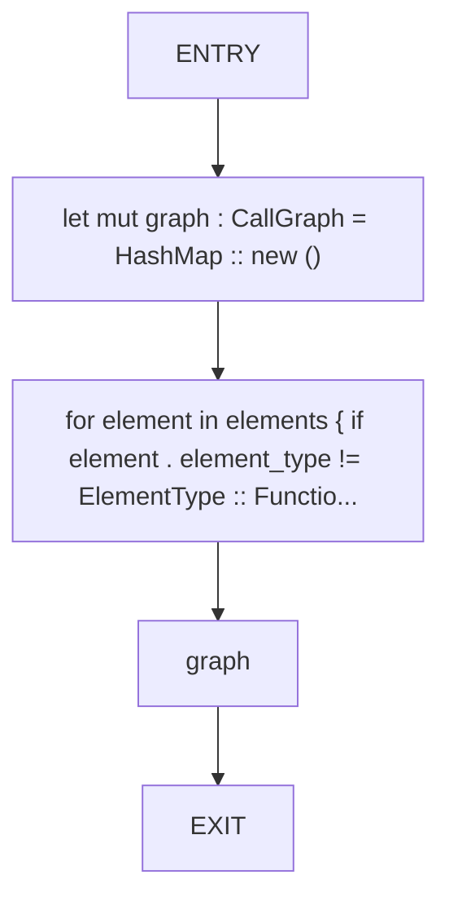
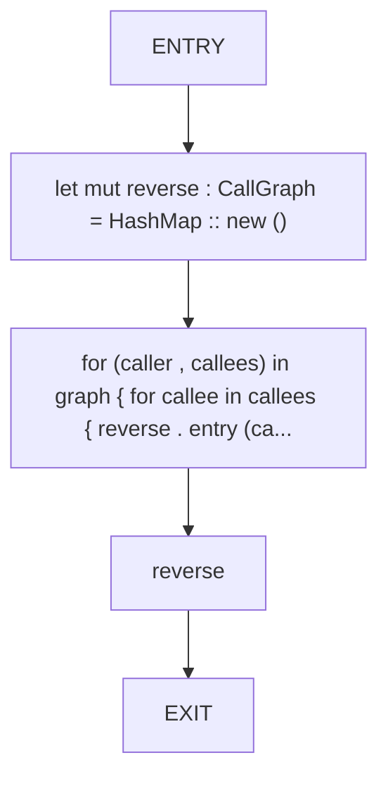
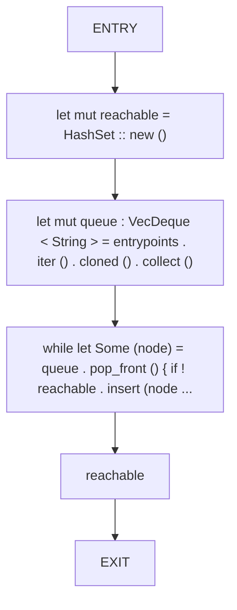
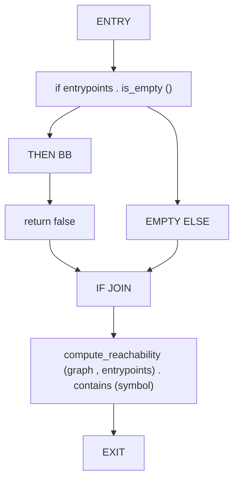
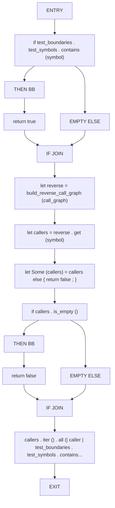

# CFG Group: src/390_dead_code_call_graph.rs

## Function: `build_call_graph`

- File: src/390_dead_code_call_graph.rs
- Branches: 0
- Loops: 0
- Nodes: 5
- Edges: 4

## Function: `build_reverse_call_graph`

- File: src/390_dead_code_call_graph.rs
- Branches: 0
- Loops: 0
- Nodes: 5
- Edges: 4

## Function: `compute_reachability`

- File: src/390_dead_code_call_graph.rs
- Branches: 0
- Loops: 0
- Nodes: 6
- Edges: 5

## Function: `is_reachable`

- File: src/390_dead_code_call_graph.rs
- Branches: 1
- Loops: 0
- Nodes: 8
- Edges: 8

## Function: `is_test_only`

- File: src/390_dead_code_call_graph.rs
- Branches: 2
- Loops: 0
- Nodes: 16
- Edges: 17

