# CFG Group: src/640_correction_intelligence_report.rs

## Function: `action_function`

- File: src/640_correction_intelligence_report.rs
- Branches: 0
- Loops: 0
- Nodes: 3
- Edges: 2

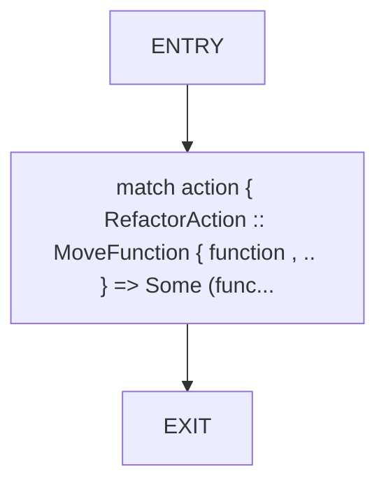

## Function: `action_module`

- File: src/640_correction_intelligence_report.rs
- Branches: 0
- Loops: 0
- Nodes: 3
- Edges: 2

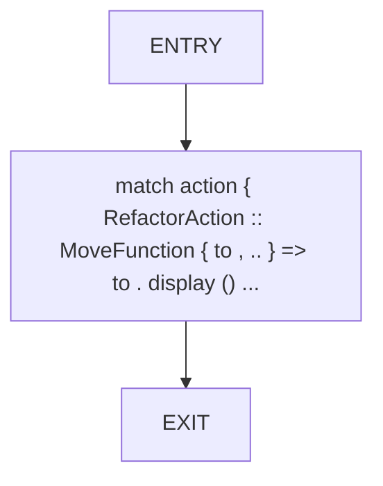

## Function: `action_module_path`

- File: src/640_correction_intelligence_report.rs
- Branches: 0
- Loops: 0
- Nodes: 3
- Edges: 2


## Function: `action_refs`

- File: src/640_correction_intelligence_report.rs
- Branches: 0
- Loops: 0
- Nodes: 3
- Edges: 2

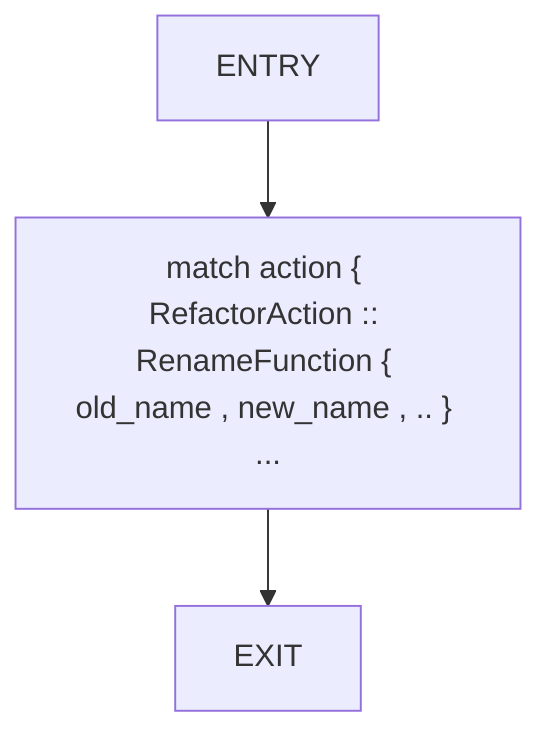

## Function: `action_symbol`

- File: src/640_correction_intelligence_report.rs
- Branches: 0
- Loops: 0
- Nodes: 3
- Edges: 2


## Function: `action_target_layer`

- File: src/640_correction_intelligence_report.rs
- Branches: 0
- Loops: 0
- Nodes: 3
- Edges: 2

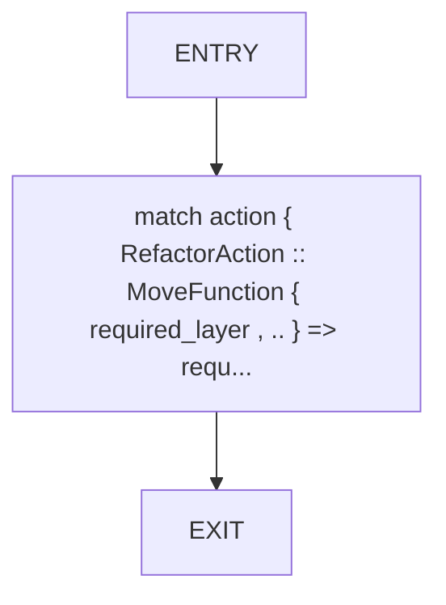

## Function: `action_visibility`

- File: src/640_correction_intelligence_report.rs
- Branches: 0
- Loops: 0
- Nodes: 3
- Edges: 2

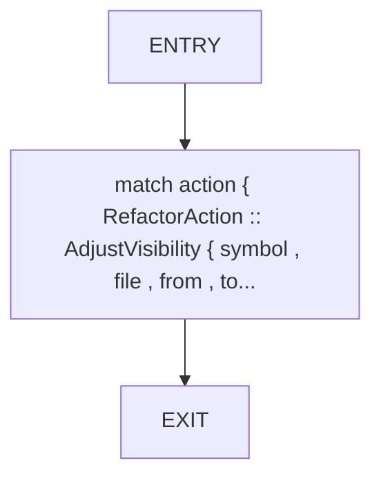

## Function: `affected_files`

- File: src/640_correction_intelligence_report.rs
- Branches: 0
- Loops: 0
- Nodes: 3
- Edges: 2

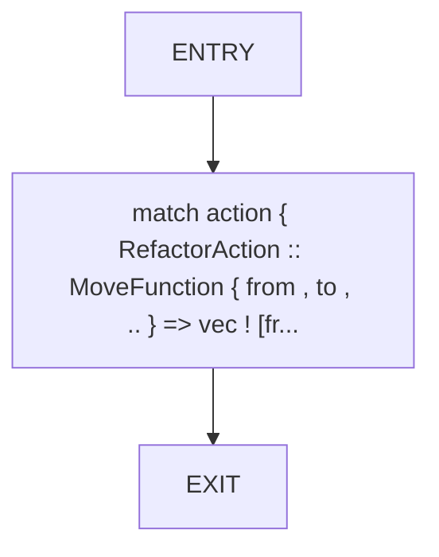

## Function: `augment_path_coherence_strategies`

- File: src/640_correction_intelligence_report.rs
- Branches: 0
- Loops: 0
- Nodes: 17
- Edges: 16

```mermaid
flowchart TD
    augment_path_coherence_strategies_0["ENTRY"]
    augment_path_coherence_strategies_1["let RefactorAction :: RenameFile { from , to } = action else { return ; }"]
    augment_path_coherence_strategies_2["let Some (old_mod) = module_name_from_path (from) else { return ; }"]
    augment_path_coherence_strategies_3["let Some (new_mod) = module_name_from_path (to) else { return ; }"]
    augment_path_coherence_strategies_4["let old_file_name = from . file_name () . and_then (| s | s . to_str ()) . unwrap_or ('')"]
    augment_path_coherence_strategies_5["let new_file_name = to . file_name () . and_then (| s | s . to_str ()) . unwrap_or ('')"]
    augment_path_coherence_strategies_6["let replace_mod = old_mod != new_mod"]
    augment_path_coherence_strategies_7["let mod_re = if replace_mod { Regex :: new (& format ! (r'^\s*(pub\s+)?mod\s+{}\s*;' , reg..."]
    augment_path_coherence_strategies_8["let use_re = if replace_mod { Regex :: new (& format ! (r'^\s*use\s+.*\b{}\b' , regex :: e..."]
    augment_path_coherence_strategies_9["let path_re = if ! old_file_name . is_empty () && ! new_file_name . is_empty () { Regex :: ..."]
    augment_path_coherence_strategies_10["let mut updates = Vec :: new ()"]
    augment_path_coherence_strategies_11["let mut seen = HashSet :: new ()"]
    augment_path_coherence_strategies_12["let rust_files = crate :: cluster_010 :: gather_rust_files (root)"]
    augment_path_coherence_strategies_13["for file in rust_files { let Ok (contents) = fs :: read_to_string (& file) el..."]
    augment_path_coherence_strategies_14["updates . sort_by (| a , b | { a . 0 . cmp (& b . 0) . then_with (| | a . 1 ...."]
    augment_path_coherence_strategies_15["for (file , old_ref , new_ref) in updates { plan . strategies . push (Correct..."]
    augment_path_coherence_strategies_16["EXIT"]
    augment_path_coherence_strategies_0 --> augment_path_coherence_strategies_1
    augment_path_coherence_strategies_1 --> augment_path_coherence_strategies_2
    augment_path_coherence_strategies_2 --> augment_path_coherence_strategies_3
    augment_path_coherence_strategies_3 --> augment_path_coherence_strategies_4
    augment_path_coherence_strategies_4 --> augment_path_coherence_strategies_5
    augment_path_coherence_strategies_5 --> augment_path_coherence_strategies_6
    augment_path_coherence_strategies_6 --> augment_path_coherence_strategies_7
    augment_path_coherence_strategies_7 --> augment_path_coherence_strategies_8
    augment_path_coherence_strategies_8 --> augment_path_coherence_strategies_9
    augment_path_coherence_strategies_9 --> augment_path_coherence_strategies_10
    augment_path_coherence_strategies_10 --> augment_path_coherence_strategies_11
    augment_path_coherence_strategies_11 --> augment_path_coherence_strategies_12
    augment_path_coherence_strategies_12 --> augment_path_coherence_strategies_13
    augment_path_coherence_strategies_13 --> augment_path_coherence_strategies_14
    augment_path_coherence_strategies_14 --> augment_path_coherence_strategies_15
    augment_path_coherence_strategies_15 --> augment_path_coherence_strategies_16
```

## Function: `average_confidence`

- File: src/640_correction_intelligence_report.rs
- Branches: 1
- Loops: 0
- Nodes: 9
- Edges: 9

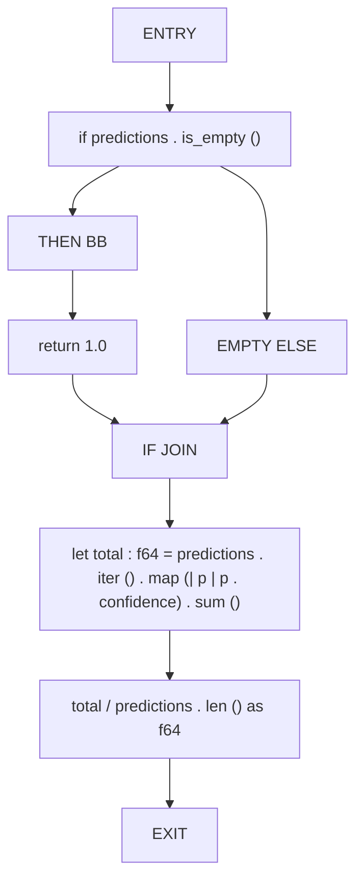

## Function: `build_rollback_criteria`

- File: src/640_correction_intelligence_report.rs
- Branches: 0
- Loops: 0
- Nodes: 7
- Edges: 6

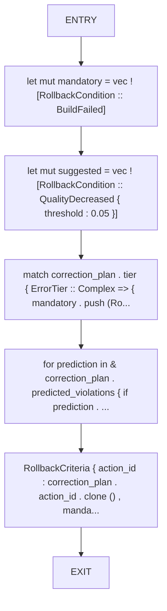

## Function: `build_state`

- File: src/640_correction_intelligence_report.rs
- Branches: 0
- Loops: 0
- Nodes: 3
- Edges: 2

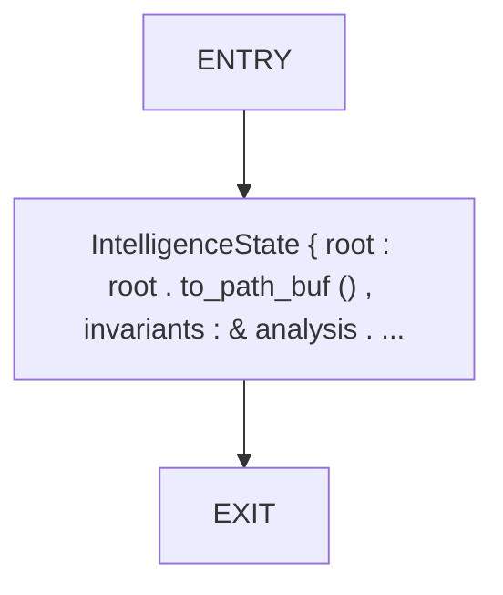

## Function: `calculate_quality_delta`

- File: src/640_correction_intelligence_report.rs
- Branches: 0
- Loops: 0
- Nodes: 9
- Edges: 8

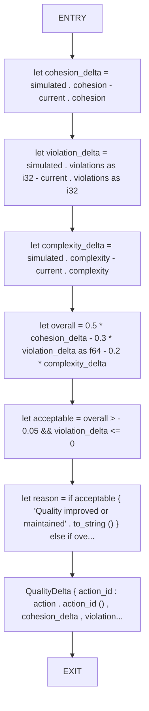

## Function: `compute_summary`

- File: src/640_correction_intelligence_report.rs
- Branches: 0
- Loops: 0
- Nodes: 12
- Edges: 11

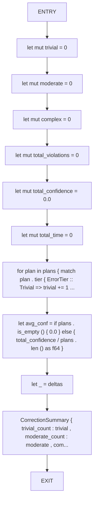

## Function: `default_confidence`

- File: src/640_correction_intelligence_report.rs
- Branches: 0
- Loops: 0
- Nodes: 3
- Edges: 2

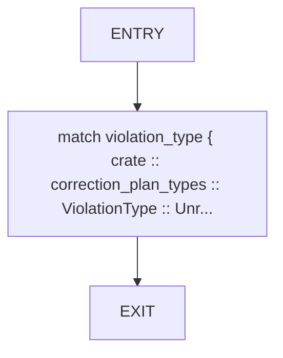

## Function: `estimate_fix_time`

- File: src/640_correction_intelligence_report.rs
- Branches: 0
- Loops: 0
- Nodes: 3
- Edges: 2

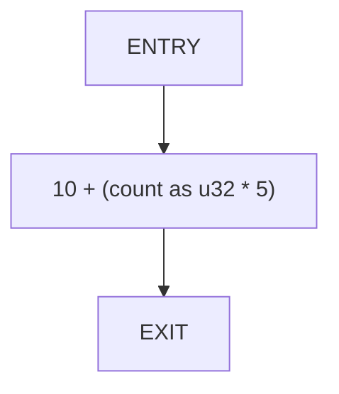

## Function: `estimate_impact`

- File: src/640_correction_intelligence_report.rs
- Branches: 0
- Loops: 0
- Nodes: 4
- Edges: 3

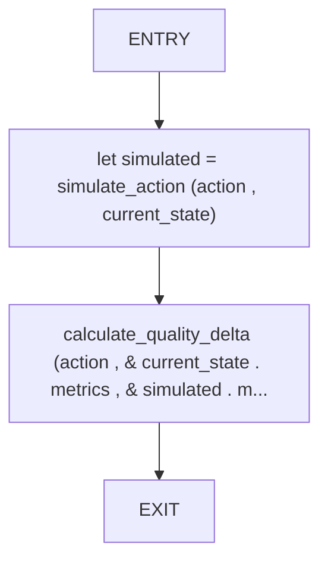

## Function: `estimate_verification_time`

- File: src/640_correction_intelligence_report.rs
- Branches: 0
- Loops: 0
- Nodes: 3
- Edges: 2

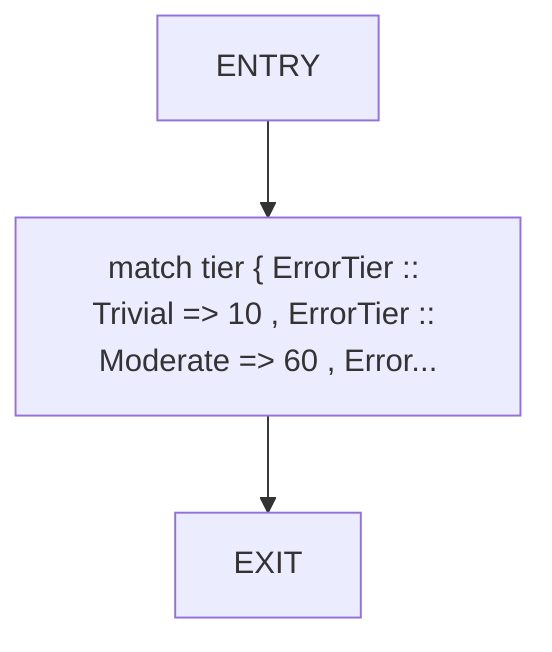

## Function: `evaluate_move_admission`

- File: src/640_correction_intelligence_report.rs
- Branches: 2
- Loops: 0
- Nodes: 21
- Edges: 22

```mermaid
flowchart TD
    evaluate_move_admission_0["ENTRY"]
    evaluate_move_admission_1["let mut reasons = Vec :: new ()"]
    evaluate_move_admission_2["let candidates = match find_function_definition_candidates (root , function) { Ok (paths) => p..."]
    evaluate_move_admission_3["if candidates . len () > 1"]
    evaluate_move_admission_4["THEN BB"]
    evaluate_move_admission_5["let locations = candidates . iter () . map (| path | path . display () . to_string ()) . coll..."]
    evaluate_move_admission_6["reasons . push (format ! ('MoveToLayer blocked for {}: ambiguous definitions ..."]
    evaluate_move_admission_7["return AdmissionDecision { admissible : false , reasons , }"]
    evaluate_move_admission_8["EMPTY ELSE"]
    evaluate_move_admission_9["IF JOIN"]
    evaluate_move_admission_10["let source_path = match candidates . into_iter () . next () { Some (path) => path , None => { r..."]
    evaluate_move_admission_11["let contents = match fs :: read_to_string (& source_path) { Ok (text) => text , Err (err) =>..."]
    evaluate_move_admission_12["if function_in_impl_block (& contents , function)"]
    evaluate_move_admission_13["THEN BB"]
    evaluate_move_admission_14["reasons . push (format ! ('MoveToLayer blocked for {}: function inside impl/t..."]
    evaluate_move_admission_15["return AdmissionDecision { admissible : false , reasons , }"]
    evaluate_move_admission_16["EMPTY ELSE"]
    evaluate_move_admission_17["IF JOIN"]
    evaluate_move_admission_18["match is_test_scoped_function (& contents , function) { Ok (true) => { reason..."]
    evaluate_move_admission_19["match find_private_dependencies (& contents , function , & source_path) { Ok ..."]
    evaluate_move_admission_20["EXIT"]
    evaluate_move_admission_0 --> evaluate_move_admission_1
    evaluate_move_admission_1 --> evaluate_move_admission_2
    evaluate_move_admission_2 --> evaluate_move_admission_3
    evaluate_move_admission_3 --> evaluate_move_admission_4
    evaluate_move_admission_4 --> evaluate_move_admission_5
    evaluate_move_admission_5 --> evaluate_move_admission_6
    evaluate_move_admission_6 --> evaluate_move_admission_7
    evaluate_move_admission_3 --> evaluate_move_admission_8
    evaluate_move_admission_7 --> evaluate_move_admission_9
    evaluate_move_admission_8 --> evaluate_move_admission_9
    evaluate_move_admission_9 --> evaluate_move_admission_10
    evaluate_move_admission_10 --> evaluate_move_admission_11
    evaluate_move_admission_11 --> evaluate_move_admission_12
    evaluate_move_admission_12 --> evaluate_move_admission_13
    evaluate_move_admission_13 --> evaluate_move_admission_14
    evaluate_move_admission_14 --> evaluate_move_admission_15
    evaluate_move_admission_12 --> evaluate_move_admission_16
    evaluate_move_admission_15 --> evaluate_move_admission_17
    evaluate_move_admission_16 --> evaluate_move_admission_17
    evaluate_move_admission_17 --> evaluate_move_admission_18
    evaluate_move_admission_18 --> evaluate_move_admission_19
    evaluate_move_admission_19 --> evaluate_move_admission_20
```

## Function: `extract_critical_tests`

- File: src/640_correction_intelligence_report.rs
- Branches: 0
- Loops: 0
- Nodes: 3
- Edges: 2

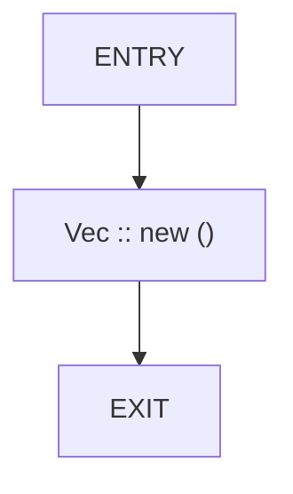

## Function: `extract_function_block_from_contents`

- File: src/640_correction_intelligence_report.rs
- Branches: 0
- Loops: 0
- Nodes: 15
- Edges: 14

```mermaid
flowchart TD
    extract_function_block_from_contents_0["ENTRY"]
    extract_function_block_from_contents_1["let mut start_idx = None"]
    extract_function_block_from_contents_2["let mut offset = 0usize"]
    extract_function_block_from_contents_3["for line in contents . lines () { let line_len = line . len () + 1 ; if is_fu..."]
    extract_function_block_from_contents_4["let start = start_idx . ok_or_else (| | { format ! ('MoveToLayer: function {} signature n..."]
    extract_function_block_from_contents_5["let bytes = contents . as_bytes ()"]
    extract_function_block_from_contents_6["let mut brace_start = None"]
    extract_function_block_from_contents_7["for idx in start .. bytes . len () { if bytes [idx] == b'{' { brace_start = S..."]
    extract_function_block_from_contents_8["let brace_start = brace_start . ok_or_else (| | { format ! ('MoveToLayer: no body found for {} ..."]
    extract_function_block_from_contents_9["let mut depth = 0i32"]
    extract_function_block_from_contents_10["let mut end_idx = None"]
    extract_function_block_from_contents_11["for idx in brace_start .. bytes . len () { match bytes [idx] { b'{' => depth ..."]
    extract_function_block_from_contents_12["let end = end_idx . ok_or_else (| | { format ! ('MoveToLayer: unterminated body for {} ..."]
    extract_function_block_from_contents_13["Ok (contents [start .. end] . to_string ())"]
    extract_function_block_from_contents_14["EXIT"]
    extract_function_block_from_contents_0 --> extract_function_block_from_contents_1
    extract_function_block_from_contents_1 --> extract_function_block_from_contents_2
    extract_function_block_from_contents_2 --> extract_function_block_from_contents_3
    extract_function_block_from_contents_3 --> extract_function_block_from_contents_4
    extract_function_block_from_contents_4 --> extract_function_block_from_contents_5
    extract_function_block_from_contents_5 --> extract_function_block_from_contents_6
    extract_function_block_from_contents_6 --> extract_function_block_from_contents_7
    extract_function_block_from_contents_7 --> extract_function_block_from_contents_8
    extract_function_block_from_contents_8 --> extract_function_block_from_contents_9
    extract_function_block_from_contents_9 --> extract_function_block_from_contents_10
    extract_function_block_from_contents_10 --> extract_function_block_from_contents_11
    extract_function_block_from_contents_11 --> extract_function_block_from_contents_12
    extract_function_block_from_contents_12 --> extract_function_block_from_contents_13
    extract_function_block_from_contents_13 --> extract_function_block_from_contents_14
```

## Function: `extract_identifiers`

- File: src/640_correction_intelligence_report.rs
- Branches: 1
- Loops: 0
- Nodes: 11
- Edges: 11

```mermaid
flowchart TD
    extract_identifiers_0["ENTRY"]
    extract_identifiers_1["let mut idents = HashSet :: new ()"]
    extract_identifiers_2["let mut current = String :: new ()"]
    extract_identifiers_3["for ch in contents . chars () { if ch . is_alphanumeric () || ch == '_' { cur..."]
    extract_identifiers_4["if ! current . is_empty () && is_identifier_candidate (& current)"]
    extract_identifiers_5["THEN BB"]
    extract_identifiers_6["idents . insert (current)"]
    extract_identifiers_7["EMPTY ELSE"]
    extract_identifiers_8["IF JOIN"]
    extract_identifiers_9["idents"]
    extract_identifiers_10["EXIT"]
    extract_identifiers_0 --> extract_identifiers_1
    extract_identifiers_1 --> extract_identifiers_2
    extract_identifiers_2 --> extract_identifiers_3
    extract_identifiers_3 --> extract_identifiers_4
    extract_identifiers_4 --> extract_identifiers_5
    extract_identifiers_5 --> extract_identifiers_6
    extract_identifiers_4 --> extract_identifiers_7
    extract_identifiers_6 --> extract_identifiers_8
    extract_identifiers_7 --> extract_identifiers_8
    extract_identifiers_8 --> extract_identifiers_9
    extract_identifiers_9 --> extract_identifiers_10
```

## Function: `fill_prediction_confidence`

- File: src/640_correction_intelligence_report.rs
- Branches: 0
- Loops: 0
- Nodes: 3
- Edges: 2

```mermaid
flowchart TD
    fill_prediction_confidence_0["ENTRY"]
    fill_prediction_confidence_1["for prediction in predictions { if prediction . confidence <= 0.0 { predictio..."]
    fill_prediction_confidence_2["EXIT"]
    fill_prediction_confidence_0 --> fill_prediction_confidence_1
    fill_prediction_confidence_1 --> fill_prediction_confidence_2
```

## Function: `filter_path_coherence_report`

- File: src/640_correction_intelligence_report.rs
- Branches: 0
- Loops: 0
- Nodes: 9
- Edges: 8

```mermaid
flowchart TD
    filter_path_coherence_report_0["ENTRY"]
    filter_path_coherence_report_1["let mut plans = Vec :: new ()"]
    filter_path_coherence_report_2["let mut policies = Vec :: new ()"]
    filter_path_coherence_report_3["let mut criteria = Vec :: new ()"]
    filter_path_coherence_report_4["let mut deltas = Vec :: new ()"]
    filter_path_coherence_report_5["for (idx , plan) in report . correction_plans . iter () . enumerate () { let ..."]
    filter_path_coherence_report_6["let summary = compute_summary (& plans , & deltas)"]
    filter_path_coherence_report_7["CorrectionIntelligenceReport { version : report . version . clone () , timest..."]
    filter_path_coherence_report_8["EXIT"]
    filter_path_coherence_report_0 --> filter_path_coherence_report_1
    filter_path_coherence_report_1 --> filter_path_coherence_report_2
    filter_path_coherence_report_2 --> filter_path_coherence_report_3
    filter_path_coherence_report_3 --> filter_path_coherence_report_4
    filter_path_coherence_report_4 --> filter_path_coherence_report_5
    filter_path_coherence_report_5 --> filter_path_coherence_report_6
    filter_path_coherence_report_6 --> filter_path_coherence_report_7
    filter_path_coherence_report_7 --> filter_path_coherence_report_8
```

## Function: `filter_visibility_report`

- File: src/640_correction_intelligence_report.rs
- Branches: 0
- Loops: 0
- Nodes: 9
- Edges: 8

```mermaid
flowchart TD
    filter_visibility_report_0["ENTRY"]
    filter_visibility_report_1["let mut plans = Vec :: new ()"]
    filter_visibility_report_2["let mut policies = Vec :: new ()"]
    filter_visibility_report_3["let mut criteria = Vec :: new ()"]
    filter_visibility_report_4["let mut deltas = Vec :: new ()"]
    filter_visibility_report_5["for (idx , plan) in report . correction_plans . iter () . enumerate () { let ..."]
    filter_visibility_report_6["let summary = compute_summary (& plans , & deltas)"]
    filter_visibility_report_7["CorrectionIntelligenceReport { version : report . version . clone () , timest..."]
    filter_visibility_report_8["EXIT"]
    filter_visibility_report_0 --> filter_visibility_report_1
    filter_visibility_report_1 --> filter_visibility_report_2
    filter_visibility_report_2 --> filter_visibility_report_3
    filter_visibility_report_3 --> filter_visibility_report_4
    filter_visibility_report_4 --> filter_visibility_report_5
    filter_visibility_report_5 --> filter_visibility_report_6
    filter_visibility_report_6 --> filter_visibility_report_7
    filter_visibility_report_7 --> filter_visibility_report_8
```

## Function: `find_callers`

- File: src/640_correction_intelligence_report.rs
- Branches: 1
- Loops: 0
- Nodes: 9
- Edges: 9

```mermaid
flowchart TD
    find_callers_0["ENTRY"]
    find_callers_1["let mut files = HashSet :: new ()"]
    find_callers_2["if let Some (node) = call_graph . get (function)"]
    find_callers_3["THEN BB"]
    find_callers_4["for caller in & node . called_by { if let Some (file) = find_element_file (ca..."]
    find_callers_5["EMPTY ELSE"]
    find_callers_6["IF JOIN"]
    find_callers_7["files . into_iter () . collect ()"]
    find_callers_8["EXIT"]
    find_callers_0 --> find_callers_1
    find_callers_1 --> find_callers_2
    find_callers_2 --> find_callers_3
    find_callers_3 --> find_callers_4
    find_callers_2 --> find_callers_5
    find_callers_4 --> find_callers_6
    find_callers_5 --> find_callers_6
    find_callers_6 --> find_callers_7
    find_callers_7 --> find_callers_8
```

## Function: `find_element_file`

- File: src/640_correction_intelligence_report.rs
- Branches: 0
- Loops: 0
- Nodes: 3
- Edges: 2

```mermaid
flowchart TD
    find_element_file_0["ENTRY"]
    find_element_file_1["elements . iter () . find (| el | el . name == function) . map (| el | PathBu..."]
    find_element_file_2["EXIT"]
    find_element_file_0 --> find_element_file_1
    find_element_file_1 --> find_element_file_2
```

## Function: `find_function_definition_candidates`

- File: src/640_correction_intelligence_report.rs
- Branches: 1
- Loops: 0
- Nodes: 12
- Edges: 12

```mermaid
flowchart TD
    find_function_definition_candidates_0["ENTRY"]
    find_function_definition_candidates_1["let search_root = if root . join ('src') . is_dir () { root . join ('src') } else { root . to_p..."]
    find_function_definition_candidates_2["let mut matches = Vec :: new ()"]
    find_function_definition_candidates_3["let mut stack = vec ! [search_root]"]
    find_function_definition_candidates_4["while let Some (dir) = stack . pop () { let entries = fs :: read_dir (& dir) ..."]
    find_function_definition_candidates_5["if matches . is_empty ()"]
    find_function_definition_candidates_6["THEN BB"]
    find_function_definition_candidates_7["return Err (format ! ('MoveToLayer: function {} not found' , function))"]
    find_function_definition_candidates_8["EMPTY ELSE"]
    find_function_definition_candidates_9["IF JOIN"]
    find_function_definition_candidates_10["Ok (matches)"]
    find_function_definition_candidates_11["EXIT"]
    find_function_definition_candidates_0 --> find_function_definition_candidates_1
    find_function_definition_candidates_1 --> find_function_definition_candidates_2
    find_function_definition_candidates_2 --> find_function_definition_candidates_3
    find_function_definition_candidates_3 --> find_function_definition_candidates_4
    find_function_definition_candidates_4 --> find_function_definition_candidates_5
    find_function_definition_candidates_5 --> find_function_definition_candidates_6
    find_function_definition_candidates_6 --> find_function_definition_candidates_7
    find_function_definition_candidates_5 --> find_function_definition_candidates_8
    find_function_definition_candidates_7 --> find_function_definition_candidates_9
    find_function_definition_candidates_8 --> find_function_definition_candidates_9
    find_function_definition_candidates_9 --> find_function_definition_candidates_10
    find_function_definition_candidates_10 --> find_function_definition_candidates_11
```

## Function: `find_private_dependencies`

- File: src/640_correction_intelligence_report.rs
- Branches: 0
- Loops: 0
- Nodes: 8
- Edges: 7

```mermaid
flowchart TD
    find_private_dependencies_0["ENTRY"]
    find_private_dependencies_1["let function_block = extract_function_block_from_contents (contents , function) ?"]
    find_private_dependencies_2["let identifiers = extract_identifiers (& function_block)"]
    find_private_dependencies_3["let mut blockers = Vec :: new ()"]
    find_private_dependencies_4["let mut seen = HashSet :: new ()"]
    find_private_dependencies_5["for line in contents . lines () { let trimmed = line . trim_start () ; let (v..."]
    find_private_dependencies_6["Ok (blockers)"]
    find_private_dependencies_7["EXIT"]
    find_private_dependencies_0 --> find_private_dependencies_1
    find_private_dependencies_1 --> find_private_dependencies_2
    find_private_dependencies_2 --> find_private_dependencies_3
    find_private_dependencies_3 --> find_private_dependencies_4
    find_private_dependencies_4 --> find_private_dependencies_5
    find_private_dependencies_5 --> find_private_dependencies_6
    find_private_dependencies_6 --> find_private_dependencies_7
```

## Function: `find_reference_files`

- File: src/640_correction_intelligence_report.rs
- Branches: 0
- Loops: 0
- Nodes: 5
- Edges: 4

```mermaid
flowchart TD
    find_reference_files_0["ENTRY"]
    find_reference_files_1["let mut files = HashSet :: new ()"]
    find_reference_files_2["for (caller , node) in call_graph { if node . calls . iter () . any (| c | c ..."]
    find_reference_files_3["files . into_iter () . collect ()"]
    find_reference_files_4["EXIT"]
    find_reference_files_0 --> find_reference_files_1
    find_reference_files_1 --> find_reference_files_2
    find_reference_files_2 --> find_reference_files_3
    find_reference_files_3 --> find_reference_files_4
```

## Function: `function_in_impl_block`

- File: src/640_correction_intelligence_report.rs
- Branches: 0
- Loops: 0
- Nodes: 5
- Edges: 4

```mermaid
flowchart TD
    function_in_impl_block_0["ENTRY"]
    function_in_impl_block_1["let mut impl_depth = 0i32"]
    function_in_impl_block_2["for line in contents . lines () { if is_function_signature_line (line , funct..."]
    function_in_impl_block_3["false"]
    function_in_impl_block_4["EXIT"]
    function_in_impl_block_0 --> function_in_impl_block_1
    function_in_impl_block_1 --> function_in_impl_block_2
    function_in_impl_block_2 --> function_in_impl_block_3
    function_in_impl_block_3 --> function_in_impl_block_4
```

## Function: `function_signature_found`

- File: src/640_correction_intelligence_report.rs
- Branches: 0
- Loops: 0
- Nodes: 3
- Edges: 2

```mermaid
flowchart TD
    function_signature_found_0["ENTRY"]
    function_signature_found_1["contents . lines () . any (| line | is_function_signature_line (line , functi..."]
    function_signature_found_2["EXIT"]
    function_signature_found_0 --> function_signature_found_1
    function_signature_found_1 --> function_signature_found_2
```

## Function: `generate_admission_preflight`

- File: src/640_correction_intelligence_report.rs
- Branches: 0
- Loops: 0
- Nodes: 7
- Edges: 6

```mermaid
flowchart TD
    generate_admission_preflight_0["ENTRY"]
    generate_admission_preflight_1["let mut entries = Vec :: new ()"]
    generate_admission_preflight_2["for plan in & report . correction_plans { for strategy in & plan . strategies..."]
    generate_admission_preflight_3["let admissible = entries . iter () . filter (| entry | entry . admissible) . count ()"]
    generate_admission_preflight_4["let summary = AdmissionPreflightSummary { total_moves : entries . len () , admissible , blo..."]
    generate_admission_preflight_5["AdmissionPreflightReport { version : report . version . clone () , timestamp ..."]
    generate_admission_preflight_6["EXIT"]
    generate_admission_preflight_0 --> generate_admission_preflight_1
    generate_admission_preflight_1 --> generate_admission_preflight_2
    generate_admission_preflight_2 --> generate_admission_preflight_3
    generate_admission_preflight_3 --> generate_admission_preflight_4
    generate_admission_preflight_4 --> generate_admission_preflight_5
    generate_admission_preflight_5 --> generate_admission_preflight_6
```

## Function: `generate_correction_plan`

- File: src/640_correction_intelligence_report.rs
- Branches: 0
- Loops: 0
- Nodes: 6
- Edges: 5

```mermaid
flowchart TD
    generate_correction_plan_0["ENTRY"]
    generate_correction_plan_1["let mut strategies = Vec :: new ()"]
    generate_correction_plan_2["for prediction in predictions { match prediction . violation_type { Violation..."]
    generate_correction_plan_3["let tier = predictions . iter () . map (classify_tier) . max () . unwrap_or (ErrorTier :..."]
    generate_correction_plan_4["CorrectionPlan { action_id : action . action_id () , tier , predicted_violati..."]
    generate_correction_plan_5["EXIT"]
    generate_correction_plan_0 --> generate_correction_plan_1
    generate_correction_plan_1 --> generate_correction_plan_2
    generate_correction_plan_2 --> generate_correction_plan_3
    generate_correction_plan_3 --> generate_correction_plan_4
    generate_correction_plan_4 --> generate_correction_plan_5
```

## Function: `generate_intelligence_report`

- File: src/640_correction_intelligence_report.rs
- Branches: 0
- Loops: 0
- Nodes: 9
- Edges: 8

```mermaid
flowchart TD
    generate_intelligence_report_0["ENTRY"]
    generate_intelligence_report_1["let mut plans = Vec :: new ()"]
    generate_intelligence_report_2["let mut policies = Vec :: new ()"]
    generate_intelligence_report_3["let mut criteria = Vec :: new ()"]
    generate_intelligence_report_4["let mut deltas = Vec :: new ()"]
    generate_intelligence_report_5["for action in actions { let mut predictions = predict_violations (action , st..."]
    generate_intelligence_report_6["let summary = compute_summary (& plans , & deltas)"]
    generate_intelligence_report_7["CorrectionIntelligenceReport { version : '1.0' . to_string () , timestamp : c..."]
    generate_intelligence_report_8["EXIT"]
    generate_intelligence_report_0 --> generate_intelligence_report_1
    generate_intelligence_report_1 --> generate_intelligence_report_2
    generate_intelligence_report_2 --> generate_intelligence_report_3
    generate_intelligence_report_3 --> generate_intelligence_report_4
    generate_intelligence_report_4 --> generate_intelligence_report_5
    generate_intelligence_report_5 --> generate_intelligence_report_6
    generate_intelligence_report_6 --> generate_intelligence_report_7
    generate_intelligence_report_7 --> generate_intelligence_report_8
```

## Function: `generate_phase2_cluster_slice`

- File: src/640_correction_intelligence_report.rs
- Branches: 1
- Loops: 0
- Nodes: 16
- Edges: 16

```mermaid
flowchart TD
    generate_phase2_cluster_slice_0["ENTRY"]
    generate_phase2_cluster_slice_1["let batches = parse_phase2_cluster_plan (plan_path) ?"]
    generate_phase2_cluster_slice_2["let batch = batches . get (batch_index . saturating_sub (1)) . ok_or_else (| | { std :: i..."]
    generate_phase2_cluster_slice_3["if batch . moves . is_empty ()"]
    generate_phase2_cluster_slice_4["THEN BB"]
    generate_phase2_cluster_slice_5["return Err (std :: io :: Error :: new (std :: io :: ErrorKind :: InvalidData ..."]
    generate_phase2_cluster_slice_6["EMPTY ELSE"]
    generate_phase2_cluster_slice_7["IF JOIN"]
    generate_phase2_cluster_slice_8["let mut plans = Vec :: new ()"]
    generate_phase2_cluster_slice_9["let mut policies = Vec :: new ()"]
    generate_phase2_cluster_slice_10["let mut criteria = Vec :: new ()"]
    generate_phase2_cluster_slice_11["let mut deltas = Vec :: new ()"]
    generate_phase2_cluster_slice_12["for entry in & batch . moves { let action = RefactorAction :: MoveFunction { ..."]
    generate_phase2_cluster_slice_13["let summary = compute_summary (& plans , & deltas)"]
    generate_phase2_cluster_slice_14["Ok (CorrectionIntelligenceReport { version : '1.0' . to_string () , timestamp..."]
    generate_phase2_cluster_slice_15["EXIT"]
    generate_phase2_cluster_slice_0 --> generate_phase2_cluster_slice_1
    generate_phase2_cluster_slice_1 --> generate_phase2_cluster_slice_2
    generate_phase2_cluster_slice_2 --> generate_phase2_cluster_slice_3
    generate_phase2_cluster_slice_3 --> generate_phase2_cluster_slice_4
    generate_phase2_cluster_slice_4 --> generate_phase2_cluster_slice_5
    generate_phase2_cluster_slice_3 --> generate_phase2_cluster_slice_6
    generate_phase2_cluster_slice_5 --> generate_phase2_cluster_slice_7
    generate_phase2_cluster_slice_6 --> generate_phase2_cluster_slice_7
    generate_phase2_cluster_slice_7 --> generate_phase2_cluster_slice_8
    generate_phase2_cluster_slice_8 --> generate_phase2_cluster_slice_9
    generate_phase2_cluster_slice_9 --> generate_phase2_cluster_slice_10
    generate_phase2_cluster_slice_10 --> generate_phase2_cluster_slice_11
    generate_phase2_cluster_slice_11 --> generate_phase2_cluster_slice_12
    generate_phase2_cluster_slice_12 --> generate_phase2_cluster_slice_13
    generate_phase2_cluster_slice_13 --> generate_phase2_cluster_slice_14
    generate_phase2_cluster_slice_14 --> generate_phase2_cluster_slice_15
```

## Function: `is_function_signature_line`

- File: src/640_correction_intelligence_report.rs
- Branches: 1
- Loops: 0
- Nodes: 10
- Edges: 10

```mermaid
flowchart TD
    is_function_signature_line_0["ENTRY"]
    is_function_signature_line_1["let trimmed = line . trim_start ()"]
    is_function_signature_line_2["if ! trimmed . contains ('fn ')"]
    is_function_signature_line_3["THEN BB"]
    is_function_signature_line_4["return false"]
    is_function_signature_line_5["EMPTY ELSE"]
    is_function_signature_line_6["IF JOIN"]
    is_function_signature_line_7["let patterns = [format ! ('fn {}(' , function) , format ! ('fn {}<' , function) , format ! (..."]
    is_function_signature_line_8["patterns . iter () . any (| pattern | trimmed . contains (pattern))"]
    is_function_signature_line_9["EXIT"]
    is_function_signature_line_0 --> is_function_signature_line_1
    is_function_signature_line_1 --> is_function_signature_line_2
    is_function_signature_line_2 --> is_function_signature_line_3
    is_function_signature_line_3 --> is_function_signature_line_4
    is_function_signature_line_2 --> is_function_signature_line_5
    is_function_signature_line_4 --> is_function_signature_line_6
    is_function_signature_line_5 --> is_function_signature_line_6
    is_function_signature_line_6 --> is_function_signature_line_7
    is_function_signature_line_7 --> is_function_signature_line_8
    is_function_signature_line_8 --> is_function_signature_line_9
```

## Function: `is_identifier_candidate`

- File: src/640_correction_intelligence_report.rs
- Branches: 2
- Loops: 0
- Nodes: 16
- Edges: 17

```mermaid
flowchart TD
    is_identifier_candidate_0["ENTRY"]
    is_identifier_candidate_1["if value . chars () . next () . map (| c | c . is_numeric ()) . unwrap_or (fa..."]
    is_identifier_candidate_2["THEN BB"]
    is_identifier_candidate_3["return false"]
    is_identifier_candidate_4["EMPTY ELSE"]
    is_identifier_candidate_5["IF JOIN"]
    is_identifier_candidate_6["let lower = value . to_lowercase ()"]
    is_identifier_candidate_7["let keywords = ['fn' , 'let' , 'mut' , 'pub' , 'use' , 'crate' , 'self' , 'super' , 'mod' , ..."]
    is_identifier_candidate_8["if keywords . contains (& lower . as_str ())"]
    is_identifier_candidate_9["THEN BB"]
    is_identifier_candidate_10["return false"]
    is_identifier_candidate_11["EMPTY ELSE"]
    is_identifier_candidate_12["IF JOIN"]
    is_identifier_candidate_13["let primitives = ['i8' , 'i16' , 'i32' , 'i64' , 'i128' , 'isize' , 'u8' , 'u16' , 'u32' , 'u6..."]
    is_identifier_candidate_14["! primitives . contains (& lower . as_str ())"]
    is_identifier_candidate_15["EXIT"]
    is_identifier_candidate_0 --> is_identifier_candidate_1
    is_identifier_candidate_1 --> is_identifier_candidate_2
    is_identifier_candidate_2 --> is_identifier_candidate_3
    is_identifier_candidate_1 --> is_identifier_candidate_4
    is_identifier_candidate_3 --> is_identifier_candidate_5
    is_identifier_candidate_4 --> is_identifier_candidate_5
    is_identifier_candidate_5 --> is_identifier_candidate_6
    is_identifier_candidate_6 --> is_identifier_candidate_7
    is_identifier_candidate_7 --> is_identifier_candidate_8
    is_identifier_candidate_8 --> is_identifier_candidate_9
    is_identifier_candidate_9 --> is_identifier_candidate_10
    is_identifier_candidate_8 --> is_identifier_candidate_11
    is_identifier_candidate_10 --> is_identifier_candidate_12
    is_identifier_candidate_11 --> is_identifier_candidate_12
    is_identifier_candidate_12 --> is_identifier_candidate_13
    is_identifier_candidate_13 --> is_identifier_candidate_14
    is_identifier_candidate_14 --> is_identifier_candidate_15
```

## Function: `is_test_attribute_line`

- File: src/640_correction_intelligence_report.rs
- Branches: 1
- Loops: 0
- Nodes: 9
- Edges: 9

```mermaid
flowchart TD
    is_test_attribute_line_0["ENTRY"]
    is_test_attribute_line_1["if ! trimmed . starts_with ('#[')"]
    is_test_attribute_line_2["THEN BB"]
    is_test_attribute_line_3["return false"]
    is_test_attribute_line_4["EMPTY ELSE"]
    is_test_attribute_line_5["IF JOIN"]
    is_test_attribute_line_6["let lower = trimmed . to_ascii_lowercase ()"]
    is_test_attribute_line_7["lower . contains ('test') && ! lower . contains ('cfg')"]
    is_test_attribute_line_8["EXIT"]
    is_test_attribute_line_0 --> is_test_attribute_line_1
    is_test_attribute_line_1 --> is_test_attribute_line_2
    is_test_attribute_line_2 --> is_test_attribute_line_3
    is_test_attribute_line_1 --> is_test_attribute_line_4
    is_test_attribute_line_3 --> is_test_attribute_line_5
    is_test_attribute_line_4 --> is_test_attribute_line_5
    is_test_attribute_line_5 --> is_test_attribute_line_6
    is_test_attribute_line_6 --> is_test_attribute_line_7
    is_test_attribute_line_7 --> is_test_attribute_line_8
```

## Function: `is_test_scoped_function`

- File: src/640_correction_intelligence_report.rs
- Branches: 0
- Loops: 0
- Nodes: 9
- Edges: 8

```mermaid
flowchart TD
    is_test_scoped_function_0["ENTRY"]
    is_test_scoped_function_1["let mut brace_depth : i32 = 0"]
    is_test_scoped_function_2["let mut attr_test = false"]
    is_test_scoped_function_3["let mut pending_cfg_test = false"]
    is_test_scoped_function_4["let mut pending_test_mod = false"]
    is_test_scoped_function_5["let mut test_mod_depths : Vec < i32 > = Vec :: new ()"]
    is_test_scoped_function_6["for line in contents . lines () { let trimmed = line . trim_start () ; if tri..."]
    is_test_scoped_function_7["Ok (false)"]
    is_test_scoped_function_8["EXIT"]
    is_test_scoped_function_0 --> is_test_scoped_function_1
    is_test_scoped_function_1 --> is_test_scoped_function_2
    is_test_scoped_function_2 --> is_test_scoped_function_3
    is_test_scoped_function_3 --> is_test_scoped_function_4
    is_test_scoped_function_4 --> is_test_scoped_function_5
    is_test_scoped_function_5 --> is_test_scoped_function_6
    is_test_scoped_function_6 --> is_test_scoped_function_7
    is_test_scoped_function_7 --> is_test_scoped_function_8
```

## Function: `module_name_from_path`

- File: src/640_correction_intelligence_report.rs
- Branches: 0
- Loops: 0
- Nodes: 5
- Edges: 4

```mermaid
flowchart TD
    module_name_from_path_0["ENTRY"]
    module_name_from_path_1["let stem = path . file_stem () . and_then (| s | s . to_str ()) ?"]
    module_name_from_path_2["let name = if stem == 'mod' { path . parent () . and_then (| p | p . file_name ()) . and..."]
    module_name_from_path_3["Some (crate :: cluster_010 :: normalize_module_name (& name))"]
    module_name_from_path_4["EXIT"]
    module_name_from_path_0 --> module_name_from_path_1
    module_name_from_path_1 --> module_name_from_path_2
    module_name_from_path_2 --> module_name_from_path_3
    module_name_from_path_3 --> module_name_from_path_4
```

## Function: `move_violates_invariant`

- File: src/640_correction_intelligence_report.rs
- Branches: 0
- Loops: 0
- Nodes: 3
- Edges: 2

```mermaid
flowchart TD
    move_violates_invariant_0["ENTRY"]
    move_violates_invariant_1["false"]
    move_violates_invariant_2["EXIT"]
    move_violates_invariant_0 --> move_violates_invariant_1
    move_violates_invariant_1 --> move_violates_invariant_2
```

## Function: `parse_phase2_cluster_plan`

- File: src/640_correction_intelligence_report.rs
- Branches: 1
- Loops: 0
- Nodes: 14
- Edges: 14

```mermaid
flowchart TD
    parse_phase2_cluster_plan_0["ENTRY"]
    parse_phase2_cluster_plan_1["let contents = fs :: read_to_string (plan_path) ?"]
    parse_phase2_cluster_plan_2["let batch_re = Regex :: new (r'^#### Batch \d+: target '([^']+)'') . map_err (| err | { std ..."]
    parse_phase2_cluster_plan_3["let move_re = Regex :: new (r'^- Move '([^']+)' from '([^']+)'') . map_err (| err | { std :..."]
    parse_phase2_cluster_plan_4["let mut batches = Vec :: new ()"]
    parse_phase2_cluster_plan_5["let mut current : Option < ClusterBatch > = None"]
    parse_phase2_cluster_plan_6["for line in contents . lines () { if let Some (captures) = batch_re . capture..."]
    parse_phase2_cluster_plan_7["if let Some (batch) = current"]
    parse_phase2_cluster_plan_8["THEN BB"]
    parse_phase2_cluster_plan_9["batches . push (batch)"]
    parse_phase2_cluster_plan_10["EMPTY ELSE"]
    parse_phase2_cluster_plan_11["IF JOIN"]
    parse_phase2_cluster_plan_12["Ok (batches)"]
    parse_phase2_cluster_plan_13["EXIT"]
    parse_phase2_cluster_plan_0 --> parse_phase2_cluster_plan_1
    parse_phase2_cluster_plan_1 --> parse_phase2_cluster_plan_2
    parse_phase2_cluster_plan_2 --> parse_phase2_cluster_plan_3
    parse_phase2_cluster_plan_3 --> parse_phase2_cluster_plan_4
    parse_phase2_cluster_plan_4 --> parse_phase2_cluster_plan_5
    parse_phase2_cluster_plan_5 --> parse_phase2_cluster_plan_6
    parse_phase2_cluster_plan_6 --> parse_phase2_cluster_plan_7
    parse_phase2_cluster_plan_7 --> parse_phase2_cluster_plan_8
    parse_phase2_cluster_plan_8 --> parse_phase2_cluster_plan_9
    parse_phase2_cluster_plan_7 --> parse_phase2_cluster_plan_10
    parse_phase2_cluster_plan_9 --> parse_phase2_cluster_plan_11
    parse_phase2_cluster_plan_10 --> parse_phase2_cluster_plan_11
    parse_phase2_cluster_plan_11 --> parse_phase2_cluster_plan_12
    parse_phase2_cluster_plan_12 --> parse_phase2_cluster_plan_13
```

## Function: `plan_verification_scope`

- File: src/640_correction_intelligence_report.rs
- Branches: 1
- Loops: 0
- Nodes: 10
- Edges: 10

```mermaid
flowchart TD
    plan_verification_scope_0["ENTRY"]
    plan_verification_scope_1["let scope = match correction_plan . tier { ErrorTier :: Trivial if correction_plan . pred..."]
    plan_verification_scope_2["let mut required_checks = vec ! [VerificationCheck :: CargoCheck]"]
    plan_verification_scope_3["if matches ! (correction_plan . tier , ErrorTier :: Moderate | ErrorTier :: C..."]
    plan_verification_scope_4["THEN BB"]
    plan_verification_scope_5["required_checks . push (VerificationCheck :: CargoTest { filter : None })"]
    plan_verification_scope_6["EMPTY ELSE"]
    plan_verification_scope_7["IF JOIN"]
    plan_verification_scope_8["VerificationPolicy { action_id : correction_plan . action_id . clone () , sco..."]
    plan_verification_scope_9["EXIT"]
    plan_verification_scope_0 --> plan_verification_scope_1
    plan_verification_scope_1 --> plan_verification_scope_2
    plan_verification_scope_2 --> plan_verification_scope_3
    plan_verification_scope_3 --> plan_verification_scope_4
    plan_verification_scope_4 --> plan_verification_scope_5
    plan_verification_scope_3 --> plan_verification_scope_6
    plan_verification_scope_5 --> plan_verification_scope_7
    plan_verification_scope_6 --> plan_verification_scope_7
    plan_verification_scope_7 --> plan_verification_scope_8
    plan_verification_scope_8 --> plan_verification_scope_9
```

## Function: `predict_violations`

- File: src/640_correction_intelligence_report.rs
- Branches: 0
- Loops: 0
- Nodes: 5
- Edges: 4

```mermaid
flowchart TD
    predict_violations_0["ENTRY"]
    predict_violations_1["let mut predictions = Vec :: new ()"]
    predict_violations_2["match action { RefactorAction :: MoveFunction { function , from , to , requir..."]
    predict_violations_3["predictions"]
    predict_violations_4["EXIT"]
    predict_violations_0 --> predict_violations_1
    predict_violations_1 --> predict_violations_2
    predict_violations_2 --> predict_violations_3
    predict_violations_3 --> predict_violations_4
```

## Function: `simulate_action`

- File: src/640_correction_intelligence_report.rs
- Branches: 0
- Loops: 0
- Nodes: 3
- Edges: 2

```mermaid
flowchart TD
    simulate_action_0["ENTRY"]
    simulate_action_1["state . clone ()"]
    simulate_action_2["EXIT"]
    simulate_action_0 --> simulate_action_1
    simulate_action_1 --> simulate_action_2
```

## Function: `symbol_exists`

- File: src/640_correction_intelligence_report.rs
- Branches: 0
- Loops: 0
- Nodes: 3
- Edges: 2

```mermaid
flowchart TD
    symbol_exists_0["ENTRY"]
    symbol_exists_1["elements . iter () . any (| el | el . name == symbol)"]
    symbol_exists_2["EXIT"]
    symbol_exists_0 --> symbol_exists_1
    symbol_exists_1 --> symbol_exists_2
```

## Function: `write_admission_preflight_report`

- File: src/640_correction_intelligence_report.rs
- Branches: 0
- Loops: 0
- Nodes: 7
- Edges: 6

```mermaid
flowchart TD
    write_admission_preflight_report_0["ENTRY"]
    write_admission_preflight_report_1["let preflight = generate_admission_preflight (report , root)"]
    write_admission_preflight_report_2["std :: fs :: create_dir_all (output_dir) ?"]
    write_admission_preflight_report_3["let path = output_dir . join ('admission_preflight.json')"]
    write_admission_preflight_report_4["std :: fs :: write (path , serde_json :: to_string_pretty (& preflight) ?) ?"]
    write_admission_preflight_report_5["Ok (())"]
    write_admission_preflight_report_6["EXIT"]
    write_admission_preflight_report_0 --> write_admission_preflight_report_1
    write_admission_preflight_report_1 --> write_admission_preflight_report_2
    write_admission_preflight_report_2 --> write_admission_preflight_report_3
    write_admission_preflight_report_3 --> write_admission_preflight_report_4
    write_admission_preflight_report_4 --> write_admission_preflight_report_5
    write_admission_preflight_report_5 --> write_admission_preflight_report_6
```

