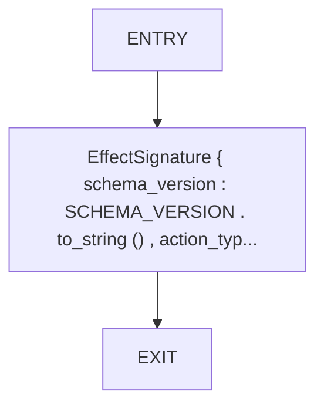
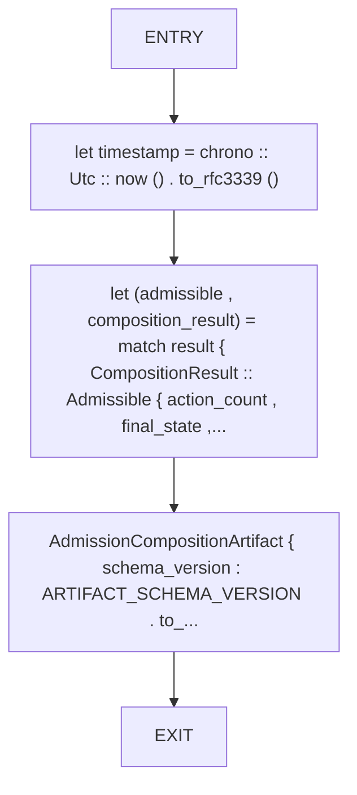
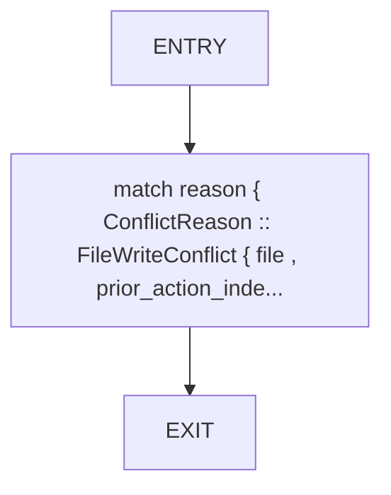
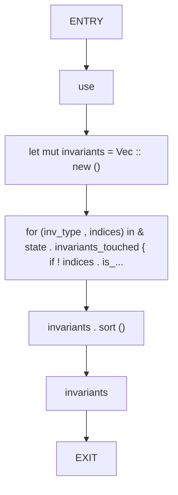
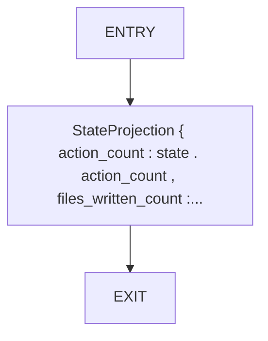
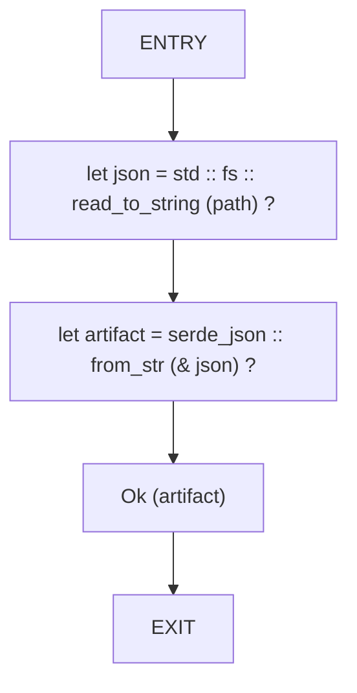
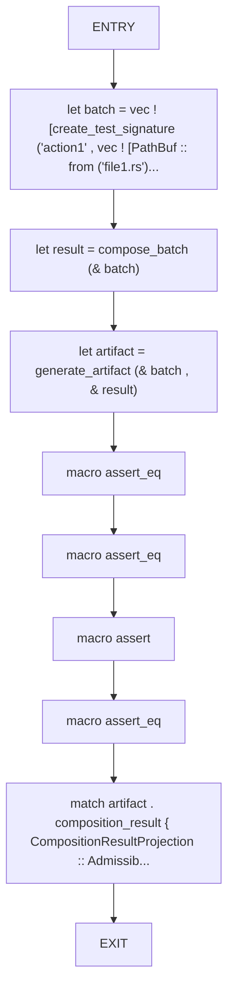
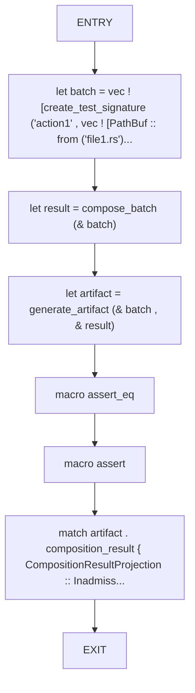
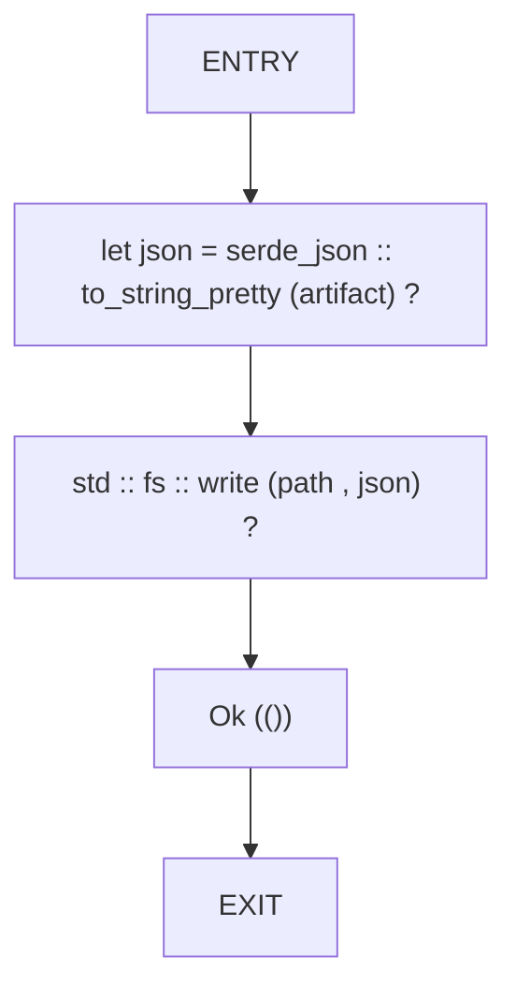

# CFG Group: src/admission_composition_artifact.rs

## Function: `create_test_signature`

- File: src/admission_composition_artifact.rs
- Branches: 0
- Loops: 0
- Nodes: 3
- Edges: 2

## Function: `generate_artifact`

- File: src/admission_composition_artifact.rs
- Branches: 0
- Loops: 0
- Nodes: 5
- Edges: 4

## Function: `project_conflict_reason`

- File: src/admission_composition_artifact.rs
- Branches: 0
- Loops: 0
- Nodes: 3
- Edges: 2

## Function: `project_invariants_touched`

- File: src/admission_composition_artifact.rs
- Branches: 0
- Loops: 0
- Nodes: 7
- Edges: 6

## Function: `project_state`

- File: src/admission_composition_artifact.rs
- Branches: 0
- Loops: 0
- Nodes: 3
- Edges: 2

## Function: `read_artifact`

- File: src/admission_composition_artifact.rs
- Branches: 0
- Loops: 0
- Nodes: 5
- Edges: 4

## Function: `test_admissible_batch_artifact`

- File: src/admission_composition_artifact.rs
- Branches: 0
- Loops: 0
- Nodes: 10
- Edges: 9

## Function: `test_determinism`

- File: src/admission_composition_artifact.rs
- Branches: 0
- Loops: 0
- Nodes: 13
- Edges: 12

```mermaid
flowchart TD
    test_determinism_0["ENTRY"]
    test_determinism_1["let batch = vec ! [create_test_signature ('test_action' , vec ! [PathBuf :: from ('test.r..."]
    test_determinism_2["let result = compose_batch (& batch)"]
    test_determinism_3["let artifact1 = generate_artifact (& batch , & result)"]
    test_determinism_4["let artifact2 = generate_artifact (& batch , & result)"]
    test_determinism_5["let mut artifact1_normalized = artifact1 . clone ()"]
    test_determinism_6["let mut artifact2_normalized = artifact2 . clone ()"]
    test_determinism_7["artifact1_normalized . timestamp = 'NORMALIZED' . to_string ()"]
    test_determinism_8["artifact2_normalized . timestamp = 'NORMALIZED' . to_string ()"]
    test_determinism_9["let json1 = serde_json :: to_string_pretty (& artifact1_normalized) . unwrap ()"]
    test_determinism_10["let json2 = serde_json :: to_string_pretty (& artifact2_normalized) . unwrap ()"]
    test_determinism_11["macro assert_eq"]
    test_determinism_12["EXIT"]
    test_determinism_0 --> test_determinism_1
    test_determinism_1 --> test_determinism_2
    test_determinism_2 --> test_determinism_3
    test_determinism_3 --> test_determinism_4
    test_determinism_4 --> test_determinism_5
    test_determinism_5 --> test_determinism_6
    test_determinism_6 --> test_determinism_7
    test_determinism_7 --> test_determinism_8
    test_determinism_8 --> test_determinism_9
    test_determinism_9 --> test_determinism_10
    test_determinism_10 --> test_determinism_11
    test_determinism_11 --> test_determinism_12
```

## Function: `test_inadmissible_batch_artifact`

- File: src/admission_composition_artifact.rs
- Branches: 0
- Loops: 0
- Nodes: 8
- Edges: 7

## Function: `write_artifact`

- File: src/admission_composition_artifact.rs
- Branches: 0
- Loops: 0
- Nodes: 5
- Edges: 4

