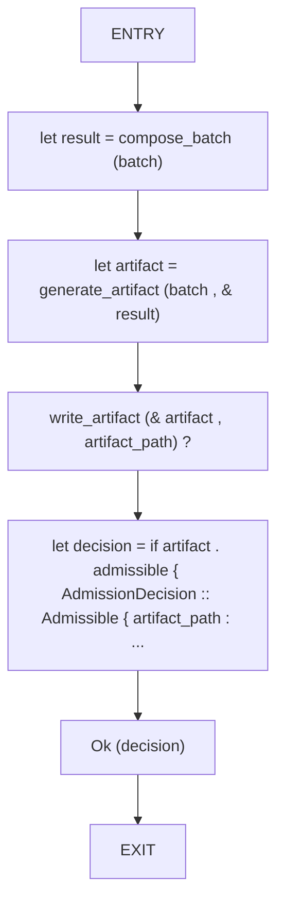
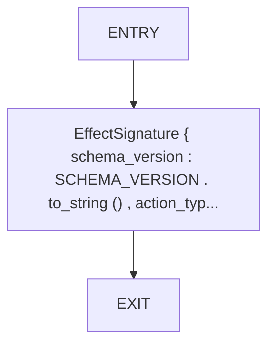
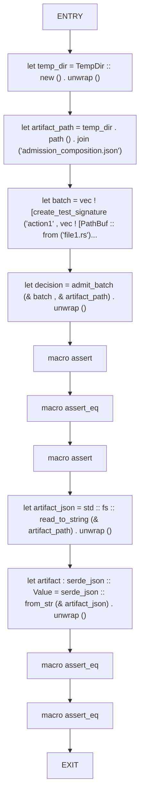

# CFG Group: src/batch_admission.rs

## Function: `admit_batch`

- File: src/batch_admission.rs
- Branches: 0
- Loops: 0
- Nodes: 7
- Edges: 6

## Function: `create_test_signature`

- File: src/batch_admission.rs
- Branches: 0
- Loops: 0
- Nodes: 3
- Edges: 2

## Function: `test_admissible_batch`

- File: src/batch_admission.rs
- Branches: 0
- Loops: 0
- Nodes: 13
- Edges: 12

## Function: `test_inadmissible_batch`

- File: src/batch_admission.rs
- Branches: 0
- Loops: 0
- Nodes: 16
- Edges: 15

```mermaid
flowchart TD
    test_inadmissible_batch_0["ENTRY"]
    test_inadmissible_batch_1["let temp_dir = TempDir :: new () . unwrap ()"]
    test_inadmissible_batch_2["let artifact_path = temp_dir . path () . join ('admission_composition.json')"]
    test_inadmissible_batch_3["let batch = vec ! [create_test_signature ('action1' , vec ! [PathBuf :: from ('file1.rs')..."]
    test_inadmissible_batch_4["let decision = admit_batch (& batch , & artifact_path) . unwrap ()"]
    test_inadmissible_batch_5["macro assert"]
    test_inadmissible_batch_6["macro assert_eq"]
    test_inadmissible_batch_7["macro assert"]
    test_inadmissible_batch_8["let artifact_json = std :: fs :: read_to_string (& artifact_path) . unwrap ()"]
    test_inadmissible_batch_9["let artifact : serde_json :: Value = serde_json :: from_str (& artifact_json) . unwrap ()"]
    test_inadmissible_batch_10["macro assert_eq"]
    test_inadmissible_batch_11["macro assert_eq"]
    test_inadmissible_batch_12["let result = & artifact ['composition_result']"]
    test_inadmissible_batch_13["macro assert_eq"]
    test_inadmissible_batch_14["macro assert_eq"]
    test_inadmissible_batch_15["EXIT"]
    test_inadmissible_batch_0 --> test_inadmissible_batch_1
    test_inadmissible_batch_1 --> test_inadmissible_batch_2
    test_inadmissible_batch_2 --> test_inadmissible_batch_3
    test_inadmissible_batch_3 --> test_inadmissible_batch_4
    test_inadmissible_batch_4 --> test_inadmissible_batch_5
    test_inadmissible_batch_5 --> test_inadmissible_batch_6
    test_inadmissible_batch_6 --> test_inadmissible_batch_7
    test_inadmissible_batch_7 --> test_inadmissible_batch_8
    test_inadmissible_batch_8 --> test_inadmissible_batch_9
    test_inadmissible_batch_9 --> test_inadmissible_batch_10
    test_inadmissible_batch_10 --> test_inadmissible_batch_11
    test_inadmissible_batch_11 --> test_inadmissible_batch_12
    test_inadmissible_batch_12 --> test_inadmissible_batch_13
    test_inadmissible_batch_13 --> test_inadmissible_batch_14
    test_inadmissible_batch_14 --> test_inadmissible_batch_15
```

