# CFG Group: src/composition_rule.rs

## Function: `check_conflicts`

- File: src/composition_rule.rs
- Branches: 0
- Loops: 0
- Nodes: 11
- Edges: 10

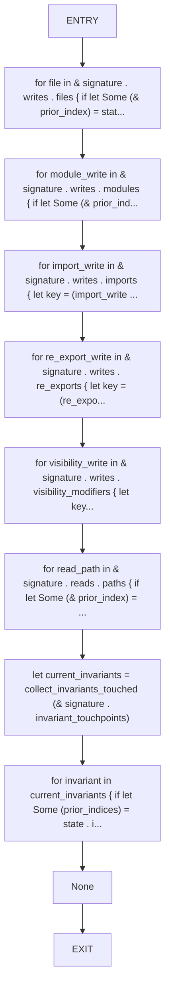

## Function: `collect_invariants_touched`

- File: src/composition_rule.rs
- Branches: 5
- Loops: 0
- Nodes: 29
- Edges: 33

```mermaid
flowchart TD
    collect_invariants_touched_0["ENTRY"]
    collect_invariants_touched_1["let mut invariants = Vec :: new ()"]
    collect_invariants_touched_2["if touchpoints . i1_module_coherence"]
    collect_invariants_touched_3["THEN BB"]
    collect_invariants_touched_4["invariants . push (InvariantType :: I1ModuleCoherence)"]
    collect_invariants_touched_5["EMPTY ELSE"]
    collect_invariants_touched_6["IF JOIN"]
    collect_invariants_touched_7["if touchpoints . i2_dependency_direction"]
    collect_invariants_touched_8["THEN BB"]
    collect_invariants_touched_9["invariants . push (InvariantType :: I2DependencyDirection)"]
    collect_invariants_touched_10["EMPTY ELSE"]
    collect_invariants_touched_11["IF JOIN"]
    collect_invariants_touched_12["if touchpoints . visibility_law"]
    collect_invariants_touched_13["THEN BB"]
    collect_invariants_touched_14["invariants . push (InvariantType :: VisibilityLaw)"]
    collect_invariants_touched_15["EMPTY ELSE"]
    collect_invariants_touched_16["IF JOIN"]
    collect_invariants_touched_17["if touchpoints . re_export_law"]
    collect_invariants_touched_18["THEN BB"]
    collect_invariants_touched_19["invariants . push (InvariantType :: ReExportLaw)"]
    collect_invariants_touched_20["EMPTY ELSE"]
    collect_invariants_touched_21["IF JOIN"]
    collect_invariants_touched_22["if touchpoints . test_topology_law"]
    collect_invariants_touched_23["THEN BB"]
    collect_invariants_touched_24["invariants . push (InvariantType :: TestTopologyLaw)"]
    collect_invariants_touched_25["EMPTY ELSE"]
    collect_invariants_touched_26["IF JOIN"]
    collect_invariants_touched_27["invariants"]
    collect_invariants_touched_28["EXIT"]
    collect_invariants_touched_0 --> collect_invariants_touched_1
    collect_invariants_touched_1 --> collect_invariants_touched_2
    collect_invariants_touched_2 --> collect_invariants_touched_3
    collect_invariants_touched_3 --> collect_invariants_touched_4
    collect_invariants_touched_2 --> collect_invariants_touched_5
    collect_invariants_touched_4 --> collect_invariants_touched_6
    collect_invariants_touched_5 --> collect_invariants_touched_6
    collect_invariants_touched_6 --> collect_invariants_touched_7
    collect_invariants_touched_7 --> collect_invariants_touched_8
    collect_invariants_touched_8 --> collect_invariants_touched_9
    collect_invariants_touched_7 --> collect_invariants_touched_10
    collect_invariants_touched_9 --> collect_invariants_touched_11
    collect_invariants_touched_10 --> collect_invariants_touched_11
    collect_invariants_touched_11 --> collect_invariants_touched_12
    collect_invariants_touched_12 --> collect_invariants_touched_13
    collect_invariants_touched_13 --> collect_invariants_touched_14
    collect_invariants_touched_12 --> collect_invariants_touched_15
    collect_invariants_touched_14 --> collect_invariants_touched_16
    collect_invariants_touched_15 --> collect_invariants_touched_16
    collect_invariants_touched_16 --> collect_invariants_touched_17
    collect_invariants_touched_17 --> collect_invariants_touched_18
    collect_invariants_touched_18 --> collect_invariants_touched_19
    collect_invariants_touched_17 --> collect_invariants_touched_20
    collect_invariants_touched_19 --> collect_invariants_touched_21
    collect_invariants_touched_20 --> collect_invariants_touched_21
    collect_invariants_touched_21 --> collect_invariants_touched_22
    collect_invariants_touched_22 --> collect_invariants_touched_23
    collect_invariants_touched_23 --> collect_invariants_touched_24
    collect_invariants_touched_22 --> collect_invariants_touched_25
    collect_invariants_touched_24 --> collect_invariants_touched_26
    collect_invariants_touched_25 --> collect_invariants_touched_26
    collect_invariants_touched_26 --> collect_invariants_touched_27
    collect_invariants_touched_27 --> collect_invariants_touched_28
```

## Function: `compose_batch`

- File: src/composition_rule.rs
- Branches: 0
- Loops: 0
- Nodes: 5
- Edges: 4

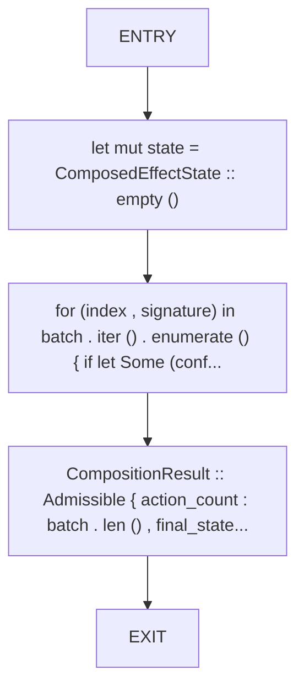

## Function: `compose_into_state`

- File: src/composition_rule.rs
- Branches: 0
- Loops: 0
- Nodes: 16
- Edges: 15

```mermaid
flowchart TD
    compose_into_state_0["ENTRY"]
    compose_into_state_1["for file in & signature . writes . files { state . files_written . insert (fi..."]
    compose_into_state_2["for module_write in & signature . writes . modules { state . modules_written ..."]
    compose_into_state_3["for import_write in & signature . writes . imports { let key = (import_write ..."]
    compose_into_state_4["for re_export_write in & signature . writes . re_exports { let key = (re_expo..."]
    compose_into_state_5["for visibility_write in & signature . writes . visibility_modifiers { let key..."]
    compose_into_state_6["for path in & signature . reads . paths { state . files_read . insert (path ...."]
    compose_into_state_7["for symbol in & signature . reads . symbols { state . symbols_read . insert (..."]
    compose_into_state_8["let invariants = collect_invariants_touched (& signature . invariant_touchpoints)"]
    compose_into_state_9["for invariant in invariants { state . invariants_touched . entry (invariant) ..."]
    compose_into_state_10["state . executor_surfaces . requires_import_repair |= signature . executor_su..."]
    compose_into_state_11["state . executor_surfaces . requires_module_shim |= signature . executor_surf..."]
    compose_into_state_12["state . executor_surfaces . requires_re_export_enforcement |= signature . exe..."]
    compose_into_state_13["state . executor_surfaces . requires_verification_gate |= signature . executo..."]
    compose_into_state_14["state . action_count += 1"]
    compose_into_state_15["EXIT"]
    compose_into_state_0 --> compose_into_state_1
    compose_into_state_1 --> compose_into_state_2
    compose_into_state_2 --> compose_into_state_3
    compose_into_state_3 --> compose_into_state_4
    compose_into_state_4 --> compose_into_state_5
    compose_into_state_5 --> compose_into_state_6
    compose_into_state_6 --> compose_into_state_7
    compose_into_state_7 --> compose_into_state_8
    compose_into_state_8 --> compose_into_state_9
    compose_into_state_9 --> compose_into_state_10
    compose_into_state_10 --> compose_into_state_11
    compose_into_state_11 --> compose_into_state_12
    compose_into_state_12 --> compose_into_state_13
    compose_into_state_13 --> compose_into_state_14
    compose_into_state_14 --> compose_into_state_15
```

## Function: `create_test_signature`

- File: src/composition_rule.rs
- Branches: 0
- Loops: 0
- Nodes: 3
- Edges: 2

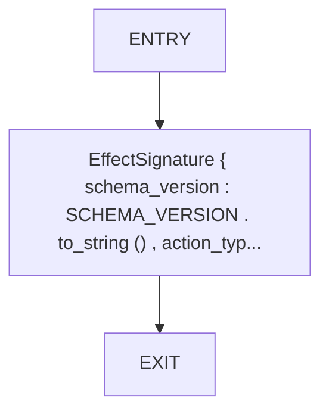

## Function: `test_abort_happens_at_first_conflict`

- File: src/composition_rule.rs
- Branches: 0
- Loops: 0
- Nodes: 7
- Edges: 6

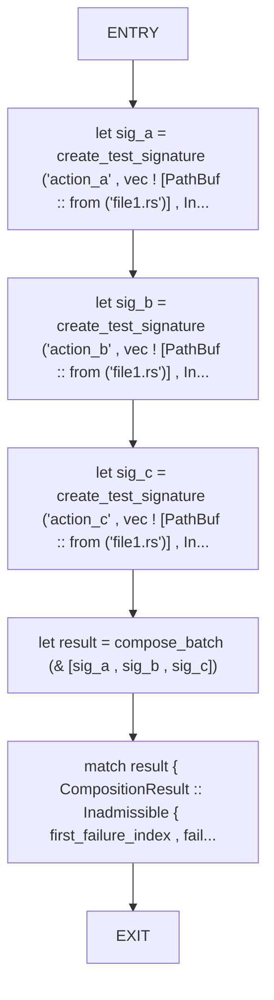

## Function: `test_empty_batch_is_admissible`

- File: src/composition_rule.rs
- Branches: 0
- Loops: 0
- Nodes: 4
- Edges: 3

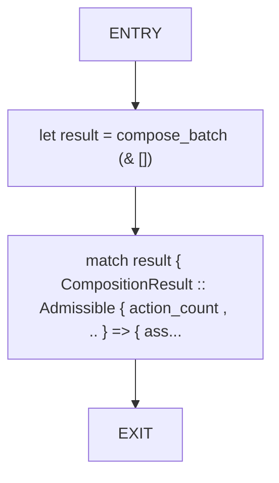

## Function: `test_executor_surface_accumulation`

- File: src/composition_rule.rs
- Branches: 0
- Loops: 0
- Nodes: 8
- Edges: 7

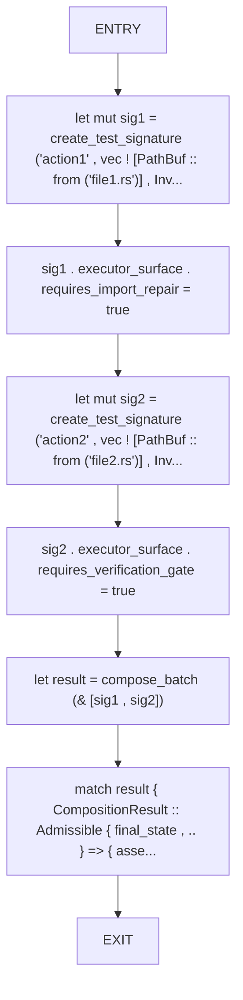

## Function: `test_file_write_conflict_aborts`

- File: src/composition_rule.rs
- Branches: 0
- Loops: 0
- Nodes: 6
- Edges: 5

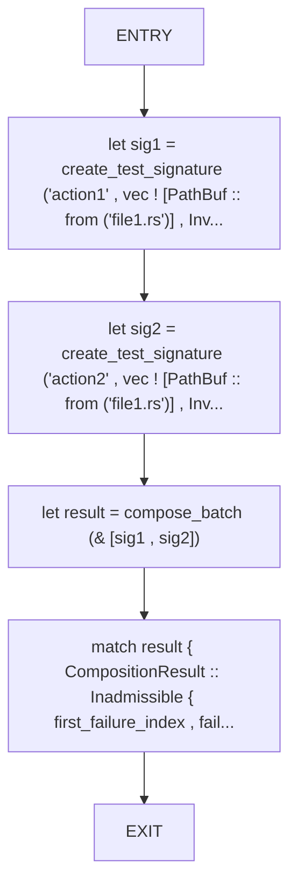

## Function: `test_invariant_overlap_aborts`

- File: src/composition_rule.rs
- Branches: 0
- Loops: 0
- Nodes: 6
- Edges: 5

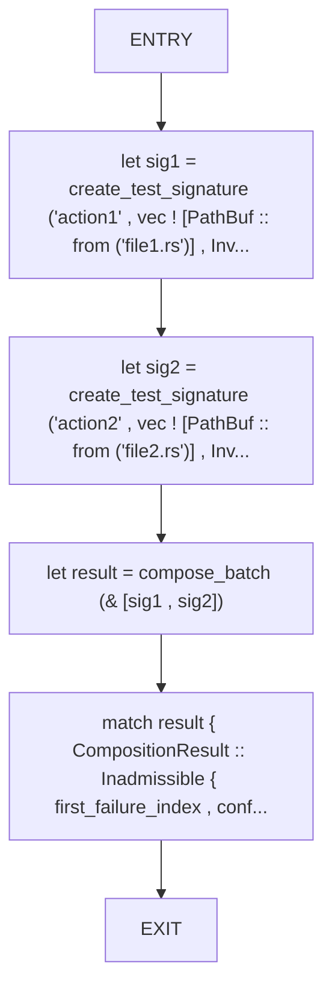

## Function: `test_non_overlapping_actions_are_admissible`

- File: src/composition_rule.rs
- Branches: 0
- Loops: 0
- Nodes: 6
- Edges: 5

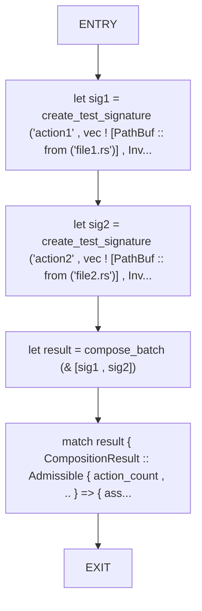

## Function: `test_order_sensitivity`

- File: src/composition_rule.rs
- Branches: 0
- Loops: 0
- Nodes: 10
- Edges: 9

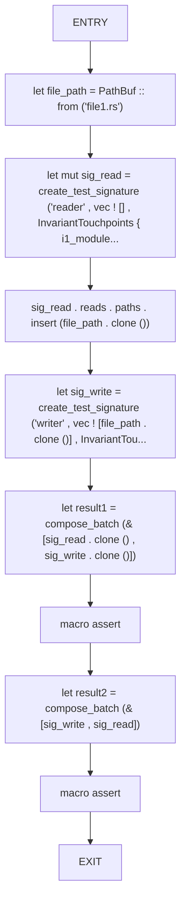

## Function: `test_read_after_write_aborts`

- File: src/composition_rule.rs
- Branches: 0
- Loops: 0
- Nodes: 8
- Edges: 7

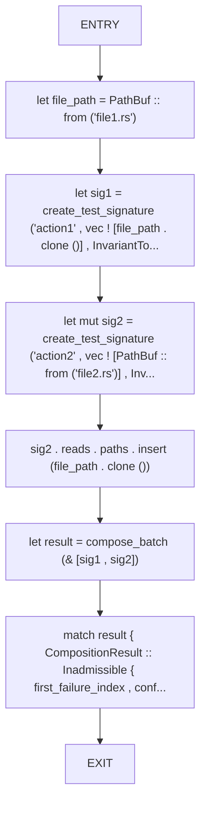

## Function: `test_single_action_is_admissible`

- File: src/composition_rule.rs
- Branches: 0
- Loops: 0
- Nodes: 5
- Edges: 4

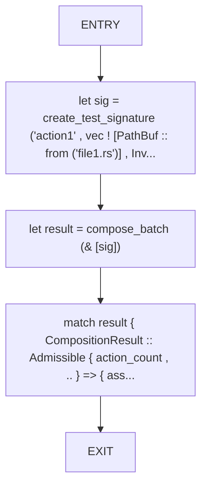

