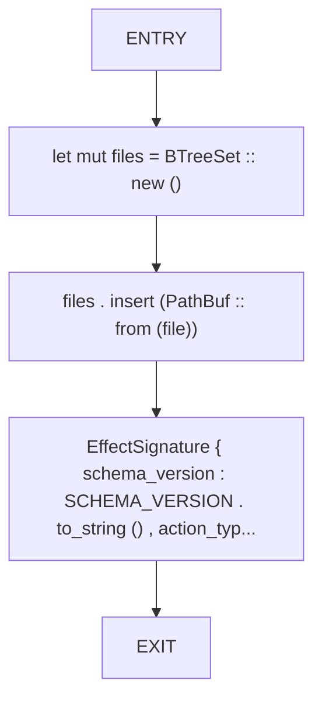
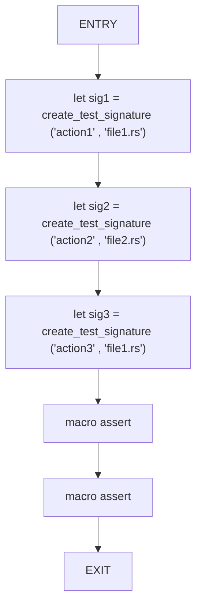
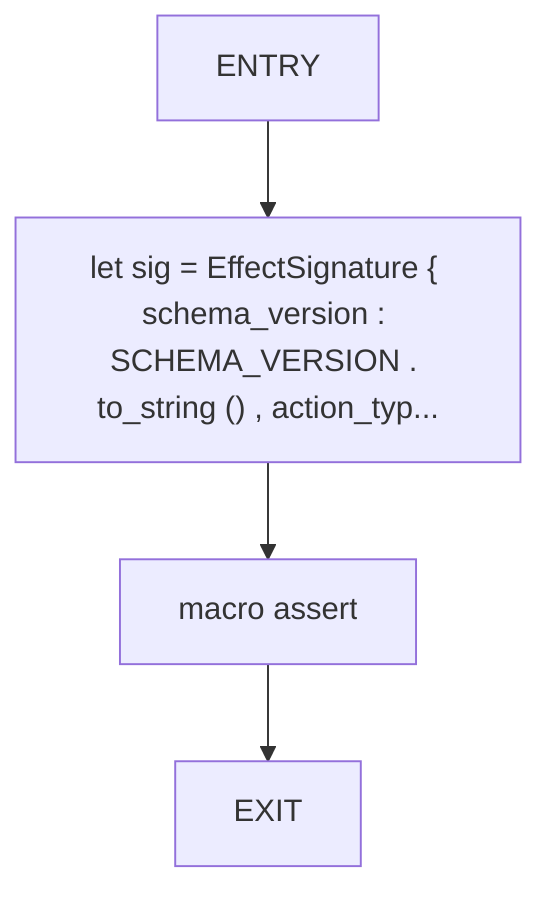

# CFG Group: src/effect_signature_schema.rs

## Function: `create_test_signature`

- File: src/effect_signature_schema.rs
- Branches: 0
- Loops: 0
- Nodes: 5
- Edges: 4

## Function: `test_signature_conflict_detection`

- File: src/effect_signature_schema.rs
- Branches: 0
- Loops: 0
- Nodes: 7
- Edges: 6

## Function: `test_signature_validation`

- File: src/effect_signature_schema.rs
- Branches: 0
- Loops: 0
- Nodes: 4
- Edges: 3

