# Directory: MMSB/tools/mmsb-analyzer/src

- Layer: `root`

## Files

| File | Suggested | Rename |
| --- | --- | --- |
| `MMSB/tools/mmsb-analyzer/src/000_dependency_analysis.rs` | `000_dependency_analysis.rs` | no |
| `MMSB/tools/mmsb-analyzer/src/000_main.jl` | `010_main.jl` | yes |
| `MMSB/tools/mmsb-analyzer/src/010_MMSBAnalyzerJulia.jl` | `020_MMSBAnalyzerJulia.jl` | yes |
| `MMSB/tools/mmsb-analyzer/src/010_layer_utilities.rs` | `030_layer_utilities.rs` | yes |
| `MMSB/tools/mmsb-analyzer/src/020_ast_cfg.jl` | `040_ast_cfg.jl` | yes |
| `MMSB/tools/mmsb-analyzer/src/020_gather_rust_files.rs` | `050_gather_rust_files.rs` | yes |
| `MMSB/tools/mmsb-analyzer/src/030_invariant_types.rs` | `060_invariant_types.rs` | yes |
| `MMSB/tools/mmsb-analyzer/src/030_ir_ssa.jl` | `070_ir_ssa.jl` | yes |
| `MMSB/tools/mmsb-analyzer/src/030_is_cfg_test_item.rs` | `080_is_cfg_test_item.rs` | yes |
| `MMSB/tools/mmsb-analyzer/src/040_build_model.jl` | `090_build_model.jl` | yes |
| `MMSB/tools/mmsb-analyzer/src/040_classify_symbol.rs` | `100_classify_symbol.rs` | yes |
| `MMSB/tools/mmsb-analyzer/src/040_refactor_constraints.rs` | `110_refactor_constraints.rs` | yes |
| `MMSB/tools/mmsb-analyzer/src/050_scc_compressor.rs` | `120_scc_compressor.rs` | yes |
| `MMSB/tools/mmsb-analyzer/src/060_module_resolution.rs` | `130_module_resolution.rs` | yes |
| `MMSB/tools/mmsb-analyzer/src/070_layer_inference.rs` | `140_layer_inference.rs` | yes |
| `MMSB/tools/mmsb-analyzer/src/080_cluster_011.rs` | `150_cluster_011.rs` | yes |
| `MMSB/tools/mmsb-analyzer/src/090_fixpoint_solver.rs` | `160_fixpoint_solver.rs` | yes |
| `MMSB/tools/mmsb-analyzer/src/100_dependency.rs` | `170_dependency.rs` | yes |
| `MMSB/tools/mmsb-analyzer/src/110_structural_detector.rs` | `180_structural_detector.rs` | yes |
| `MMSB/tools/mmsb-analyzer/src/120_cluster_006.rs` | `190_cluster_006.rs` | yes |
| `MMSB/tools/mmsb-analyzer/src/130_semantic_detector.rs` | `200_semantic_detector.rs` | yes |
| `MMSB/tools/mmsb-analyzer/src/140_layer_core.rs` | `210_layer_core.rs` | yes |
| `MMSB/tools/mmsb-analyzer/src/150_path_detector.rs` | `220_path_detector.rs` | yes |
| `MMSB/tools/mmsb-analyzer/src/160_invariant_integrator.rs` | `230_invariant_integrator.rs` | yes |
| `MMSB/tools/mmsb-analyzer/src/170_layer_utilities.rs` | `240_layer_utilities.rs` | yes |
| `MMSB/tools/mmsb-analyzer/src/180_invariant_reporter.rs` | `250_invariant_reporter.rs` | yes |
| `MMSB/tools/mmsb-analyzer/src/190_conscience_graph.rs` | `260_conscience_graph.rs` | yes |
| `MMSB/tools/mmsb-analyzer/src/200_action_validator.rs` | `270_action_validator.rs` | yes |
| `MMSB/tools/mmsb-analyzer/src/210_agent_conscience.rs` | `280_agent_conscience.rs` | yes |
| `MMSB/tools/mmsb-analyzer/src/211_dead_code_doc_comment_scanner.rs` | `290_dead_code_doc_comment_scanner.rs` | yes |
| `MMSB/tools/mmsb-analyzer/src/220_utilities.rs` | `300_utilities.rs` | yes |
| `MMSB/tools/mmsb-analyzer/src/230_dead_code_attribute_parser.rs` | `310_dead_code_attribute_parser.rs` | yes |
| `MMSB/tools/mmsb-analyzer/src/240_types.rs` | `320_types.rs` | yes |
| `MMSB/tools/mmsb-analyzer/src/250_cohesion_analyzer.rs` | `330_cohesion_analyzer.rs` | yes |
| `MMSB/tools/mmsb-analyzer/src/260_directory_analyzer.rs` | `340_directory_analyzer.rs` | yes |
| `MMSB/tools/mmsb-analyzer/src/270_control_flow.rs` | `350_control_flow.rs` | yes |
| `MMSB/tools/mmsb-analyzer/src/280_file_ordering.rs` | `360_file_ordering.rs` | yes |
| `MMSB/tools/mmsb-analyzer/src/290_julia_parser.rs` | `370_julia_parser.rs` | yes |
| `MMSB/tools/mmsb-analyzer/src/300_rust_parser.rs` | `380_rust_parser.rs` | yes |
| `MMSB/tools/mmsb-analyzer/src/310_dot_exporter.rs` | `390_dot_exporter.rs` | yes |
| `MMSB/tools/mmsb-analyzer/src/320_file_gathering.rs` | `400_file_gathering.rs` | yes |
| `MMSB/tools/mmsb-analyzer/src/330_markdown_report.rs` | `410_markdown_report.rs` | yes |
| `MMSB/tools/mmsb-analyzer/src/340_main.rs` | `420_main.rs` | yes |
| `MMSB/tools/mmsb-analyzer/src/350_agent_cli.rs` | `430_agent_cli.rs` | yes |
| `MMSB/tools/mmsb-analyzer/src/360_lib.rs` | `440_lib.rs` | yes |
| `MMSB/tools/mmsb-analyzer/src/370_dead_code_types.rs` | `450_dead_code_types.rs` | yes |
| `MMSB/tools/mmsb-analyzer/src/380_dead_code_doc_comment_parser.rs` | `460_dead_code_doc_comment_parser.rs` | yes |
| `MMSB/tools/mmsb-analyzer/src/390_dead_code_call_graph.rs` | `470_dead_code_call_graph.rs` | yes |
| `MMSB/tools/mmsb-analyzer/src/400_dead_code_intent.rs` | `480_dead_code_intent.rs` | yes |
| `MMSB/tools/mmsb-analyzer/src/410_dead_code_test_boundaries.rs` | `490_dead_code_test_boundaries.rs` | yes |
| `MMSB/tools/mmsb-analyzer/src/420_dead_code_entrypoints.rs` | `500_dead_code_entrypoints.rs` | yes |
| `MMSB/tools/mmsb-analyzer/src/430_dead_code_classifier.rs` | `510_dead_code_classifier.rs` | yes |
| `MMSB/tools/mmsb-analyzer/src/440_dead_code_confidence.rs` | `520_dead_code_confidence.rs` | yes |
| `MMSB/tools/mmsb-analyzer/src/450_dead_code_actions.rs` | `530_dead_code_actions.rs` | yes |
| `MMSB/tools/mmsb-analyzer/src/460_correction_plan_types.rs` | `540_correction_plan_types.rs` | yes |
| `MMSB/tools/mmsb-analyzer/src/470_dead_code_report.rs` | `550_dead_code_report.rs` | yes |
| `MMSB/tools/mmsb-analyzer/src/480_dead_code_filter.rs` | `560_dead_code_filter.rs` | yes |
| `MMSB/tools/mmsb-analyzer/src/490_verification_policy_types.rs` | `570_verification_policy_types.rs` | yes |
| `MMSB/tools/mmsb-analyzer/src/500_dead_code_cli.rs` | `580_dead_code_cli.rs` | yes |
| `MMSB/tools/mmsb-analyzer/src/510_quality_delta_types.rs` | `590_quality_delta_types.rs` | yes |
| `MMSB/tools/mmsb-analyzer/src/520_dead_code_policy.rs` | `600_dead_code_policy.rs` | yes |
| `MMSB/tools/mmsb-analyzer/src/530_violation_predictor.rs` | `610_violation_predictor.rs` | yes |
| `MMSB/tools/mmsb-analyzer/src/540_dead_code_report_split.rs` | `620_dead_code_report_split.rs` | yes |
| `MMSB/tools/mmsb-analyzer/src/550_tier_classifier.rs` | `630_tier_classifier.rs` | yes |
| `MMSB/tools/mmsb-analyzer/src/560_confidence_scorer.rs` | `640_confidence_scorer.rs` | yes |
| `MMSB/tools/mmsb-analyzer/src/570_correction_plan_generator.rs` | `650_correction_plan_generator.rs` | yes |
| `MMSB/tools/mmsb-analyzer/src/580_verification_scope_planner.rs` | `660_verification_scope_planner.rs` | yes |
| `MMSB/tools/mmsb-analyzer/src/590_rollback_criteria_builder.rs` | `670_rollback_criteria_builder.rs` | yes |
| `MMSB/tools/mmsb-analyzer/src/600_quality_delta_calculator.rs` | `680_quality_delta_calculator.rs` | yes |
| `MMSB/tools/mmsb-analyzer/src/610_action_impact_estimator.rs` | `690_action_impact_estimator.rs` | yes |
| `MMSB/tools/mmsb-analyzer/src/620_correction_plan_serializer.rs` | `700_correction_plan_serializer.rs` | yes |
| `MMSB/tools/mmsb-analyzer/src/630_verification_policy_emitter.rs` | `710_verification_policy_emitter.rs` | yes |
| `MMSB/tools/mmsb-analyzer/src/640_correction_intelligence_report.rs` | `720_correction_intelligence_report.rs` | yes |
| `MMSB/tools/mmsb-analyzer/src/admission_composition_artifact.rs` | `730_admission_composition_artifact.rs` | yes |
| `MMSB/tools/mmsb-analyzer/src/batch_admission.rs` | `740_batch_admission.rs` | yes |
| `MMSB/tools/mmsb-analyzer/src/composition_rule.rs` | `750_composition_rule.rs` | yes |
| `MMSB/tools/mmsb-analyzer/src/effect_signature_schema.rs` | `760_effect_signature_schema.rs` | yes |

## Dependency Graph

```mermaid
graph TD
    F0["000_dependency_analysis.rs"]
    F1["000_main.jl"]
    F2["010_MMSBAnalyzerJulia.jl"]
    F3["010_layer_utilities.rs"]
    F4["020_ast_cfg.jl"]
    F5["020_gather_rust_files.rs"]
    F6["030_invariant_types.rs"]
    F7["030_ir_ssa.jl"]
    F8["030_is_cfg_test_item.rs"]
    F9["040_build_model.jl"]
    F10["040_classify_symbol.rs"]
    F11["040_refactor_constraints.rs"]
    F12["050_scc_compressor.rs"]
    F13["060_module_resolution.rs"]
    F14["070_layer_inference.rs"]
    F15["080_cluster_011.rs"]
    F16["090_fixpoint_solver.rs"]
    F17["100_dependency.rs"]
    F18["110_structural_detector.rs"]
    F19["120_cluster_006.rs"]
    F20["130_semantic_detector.rs"]
    F21["140_layer_core.rs"]
    F22["150_path_detector.rs"]
    F23["160_invariant_integrator.rs"]
    F24["170_layer_utilities.rs"]
    F25["180_invariant_reporter.rs"]
    F26["190_conscience_graph.rs"]
    F27["200_action_validator.rs"]
    F28["210_agent_conscience.rs"]
    F29["211_dead_code_doc_comment_scanner.rs"]
    F30["220_utilities.rs"]
    F31["230_dead_code_attribute_parser.rs"]
    F32["240_types.rs"]
    F33["250_cohesion_analyzer.rs"]
    F34["260_directory_analyzer.rs"]
    F35["270_control_flow.rs"]
    F36["280_file_ordering.rs"]
    F37["290_julia_parser.rs"]
    F38["300_rust_parser.rs"]
    F39["310_dot_exporter.rs"]
    F40["320_file_gathering.rs"]
    F41["330_markdown_report.rs"]
    F42["340_main.rs"]
    F43["350_agent_cli.rs"]
    F44["360_lib.rs"]
    F45["370_dead_code_types.rs"]
    F46["380_dead_code_doc_comment_parser.rs"]
    F47["390_dead_code_call_graph.rs"]
    F48["400_dead_code_intent.rs"]
    F49["410_dead_code_test_boundaries.rs"]
    F50["420_dead_code_entrypoints.rs"]
    F51["430_dead_code_classifier.rs"]
    F52["440_dead_code_confidence.rs"]
    F53["450_dead_code_actions.rs"]
    F54["460_correction_plan_types.rs"]
    F55["470_dead_code_report.rs"]
    F56["480_dead_code_filter.rs"]
    F57["490_verification_policy_types.rs"]
    F58["500_dead_code_cli.rs"]
    F59["510_quality_delta_types.rs"]
    F60["520_dead_code_policy.rs"]
    F61["530_violation_predictor.rs"]
    F62["540_dead_code_report_split.rs"]
    F63["550_tier_classifier.rs"]
    F64["560_confidence_scorer.rs"]
    F65["570_correction_plan_generator.rs"]
    F66["580_verification_scope_planner.rs"]
    F67["590_rollback_criteria_builder.rs"]
    F68["600_quality_delta_calculator.rs"]
    F69["610_action_impact_estimator.rs"]
    F70["620_correction_plan_serializer.rs"]
    F71["630_verification_policy_emitter.rs"]
    F72["640_correction_intelligence_report.rs"]
    F73["admission_composition_artifact.rs"]
    F74["batch_admission.rs"]
    F75["composition_rule.rs"]
    F76["effect_signature_schema.rs"]
    F6 --> F26
    F27 --> F28
    F6 --> F28
    F11 --> F28
    F69 --> F42
    F27 --> F42
    F43 --> F42
    F28 --> F42
    F19 --> F42
    F15 --> F42
    F33 --> F42
    F64 --> F42
    F26 --> F42
    F35 --> F42
    F72 --> F42
    F65 --> F42
    F70 --> F42
    F54 --> F42
    F53 --> F42
    F31 --> F42
    F47 --> F42
    F51 --> F42
    F58 --> F42
    F52 --> F42
    F46 --> F42
    F50 --> F42
    F56 --> F42
    F48 --> F42
    F60 --> F42
    F55 --> F42
    F62 --> F42
    F49 --> F42
    F45 --> F42
    F17 --> F42
    F34 --> F42
    F39 --> F42
    F36 --> F42
    F16 --> F42
    F23 --> F42
    F25 --> F42
    F6 --> F42
    F37 --> F42
    F21 --> F42
    F14 --> F42
    F24 --> F42
    F22 --> F42
    F68 --> F42
    F59 --> F42
    F11 --> F42
    F67 --> F42
    F38 --> F42
    F12 --> F42
    F20 --> F42
    F18 --> F42
    F63 --> F42
    F32 --> F42
    F30 --> F42
    F71 --> F42
    F57 --> F42
    F66 --> F42
    F61 --> F42
    F45 --> F53
    F6 --> F18
    F14 --> F18
    F12 --> F18
    F32 --> F18
    F6 --> F32
    F11 --> F32
    F46 --> F8
    F32 --> F54
    F6 --> F14
    F54 --> F64
    F53 --> F24
    F31 --> F24
    F47 --> F24
    F58 --> F24
    F52 --> F24
    F50 --> F24
    F48 --> F24
    F55 --> F24
    F49 --> F24
    F45 --> F24
    F32 --> F24
    F57 --> F71
    F73 --> F74
    F75 --> F74
    F76 --> F74
    F76 --> F75
    F24 --> F5
    F6 --> F22
    F12 --> F22
    F45 --> F46
    F55 --> F62
    F45 --> F62
    F15 --> F17
    F72 --> F70
    F54 --> F70
    F59 --> F70
    F71 --> F70
    F57 --> F70
    F72 --> F69
    F68 --> F69
    F72 --> F65
    F6 --> F20
    F32 --> F20
    F47 --> F51
    F32 --> F38
    F6 --> F25
    F11 --> F25
    F58 --> F55
    F62 --> F55
    F45 --> F55
    F32 --> F15
    F72 --> F68
    F27 --> F41
    F19 --> F41
    F35 --> F41
    F17 --> F41
    F36 --> F41
    F21 --> F41
    F11 --> F41
    F32 --> F41
    F75 --> F73
    F76 --> F73
    F19 --> F0
    F33 --> F0
    F35 --> F0
    F17 --> F0
    F34 --> F0
    F39 --> F0
    F36 --> F0
    F23 --> F0
    F25 --> F0
    F37 --> F0
    F21 --> F0
    F24 --> F0
    F38 --> F0
    F32 --> F0
    F30 --> F0
    F6 --> F11
    F32 --> F35
    F30 --> F35
    F27 --> F44
    F73 --> F44
    F28 --> F44
    F74 --> F44
    F33 --> F44
    F75 --> F44
    F26 --> F44
    F35 --> F44
    F17 --> F44
    F34 --> F44
    F39 --> F44
    F76 --> F44
    F36 --> F44
    F6 --> F44
    F37 --> F44
    F11 --> F44
    F38 --> F44
    F32 --> F44
    F69 --> F44
    F27 --> F44
    F73 --> F44
    F28 --> F44
    F74 --> F44
    F10 --> F44
    F19 --> F44
    F15 --> F44
    F33 --> F44
    F75 --> F44
    F64 --> F44
    F26 --> F44
    F35 --> F44
    F72 --> F44
    F65 --> F44
    F70 --> F44
    F54 --> F44
    F53 --> F44
    F31 --> F44
    F47 --> F44
    F51 --> F44
    F58 --> F44
    F52 --> F44
    F46 --> F44
    F50 --> F44
    F56 --> F44
    F48 --> F44
    F60 --> F44
    F55 --> F44
    F62 --> F44
    F49 --> F44
    F45 --> F44
    F17 --> F44
    F34 --> F44
    F39 --> F44
    F76 --> F44
    F36 --> F44
    F16 --> F44
    F23 --> F44
    F25 --> F44
    F6 --> F44
    F8 --> F44
    F37 --> F44
    F21 --> F44
    F14 --> F44
    F24 --> F44
    F22 --> F44
    F68 --> F44
    F59 --> F44
    F11 --> F44
    F67 --> F44
    F38 --> F44
    F12 --> F44
    F20 --> F44
    F18 --> F44
    F63 --> F44
    F32 --> F44
    F30 --> F44
    F71 --> F44
    F57 --> F44
    F66 --> F44
    F61 --> F44
    F11 --> F27
    F17 --> F3
    F32 --> F3
    F19 --> F21
    F54 --> F59
    F72 --> F66
    F46 --> F31
    F48 --> F31
    F49 --> F31
    F45 --> F31
    F49 --> F47
    F32 --> F47
    F69 --> F72
    F70 --> F72
    F54 --> F72
    F6 --> F72
    F68 --> F72
    F59 --> F72
    F63 --> F72
    F32 --> F72
    F57 --> F72
    F6 --> F23
    F14 --> F23
    F22 --> F23
    F11 --> F23
    F20 --> F23
    F18 --> F23
    F32 --> F23
    F17 --> F13
    F24 --> F13
    F15 --> F39
    F15 --> F36
    F17 --> F36
    F31 --> F48
    F46 --> F48
    F45 --> F48
    F55 --> F56
    F45 --> F56
    F32 --> F56
    F45 --> F52
    F48 --> F58
    F45 --> F58
    F24 --> F58
    F48 --> F60
    F17 --> F34
    F24 --> F34
    F32 --> F34
    F32 --> F37
    F72 --> F61
    F47 --> F49
    F48 --> F50
    F32 --> F50
    F72 --> F67
    F54 --> F63
    F27 --> F43
    F28 --> F43
    F6 --> F43
    F19 --> F33
    F32 --> F33
    F47 --> F10
    F48 --> F10
    F49 --> F10
    F45 --> F10
    F46 --> F29
    F45 --> F29
```

