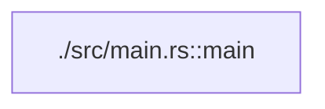

# Control Flow Analysis

## Call Graph Statistics

- Total functions: 1
- Total function calls: 0
- Maximum call depth: 1
- Leaf functions (no outgoing calls): 1

## Call Graph Visualization

```mermaid
graph TD
    __src_main_rs_main["./src/main.rs::main"]
```
